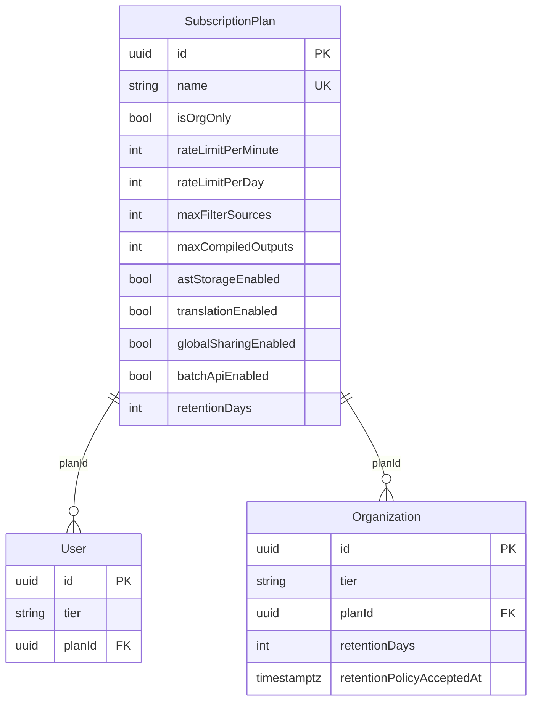
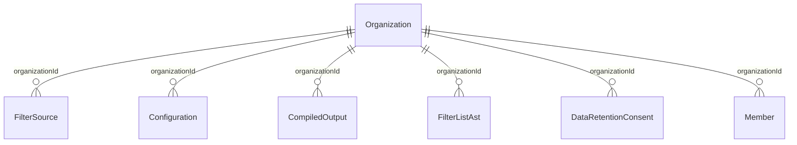

# Multi-Tenancy Schema Reference

This document describes the database relationships and design decisions introduced in the `20260414000000_multi_tenant_shared_schema` migration.

For the broader architecture rationale, see [`docs/architecture/MULTI_TENANCY.md`](../architecture/MULTI_TENANCY.md).

---

## New Relationships Added

### SubscriptionPlan → User and Organization



`SubscriptionPlan` is the authoritative source of tier capabilities. Both `User.tier` and `Organization.tier` are **denormalized caches** of `plan.name` for fast Worker hot-path reads. Always keep `tier` in sync when `planId` changes.

`Organization.retentionDays` is copied from `SubscriptionPlan.retentionDays` when a plan is assigned. It is cached on the org row to avoid a JOIN on every request that needs to enforce retention.

---

### Organization → Resources



Every content resource (`FilterSource`, `Configuration`, `CompiledOutput`, `FilterListAst`) is independently scoped to either a user or an organisation. An `organizationId` FK with `ON DELETE CASCADE` ensures all org-owned resources are purged when the org is deleted.

---

### FilterListAst Model

`FilterListAst` stores parsed AST (Abstract Syntax Tree) representations of filter lists. It is gated behind `SubscriptionPlan.astStorageEnabled` (enabled for `pro`, `vendor`, `enterprise` tiers).

**Fields:**

| Field | Type | Purpose |
|---|---|---|
| `ownerUserId` | `UUID?` | Personal AST — belongs to one user |
| `organizationId` | `UUID?` | Org-shared AST — visible to all org members |
| `sourceId` | `UUID?` | Optional link to the `FilterSource` this was parsed from |
| `ast` | `JSONB` | Schema-agnostic JSON of the parsed AST |
| `ruleCount` | `INT` | Cached count of rules in the AST |
| `parserVersion` | `TEXT` | Semver of the parser that produced this AST |
| `visibility` | `TEXT` | `private` \| `org` \| `public` |

**Staleness Detection:**
When the parser library is upgraded, the `parserVersion` field can be used to detect stale ASTs that need re-parsing.

> ⚠️ **Do not use lexicographic `<` / `>` comparisons on `parserVersion`** — `TEXT` ordering does not follow semver (e.g. `'10.0.0' < '2.0.0'` evaluates to `true` lexicographically, which is incorrect for semver). Instead, compare for exact version equality or inequality:
>
> ```sql
> -- Find all ASTs NOT produced by the current parser version:
> SELECT * FROM filter_list_asts WHERE parser_version != '2.0.0';
> ```
>
> For ordered range queries, consider storing the version as an integer (e.g. `schema_version INT DEFAULT 1`) and incrementing it on breaking parser changes, or maintain an explicit `is_stale BOOLEAN DEFAULT false` flag toggled during upgrades.

---

### DataRetentionConsent Model

`DataRetentionConsent` is an **append-only** compliance audit log. A new row is inserted whenever:

1. A user or organisation signs up (first consent)
2. The policy version (`policyVersion`) changes and the entity re-accepts

**Do not delete rows from this table.** The table is a legal audit trail.

**Policy Version Bump Process:**

1. Update the `policyVersion` string (e.g. `"2026-04"` → `"2026-07"`)
2. Update the `dataCategories` array in the consent form to reflect new categories
3. On next login / org access, prompt users/orgs to accept the updated policy
4. Insert a new `DataRetentionConsent` row upon acceptance

**`dataCategories` Examples:**

```
"compilation_events"   — raw compilation request telemetry
"agent_sessions"       — Cloudflare Agent session logs
"filter_sources"       — stored upstream filter list URLs and metadata
"filter_list_asts"     — parsed AST data
"compiled_outputs"     — cached compilation results stored in R2
```

---

### Configuration Model

`Configuration` replaces `UserConfiguration` (which is retained for backward compatibility and marked legacy).

**Migration Path from UserConfiguration:**

`UserConfiguration` rows can be migrated with:

```sql
INSERT INTO configurations (id, owner_user_id, name, description, config, visibility, created_at, updated_at)
SELECT id, user_id, name, description, config, 'private', created_at, updated_at
FROM user_configurations
ON CONFLICT DO NOTHING;
```

**Fork / Star Social Graph:**

`Configuration` supports a self-referential fork relationship (`forkedFromId → id`). This enables:

- Users to fork a public configuration into their own profile
- Tracking fork counts (`forkCount`) and star counts (`starCount`) for discovery/ranking
- The `forkedFrom` relation allows tracing the provenance chain

Only `visibility = 'public'` configurations should be eligible for starring and forking.

---

## Why FilterSource.url Uniqueness Changed

Previously `FilterSource.url` had a global `@unique` constraint, meaning the same upstream URL (e.g. `https://easylist.to/easylist/easylist.txt`) could only exist once in the table.

This was incorrect for multi-tenancy: two different organisations might independently subscribe to the same upstream EasyList URL while maintaining separate refresh schedules, health tracking, and version histories.

The new constraint is a **composite unique** across `(url, owner_user_id, organization_id)`:

```sql
CREATE UNIQUE INDEX filter_sources_url_owner_unique
    ON filter_sources(url, owner_user_id, organization_id);
```

> **Note on NULL handling**: PostgreSQL UNIQUE indexes allow multiple `NULL` values, so the composite index does not enforce uniqueness for system-managed/global rows where both owner columns are `NULL`. A separate **partial unique index** handles this case:
>
> ```sql
> CREATE UNIQUE INDEX filter_sources_url_global_unique
>     ON filter_sources(url)
>     WHERE owner_user_id IS NULL AND organization_id IS NULL;
> ```

This allows:
- Org A and Org B to both subscribe to the same EasyList URL independently
- A user and an org to both own copies of the same URL
- System-managed global sources (both FKs null) to remain unique per URL (enforced by the partial index above)

---

## Index Strategy

All `organizationId` and `ownerUserId` FK columns are indexed for efficient tenant-scoped list queries. Additional `visibility` indexes support discovery endpoints that filter by `visibility = 'public'` or `'featured'`.

| Table | New Index | Purpose |
|---|---|---|
| `users` | `users_plan_id_idx` | Plan-tier lookup |
| `organization` | `organization_plan_id_idx` | Plan-tier lookup |
| `filter_sources` | `filter_sources_owner_user_id_idx` | User-scoped source listing + FK cascades |
| `filter_sources` | `filter_sources_organization_id_idx` | Org-scoped source listing |
| `filter_sources` | `filter_sources_visibility_idx` | Discovery / public listing |
| `filter_sources` | `filter_sources_url_global_unique` (partial) | Uniqueness for system/global sources |
| `compiled_outputs` | `compiled_outputs_organization_id_idx` | Org-scoped output listing |
| `compiled_outputs` | `compiled_outputs_visibility_idx` | Shared output discovery |
| `configurations` | `configurations_owner_user_id_idx` | User config listing |
| `configurations` | `configurations_organization_id_idx` | Org config listing |
| `configurations` | `configurations_star_count_idx` | Public config ranking |
| `filter_list_asts` | `filter_list_asts_source_id_idx` | ASTs for a given source |
| `data_retention_consents` | `data_retention_consents_accepted_at_idx` | Audit log chronology |

---

## Running the Migration Locally

```bash
# 1. Ensure your local Neon branch connection string is set
cp .env.example .env.local
# Edit .env.local and set DIRECT_DATABASE_URL to your Neon branch URL

# 2. Apply migrations
deno task db:migrate
```

See [`docs/database-setup/local-dev.md`](local-dev.md) for full local setup instructions.
