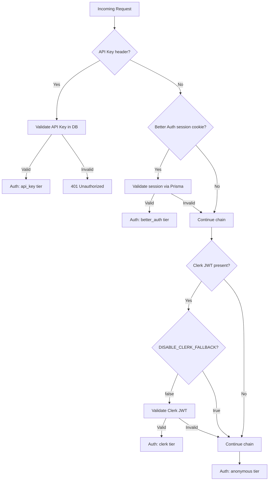

# Neon PostgreSQL Migration — Complete Summary

This document provides a comprehensive record of the migration from Cloudflare D1 (SQLite) to Neon PostgreSQL as the primary database for adblock-compiler. It covers the motivation, scope, technical decisions, implementation details, CI/CD changes, and post-migration improvements.

For topic-specific guides, see the cross-references at the end of this document.

## Background

GitHub Issue [#1257](https://github.com/jaypatrick/adblock-compiler/issues/1257) requested migrating from Cloudflare D1 to Neon PostgreSQL, integrating Better Auth as the primary authentication provider (replacing Clerk), and adopting Prisma ORM for type-safe database access throughout the codebase.

### Motivation

| Concern | D1 (Before) | Neon PostgreSQL (After) |
|---------|-------------|------------------------|
| SQL dialect | SQLite | PostgreSQL |
| Connection pooling | N/A (embedded) | Cloudflare Hyperdrive |
| ORM support | Raw SQL / partial Prisma | Full Prisma with typed client |
| Auth provider | Clerk (third-party SaaS) | Better Auth (self-hosted, OSS) |
| Branching / preview DBs | Not supported | Neon branch-per-PR via GitHub Actions |
| Point-in-time recovery | Manual backups | Native Neon PITR |

### Design Decisions

These decisions were confirmed with the project owner before implementation began:

| Decision | Choice | Rationale |
|----------|--------|-----------|
| Primary auth provider | Better Auth | Self-hosted, OSS, Prisma-native adapter, Cloudflare-compatible |
| Clerk disposition | Disabled via `DISABLE_CLERK_FALLBACK=true` | Kept as fallback code path during transition; can be removed later |
| D1 disposition | Retained as L1 edge cache | Low-latency reads at the Cloudflare edge; write-through to Neon |
| Connection method | Cloudflare Hyperdrive | TCP connection pooling at the edge, built-in to Workers runtime |
| ORM strategy | Prisma everywhere | Type-safe queries, generated client, migration management |
| Local development DB | Neon by default; Docker PostgreSQL as opt-in alternative | Seamless parity with production; Docker for offline/isolated work |

## Scope

### PR #1264 — Core Migration (Merged)

- **Commit**: `289b3cbf0`
- **Stats**: 104 files changed, +18,847 insertions, -1,424 deletions
- **Branch**: `feat/neon-migration-1257` (deleted after merge)

### PR #1266 — DX Improvements (Open)

- **Branch**: `fix/dx-improvements`
- **Stats**: 5 commits, focused on CI fixes and developer experience

## Database Schema

The Prisma schema defines 14 models across three domains:

### Authentication (5 models)

| Model | Purpose |
|-------|---------|
| `User` | User accounts with email, name, image, role, email verification status |
| `Session` | Active sessions with expiry, IP address, user agent tracking |
| `Account` | OAuth/credential provider links (Better Auth multi-provider support) |
| `Verification` | Email/phone verification tokens with expiry |
| `ApiKey` | Hashed API keys with optional expiry, tier assignment, last-used tracking |

### Compiler Domain (5 models)

| Model | Purpose |
|-------|---------|
| `FilterSource` | Registered filter list source URLs with format, health status, scheduling |
| `FilterListVersion` | Versioned snapshots of downloaded filter list content |
| `CompiledOutput` | Compilation results with format, rule count, hash, R2 storage key |
| `CompilationEvent` | Audit log of compilation runs with timing, status, trigger source |
| `CompilationMetadata` | Extended key-value metadata attached to compilation events |

### Infrastructure (4 models)

| Model | Purpose |
|-------|---------|
| `SourceHealthSnapshot` | Periodic health checks for filter sources (latency, status, size) |
| `SourceChangeEvent` | Change detection events when filter list content differs from prior version |
| `StorageEntry` | Generic key-value storage with optional TTL |
| `FilterCache` | Cached filter list data with TTL and ETag support |

The full schema is defined in `prisma/schema.prisma`. A single initial migration (`prisma/migrations/20260322030000_init/migration.sql`) creates all 14 tables.

For field-level documentation, see [Prisma Schema Reference](prisma-schema-reference.md).

## Authentication Architecture

The migration introduced a four-tier authentication chain, evaluated in order for each request:



The `AuthFacadeService` on the Angular frontend abstracts the active provider, allowing runtime switching without component changes.

For the full auth chain specification, see [Auth Chain Reference](../auth/auth-chain-reference.md).

## Infrastructure Changes

### Cloudflare Hyperdrive

All Worker-to-Neon connections route through Cloudflare Hyperdrive, which provides:

- TCP connection pooling at the edge (no cold-start connection overhead)
- Automatic connection reuse across Worker isolates
- Transparent TLS termination

Configuration is in `wrangler.toml` under `[[hyperdrive]]`. The binding is accessed as `env.HYPERDRIVE` in Worker handlers.

### GitHub Actions Workflows

Two new workflows support Neon database branching for pull requests:

**`neon-branch-create.yml`** — Runs on PR open/synchronize:
1. Creates a Neon branch from `main` (copy-on-write, near-instant)
2. Installs pnpm and Node.js
3. Runs `prisma migrate deploy` against the branch
4. Outputs the pooled connection URL as a PR environment variable

**`neon-branch-cleanup.yml`** — Runs on PR close:
1. Deletes the Neon branch to free resources

Both workflows use `neondatabase/create-branch-action@v5`, which is a composite action wrapping the `neonctl` CLI. Key input/output mappings for v5:

| Input | Purpose | Default |
|-------|---------|---------|
| `username` | Database role name | _(required)_ |
| `database` | Database name | `neondb` |
| `branch_name` | Name for the new branch | _(required)_ |
| `parent` | Parent branch to fork from | `main` |

| Output | Purpose |
|--------|---------|
| `db_url_with_pooler` | Pooled connection string |
| `db_url` | Direct connection string |
| `branch_id` | Neon branch identifier |

### Docker Local Development

A `docker-compose.yml` service provides an optional local PostgreSQL 16 instance:

```bash
deno task db:local:up      # Start PostgreSQL with healthcheck --wait
deno task db:local:push    # Push Prisma schema to local DB
deno task db:local:studio  # Open Prisma Studio against local DB
deno task db:local:reset   # Destroy and recreate local DB
deno task db:local:down    # Stop PostgreSQL
```

The default local development path uses the Neon cloud database directly (via `DATABASE_URL` in `.env.local`). Docker is available for offline or isolated development.

## Environment Configuration

### Required Variables

| Variable | Location | Purpose |
|----------|----------|---------|
| `DATABASE_URL` | `.env.local` | Neon pooled connection string (used by Prisma) |
| `DIRECT_DATABASE_URL` | `.env.local` | Neon direct connection string (used by migrations) |
| `BETTER_AUTH_SECRET` | `.dev.vars` | HMAC secret for Better Auth session signing |
| `BETTER_AUTH_URL` | `.dev.vars` | Base URL for Better Auth endpoints |
| `DISABLE_CLERK_FALLBACK` | `.dev.vars` | Set to `true` to disable Clerk JWT validation |
| `HYPERDRIVE` | Worker binding | Cloudflare Hyperdrive binding (configured in `wrangler.toml`) |

### Environment Files

| File | Purpose | Committed |
|------|---------|-----------|
| `.env.example` | Template with all variables documented | Yes |
| `.dev.vars.example` | Template for Cloudflare Worker secrets | Yes |
| `.env.local` | Local development values | No (gitignored) |
| `.dev.vars` | Local Worker secret values | No (gitignored) |

### One-Command Setup

```bash
deno task setup
```

This copies example env files, generates the Prisma client, and installs git hooks.

## Deno Task Reference

All database-related tasks:

| Task | Purpose |
|------|---------|
| `deno task setup` | One-command project bootstrap |
| `deno task db:generate` | Generate Prisma client (with Deno import fix) |
| `deno task db:push` | Push schema to Neon (no migration file) |
| `deno task db:migrate` | Create and apply migration (development) |
| `deno task db:migrate:deploy` | Apply pending migrations (CI/production) |
| `deno task db:studio` | Open Prisma Studio GUI |
| `deno task db:local:up` | Start Docker PostgreSQL |
| `deno task db:local:down` | Stop Docker PostgreSQL |
| `deno task db:local:reset` | Destroy and recreate Docker PostgreSQL |
| `deno task db:local:push` | Push schema to Docker PostgreSQL |

All Prisma tasks use `--env=.env.local` to load environment variables. The `db:generate` task runs `scripts/prisma-fix-imports.ts` afterward to rewrite `.js` import specifiers to `.ts` for Deno compatibility.

## Migration Script

A one-time D1-to-Neon data migration script is available:

```bash
deno task db:migrate:d1-to-neon -- --dry-run   # Preview without writing
deno task db:migrate:d1-to-neon                 # Execute migration
```

The script reads from D1 (via Cloudflare API), transforms data to match the Prisma schema, and writes to Neon via Prisma Client. It includes row-count verification and can be run multiple times safely (idempotent upserts).

For the full migration checklist, see [Migration Checklist](migration-checklist.md).

## CI/CD Pipeline

The CI pipeline validates the full stack on every push:

| Check | What It Validates |
|-------|-------------------|
| Type Check | `deno task check` — Deno + Worker type correctness |
| Test | `deno task test` — 2,557+ backend tests |
| Frontend (build) | `ng build` — Angular production build |
| Frontend (lint, test) | `ng lint && ng test` — 950+ frontend tests |
| Lint & Format | `deno lint && deno fmt --check` |
| Security Scan | Trivy vulnerability scanner |
| Check Slow Types | `deno publish --dry-run` — JSR compatibility |
| Validate Migrations | `scripts/validate-migrations.ts` |
| Validate Generated Artifacts | Schema/Postman drift detection |
| Create Neon Branch | Per-PR database branch with Prisma migration |
| Verify Worker Build | Cloudflare Workers build verification |
| ZTA Lint | Zero Trust Architecture compliance |
| CodeQL | Static analysis (JavaScript/TypeScript + Actions) |

## Post-Migration Improvements (PR #1266)

After the core migration merged, a follow-up PR addressed developer experience gaps:

1. **Environment validation guards** — `worker/lib/auth.ts` and `prisma.config.ts` throw descriptive errors when required bindings or variables are missing, replacing cryptic runtime failures
2. **Global error handler** — `app.onError()` in `worker/hono-app.ts` catches unhandled exceptions and returns structured JSON with a `requestId`, preventing stack trace leaks
3. **Neon CI workflow fixes** — Corrected action input names for `neondatabase/create-branch-action@v5`, fixed pnpm/Node.js step ordering, and resolved pnpm version conflict with `packageManager` field
4. **Setup task** — `deno task setup` provides one-command project bootstrap
5. **Docker improvements** — `db:local:up` and `db:local:reset` use `--wait` flag for reliable healthcheck-based startup

## Cross-References

| Topic | Document |
|-------|----------|
| Neon production setup | [Neon Setup](neon-setup.md) |
| Neon branch-per-PR workflows | [Neon Branching](neon-branching.md) |
| D1-to-Neon data migration checklist | [Migration Checklist](migration-checklist.md) |
| Database architecture (D1 cache + Neon primary) | [Database Architecture](DATABASE_ARCHITECTURE.md) |
| Prisma + Deno compatibility notes | [Prisma Deno Compatibility](prisma-deno-compatibility.md) |
| Prisma schema field reference | [Prisma Schema Reference](prisma-schema-reference.md) |
| Local development setup | [Local Dev](local-dev.md) |
| Better Auth + Prisma integration | [Better Auth Prisma](../auth/better-auth-prisma.md) |
| Clerk → Better Auth migration guide | [Auth Migration](../auth/migration-clerk-to-better-auth.md) |
| Auth chain runtime behavior | [Auth Chain Reference](../auth/auth-chain-reference.md) |
| End-user migration guide | [User Migration Guide](../guides/USER_MIGRATION_GUIDE.md) |
| Production secrets management | [Production Secrets](../deployment/PRODUCTION_SECRETS.md) |
| Disaster recovery procedures | [Disaster Recovery](../deployment/DISASTER_RECOVERY.md) |
| Developer onboarding | [Developer Onboarding](../development/DEVELOPER_ONBOARDING.md) |
| Neon troubleshooting | [Neon Troubleshooting](../troubleshooting/neon-troubleshooting.md) |
| Database testing patterns | [Database Testing](../testing/database-testing.md) |
