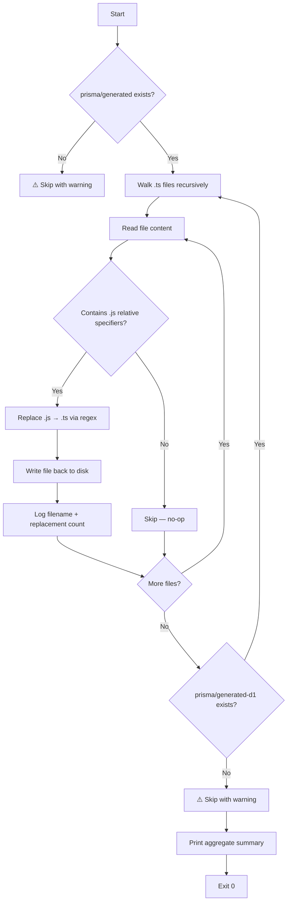

# Prisma + Deno Compatibility: Fixing `.js` Import Specifiers

## Problem

Prisma's code generator emits **Node-style `.js` extension imports** in every file it
writes to `prisma/generated/` and `prisma/generated-d1/`. For example:

```typescript
import * as $Class from "./internal/class.js"
import * as $Enums from "./enums.js"
export * from "./enums.js"
```

In a Node.js / bundler environment these resolve correctly, because the bundler (or
`ts-node`) transparently maps `.js` → `.ts` at the module resolution step. Deno's
resolver, however, is **strict**: a specifier must match the actual file on disk. Since
the generated files are `.ts` files, not `.js` files, Deno cannot resolve the import
without assistance.

## Why `--sloppy-imports` is not a solution

`--sloppy-imports` is a Deno escape hatch that relaxes module resolution. It is
intentionally not a stable, production-grade feature. Using it project-wide:

- Masks genuine typos in import paths (a missing file silently resolves to the wrong
  extension instead of failing at compile time).
- Signals to consumers of the package that strict Deno conventions are not followed.
- Is flagged in `deno check` output as a warning.

The correct fix is to make the import specifiers exactly match the files on disk.

## Solution: post-process generated files after `prisma generate`

After `prisma generate` writes the files, a lightweight post-processing script rewrites
every relative `.js` specifier to `.ts`:

- `from "./foo.js"` → `from "./foo.ts"`
- `export * from "../bar.js"` → `export * from "../bar.ts"`
- `import("./baz.js")` → `import("./baz.ts")`

Only **relative specifiers** (those starting with `./` or `../`) are rewritten. Bare
npm/jsr specifiers such as `"@prisma/client/runtime/client"` are left untouched.

## How `scripts/prisma-fix-imports.ts` works

The script is located at `scripts/prisma-fix-imports.ts` and can be run directly or via
`deno task`:

```
deno run --allow-read --allow-write scripts/prisma-fix-imports.ts
```

### Algorithm



### Key implementation details

| Detail | Value |
|---|---|
| Target dirs | `./prisma/generated`, `./prisma/generated-d1` |
| File filter | `.ts` files only |
| `from` regex | `` /(\bfrom\s+['"](?:\.\.?\/[^'"]*))\.js(['"])/g `` |
| Dynamic import regex | `` /(\bimport\s*\(\s*['"](?:\.\.?\/[^'"]*))\.js(['"])/g `` |
| Write-back | Only when at least one replacement was made (avoids mtime churn) |
| Missing dir | Graceful skip with `⚠️` warning — safe to call before `prisma generate` has ever run |
| Non-zero exit | On any unhandled I/O error, so CI fails loudly |

### Idempotency

Running the script a second time with already-fixed files still scans the `.ts` files but
produces zero replacements and performs no writes. It is safe to run on every `db:generate` invocation.

## Wire-up in `deno.json`

The script is automatically invoked at the end of both generate tasks:

```jsonc
"db:generate": "deno run -A --env=.envrc npm:prisma generate && deno run --allow-read --allow-write scripts/prisma-fix-imports.ts",
"db:generate:d1": "deno run -A npm:prisma generate --schema=prisma/schema.d1.prisma && deno run --allow-read --allow-write scripts/prisma-fix-imports.ts",
```

## The golden rule

> **Always use `deno task db:generate` or `deno task db:generate:d1` — never run
> `npx prisma generate` or `prisma generate` directly.**

Running Prisma directly without the fixup step will restore the `.js` specifiers in the
generated files. This will break `deno task check:worker` and `deno task test:worker`
with resolution errors like:

```
error: Module not found "file:///…/prisma/generated/enums.js"
```

## Verifying the fix is in effect

After running `deno task db:generate` (or after the initial commit that applied the fix),
verify with:

```bash
# Must pass with zero errors — no --sloppy-imports flag
deno task check:worker

# Also confirm no .js relative specifiers remain in generated files
grep -r "from.*\.\./.*\.js['\"]" prisma/ --include="*.ts"
grep -r "from.*\./.*\.js['\"]" prisma/ --include="*.ts"
# Both commands should produce no output
```

## Troubleshooting

| Symptom | Cause | Fix |
|---|---|---|
| `Module not found "…enums.js"` | `prisma generate` was run without the fix script | Run `deno run --allow-read --allow-write scripts/prisma-fix-imports.ts` |
| `check:worker` fails after regeneration | Same as above | Always use `deno task db:generate` |
| Script exits non-zero with `❌ Fatal error` | Disk permission issue or corrupted generated file | Check file permissions in `prisma/generated/` |
