# Prisma Schema Reference

> **Auto-documented from `prisma/schema.prisma`** — All 17 models with their
> fields, types, relations, constraints, and indexes. Grouped by domain.

---

## Table of Contents

- [Schema Overview](#schema-overview)
- [Entity Relationship Diagram](#entity-relationship-diagram)
- [Auth Domain](#auth-domain)
  - [User](#user)
  - [Session](#session)
  - [Account](#account)
  - [Verification](#verification)
  - [ApiKey](#apikey)
  - [TwoFactor](#twofactor)
- [Content Domain](#content-domain)
  - [FilterSource](#filtersource)
  - [FilterListVersion](#filterlistversion)
  - [CompiledOutput](#compiledoutput)
  - [CompilationEvent](#compilationevent)
- [Health Monitoring Domain](#health-monitoring-domain)
  - [SourceHealthSnapshot](#sourcehealthsnapshot)
  - [SourceChangeEvent](#sourcechangeevent)
- [Agent Sessions Domain](#agent-sessions-domain)
  - [AgentSession](#agentsession)
  - [AgentInvocation](#agentinvocation)
  - [AgentAuditLog](#agentauditlog)
- [Deployment Domain](#deployment-domain)
  - [DeploymentHistory](#deploymenthistory)
  - [DeploymentCounter](#deploymentcounter)
- [Legacy / Compatibility Domain](#legacy--compatibility-domain)
  - [StorageEntry](#storageentry)
  - [FilterCache](#filtercache)
  - [CompilationMetadata](#compilationmetadata)
- [Generator & Datasource Configuration](#generator--datasource-configuration)
- [Naming Conventions](#naming-conventions)

---

## Schema Overview

| Domain | Models | Purpose |
|---|---|---|
| **Auth** | User, Session, Account, Verification, ApiKey, TwoFactor | Identity, sessions, OAuth accounts, email verification, API keys, 2FA |
| **Content** | FilterSource, FilterListVersion, CompiledOutput, CompilationEvent | Filter lists, versions, compiled outputs, telemetry |
| **Health Monitoring** | SourceHealthSnapshot, SourceChangeEvent | Source reliability tracking, change detection |
| **Agent Sessions** | AgentSession, AgentInvocation, AgentAuditLog | Cloudflare Agents session tracking, tool invocations, security audit |
| **Deployment** | DeploymentHistory, DeploymentCounter | Worker deployment tracking (migrated from D1) |
| **Legacy** | StorageEntry, FilterCache, CompilationMetadata | Backward-compatible storage (migration target) |

### Model Ownership

| Model | Used By |
|---|---|
| User, Session, Account, Verification | **Better Auth** (via `prismaAdapter`) |
| TwoFactor | **Better Auth** (`twoFactor` plugin) |
| User (Clerk fields: `clerkUserId`, `firstName`, `lastName`) | **Clerk webhooks** (deprecated) |
| ApiKey | **Auth middleware** (`authenticateApiKey()`) |
| FilterSource, FilterListVersion | **Compilation pipeline** + **source health monitor** |
| CompiledOutput, CompilationEvent | **Compilation pipeline** + **telemetry** |
| AgentSession, AgentInvocation | **Cloudflare Agents** (WebSocket/SSE session tracking) |
| AgentAuditLog | **Agent security audit** (append-only) |
| DeploymentHistory, DeploymentCounter | **CI/CD deployment pipeline** |
| StorageEntry, FilterCache, CompilationMetadata | **HyperdriveStorageAdapter** + **D1StorageAdapter** (legacy) |

---

## Entity Relationship Diagram

```mermaid
erDiagram
    User ||--o{ Session : "has many"
    User ||--o{ Account : "has many"
    User ||--o{ ApiKey : "has many"
    User ||--o| TwoFactor : "has one"
    User ||--o{ AgentSession : "has many"

    FilterSource ||--o{ FilterListVersion : "has many"
    FilterSource ||--o{ SourceHealthSnapshot : "has many"
    FilterSource ||--o{ SourceChangeEvent : "has many"

    CompiledOutput ||--o{ CompilationEvent : "has many"

    AgentSession ||--o{ AgentInvocation : "has many"

    User {
        uuid id PK
        string email UK
        string displayName
        string role
        string clerkUserId UK
        string tier
        string firstName
        string lastName
        string imageUrl
        boolean emailVerified
        boolean twoFactorEnabled
        boolean banned
        string banReason
        timestamptz banExpires
        timestamptz lastSignInAt
        timestamptz createdAt
        timestamptz updatedAt
    }

    Session {
        uuid id PK
        uuid userId FK
        string token UK
        string tokenHash UK
        string ipAddress
        string userAgent
        timestamptz expiresAt
        timestamptz createdAt
        timestamptz updatedAt
    }

    Account {
        uuid id PK
        uuid userId FK
        string accountId
        string providerId
        string accessToken
        string refreshToken
        timestamptz accessTokenExpiresAt
        timestamptz refreshTokenExpiresAt
        string scope
        string idToken
        string password
        timestamptz createdAt
        timestamptz updatedAt
    }

    Verification {
        uuid id PK
        string identifier
        string value
        timestamptz expiresAt
        timestamptz createdAt
        timestamptz updatedAt
    }

    ApiKey {
        uuid id PK
        uuid userId FK
        string keyHash UK
        string keyPrefix
        string name
        string[] scopes
        int rateLimitPerMinute
        timestamptz expiresAt
        timestamptz revokedAt
        timestamptz lastUsedAt
        timestamptz createdAt
        timestamptz updatedAt
    }

    TwoFactor {
        uuid id PK
        uuid userId FK
        string secret
        string backupCodes
    }

    FilterSource {
        uuid id PK
        string url UK
        string name
        string status
        int refreshIntervalSeconds
        int consecutiveFailures
        timestamptz lastCheckedAt
        timestamptz createdAt
        timestamptz updatedAt
    }

    FilterListVersion {
        uuid id PK
        uuid sourceId FK
        string contentHash
        int ruleCount
        string r2Key
        boolean isCurrent
        timestamptz fetchedAt
        timestamptz expiresAt
    }

    CompiledOutput {
        uuid id PK
        string configHash UK
        string configName
        jsonb configSnapshot
        int ruleCount
        string r2Key
        timestamptz createdAt
        timestamptz expiresAt
    }

    CompilationEvent {
        uuid id PK
        uuid compiledOutputId FK
        uuid userId FK
        string requestSource
        int durationMs
        boolean cacheHit
        timestamptz createdAt
    }

    SourceHealthSnapshot {
        uuid id PK
        uuid sourceId FK
        string status
        int totalAttempts
        int successfulAttempts
        float avgDurationMs
        timestamptz recordedAt
    }

    SourceChangeEvent {
        uuid id PK
        uuid sourceId FK
        uuid previousVersionId
        uuid newVersionId
        int ruleCountDelta
        boolean contentHashChanged
        timestamptz detectedAt
    }

    AgentSession {
        uuid id PK
        string agentSlug
        string instanceId
        uuid userId FK
        string clerkUserId
        timestamptz startedAt
        timestamptz endedAt
        string endReason
        int messageCount
        string transport
        string clientIp
        string userAgent
        json metadata
    }

    AgentInvocation {
        uuid id PK
        uuid sessionId FK
        string toolName
        string inputSummary
        string outputSummary
        int durationMs
        boolean success
        string errorMessage
        timestamptz invokedAt
        jsonb metadata
    }

    AgentAuditLog {
        uuid id PK
        uuid actorUserId
        string agentSlug
        string instanceId
        string action
        string status
        string ipAddress
        string userAgent
        string reason
        jsonb metadata
        timestamptz createdAt
    }

    DeploymentHistory {
        string id PK
        string version
        int buildNumber
        string fullVersion UK
        string gitCommit
        string gitBranch
        timestamptz deployedAt
        string deployedBy
        string status
        int deploymentDuration
        string workflowRunId
        string workflowRunUrl
        jsonb metadata
    }

    DeploymentCounter {
        string version PK
        int lastBuildNumber
        timestamptz updatedAt
    }

    StorageEntry {
        cuid id PK
        string key UK
        string data
        datetime createdAt
        datetime expiresAt
    }

    FilterCache {
        cuid id PK
        string source UK
        string content
        string hash
        datetime expiresAt
    }

    CompilationMetadata {
        cuid id PK
        string configName
        datetime timestamp
        int ruleCount
        int duration
    }
```



---

## Auth Domain

### User

The central identity model. Used by **Better Auth** for session-based authentication
and by **Clerk webhooks** for user sync (deprecated).

| Field | Type | Attributes | Description |
|---|---|---|---|
| `id` | `String` (UUID) | `@id @default(uuid())` | Primary key |
| `email` | `String?` | `@unique` | Login email (nullable for anonymous users) |
| `displayName` | `String?` | `@map("display_name")` | User display name |
| `role` | `String` | `@default("user")` | `admin` \| `user` \| `readonly` |
| `createdAt` | `DateTime` | `@default(now()) @db.Timestamptz` | Creation timestamp |
| `updatedAt` | `DateTime` | `@updatedAt @db.Timestamptz` | Last update |
| `clerkUserId` | `String?` | `@unique @map("clerk_user_id")` | Clerk integration (deprecated) |
| `tier` | `String` | `@default("free")` | `anonymous` \| `free` \| `pro` \| `admin` |
| `firstName` | `String?` | `@map("first_name")` | From Clerk (deprecated) |
| `lastName` | `String?` | `@map("last_name")` | From Clerk (deprecated) |
| `imageUrl` | `String?` | `@map("image_url")` | Avatar URL |
| `emailVerified` | `Boolean` | `@default(false)` | Email verification status |
| `lastSignInAt` | `DateTime?` | `@db.Timestamptz` | Last sign-in timestamp |
| `twoFactorEnabled` | `Boolean` | `@default(false) @map("two_factor_enabled")` | Whether 2FA is enabled (Better Auth) |
| `banned` | `Boolean` | `@default(false)` | Whether the user is banned (Better Auth) |
| `banReason` | `String?` | `@map("ban_reason")` | Reason for ban |
| `banExpires` | `DateTime?` | `@db.Timestamptz @map("ban_expires")` | Ban expiry (null = permanent) |

**Table name:** `users`
**Relations:** `apiKeys` → ApiKey[], `sessions` → Session[], `accounts` → Account[], `twoFactor` → TwoFactor?, `agentSessions` → AgentSession[]
**Unique constraints:** `email`, `clerkUserId`

> **Note:** The Clerk-specific fields (`clerkUserId`, `firstName`, `lastName`, `imageUrl`,
> `lastSignInAt`) will be removed after the Clerk → Better Auth migration completes.
> Better Auth uses `displayName` and reads tier/role directly from the database.

---

### Session

Tracks active user sessions. Created by **Better Auth** on sign-in.

| Field | Type | Attributes | Description |
|---|---|---|---|
| `id` | `String` (UUID) | `@id @default(uuid())` | Primary key |
| `userId` | `String` (UUID) | `@map("user_id")` | FK → User |
| `token` | `String` | `@unique` | Better Auth session token |
| `tokenHash` | `String?` | `@unique @map("token_hash")` | Legacy Clerk token hash (nullable) |
| `ipAddress` | `String?` | `@map("ip_address")` | Client IP |
| `userAgent` | `String?` | `@map("user_agent")` | Client user agent |
| `expiresAt` | `DateTime` | `@db.Timestamptz` | Session expiry |
| `createdAt` | `DateTime` | `@default(now()) @db.Timestamptz` | Creation timestamp |
| `updatedAt` | `DateTime` | `@updatedAt @db.Timestamptz` | Last update |

**Table name:** `sessions`
**Relations:** `user` → User (via `userId`, cascade delete)
**Indexes:** `userId`
**Unique constraints:** `token`, `tokenHash`

> **Note:** `tokenHash` is nullable — Better Auth sessions use `token` directly.
> The `tokenHash` column exists for backward compatibility with Clerk sessions
> and will be removed after migration.

---

### Account

OAuth / credential accounts linked to a user. Managed by **Better Auth**.

| Field | Type | Attributes | Description |
|---|---|---|---|
| `id` | `String` (UUID) | `@id @default(uuid())` | Primary key |
| `userId` | `String` (UUID) | `@map("user_id")` | FK → User |
| `accountId` | `String` | `@map("account_id")` | Provider-specific account ID |
| `providerId` | `String` | `@map("provider_id")` | Provider name (e.g., `credential`, `google`) |
| `accessToken` | `String?` | `@map("access_token")` | OAuth access token |
| `refreshToken` | `String?` | `@map("refresh_token")` | OAuth refresh token |
| `accessTokenExpiresAt` | `DateTime?` | `@db.Timestamptz` | Access token expiry |
| `refreshTokenExpiresAt` | `DateTime?` | `@db.Timestamptz` | Refresh token expiry |
| `scope` | `String?` | | OAuth scopes |
| `idToken` | `String?` | `@map("id_token")` | OIDC ID token |
| `password` | `String?` | | Hashed password (for `credential` provider) |
| `createdAt` | `DateTime` | `@default(now()) @db.Timestamptz` | Creation timestamp |
| `updatedAt` | `DateTime` | `@updatedAt @db.Timestamptz` | Last update |

**Table name:** `account`
**Relations:** `user` → User (via `userId`, cascade delete)

---

### Verification

Email verification and password reset tokens. Managed by **Better Auth**.

| Field | Type | Attributes | Description |
|---|---|---|---|
| `id` | `String` (UUID) | `@id @default(uuid())` | Primary key |
| `identifier` | `String` | | What's being verified (e.g., email) |
| `value` | `String` | | Verification token value |
| `expiresAt` | `DateTime` | `@db.Timestamptz` | Token expiry |
| `createdAt` | `DateTime` | `@default(now()) @db.Timestamptz` | Creation timestamp |
| `updatedAt` | `DateTime` | `@updatedAt @db.Timestamptz` | Last update |

**Table name:** `verification`

---

### ApiKey

API keys for programmatic access. Managed by the **auth middleware** — not
by Better Auth.

| Field | Type | Attributes | Description |
|---|---|---|---|
| `id` | `String` (UUID) | `@id @default(uuid())` | Primary key |
| `userId` | `String` (UUID) | `@map("user_id")` | FK → User (owner) |
| `keyHash` | `String` | `@unique @map("key_hash")` | SHA-256 hash of the full API key |
| `keyPrefix` | `String` | `@map("key_prefix")` | First 8 chars for display (e.g., `abc_sk_l`) |
| `name` | `String` | | Human-readable key name |
| `scopes` | `String[]` | `@default(["compile"])` | Permission scopes |
| `rateLimitPerMinute` | `Int` | `@default(60)` | Per-key rate limit |
| `lastUsedAt` | `DateTime?` | `@db.Timestamptz` | Last usage timestamp (fire-and-forget update) |
| `expiresAt` | `DateTime?` | `@db.Timestamptz` | Expiry (null = never) |
| `revokedAt` | `DateTime?` | `@db.Timestamptz` | Revocation timestamp (null = active) |
| `createdAt` | `DateTime` | `@default(now()) @db.Timestamptz` | Creation timestamp |
| `updatedAt` | `DateTime` | `@updatedAt @db.Timestamptz` | Last update |

**Table name:** `api_keys`
**Relations:** `user` → User (via `userId`, cascade delete)
**Indexes:** `userId`
**Unique constraints:** `keyHash`

---

### TwoFactor

Stores TOTP secrets and backup codes per user. Managed by the **Better Auth `twoFactor` plugin**.

| Field | Type | Attributes | Description |
|---|---|---|---|
| `id` | `String` (UUID) | `@id @default(uuid())` | Primary key |
| `userId` | `String` (UUID) | `@map("user_id")` | FK → User (unique — one record per user) |
| `secret` | `String` | | Encrypted TOTP secret |
| `backupCodes` | `String` | `@map("backup_codes")` | JSON-encoded backup code array |

**Table name:** `two_factor`
**Relations:** `user` → User (via `userId`, cascade delete)
**Unique constraints:** `userId`

---

## Content Domain

### FilterSource

Represents a remote filter list URL (e.g., EasyList). The system periodically
fetches these sources and stores versioned snapshots.

| Field | Type | Attributes | Description |
|---|---|---|---|
| `id` | `String` (UUID) | `@id @default(uuid())` | Primary key |
| `url` | `String` | `@unique` | Filter list URL |
| `name` | `String` | | Human-readable name |
| `description` | `String?` | | Optional description |
| `homepage` | `String?` | | Source homepage URL |
| `license` | `String?` | | License identifier |
| `isPublic` | `Boolean` | `@default(true)` | Publicly visible? |
| `ownerUserId` | `String?` (UUID) | | Owner (for private sources) |
| `refreshIntervalSeconds` | `Int` | `@default(3600)` | How often to re-fetch (seconds) |
| `lastCheckedAt` | `DateTime?` | `@db.Timestamptz` | Last fetch attempt |
| `lastSuccessAt` | `DateTime?` | `@db.Timestamptz` | Last successful fetch |
| `lastFailureAt` | `DateTime?` | `@db.Timestamptz` | Last failed fetch |
| `consecutiveFailures` | `Int` | `@default(0)` | Failure streak counter |
| `status` | `String` | `@default("unknown")` | `healthy` \| `degraded` \| `unhealthy` \| `unknown` |
| `createdAt` | `DateTime` | `@default(now()) @db.Timestamptz` | Creation timestamp |
| `updatedAt` | `DateTime` | `@updatedAt @db.Timestamptz` | Last update |

**Table name:** `filter_sources`
**Relations:** `versions` → FilterListVersion[], `healthSnapshots` → SourceHealthSnapshot[], `changeEvents` → SourceChangeEvent[]
**Indexes:** `status`
**Unique constraints:** `url`

---

### FilterListVersion

A point-in-time snapshot of a filter source's content. The actual content is stored
in R2 (referenced by `r2Key`); the database stores metadata and the content hash.

| Field | Type | Attributes | Description |
|---|---|---|---|
| `id` | `String` (UUID) | `@id @default(uuid())` | Primary key |
| `sourceId` | `String` (UUID) | `@map("source_id")` | FK → FilterSource |
| `contentHash` | `String` | `@map("content_hash")` | SHA-256 of content |
| `ruleCount` | `Int` | `@map("rule_count")` | Number of rules in this version |
| `etag` | `String?` | | HTTP ETag from source server |
| `r2Key` | `String` | `@map("r2_key")` | Pointer to R2 object |
| `fetchedAt` | `DateTime` | `@default(now()) @db.Timestamptz` | When fetched |
| `expiresAt` | `DateTime?` | `@db.Timestamptz` | Cache expiry |
| `isCurrent` | `Boolean` | `@default(false)` | Is this the active version? |

**Table name:** `filter_list_versions`
**Relations:** `source` → FilterSource (via `sourceId`, cascade delete)
**Indexes:** `(sourceId, isCurrent)`, `contentHash`

> **Note:** A partial unique index should be applied via SQL migration to enforce
> "at most one current version per source":
> ```sql
> CREATE UNIQUE INDEX idx_filter_list_versions_current
>     ON filter_list_versions(source_id) WHERE is_current = true;
> ```

---

### CompiledOutput

A compiled filter list output. Contains the compilation configuration snapshot
and points to the compiled content in R2.

| Field | Type | Attributes | Description |
|---|---|---|---|
| `id` | `String` (UUID) | `@id @default(uuid())` | Primary key |
| `configHash` | `String` | `@unique @map("config_hash")` | Hash of the compilation config |
| `configName` | `String` | `@map("config_name")` | Human-readable config name |
| `configSnapshot` | `Json` | `@db.JsonB` | Full config at compilation time |
| `ruleCount` | `Int` | `@map("rule_count")` | Total rules in output |
| `sourceCount` | `Int` | `@map("source_count")` | Number of sources used |
| `durationMs` | `Int` | `@map("duration_ms")` | Compilation duration |
| `r2Key` | `String` | `@map("r2_key")` | Pointer to R2 object |
| `ownerUserId` | `String?` (UUID) | `@map("owner_user_id")` | Who triggered it |
| `createdAt` | `DateTime` | `@default(now()) @db.Timestamptz` | Creation timestamp |
| `expiresAt` | `DateTime?` | `@db.Timestamptz` | Cache expiry |

**Table name:** `compiled_outputs`
**Relations:** `events` → CompilationEvent[]
**Indexes:** `configName`, `createdAt DESC`, `ownerUserId`
**Unique constraints:** `configHash`

---

### CompilationEvent

Append-only telemetry for compilation requests. Used for analytics, billing,
and debugging.

| Field | Type | Attributes | Description |
|---|---|---|---|
| `id` | `String` (UUID) | `@id @default(uuid())` | Primary key |
| `compiledOutputId` | `String?` (UUID) | `@map("compiled_output_id")` | FK → CompiledOutput (nullable for failed compilations) |
| `userId` | `String?` (UUID) | `@map("user_id")` | Who triggered it |
| `apiKeyId` | `String?` (UUID) | `@map("api_key_id")` | Which API key was used |
| `requestSource` | `String` | `@map("request_source")` | `worker` \| `cli` \| `batch_api` \| `workflow` |
| `workerRegion` | `String?` | `@map("worker_region")` | Cloudflare colo |
| `durationMs` | `Int` | `@map("duration_ms")` | Request duration |
| `cacheHit` | `Boolean` | `@default(false)` | Was a cached output served? |
| `errorMessage` | `String?` | `@map("error_message")` | Error (for failed compilations) |
| `createdAt` | `DateTime` | `@default(now()) @db.Timestamptz` | Event timestamp |

**Table name:** `compilation_events`
**Relations:** `compiledOutput` → CompiledOutput? (via `compiledOutputId`, set null on delete)
**Indexes:** `createdAt DESC`, `userId`

---

## Health Monitoring Domain

### SourceHealthSnapshot

Periodic health snapshots for filter sources. Used by the source health dashboard.

| Field | Type | Attributes | Description |
|---|---|---|---|
| `id` | `String` (UUID) | `@id @default(uuid())` | Primary key |
| `sourceId` | `String` (UUID) | `@map("source_id")` | FK → FilterSource |
| `status` | `String` | | `healthy` \| `degraded` \| `unhealthy` |
| `totalAttempts` | `Int` | `@default(0)` | Total fetch attempts in period |
| `successfulAttempts` | `Int` | `@default(0)` | Successful fetches |
| `failedAttempts` | `Int` | `@default(0)` | Failed fetches |
| `consecutiveFailures` | `Int` | `@default(0)` | Current failure streak |
| `avgDurationMs` | `Float` | `@default(0)` | Average fetch duration |
| `avgRuleCount` | `Float` | `@default(0)` | Average rules per fetch |
| `recordedAt` | `DateTime` | `@default(now()) @db.Timestamptz` | Snapshot timestamp |

**Table name:** `source_health_snapshots`
**Relations:** `source` → FilterSource (via `sourceId`, cascade delete)
**Indexes:** `sourceId`, `recordedAt DESC`

---

### SourceChangeEvent

Records when a filter source's content changes between versions.

| Field | Type | Attributes | Description |
|---|---|---|---|
| `id` | `String` (UUID) | `@id @default(uuid())` | Primary key |
| `sourceId` | `String` (UUID) | `@map("source_id")` | FK → FilterSource |
| `previousVersionId` | `String?` (UUID) | `@map("previous_version_id")` | Previous version ID |
| `newVersionId` | `String` (UUID) | `@map("new_version_id")` | New version ID |
| `ruleCountDelta` | `Int` | `@default(0)` | Change in rule count |
| `contentHashChanged` | `Boolean` | `@default(true)` | Whether content actually changed |
| `detectedAt` | `DateTime` | `@default(now()) @db.Timestamptz` | Detection timestamp |

**Table name:** `source_change_events`
**Relations:** `source` → FilterSource (via `sourceId`, cascade delete)
**Indexes:** `sourceId`, `detectedAt DESC`

---

## Agent Sessions Domain

### AgentSession

Tracks active and historical Cloudflare Agents connections over WebSocket or SSE.

| Field | Type | Attributes | Description |
|---|---|---|---|
| `id` | `String` (UUID) | `@id @default(uuid())` | Primary key |
| `agentSlug` | `String` | `@map("agent_slug")` | Agent identifier from `AGENT_REGISTRY` |
| `instanceId` | `String` | `@map("instance_id")` | Durable Object instance name |
| `userId` | `String?` (UUID) | `@map("user_id")` | FK → User (nullable for anonymous) |
| `clerkUserId` | `String?` | `@map("clerk_user_id")` | Clerk user ID (legacy / cross-reference) |
| `startedAt` | `DateTime` | `@default(now()) @db.Timestamptz` | Session start time |
| `endedAt` | `DateTime?` | `@db.Timestamptz` | Session end time (NULL = still active) |
| `endReason` | `String?` | `@map("end_reason")` | `client_disconnect` \| `server_error` \| `admin_terminate` \| `timeout` |
| `messageCount` | `Int` | `@default(0)` | WebSocket messages received |
| `transport` | `String` | `@default("websocket")` | `websocket` \| `sse` |
| `clientIp` | `String?` | `@map("client_ip")` | Client IP address |
| `userAgent` | `String?` | `@map("user_agent")` | Client user agent |
| `metadata` | `Json?` | | Extensibility JSON blob |

**Table name:** `agent_sessions`
**Relations:** `user` → User? (via `userId`, set null on delete), `invocations` → AgentInvocation[]
**Indexes:** `userId`, `clerkUserId`, `agentSlug`, `startedAt`, `(userId, endedAt)` (active sessions per user)

---

### AgentInvocation

Tracks individual tool calls / actions within an agent session.

| Field | Type | Attributes | Description |
|---|---|---|---|
| `id` | `String` (UUID) | `@id @default(uuid())` | Primary key |
| `sessionId` | `String` (UUID) | `@map("session_id")` | FK → AgentSession |
| `toolName` | `String` | `@map("tool_name")` | Name of the tool called |
| `inputSummary` | `String?` | `@map("input_summary")` | Brief summary of tool input |
| `outputSummary` | `String?` | `@map("output_summary")` | Brief summary of tool output |
| `durationMs` | `Int?` | `@map("duration_ms")` | Invocation duration |
| `success` | `Boolean` | `@default(true)` | Whether the invocation succeeded |
| `errorMessage` | `String?` | `@map("error_message")` | Error message if failed |
| `invokedAt` | `DateTime` | `@default(now()) @db.Timestamptz` | Invocation timestamp |
| `metadata` | `Json?` | `@db.JsonB` | Extensibility JSON blob |

**Table name:** `agent_invocations`
**Relations:** `session` → AgentSession (via `sessionId`, cascade delete)
**Indexes:** `sessionId`, `toolName`, `invokedAt`

---

### AgentAuditLog

Append-only audit log for agent-related security events (ZTA telemetry).

| Field | Type | Attributes | Description |
|---|---|---|---|
| `id` | `String` (UUID) | `@id @default(uuid())` | Primary key |
| `actorUserId` | `String?` (UUID) | `@map("actor_user_id")` | User who triggered the action |
| `agentSlug` | `String?` | `@map("agent_slug")` | Agent identifier |
| `instanceId` | `String?` | `@map("instance_id")` | Durable Object instance |
| `action` | `String` | | Action type (e.g., `session_start`, `tool_invoke`) |
| `status` | `String` | `@default("success")` | `success` \| `failure` |
| `ipAddress` | `String?` | `@map("ip_address")` | Client IP |
| `userAgent` | `String?` | `@map("user_agent")` | Client user agent |
| `reason` | `String?` | | Reason for the action / failure |
| `metadata` | `Json?` | `@db.JsonB` | Extensibility JSON blob |
| `createdAt` | `DateTime` | `@default(now()) @db.Timestamptz` | Event timestamp |

**Table name:** `agent_audit_logs`
**Indexes:** `actorUserId`, `agentSlug`, `action`, `createdAt`

> **Append-only:** Never update or delete rows from this table. It feeds ZTA security dashboards and SIEM pipelines via `AnalyticsService.trackSecurityEvent()`.

---

## Deployment Domain

### DeploymentHistory

Tracks worker deployments. Migrated from the legacy D1 `deployment_history` table.

| Field | Type | Attributes | Description |
|---|---|---|---|
| `id` | `String` | `@id` | Primary key (string, not UUID) |
| `version` | `String` | | Semantic version string |
| `buildNumber` | `Int` | `@map("build_number")` | Monotonically increasing build number |
| `fullVersion` | `String` | `@unique @map("full_version")` | e.g., `1.2.3-45` |
| `gitCommit` | `String` | `@map("git_commit")` | Git commit SHA |
| `gitBranch` | `String` | `@map("git_branch")` | Git branch name |
| `deployedAt` | `DateTime` | `@default(now()) @db.Timestamptz` | Deployment timestamp |
| `deployedBy` | `String` | `@map("deployed_by")` | Actor (e.g., GitHub Actions bot) |
| `status` | `String` | `@default("success")` | `success` \| `failure` \| `rollback` |
| `deploymentDuration` | `Int?` | `@map("deployment_duration")` | Duration in seconds |
| `workflowRunId` | `String?` | `@map("workflow_run_id")` | GitHub Actions run ID |
| `workflowRunUrl` | `String?` | `@map("workflow_run_url")` | GitHub Actions run URL |
| `metadata` | `Json?` | `@db.JsonB` | Additional deployment metadata |

**Table name:** `deployment_history`
**Unique constraints:** `fullVersion`, `(version, buildNumber)`
**Indexes:** `version`, `buildNumber`, `deployedAt DESC`, `status`, `gitCommit`

---

### DeploymentCounter

Tracks the last build number per version to support monotonically incrementing builds.

| Field | Type | Attributes | Description |
|---|---|---|---|
| `version` | `String` | `@id` | Version string (primary key) |
| `lastBuildNumber` | `Int` | `@default(0) @map("last_build_number")` | Last issued build number for this version |
| `updatedAt` | `DateTime` | `@updatedAt @db.Timestamptz` | Last update |

**Table name:** `deployment_counter`

---

## Legacy / Compatibility Domain

> ⚠️ **These models are retained for backward compatibility** with the
> `HyperdriveStorageAdapter` and `D1StorageAdapter`. New code should use the
> Content domain models (`CompiledOutput`, `CompilationEvent`, etc.) instead.

### StorageEntry

Generic key-value storage. Used by `IStorageAdapter.set()` / `.get()`.

| Field | Type | Attributes | Description |
|---|---|---|---|
| `id` | `String` | `@id @default(cuid())` | Primary key (CUID) |
| `key` | `String` | `@unique` | Storage key |
| `data` | `String` | | Serialized JSON value |
| `createdAt` | `DateTime` | `@default(now())` | Creation timestamp |
| `updatedAt` | `DateTime` | `@updatedAt` | Last update |
| `expiresAt` | `DateTime?` | | TTL expiry |
| `tags` | `String?` | | Optional tags |

**Table name:** `storage_entries`
**Indexes:** `key`, `expiresAt`
**ID strategy:** `cuid()` (not UUID — legacy)

---

### FilterCache

Cached filter list content. Used by `IStorageAdapter.cacheFilterList()`.

| Field | Type | Attributes | Description |
|---|---|---|---|
| `id` | `String` | `@id @default(cuid())` | Primary key (CUID) |
| `source` | `String` | `@unique` | Source URL |
| `content` | `String` | | Cached content |
| `hash` | `String` | | Content hash |
| `etag` | `String?` | | HTTP ETag |
| `createdAt` | `DateTime` | `@default(now())` | Creation timestamp |
| `updatedAt` | `DateTime` | `@updatedAt` | Last update |
| `expiresAt` | `DateTime?` | | TTL expiry |

**Table name:** `filter_cache`
**Indexes:** `source`, `expiresAt`
**ID strategy:** `cuid()` (not UUID — legacy)

---

### CompilationMetadata

Legacy compilation metadata. Used by `IStorageAdapter.storeCompilationMetadata()`.

| Field | Type | Attributes | Description |
|---|---|---|---|
| `id` | `String` | `@id @default(cuid())` | Primary key (CUID) |
| `configName` | `String` | | Configuration name |
| `timestamp` | `DateTime` | `@default(now())` | Compilation time |
| `sourceCount` | `Int` | | Number of sources |
| `ruleCount` | `Int` | | Total rules |
| `duration` | `Int` | | Duration in ms |
| `outputPath` | `String?` | | Output file path |

**Table name:** `compilation_metadata`
**Indexes:** `configName`, `timestamp`
**ID strategy:** `cuid()` (not UUID — legacy)

> **TODO (Phase 2):** Migrate callers to use `CompiledOutput` + `CompilationEvent`
> instead. See the comment in `prisma/schema.prisma`.

---

## Generator & Datasource Configuration

```prisma
generator client {
  provider = "prisma-client"
  output   = "./generated"
  runtime  = "cloudflare"
  // "cloudflare" runtime uses @prisma/adapter-pg code path — no runtime WASM.
  // Required for Cloudflare Workers which block WebAssembly.Module() at runtime.
}

datasource db {
  provider = "postgresql"
  // Connection URL is configured in prisma.config.ts (Prisma 7+)
}
```

| Setting | Value | Notes |
|---|---|---|
| **Generator** | `prisma-client` | Generates to `prisma/generated/` |
| **Provider** | `postgresql` | Neon PostgreSQL |
| **URL resolution** | `prisma.config.ts` | `DIRECT_DATABASE_URL` → `DATABASE_URL` fallback |
| **Post-generate script** | `scripts/prisma-fix-imports.ts` | Fixes imports for Deno compatibility |

> ⚠️ Always use `deno task db:generate` instead of `npx prisma generate` to
> ensure the import fixer runs.

---

## Naming Conventions

| Prisma Convention | PostgreSQL Convention | Example |
|---|---|---|
| Model name: PascalCase | Table name: snake_case via `@@map` | `FilterSource` → `filter_sources` |
| Field name: camelCase | Column name: snake_case via `@map` | `userId` → `user_id` |
| ID fields: UUID | `@db.Uuid` | `@id @default(uuid()) @db.Uuid` |
| Timestamps: Timestamptz | `@db.Timestamptz` | `@default(now()) @db.Timestamptz` |
| Legacy IDs: CUID | `@default(cuid())` | StorageEntry, FilterCache, CompilationMetadata |

### PostgreSQL-Specific Types

| Prisma Type | PostgreSQL Type | Used In |
|---|---|---|
| `String @db.Uuid` | `uuid` | All auth + content domain IDs |
| `DateTime @db.Timestamptz` | `timestamptz` | All timestamps (timezone-aware) |
| `Json @db.JsonB` | `jsonb` | `CompiledOutput.configSnapshot` |
| `String[]` | `text[]` | `ApiKey.scopes` |

---

## Further Reading

- [Neon Setup](./neon-setup.md) — Production database configuration
- [Database Architecture](./DATABASE_ARCHITECTURE.md) — Design decisions and trade-offs
- [Prisma + Deno Compatibility](./prisma-deno-compatibility.md) — Deno-specific setup
- [Local Dev Guide](./local-dev.md) — Docker PostgreSQL for development
- [Prisma Schema Documentation](https://www.prisma.io/docs/orm/prisma-schema/overview)
