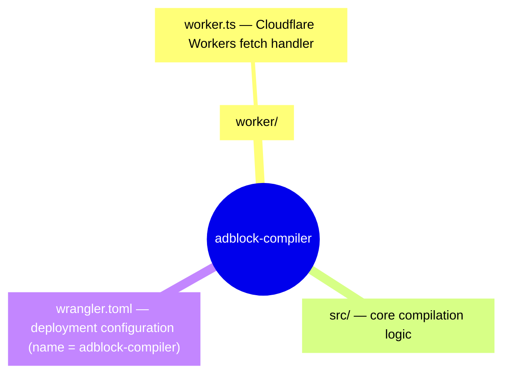
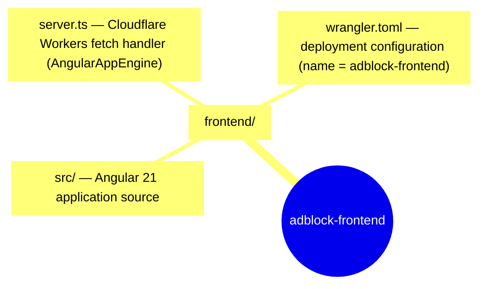
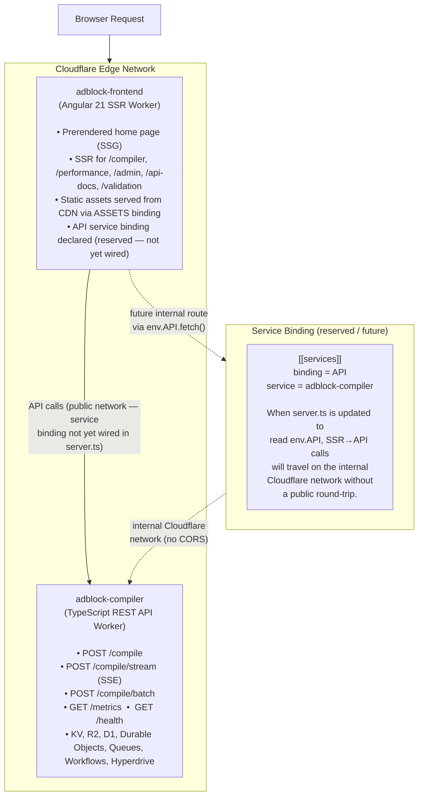
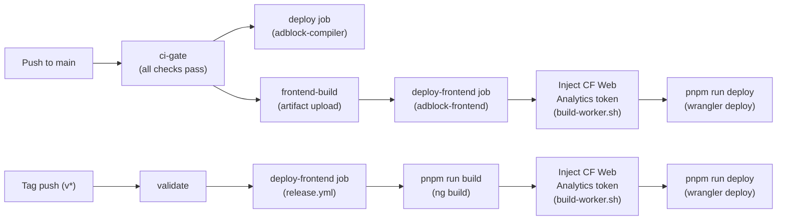

# Cloudflare Workers Architecture

This document describes the two Cloudflare Workers deployments that make up the Adblock Compiler service, the differences between them, and how they relate to each other.

---

## Overview

The Adblock Compiler is deployed as **two separate Cloudflare Workers** from a single GitHub repository. Each has a distinct role:

| | `adblock-compiler` | `adblock-frontend` |
|---|---|---|
| **Wrangler config** | [`wrangler.toml`](../../wrangler.toml) | [`frontend/wrangler.toml`](../../frontend/wrangler.toml) |
| **Entry point** | `worker/worker.ts` | `dist/adblock-compiler/server/server.mjs` |
| **Role** | REST API + compilation engine; also serves the Angular SPA as bundled static assets (CSR only) | Angular 21 SSR UI — **canonical home URL for the app** |
| **Source path** | `worker/` + `src/` | `frontend/` |
| **Deploy command** | `deno task wrangler:deploy` | `sh scripts/deploy-frontend.sh` (repo root) |
| **CI deploy trigger** | `deploy` job in `ci.yml` (main push) | `deploy-frontend` job in `ci.yml` (main push, or `workflow_dispatch` with `force_deploy_frontend: true`) |
| **Release deploy trigger** | `build-binaries` job in `release.yml` | `deploy-frontend` job in `release.yml` (tag push) |
| **Local dev port** | `8787` | `8787` (via `pnpm --filter adblock-frontend run preview`) |

---

## `adblock-compiler` — The API Worker

### What It Does

The backend worker is the **compilation engine**. It:

- Exposes a REST API (`POST /compile`, `POST /compile/stream`, `POST /compile/batch`, `GET /metrics`, etc.)
- Runs adblock/hostlist filter list compilation using the core `src/` TypeScript logic (forked from [AdguardTeam/HostlistCompiler](https://github.com/AdguardTeam/HostlistCompiler))
- Handles async queue-based compilation via Cloudflare Queues
- Manages caching, rate limiting, and metrics via KV namespaces
- Stores compiled outputs in R2 and persists state in D1 + Durable Objects
- Runs scheduled background jobs (cache warming, health monitoring) via Cloudflare Workflows + Cron Triggers
- Also serves the compiled Angular frontend as static assets via its `[assets]` binding (bundled deployment mode)

### Source



### Key Bindings

| Binding | Type | Purpose |
|---|---|---|
| `COMPILATION_CACHE` | KV | Cache compiled filter lists |
| `RATE_LIMIT` | KV | Per-IP rate limiting |
| `METRICS` | KV | Metrics counters |
| `FILTER_STORAGE` | R2 | Store compiled filter list outputs |
| `DB` | D1 | SQLite edge database |
| `ADBLOCK_COMPILER` | Durable Object | Stateful compilation sessions |
| `HYPERDRIVE` | Hyperdrive | Accelerated PostgreSQL access |
| `ANALYTICS_ENGINE` | Analytics Engine | High-cardinality telemetry |
| `ASSETS` | Static Assets | Serves compiled Angular frontend as static assets (bundled/single-worker mode only) |

---

## `adblock-frontend` — The UI Worker

### What It Does

The frontend worker is the **Angular 21 SSR application**. It:

- Server-side renders the Angular application at the Cloudflare edge using `AngularAppEngine`
- Serves the home page as a prerendered static page (SSG); all other routes are SSR per-request
- Serves JS/CSS/font bundles directly from Cloudflare's CDN via the `ASSETS` binding (the Worker never handles these requests)
- Calls the `adblock-compiler` backend Worker's REST API for all compilation operations

### Source



### Key Bindings

| Binding | Type | Purpose |
|---|---|---|
| `ASSETS` | Static Assets | JS bundles, CSS, fonts — served from CDN before the Worker is invoked |
| `API` | Service Binding | Reserved — bound to `adblock-compiler` backend on the internal Cloudflare network. Not yet consumed by `server.ts`; declared for future SSR→API internal routing without public network hops. |

### SSR Architecture

The `server.ts` fetch handler uses Angular 21's `AngularAppEngine` with the standard [WinterCG](https://wintercg.org/) fetch API — no Express, no Node.js HTTP server:

```typescript
const angularApp = new AngularAppEngine();

export default {
    async fetch(request: Request, env: Env, ctx: ExecutionContext): Promise<Response> {
        const response = await angularApp.handle(request);
        return response ?? new Response('Not found', { status: 404 });
    },
} satisfies ExportedHandler<Env>;
```

This means:
- **Edge-compatible** — runs in any WinterCG-compliant runtime (Cloudflare Workers, Deno Deploy, Fastly Compute)
- **Fast cold starts** — no Express middleware chain, no Node.js HTTP server initialisation
- **Zero-overhead static assets** — JS/CSS/fonts are served by Cloudflare CDN before the Worker is ever invoked

---

## Relationship Between the Two Workers



### Two Deployment Modes

The backend worker supports **two ways** the frontend can be served:

#### 1. Bundled Mode (single worker)
The root `wrangler.toml` includes an `[assets]` block pointing to the Angular build output:

```toml
[assets]
directory = "./frontend/dist/adblock-compiler/browser"
binding = "ASSETS"
```

This means a single `wrangler deploy` from the repo root deploys **both** the API and the Angular frontend as one unit. The Worker serves API requests; static assets are served by Cloudflare CDN via the binding.

#### 2. Independent SSR Mode (two separate workers)
`frontend/wrangler.toml` deploys the Angular application as its **own Worker** with full SSR (`AngularAppEngine`). This is the `adblock-frontend` worker. It runs server-side rendering at the edge and calls the backend API for data.

| | Bundled Mode | Independent SSR Mode |
|---|---|---|
| **Workers deployed** | 1 (`adblock-compiler`) | 2 (backend + frontend) |
| **Frontend serving** | Static assets via CDN binding | `AngularAppEngine` SSR + CDN for assets |
| **SSR support** | No (SPA only) | Yes (prerender + server rendering) |
| **Deploy command** | `deno task wrangler:deploy` (root) | `deno task wrangler:deploy` (root) + `sh scripts/deploy-frontend.sh` |
| **Use case** | Simpler deployment, CSR only | Full SSR, edge rendering, independent scaling |

---

## Deployment

### Backend

```bash
# From repo root
deno task wrangler:deploy
```

### Frontend (Independent SSR mode)

```bash
# Preferred — builds, injects CF analytics token, and deploys in one step:
sh scripts/deploy-frontend.sh

# Or step by step (from repo root):
pnpm --filter adblock-frontend run build
sh scripts/build-worker.sh      # injects/removes {{CF_WEB_ANALYTICS_TOKEN}} in index.html
pnpm --filter adblock-frontend run deploy
```

> **Important:** Always run `scripts/build-worker.sh` after `ng build` and before `wrangler deploy`. It rewrites the `{{CF_WEB_ANALYTICS_TOKEN}}` placeholder in `dist/.../browser/index.html` (or removes the analytics `<script>` tag if `CF_WEB_ANALYTICS_TOKEN` is not set). Skipping this step leaves the placeholder in the deployed HTML.

### CI/CD Automatic Deployment

Both Workers are deployed automatically by GitHub Actions:



| Trigger | Backend deploy | Frontend deploy |
|---|---|---|
| Push to `main` | `ci.yml` → `deploy` job | `ci.yml` → `deploy-frontend` job (when `frontend/**` changed) |
| Tag push (`v*`) | `release.yml` → binary/docker builds | `release.yml` → `deploy-frontend` job |
| Manual dispatch | — | `ci.yml` → `deploy-frontend` job (set `force_deploy_frontend: true`) |

### Manual Force-Redeploy

If the frontend worker shows **"Assets have not yet been deployed"**, it means the `adblock-frontend` worker was registered on Cloudflare without its build artifacts (`dist/adblock-compiler/browser`). This typically happens when:

- The `deploy-frontend` CI job was skipped because no `frontend/**` files changed.
- The worker was first registered before the build artifact was available.

To fix it immediately without a code change:

1. Go to **GitHub Actions → CI → Run workflow**.
2. Select the `main` branch.
3. Set **`force_deploy_frontend`** to `true`.
4. Click **Run workflow**.

This forces `frontend-build` and `deploy-frontend` to run regardless of which files changed.

### Local Development

```bash
# Backend API
deno task wrangler:dev                                         # → http://localhost:8787

# Frontend (Angular dev server, CSR)
pnpm --filter adblock-frontend run start             # → http://localhost:4200

# Frontend (Cloudflare Workers preview, mirrors production SSR)
pnpm --filter adblock-frontend run preview           # → http://localhost:8787
```

---

## Renaming Note

> **These workers were renamed twice. Current names as of this PR:**
>
> | Old name | Interim name (2026-03-07) | Current name | Date |
> |---|---|---|---|
> | `adblock-compiler` | `adblock-compiler-backend` | `adblock-compiler` | 2026-03-07 |
> | `adblock-compiler-angular-poc` | `adblock-frontend` | `adblock-frontend` | 2026-03-07 |
> | `adblock-compiler-frontend` | `adblock-frontend` | `adblock-frontend` | 2026-03-23 |
>
> The backend was renamed back to `adblock-compiler` for brevity. If you have workers under old names in your Cloudflare dashboard, they continue to run until manually deleted. The next `wrangler deploy` creates workers under the current names.

---

## Further Reading

- [`worker/README.md`](../../worker/README.md) — Worker API endpoints and implementation details
- [`frontend/README.md`](../../frontend/README.md) — Angular frontend architecture and Angular 21 features
- [`docs/deployment/cloudflare-pages.md`](cloudflare-pages.md) — Cloudflare Pages deployment
- [`docs/cloudflare/README.md`](../cloudflare/README.md) — Cloudflare-specific features index
- [Cloudflare Workers Docs](https://developers.cloudflare.com/workers/)
- [Wrangler CLI](https://developers.cloudflare.com/workers/wrangler/)
