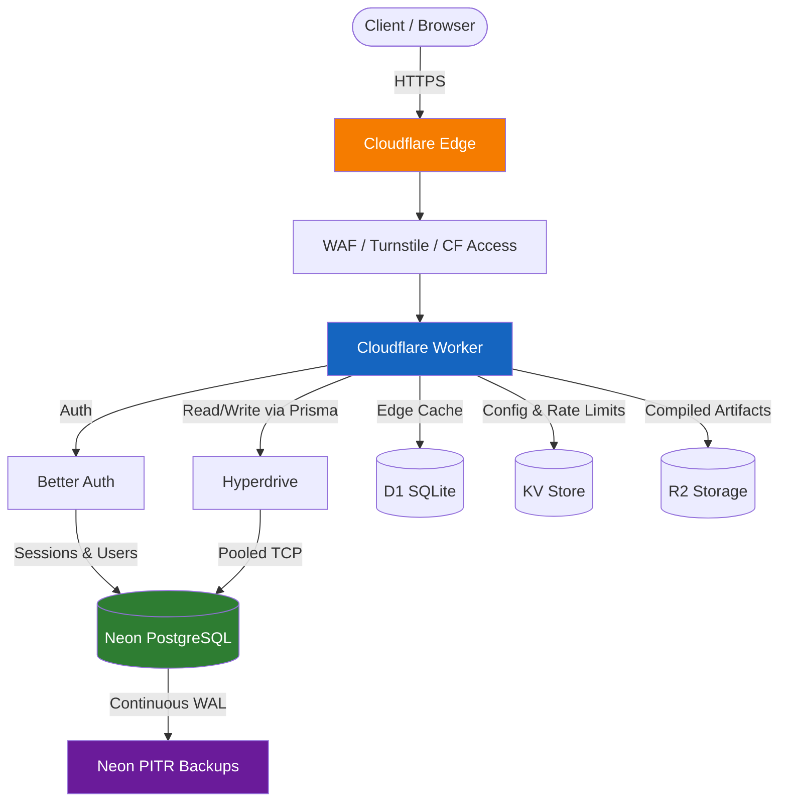
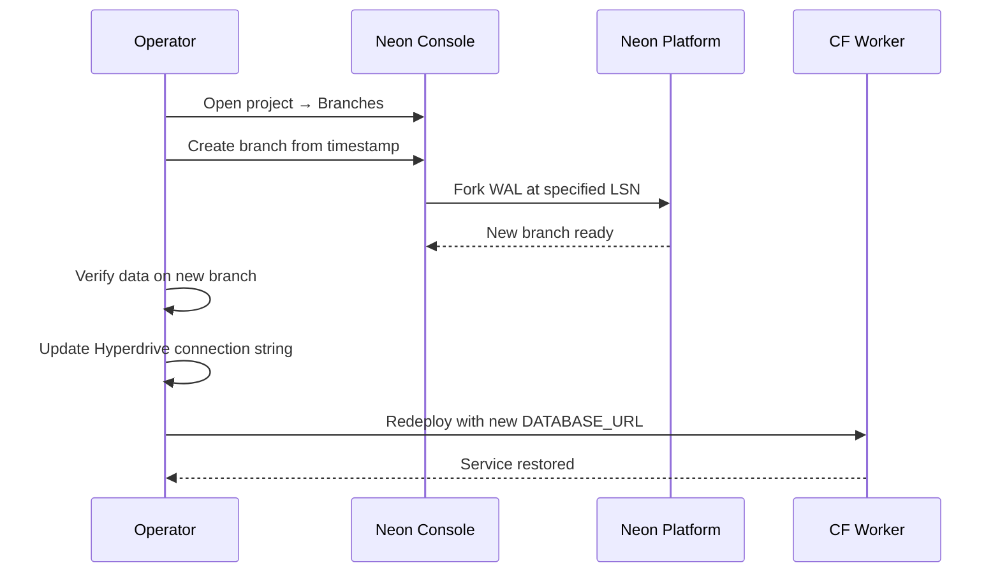
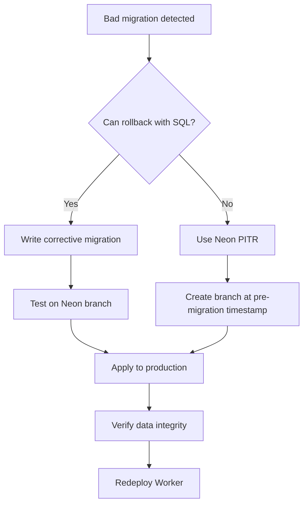

# Disaster Recovery & Incident Response Guide

**Project**: adblock-compiler
**Stack**: Cloudflare Workers · Neon PostgreSQL · Better Auth
**Last Updated**: 2025-07-15

---

## Table of Contents

- [1. Architecture Overview](#1-architecture-overview)
- [2. Recovery Targets](#2-recovery-targets)
- [3. Neon Database Recovery](#3-neon-database-recovery)
- [4. Failure Scenarios & Runbooks](#4-failure-scenarios--runbooks)
  - [Scenario 1: Neon Database Unavailable](#scenario-1-neon-database-unavailable)
  - [Scenario 2: Hyperdrive Connection Pool Exhausted](#scenario-2-hyperdrive-connection-pool-exhausted)
  - [Scenario 3: Better Auth Secret Compromised](#scenario-3-better-auth-secret-compromised)
  - [Scenario 4: Cloudflare Workers Outage](#scenario-4-cloudflare-workers-outage)
  - [Scenario 5: Data Corruption / Bad Migration](#scenario-5-data-corruption--bad-migration)
  - [Scenario 6: ADMIN_KEY or API Token Leak](#scenario-6-admin_key-or-api-token-leak)
- [5. Backup Strategy](#5-backup-strategy)
- [6. Communication Plan](#6-communication-plan)
- [7. Post-Incident Review Template](#7-post-incident-review-template)
- [8. Emergency Contacts & Links](#8-emergency-contacts--links)

---

## 1. Architecture Overview

The adblock-compiler production deployment runs on Cloudflare's edge network with Neon PostgreSQL as the primary data store. All authentication flows use Better Auth, with sessions and user data persisted to Neon via Prisma.

| Component | Role |
|-----------|------|
| **Cloudflare Workers** | Serverless compute — handles API requests, compilation, and routing |
| **Neon PostgreSQL** | Primary database — user accounts, API keys, compilation metadata |
| **Cloudflare Hyperdrive** | Connection pooler — proxies and caches TCP connections to Neon |
| **Cloudflare D1** | Edge-local SQLite cache — low-latency reads for hot data |
| **Cloudflare KV** | Distributed key-value store — rate limits, feature flags, config |
| **Cloudflare R2** | Object storage — compiled filter list artifacts |
| **Better Auth** | Authentication framework — session management, OAuth, API keys |



### Data Flow Summary

1. Requests arrive at the Cloudflare edge and pass through WAF, Turnstile, and CF Access policies.
2. The Worker authenticates via Better Auth (Clerk JWT or API key), enforces rate limits from KV, and routes the request.
3. Database reads/writes go through Hyperdrive to Neon PostgreSQL. Hot data is cached in D1.
4. Compiled filter list output is written to R2 for durable storage and CDN delivery.
5. Neon continuously streams WAL records for point-in-time recovery.

---

## 2. Recovery Targets

| Component | RPO | RTO | Recovery Method | Notes |
|-----------|-----|-----|-----------------|-------|
| **Neon PostgreSQL** | ~0 (continuous WAL) | < 5 min | Point-in-time recovery | Branch from any LSN within retention window |
| **D1 Edge Cache** | N/A (rebuildable) | < 1 min | Auto-rebuilds from Neon | No user data — purely a read cache |
| **KV Config** | Last backup | < 2 min | `wrangler kv bulk put` | Export/import via Wrangler CLI |
| **R2 Artifacts** | N/A (regeneratable) | < 10 min | Recompile from filter sources | Artifacts are deterministic outputs |
| **Auth Sessions** | Last DB state | < 5 min | Restore Neon → sessions restored | Users re-login if session table lost |

> **RPO** = Recovery Point Objective (max acceptable data loss)
> **RTO** = Recovery Time Objective (max acceptable downtime)

---

## 3. Neon Database Recovery

Neon provides native point-in-time recovery (PITR) via continuous WAL archiving. This is the primary disaster recovery mechanism for all persistent data.

### 3.1 Point-in-Time Recovery (PITR)

Neon continuously archives WAL records. You can restore to any point within the retention window (7 days on Free, 30 days on Pro).



### 3.2 Restore via Neon Console

1. Navigate to [Neon Console](https://console.neon.tech) → select project.
2. Go to **Branches** → **Create Branch**.
3. Select **Point in time** and choose the target timestamp (before the incident).
4. Name the branch (e.g., `recovery-2025-07-15`).
5. Copy the new branch connection string.
6. Verify data integrity by connecting with `psql` or Prisma Studio.
7. Update the Hyperdrive binding or `DATABASE_URL` secret:

```bash
wrangler secret put DATABASE_URL
# Paste the new Neon branch connection string
```

8. Redeploy the Worker:

```bash
wrangler deploy
```

### 3.3 Restore via Neon API

```bash
# Create a recovery branch from a specific timestamp
curl -X POST "https://console.neon.tech/api/v2/projects/${NEON_PROJECT_ID}/branches" \
  -H "Authorization: Bearer ${NEON_API_KEY}" \
  -H "Content-Type: application/json" \
  -d '{
    "branch": {
      "name": "recovery-'"$(date +%Y%m%d-%H%M)"'",
      "parent_timestamp": "2025-07-15T10:30:00Z"
    },
    "endpoints": [{ "type": "read_write" }]
  }'
```

### 3.4 Post-Restore Integrity Checks

After restoring, run these validation queries:

```sql
-- Verify user count is reasonable
SELECT COUNT(*) FROM "user";

-- Check for orphaned sessions
SELECT COUNT(*) FROM "session" s
  LEFT JOIN "user" u ON s."userId" = u."id"
  WHERE u."id" IS NULL;

-- Verify API key integrity
SELECT COUNT(*) FROM "apiKey" WHERE "userId" IS NULL;

-- Check migration state
SELECT * FROM "_prisma_migrations" ORDER BY "finished_at" DESC LIMIT 5;
```

---

## 4. Failure Scenarios & Runbooks

### Scenario 1: Neon Database Unavailable

| | |
|---|---|
| **Symptoms** | 500 errors on all DB-dependent endpoints; `/health` returns `database: unhealthy` |
| **Detection** | Hyperdrive health check fails; error rate spike in Analytics Engine; external uptime monitor alerts |
| **Severity** | **Critical** — all write operations and authenticated reads are blocked |

**Immediate Actions:**

1. Check [Neon Status](https://neonstatus.com) for ongoing incidents.
2. Check Hyperdrive binding health in the Cloudflare dashboard.
3. Verify the connection string is correct: `wrangler secret list`.
4. If D1 cache is populated, confirm read-only mode is serving cached data.

**Recovery:**

- If Neon-side: wait for Neon recovery. D1 edge cache continues serving stale reads.
- If Hyperdrive-side: recreate the Hyperdrive config via Wrangler or dashboard.
- If connection string changed: update `DATABASE_URL` and redeploy.

**Post-Incident:**

- Verify data consistency with the integrity checks in [Section 3.4](#34-post-restore-integrity-checks).
- Confirm D1 cache re-syncs from Neon.
- Review error logs for any requests that need replay.

---

### Scenario 2: Hyperdrive Connection Pool Exhausted

| | |
|---|---|
| **Symptoms** | Intermittent 500s with `connection pool exhausted` or `timeout acquiring connection` in Worker logs |
| **Detection** | Worker logs via `wrangler tail`; latency p99 spike in Analytics Engine |
| **Severity** | **High** — partial outage, intermittent failures |

**Immediate Actions:**

1. Check for connection leaks — ensure every request calls `prisma.$disconnect()` in a `finally` block.
2. Inspect recent deploys for changes to database middleware or connection handling.
3. Reduce inbound traffic if possible (enable maintenance mode via KV flag).

**Recovery:**

```bash
# Redeploy to reset all Worker instances and their connection states
wrangler deploy
```

**Prevention:**

- Ensure PrismaClient is scoped per-request, not global.
- Verify the `getPrismaClient()` middleware creates and disposes clients correctly.
- Set connection timeout in Prisma schema: `connect_timeout=10`.

---

### Scenario 3: Better Auth Secret Compromised

| | |
|---|---|
| **Symptoms** | Unauthorized session creation; session tokens appearing for non-existent users; anomalous login patterns |
| **Detection** | Security event telemetry in Analytics Engine; audit log anomalies; user reports of account access |
| **Severity** | **Critical** — potential data breach |

**Immediate Actions (within 15 minutes):**

1. Rotate the compromised secret immediately:

```bash
# Generate a new secret
openssl rand -base64 32

# Update the Worker secret
wrangler secret put BETTER_AUTH_SECRET
# Paste the new value

# Redeploy to pick up the new secret
wrangler deploy
```

2. All existing sessions are now invalidated — users must re-login.
3. If `ADMIN_KEY` was also exposed, rotate it: `wrangler secret put ADMIN_KEY`.

**Recovery:**

- Audit session table for sessions created during the compromise window.
- Check for unauthorized API key creation or data exfiltration.
- Review Analytics Engine security events for the compromise timeframe.

**Post-Incident:**

- Notify affected users if data access is confirmed.
- Review how the secret was leaked (logs, repo, env file).
- Enable secret rotation schedule.

---

### Scenario 4: Cloudflare Workers Outage

| | |
|---|---|
| **Symptoms** | Entire service is unreachable; all endpoints return 5xx or timeout |
| **Detection** | [Cloudflare Status](https://www.cloudflarestatus.com); external uptime monitors; user reports |
| **Severity** | **Critical** — total outage, but no operator action can fix it |

**Immediate Actions:**

1. Confirm the outage via [Cloudflare Status](https://www.cloudflarestatus.com).
2. There is **no failover** — Workers is the only compute layer. Wait for Cloudflare to resolve.
3. Post a status update to users (see [Section 6](#6-communication-plan)).

**Recovery:**

- Automatic when Workers recover — no redeployment needed.
- Verify `/health` endpoint returns healthy after recovery.
- Check for any queued or in-flight requests that may have been dropped.

**Post-Incident:**

- Review request logs for the outage window.
- Assess whether a multi-provider failover strategy is warranted.

---

### Scenario 5: Data Corruption / Bad Migration

| | |
|---|---|
| **Symptoms** | Incorrect data returned; constraint violations; Prisma query errors referencing missing columns |
| **Detection** | Application errors in logs; user reports; failed health checks |
| **Severity** | **High to Critical** — depends on scope of corruption |

**Immediate Actions:**

1. Identify the bad migration in `prisma/migrations/`.
2. Check migration history:

```sql
SELECT "migration_name", "finished_at", "applied_steps_count"
FROM "_prisma_migrations"
ORDER BY "finished_at" DESC
LIMIT 10;
```

3. If the migration just ran, use Neon PITR to restore to the timestamp before it.

**Recovery:**



**Prevention:**

- Always test migrations on a Neon branch first: `npx prisma migrate deploy` against a branch endpoint.
- Use `prisma migrate diff` to preview changes before applying.
- Keep rollback SQL scripts alongside each migration.

---

### Scenario 6: ADMIN_KEY or API Token Leak

| | |
|---|---|
| **Symptoms** | Unauthorized admin operations; unknown IPs in audit logs; unexpected data modifications |
| **Detection** | Analytics Engine security events; audit log review; GitHub secret scanning alerts |
| **Severity** | **Critical** — full admin access compromised |

**Immediate Actions (within 10 minutes):**

1. Rotate the leaked credential:

```bash
# Rotate ADMIN_KEY
wrangler secret put ADMIN_KEY

# If Cloudflare API token leaked, revoke in dashboard:
# dash.cloudflare.com → My Profile → API Tokens → Revoke

# If Neon API key leaked, revoke in Neon Console:
# console.neon.tech → Account → API Keys → Revoke

# Redeploy
wrangler deploy
```

2. Audit all actions performed with the compromised credential.
3. Check for created/modified API keys, user records, or admin settings.

**Recovery:**

- Revert any unauthorized changes identified in the audit.
- If data integrity is uncertain, use Neon PITR to restore to before the compromise.

**Post-Incident:**

- Determine the leak vector (committed to repo, logged, shared insecurely).
- Enable GitHub secret scanning if not already active.
- Review and tighten the secret rotation policy.

---

## 5. Backup Strategy

| Component | Method | Frequency | Retention | Restore Command |
|-----------|--------|-----------|-----------|-----------------|
| **Neon PostgreSQL** | Continuous WAL archiving | Continuous | 7 days (Free) / 30 days (Pro) | Neon Console → Create Branch from timestamp |
| **D1 Edge Cache** | Wrangler export | On-demand | N/A (rebuildable) | `wrangler d1 export <DB_NAME> --output backup.sql` |
| **KV Config** | Wrangler bulk export | Weekly (scripted) | Last 4 exports | `wrangler kv bulk put --namespace-id <ID> backup.json` |
| **R2 Artifacts** | Regeneratable from source | N/A | N/A | Recompile: `POST /compile` with source URLs |
| **Prisma Schema** | Git version control | Every commit | Full history | `git checkout <ref> -- prisma/schema.prisma` |
| **Worker Secrets** | Manual record (encrypted) | On rotation | Current + previous | `wrangler secret put <NAME>` |

### Automated Backup Script (KV + D1)

```bash
#!/usr/bin/env bash
set -euo pipefail

BACKUP_DIR="./backups/$(date +%Y-%m-%d)"
mkdir -p "$BACKUP_DIR"

# Export D1
wrangler d1 export adblock-compiler-db --output "$BACKUP_DIR/d1-export.sql"

# Export KV (requires namespace ID from wrangler.toml)
wrangler kv key list --namespace-id "$KV_NAMESPACE_ID" \
  | jq -r '.[].name' \
  | while read -r key; do
      wrangler kv key get "$key" --namespace-id "$KV_NAMESPACE_ID" >> "$BACKUP_DIR/kv-export.json"
    done

echo "Backup completed: $BACKUP_DIR"
```

---

## 6. Communication Plan

### Notification Channels

| Audience | Channel | Responsibility |
|----------|---------|----------------|
| Engineering team | Slack / Discord `#incidents` | On-call engineer |
| Stakeholders | Email summary | Incident commander |
| End users | GitHub Discussions / Status page | Incident commander |

### Status Update Templates

**Investigating:**
> **[Investigating]** We are aware of issues affecting [component]. Our team is investigating. We will provide an update within 30 minutes.

**Identified:**
> **[Identified]** The issue has been identified as [brief description]. We are working on a fix. ETA for resolution: [time estimate].

**Monitoring:**
> **[Monitoring]** A fix has been deployed. We are monitoring the system for stability. Service should be fully restored.

**Resolved:**
> **[Resolved]** The incident affecting [component] has been resolved. Duration: [X hours/minutes]. Root cause: [brief summary]. A full post-incident review will follow.

---

## 7. Post-Incident Review Template

Complete this template within 48 hours of incident resolution.

```markdown
# Post-Incident Review: [INCIDENT-TITLE]

**Date**: YYYY-MM-DD
**Duration**: HH:MM
**Severity**: Critical / High / Medium / Low
**Author**: [Name]

## Timeline
| Time (UTC) | Event |
|------------|-------|
| HH:MM | First alert / detection |
| HH:MM | Investigation started |
| HH:MM | Root cause identified |
| HH:MM | Fix deployed |
| HH:MM | Service confirmed restored |

## Root Cause
[Detailed description of what went wrong and why.]

## Impact
- **Users affected**: [number or percentage]
- **Data loss**: [none / description]
- **Duration of degradation**: [time]
- **Revenue impact**: [if applicable]

## What Went Well
- [Item]

## What Could Be Improved
- [Item]

## Corrective Actions
| Action | Owner | Due Date | Status |
|--------|-------|----------|--------|
| [Action item] | [Name] | YYYY-MM-DD | Pending |

## Lessons Learned
[Key takeaways for the team.]
```

---

## 8. Emergency Contacts & Links

### Status Pages

| Service | URL |
|---------|-----|
| Neon Status | <https://neonstatus.com> |
| Cloudflare Status | <https://www.cloudflarestatus.com> |

### Management Consoles

| Service | URL |
|---------|-----|
| Neon Console | <https://console.neon.tech> |
| Cloudflare Dashboard | <https://dash.cloudflare.com> |
| GitHub Repository | <https://github.com/jaypatrick/adblock-compiler> |
| GitHub Issues | <https://github.com/jaypatrick/adblock-compiler/issues> |

### Quick Reference Commands

```bash
# Check Worker health
curl -s https://adblock-compiler.workers.dev/health | jq .

# Tail Worker logs
wrangler tail

# List current secrets (names only)
wrangler secret list

# Rotate a secret
wrangler secret put SECRET_NAME

# Redeploy the Worker
wrangler deploy

# Check D1 database status
wrangler d1 info adblock-compiler-db

# Check KV namespace
wrangler kv namespace list
```

---

> **Remember**: In a real incident, communicate early and often. A wrong estimate updated frequently is better than silence. Follow the runbooks, but use judgment — every incident is unique.
