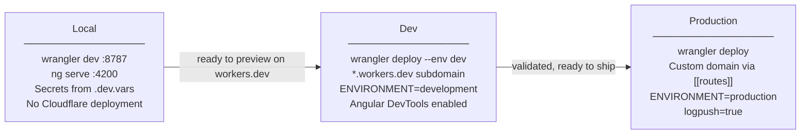

# Deployment Environments

The Adblock Compiler uses a **three-environment model**: local, dev, and production. Both the
API Worker (`wrangler.toml`) and the Angular frontend Worker (`frontend/wrangler.toml`) follow
the same model.

---

## Overview



| | Local | Dev | Production |
|---|---|---|---|
| **Deploy command (API)** | `deno task wrangler:dev` | `deno task wrangler:deploy:dev` | `deno task wrangler:deploy` |
| **Deploy command (frontend)** | `pnpm --filter adblock-frontend run start` | `deno task ui:deploy:ng:dev` | `sh scripts/deploy-frontend.sh` |
| **URL** | `http://localhost:8787` | `https://<worker-name>.workers.dev` | custom domain via `[[routes]]` |
| **Angular build** | dev server (HMR) | `ng build --configuration development` | `ng build` (production config) |
| **Angular DevTools** | ✅ (dev server always unoptimised) | ✅ (sourceMap, no optimisation) | ❌ (minified, tree-shaken) |
| **logpush** | N/A (not deployed) | `false` | `true` |
| **ENVIRONMENT var** | set in `.dev.vars` | `"development"` | `"production"` |

---

## Local Development

No Cloudflare deployment is involved. Both workers run locally.

```bash
# API Worker  →  http://localhost:8787
deno task wrangler:dev

# Angular dev server  →  http://localhost:4200  (hot module reload)
pnpm --filter adblock-frontend run start

# Angular Workers preview  →  http://localhost:4200  (mirrors production SSR)
pnpm --filter adblock-frontend run preview
```

Secrets and local URL overrides live in `.dev.vars` (gitignored — copy from `.dev.vars.example`).

---

## Dev Environment

Deploys to the auto-generated `*.workers.dev` subdomain without touching the production
custom domain. Use this environment to:

- Preview changes live on Cloudflare infrastructure
- Debug with Angular DevTools (source maps enabled, no minification)
- Test before merging to production

### Deploy the API Worker to dev

```bash
deno task wrangler:deploy:dev
# equivalent: deno run -A npm:wrangler deploy --env dev
```

### Deploy the Angular frontend to dev

```bash
deno task ui:deploy:ng:dev
# equivalent: pnpm --filter adblock-frontend run build:dev
#           + pnpm --filter adblock-frontend run deploy:dev
```

Or step by step:

```bash
# Build with development configuration (sourceMap=true, optimization=false)
pnpm --filter adblock-frontend run build:dev   # ng build --configuration development

# Deploy to *.workers.dev (--env dev skips the [[routes]] custom domain block)
pnpm --filter adblock-frontend run deploy:dev  # wrangler deploy --env dev
```

### What `[env.dev]` does

```toml
# wrangler.toml (API Worker) — and frontend/wrangler.toml mirrors this
[env.dev]
logpush = false         # disable Logpush for the dev subdomain

[env.dev.vars]
ENVIRONMENT = "development"
```

- **Routes are NOT inherited** — the dev environment is accessible only via the
  `*.workers.dev` subdomain. The `[[routes]]` custom domain block in the top-level
  config is not applied.
- **Bindings ARE inherited** — KV namespaces, D1, R2, Queues, and service bindings
  are all shared with production by default. Create separate dev resources and
  override them inside `[env.dev]` when isolation is needed.
- **Secrets are shared** — `wrangler secret put` applies to all environments. To
  set an env-specific secret, use `wrangler secret put <KEY> --env dev`.

---

## Production Environment

The top-level `wrangler.toml` / `frontend/wrangler.toml` IS the production configuration.
No `[env.production]` block is needed.

```bash
# API Worker
deno task wrangler:deploy

# Angular frontend (preferred — builds, injects CF Analytics token, deploys)
sh scripts/deploy-frontend.sh
```

Production deploys to the custom domains declared in the `[[routes]]` block of each
`wrangler.toml`. See [URL Management](../reference/URL_MANAGEMENT.md) for how to change
these URLs.

---

## URL Configuration

All public-facing URLs are managed as `[vars]` entries and kept in sync across both
`wrangler.toml` files. Replace the placeholder values below with your real domains:

| Variable | Purpose | Example value |
|---|---|---|
| `URL_FRONTEND` | Angular frontend worker | `https://app.<your-domain>` |
| `URL_API` | API / backend worker | `https://api.<your-domain>` |
| `URL_DOCS` | Documentation site | `https://docs.<your-domain>` |
| `URL_LANDING` | Marketing landing page | `https://<your-domain>` |
| `CANONICAL_DOMAIN` | Domain used for crawl-protection noindex logic | `<your-domain>` |

`CANONICAL_DOMAIN` controls the `X-Robots-Tag: noindex, nofollow` header. Any request
arriving at a hostname that is neither `<CANONICAL_DOMAIN>` nor a subdomain of it will
receive the noindex header. This prevents `*.workers.dev` and other temporary hostnames
from being indexed by search engines while a custom domain is active.

> **Important:** `CANONICAL_DOMAIN` must be the *full* domain you use — not just the
> registrable root. For `api.bloqr.dev`, set `CANONICAL_DOMAIN = "bloqr.dev"` so that
> all `*.bloqr.dev` subdomains are treated as canonical. Setting it to `dev` would match
> every `.dev` TLD hostname, which is wrong.

To swap all URLs at once, run:

```bash
# Interactive — prompts for root domain and (optionally) canonical domain
deno task domain:swap

# Non-interactive examples
deno task domain:swap -- --domain bloqr.dev
deno task domain:swap -- --domain bloqr.dev --canonical bloqr.dev

# Preview changes without writing any files
deno task domain:swap -- --domain bloqr.dev --dry-run
```

The script updates **both** `[vars]` and `[env.dev.vars]` in each `wrangler.toml`, so
both environments stay in sync after a single run.

For detailed URL change steps, see [URL Management](../reference/URL_MANAGEMENT.md).

The `[env.dev.vars]` block intentionally repeats these values. The dev environment
runs on `*.workers.dev`, but the app still references canonical production URLs (e.g.
for OpenGraph meta tags and API base URLs). Override them if you also have a dev
custom domain.

---

## TOML Scoping Rules

Two Wrangler-specific TOML gotchas apply to both `wrangler.toml` files:

### 1. Array-of-tables must come AFTER all bare top-level keys

In TOML, once you open an array-of-tables header (`[[routes]]`, `[[rules]]`, etc.), every
bare `key = value` that follows — until the next `[table]` or `[[table]]` header — is parsed
as a field of that array entry, not as a top-level key. This means if `main`, `no_bundle`,
`compatibility_date`, etc. appear after `[[routes]]`, they become route fields and Wrangler
rejects the config.

**Correct structure:**

```toml
name        = "my-worker"
main        = "worker.ts"
workers_dev = true
logpush     = true
# ... all other bare top-level keys ...

[[routes]]          # array-of-tables only AFTER all bare keys
pattern     = "api.<your-domain>"
custom_domain = true

[[rules]]           # same rule applies to [[rules]]
type  = "ESModule"
globs = ["**/*.mjs"]

[vars]              # standard tables can follow
ENVIRONMENT = "production"
```

### 2. Custom domain routes must be bare hostnames

For `custom_domain = true` route entries, Cloudflare only accepts a bare hostname — no
paths or wildcards:

```toml
# ✅ Correct
[[routes]]
pattern = "api.<your-domain>"
custom_domain = true

# ❌ Wrong — path/wildcard not allowed with custom_domain = true
[[routes]]
pattern = "api.<your-domain>/*"
custom_domain = true
```

---

## Further Reading

- [Cloudflare Workers Architecture](CLOUDFLARE_WORKERS_ARCHITECTURE.md) — two-worker split,
  bundled vs independent SSR modes, CI/CD deploy flow
- [URL Management](../reference/URL_MANAGEMENT.md) — single source of truth for service URLs
- [Environment Configuration](../reference/ENV_CONFIGURATION.md) — two-track env system
  (shell vs Wrangler), `.dev.vars`, secrets management
- [Wrangler Environments docs](https://developers.cloudflare.com/workers/wrangler/environments/)
