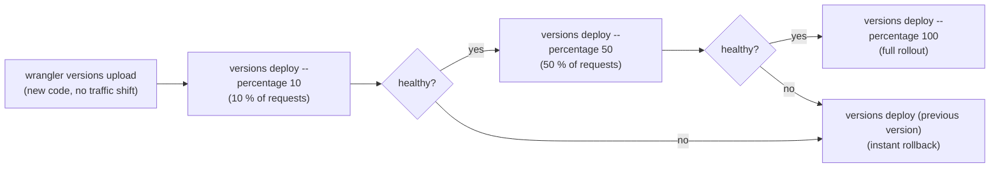

# Gradual Deployments

Gradual deployments let you roll out a new Worker version to a configurable
percentage of production traffic before committing to a full release. This is the
recommended strategy for any change that touches compilation logic, rate-limiting,
or authentication — where a bad deploy could affect every user simultaneously.

---

## Table of contents

1. [How it works](#1-how-it-works)
2. [Quick-start checklist](#2-quick-start-checklist)
3. [Step-by-step rollout](#3-step-by-step-rollout)
4. [deno task shortcuts](#4-deno-task-shortcuts)
5. [GitHub Actions — manual gradual rollout workflow](#5-github-actions--manual-gradual-rollout-workflow)
6. [Integration with feature flags](#6-integration-with-feature-flags)
7. [Monitoring during a rollout](#7-monitoring-during-a-rollout)
8. [Rollback](#8-rollback)
9. [wrangler.toml — no required changes](#9-wranglertoml--no-required-changes)
10. [Caveats and limitations](#10-caveats-and-limitations)

---

## 1. How it works

Cloudflare Workers **versioning** decouples *building* a version from *routing traffic*
to it. The workflow has two distinct commands:

| Command | What it does |
|---|---|
| `wrangler versions upload` | Bundles and uploads a new Worker version — no traffic change |
| `wrangler versions deploy --percentage N` | Routes `N %` of requests to the uploaded version |

The standard `wrangler deploy` command is equivalent to
`versions upload` + `versions deploy --percentage 100` in a single step.



All traffic percentages are **per-colo** (Cloudflare edge location), not global.
Cloudflare uses deterministic routing so a given visitor tends to consistently hit
the same version during a partial rollout.

---

## 2. Quick-start checklist

Before your first gradual rollout:

- [ ] `CLOUDFLARE_API_TOKEN` secret has `Account > Workers:Edit` permission
- [ ] `CLOUDFLARE_ACCOUNT_ID` secret is set
- [ ] You have access to the GitHub Actions manual workflows in this repository
- [ ] Review [Monitoring during a rollout](#7-monitoring-during-a-rollout) so you
      know what to watch

---

## 3. Step-by-step rollout

### Step 1 — Upload the new version (no traffic change)

```bash
# From repo root:
deno task wrangler:versions:upload
```

This bundles the worker and uploads it to Cloudflare.  
The output includes a **version ID** like `v2026-04-01T12:00:00-abc1234`.

### Step 2 — Route 10 % of traffic to the new version

```bash
# Interactive: wrangler asks you to confirm the version and percentage
deno task wrangler:versions:deploy
# Wrangler will prompt you to choose the version and percentage
```

Or non-interactively (useful in CI):

```bash
deno run -A npm:wrangler versions deploy --version-id <VERSION_ID> --percentage 10 --yes
```

### Step 3 — Monitor for 10–30 minutes

Check the Cloudflare dashboard and the metrics endpoint:

```bash
# Live log tail (filter for errors)
deno task wrangler:tail

# Health endpoint
curl https://api.bloqr.dev/api/health

# Error rates (Cloudflare Analytics Engine)
curl https://api.bloqr.dev/api/metrics
```

### Step 4 — Increase or roll back

If healthy, increase the percentage:

```bash
# 50 % of traffic
deno run -A npm:wrangler versions deploy --version-id <VERSION_ID> --percentage 50 --yes

# 100 % full rollout
deno run -A npm:wrangler versions deploy --version-id <VERSION_ID> --percentage 100 --yes
```

If unhealthy, see [Rollback](#8-rollback).

---

## 4. deno task shortcuts

The following tasks are available in `deno.json`:

| Task | Equivalent command |
|---|---|
| `deno task wrangler:versions:upload` | `wrangler versions upload` |
| `deno task wrangler:versions:deploy` | `wrangler versions deploy` (interactive) |
| `deno task wrangler:versions:list` | `wrangler versions list` |
| `deno task wrangler:versions:view` | `wrangler versions view` |
| `deno task wrangler:deployments:list` | `wrangler deployments list` |
| `deno task wrangler:deployments:status` | `wrangler deployments status` |

---

## 5. GitHub Actions — manual gradual rollout workflow

The `.github/workflows/gradual-deploy.yml` workflow provides a manual trigger for
gradual deployments with configurable percentages directly from the GitHub Actions UI.

### Inputs

| Input | Default | Description |
|---|---|---|
| `percentage` | `10` | Traffic percentage (1–100) to route to the new version |
| `version_id` | _(required)_ | Cloudflare version ID from a previous `versions upload` |
| `confirm_full_rollout` | `false` | Must be `true` to allow `percentage = 100` |

### Triggering a gradual deploy

1. Go to **Actions → Gradual Deploy (Manual)** in the GitHub UI.
2. Click **Run workflow**.
3. Fill in the version ID (from a prior upload or `versions list` output).
4. Set the traffic percentage.
5. Click **Run workflow**.

To get the version ID of the most recently uploaded version:

```bash
deno task wrangler:versions:list
```

### Full rollout via workflow

Set `percentage = 100` **and** check the `confirm_full_rollout` checkbox. This extra
confirmation prevents accidental 100 % deploys from a mis-click.

---

## 6. Integration with feature flags

For changes that affect compilation behaviour, combine gradual deployments with the
KV-backed [Feature Flags](../feature-flags/KV_FEATURE_FLAGS.md) system:

1. Wrap the new code path behind a feature flag:
   ```typescript
   const enabled = await featureFlagService.isEnabled('NEW_COMPILATION_PIPELINE', userId);
   if (enabled) {
       return runNewPipeline(config);
   }
   return runLegacyPipeline(config);
   ```

2. Deploy with `--percentage 100` (always) but target the new path only for users
   in the feature-flag rollout group:
   ```bash
   # Enable for 5 % of users:
   wrangler kv:key put --binding FEATURE_FLAGS flag:NEW_COMPILATION_PIPELINE \
       '{"enabled":true,"rollout_percentage":5,"updatedAt":"2026-04-01T00:00:00Z"}'
   ```

3. Use [gradual Worker traffic](#3-step-by-step-rollout) **and** the feature flag
   together for maximum safety on high-risk changes.

---

## 7. Monitoring during a rollout

### Key signals to watch

| Signal | Source | Threshold |
|---|---|---|
| HTTP error rate | `GET /api/metrics` | < 1 % of requests |
| `console.error` log count | `wrangler tail --format pretty` | 0 unexpected errors |
| Worker exception count | Cloudflare dashboard → Workers → Errors | 0 new exceptions |
| Compilation success rate | Analytics Engine (`ANALYTICS_ENGINE` binding) | ≥ 99 % |
| P95 response time | Cloudflare dashboard → Workers → Metrics | < 2 s |

### Live tail commands

```bash
# All logs (structured JSON):
deno task wrangler:tail

# Filter for errors only:
deno run -A npm:wrangler tail --format json | jq 'select(.outcome != "ok")'

# Show only compilation failures:
deno run -A npm:wrangler tail --format json \
    | jq 'select(.logs[].message[] | strings | test("compilation.*fail|error"; "i"))'
```

### Persistent Workers Logs

Because `persist = true` is set in `wrangler.toml`, logs are retained beyond the
live-tail window. Query them in the Cloudflare dashboard:

- **Workers & Pages → adblock-compiler → Logs**
- Filter by time range, outcome, and log level

See [Cloudflare Native Observability](../observability/CLOUDFLARE_OBSERVABILITY.md)
for the full details on Workers Logs and Logpush retention.

---

## 8. Rollback

### Instant rollback to the previous stable version

```bash
# List current deployments to identify the stable version ID
deno task wrangler:deployments:list

# Redeploy the previous version at 100 %
deno run -A npm:wrangler versions deploy --version-id <STABLE_VERSION_ID> --percentage 100 --yes
```

This takes effect immediately — Cloudflare routes 100 % of traffic back to the
previous version within seconds.

### Rollback via standard deploy

If you don't have the previous version ID, a standard `wrangler deploy` of the
last-known-good commit is equivalent:

```bash
git checkout <LAST_GOOD_SHA>
deno task wrangler:deploy
```

### Automatic rollback (future work)

Integration with health-check monitoring to trigger automatic rollback is tracked in
the deployment versioning system. See `GET /api/health` and the `HEALTH_MONITORING_WORKFLOW`
Cloudflare Workflow for the health-check infrastructure.

---

## 9. wrangler.toml — no required changes

No `wrangler.toml` changes are required to enable gradual deployments. The feature is
available to all Workers Paid plan accounts via the `wrangler versions` CLI.

The `wrangler.toml` already includes relevant observability settings that make gradual
rollouts safe:

```toml
# Forward worker logs to Cloudflare Logpush (production only).
logpush = true

[observability.logs]
enabled = true
head_sampling_rate = 1   # capture every request during rollout
persist = true           # retain logs for post-rollout analysis
invocation_logs = true   # include duration, status, exception data per invocation
```

---

## 10. Caveats and limitations

| Limitation | Detail |
|---|---|
| **Durable Objects** | Multiple versions cannot share the same Durable Object class. If your change modifies DO class logic, deploy at 100 % to avoid version skew. |
| **KV / D1 / R2** | Shared by all versions — schema changes must be backward-compatible. Use the [database migration checklist](../database-setup/DATABASE_ARCHITECTURE.md) when altering D1 or Neon schemas. |
| **Queue consumers** | All versions share the same queue consumer configuration. |
| **Compatibility flags** | All versions in a deployment share the same `compatibility_date` and `compatibility_flags`. |
| **Percentage is per-colo** | A `--percentage 10` deploy may result in slightly more or less than 10 % of *global* traffic depending on colo sizes. |
| **Tail consumers** | The `adblock-tail` log sink receives events from all active versions. |

---

## See also

- [Cloudflare Workers Versioning docs](https://developers.cloudflare.com/workers/configuration/versions-and-deployments/)
- [Deployment Environments](ENVIRONMENTS.md) — local, dev, production environments
- [Deployment Versioning](DEPLOYMENT_VERSIONING.md) — internal build-number tracking
- [Cloudflare Native Observability](../observability/CLOUDFLARE_OBSERVABILITY.md) — logging and tracing
- [Feature Flags](../feature-flags/KV_FEATURE_FLAGS.md) — KV-backed feature flags for fine-grained rollouts
