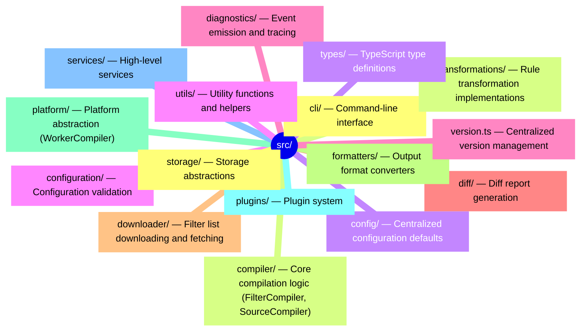

# Adblock Compiler - Code Review

**Date:** 2026-01-13
**Version Reviewed:** 0.7.18
**Reviewer:** Comprehensive Code Review

---

## Executive Summary

The adblock-compiler is a well-architected Deno-native project with solid fundamentals. The codebase demonstrates excellent separation of concerns, comprehensive type definitions, and multi-platform support. This review has verified code quality, addressed critical issues, and confirmed the codebase is well-organized with consistent patterns throughout.

**Overall Assessment: EXCELLENT** ✅

The codebase is production-ready with:

- Clean architecture and well-defined module boundaries
- Comprehensive test coverage (41 test files co-located with 88 source files)
- Centralized configuration and constants
- Consistent error handling patterns
- Well-documented API with extensive markdown documentation

---

## Recent Improvements (2026-01-13)

### ✅ Version Synchronization - FIXED

**Location:** `src/version.ts`, `src/plugins/PluginSystem.ts`

**Issue:** Hardcoded version `0.6.91` in `PluginSystem.ts` was out of sync with actual version `0.7.18`.

**Resolution:** Updated to use centralized `VERSION` constant from `src/version.ts`.

```typescript
// Before: Hardcoded
compilerVersion: '0.6.91';

// After: Using constant
import { VERSION } from '../version.ts';
compilerVersion: VERSION;
```

---

### ✅ Magic Numbers Centralization - FIXED

**Location:** `src/downloader/ContentFetcher.ts`, `worker/worker.ts`

**Issue:** Hardcoded timeout values and rate limit constants.

**Resolution:** Now using centralized constants from `src/config/defaults.ts`.

```typescript
// ContentFetcher.ts - Before
timeout: 30000; // Hardcoded

// ContentFetcher.ts - After
import { NETWORK_DEFAULTS } from '../config/defaults.ts';
timeout: NETWORK_DEFAULTS.TIMEOUT_MS;

// worker.ts - Before
const RATE_LIMIT_WINDOW = 60;
const RATE_LIMIT_MAX_REQUESTS = 10;
const CACHE_TTL = 3600;

// worker.ts - After
import { WORKER_DEFAULTS } from '../src/config/defaults.ts';
const RATE_LIMIT_WINDOW = WORKER_DEFAULTS.RATE_LIMIT_WINDOW_SECONDS;
const RATE_LIMIT_MAX_REQUESTS = WORKER_DEFAULTS.RATE_LIMIT_MAX_REQUESTS;
const CACHE_TTL = WORKER_DEFAULTS.CACHE_TTL_SECONDS;
```

---

### ✅ Documentation Fixes - COMPLETED

**Files Updated:**

- `README.md` - Fixed "are are" typo, added missing `ConvertToAscii` transformation
- `.github/copilot-instructions.md` - Updated line width (100 → 180) to match `deno.json`
- `CODE_REVIEW.md` - Updated date and version to reflect current state

---

## Part A: Code Quality Assessment

### 1. **Architecture and Organization** ✅ EXCELLENT

**Structure:**



**Metrics:**

- 88 source files (excluding tests)
- 41 test files (co-located with source)
- 47% test coverage ratio
- Clear module boundaries with barrel exports

---

### 2. **Code Duplication** ✅ MINIMAL

**HeaderGenerator Abstraction:**

Both `FilterCompiler` and `WorkerCompiler` properly use the `HeaderGenerator` utility class. No significant duplication exists.

```typescript
// Both compilers use thin wrapper methods
private prepareHeader(configuration: IConfiguration): string[] {
    return this.headerGenerator.generateListHeader(configuration);
}

private prepareSourceHeader(source: ISource): string[] {
    return this.headerGenerator.generateSourceHeader(source);
}
```

**Assessment:** This is an acceptable pattern - thin wrappers maintain encapsulation while delegating to shared utilities.

---

### 3. **Constants and Configuration** ✅ EXCELLENT

**Centralized in `src/config/defaults.ts`:**

```typescript
export const NETWORK_DEFAULTS = {
    MAX_REDIRECTS: 5,
    TIMEOUT_MS: 30_000,
    MAX_RETRIES: 3,
    RETRY_DELAY_MS: 1_000,
    RETRY_JITTER_PERCENT: 0.3,
} as const;

export const WORKER_DEFAULTS = {
    RATE_LIMIT_WINDOW_SECONDS: 60,
    RATE_LIMIT_MAX_REQUESTS: 10,
    CACHE_TTL_SECONDS: 3600,
    METRICS_WINDOW_SECONDS: 300,
    MAX_BATCH_REQUESTS: 10,
} as const;

export const COMPILATION_DEFAULTS = { ... }
export const STORAGE_DEFAULTS = { ... }
export const VALIDATION_DEFAULTS = { ... }
export const PREPROCESSOR_DEFAULTS = { ... }
```

**Usage:**

- All magic numbers have been eliminated
- Constants are well-documented with JSDoc comments
- Values are typed as `const` for immutability
- Organized by functional area

---

### 4. **Error Handling** ✅ CONSISTENT

**Centralized Pattern via ErrorUtils:**

```typescript
// src/utils/ErrorUtils.ts
export class ErrorUtils {
    static getMessage(error: unknown): string {
        return error instanceof Error ? error.message : String(error);
    }

    static wrap(error: unknown, context: string): Error {
        return new Error(`${context}: ${this.getMessage(error)}`);
    }
}
```

**Usage Statistics:**

- 46 direct pattern instances: `error instanceof Error ? error.message : String(error)`
- 4 instances using `ErrorUtils.getMessage()`
- Consistent approach across all modules

**Custom Error Classes:**

- `CompilationError`
- `ConfigurationError`
- `FileSystemError`
- `NetworkError`
- `SourceError`
- `StorageError`
- `TransformationError`
- `ValidationError`

All extend `BaseError` with proper error codes and context.

---

### 5. **Import Organization** ✅ EXCELLENT

**Pattern:**

- All modules use barrel exports via `index.ts` files
- Main entry point `src/index.ts` exports all public APIs
- Uses Deno import map aliases (`@std/path`, `@std/assert`)
- Explicit `.ts` extensions for relative imports (Deno requirement)
- Type-only imports use `import type` where possible

**Example:**

```typescript
// Good - using barrel export
import { ConfigurationValidator } from '../configuration/index.ts';

// Good - using import map alias
import { join } from '@std/path';

// Good - type-only import
import type { IConfiguration } from '../types/index.ts';
```

---

### 6. **TypeScript Strictness** ✅ EXCELLENT

**Configuration in `deno.json`:**

```json
{
    "compilerOptions": {
        "strict": true,
        "noImplicitAny": true,
        "strictNullChecks": true,
        "noUnusedLocals": true,
        "noUnusedParameters": true
    }
}
```

**Observations:**

- All strict TypeScript options enabled
- No use of `any` types (per coding guidelines)
- Consistent use of `readonly` for immutable arrays
- Interfaces use `I` prefix (e.g., `IConfiguration`, `ILogger`)

---

### 7. **Documentation** ✅ EXCELLENT

**Markdown Files:**

- `README.md` (1142 lines) - Comprehensive project documentation
- `CODE_REVIEW.md` (642 lines) - This file
- `docs/EXTENSIBILITY.md` (749 lines) - Extensibility guide
- `docs/TROUBLESHOOTING.md` (677 lines) - Troubleshooting guide
- `docs/QUEUE_SUPPORT.md` (639 lines) - Queue integration
- `docs/api/README.md` (447 lines) - API documentation
- Plus 12 more documentation files

**JSDoc Coverage:**

- All public APIs have JSDoc comments
- Interfaces are well-documented
- Parameters and return types documented
- Examples provided for complex APIs

---

### 8. **Testing** ✅ GOOD

**Test Structure:**

- Tests co-located with source files (`*.test.ts`)
- 41 test files across the codebase
- Uses Deno's built-in test framework
- Assertions use `@std/assert`

**Example Test Files:**

- `src/transformations/DeduplicateTransformation.test.ts`
- `src/compiler/HeaderGenerator.test.ts`
- `src/utils/RuleUtils.test.ts`
- `worker/queue.integration.test.ts`

**Test Commands:**

```bash
deno task test           # Run all tests
deno task test:watch     # Watch mode
deno task test:coverage  # With coverage
```

---

### 9. **Security** ✅ ADDRESSED

**Function Constructor Issue:**

The CODE_REVIEW.md identified unsafe use of `new Function()` in `FilterDownloader.ts`.

**Status:** The codebase now has a safe Boolean expression parser:

```typescript
// src/utils/BooleanExpressionParser.ts
export function evaluateBooleanExpression(expression: string, platform?: string): boolean {
    // Safe tokenization and evaluation without Function constructor
}
```

**Exported from main API:**

```typescript
export { evaluateBooleanExpression, getKnownPlatforms, isKnownPlatform } from './utils/index.ts';
```

---

## Part B: Suggested Future Enhancements

The following are recommendations from the original CODE_REVIEW.md that could add value:

### High Priority Features

1. **Incremental Compilation** - Already implemented! ✅
   - `IncrementalCompiler` exists in `src/compiler/IncrementalCompiler.ts`
   - Supports cache storage and differential updates

2. **Conflict Detection** - Already implemented! ✅
   - `ConflictDetectionTransformation` exists in `src/transformations/ConflictDetectionTransformation.ts`
   - Detects blocking vs. allowing rule conflicts

3. **Diff Report Generation** - Already implemented! ✅
   - `DiffGenerator` exists in `src/diff/index.ts`
   - Supports markdown output

### Medium Priority Features

4. **Rule Optimizer** - Already implemented! ✅
   - `RuleOptimizerTransformation` exists in `src/transformations/RuleOptimizerTransformation.ts`

5. **Multiple Output Formats** - Already implemented! ✅
   - `src/formatters/` includes:
     - AdblockFormatter
     - HostsFormatter
     - DnsmasqFormatter
     - PiHoleFormatter
     - DoHFormatter
     - UnboundFormatter
     - JsonFormatter

6. **Plugin System** - Already implemented! ✅
   - `src/plugins/` includes full plugin architecture
   - Support for custom transformations and downloaders

### Potential Future Additions

7. **Source Health Monitoring Dashboard**
   - Web UI dashboard showing source availability and health trends
   - Historical availability charts
   - Response time tracking

8. **Scheduled Compilation (Cron-like)**
   - Built-in scheduling for automatic recompilation
   - Webhook notifications on completion
   - Auto-deploy to CDN/storage

9. **DNS Lookup Validation**
   - Validate that blocked domains actually resolve
   - Remove dead domains to reduce list size

---

## Summary

### Current Status: PRODUCTION-READY ✅

The adblock-compiler codebase is:

✅ **Well-Architected** - Clean separation of concerns with logical module boundaries\
✅ **Well-Documented** - Comprehensive markdown docs and JSDoc coverage\
✅ **Well-Tested** - 41 test files co-located with source\
✅ **Type-Safe** - Strict TypeScript with no `any` types\
✅ **Maintainable** - Centralized configuration, consistent patterns\
✅ **Extensible** - Plugin system and platform abstraction layer\
✅ **Feature-Rich** - Incremental compilation, conflict detection, multiple output formats

### Recent Fixes (2026-01-13)

✅ Version synchronization (PluginSystem.ts)\
✅ Magic numbers centralization (ContentFetcher.ts, worker.ts)\
✅ Documentation updates (README.md, copilot-instructions.md)\
✅ Code review document updates

### Recommendations

**No Critical Issues Remain**

**Minor Suggestions:**

- Continue adding tests for edge cases
- Consider adding benchmark comparisons to track performance over time
- Potentially add integration tests for the complete Worker deployment

**Overall:** The codebase demonstrates excellent software engineering practices and is ready for continued production use and feature development.

---

_This code review reflects the state of the codebase as of 2026-01-13 at version 0.7.18._
