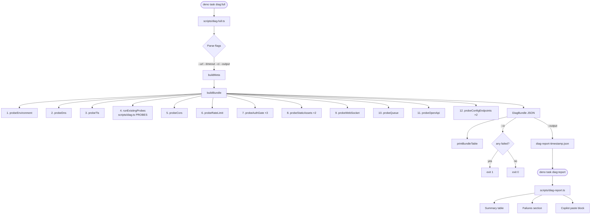

# Full Diagnostics Tool (`diag-full`)

Comprehensive, standalone health-check harness for the adblock-compiler stack. Runs without `wrangler dev`, the Angular frontend, or any Cloudflare Worker binding — it is pure `deno run` against any live URL. Produces a structured JSON bundle that can be pasted directly into a Copilot chat for automated root-cause analysis.

---

## Table of Contents

- [Why a separate tool?](#why-a-separate-tool)
- [Prerequisites](#prerequisites)
- [Quick start](#quick-start)
- [Available tasks](#available-tasks)
- [CLI flags](#cli-flags)
- [Probe categories](#probe-categories)
- [Reading the output table](#reading-the-output-table)
- [JSON bundle schema](#json-bundle-schema)
- [Report formatter (`diag-report`)](#report-formatter-diag-report)
- [Saving a bundle and sharing with Copilot](#saving-a-bundle-and-sharing-with-copilot)
- [CI integration](#ci-integration)
- [Architecture](#architecture)
- [Troubleshooting the tool itself](#troubleshooting-the-tool-itself)
- [Related tools](#related-tools)

---

## Why a separate tool?

The existing `deno task diag` / `diag:cli` harness is excellent for interactive triage but only covers live Worker HTTP endpoints and requires `wrangler dev` to be running when targeting localhost. If any of the following is true, you need `diag:full` instead:

| Situation | `diag` | `diag:full` |
|-----------|--------|-------------|
| `wrangler dev` not running | ❌ | ✅ |
| Frontend SPA is white-screening | Partial | ✅ |
| Worker returns errors you can't reproduce | Partial | ✅ |
| Need to share logs with Copilot | ❌ | ✅ (JSON bundle) |
| Need environment metadata (OS, Deno version) | ❌ | ✅ |
| Rate-limit misconfiguration | ❌ | ✅ |
| CORS allowlist drift | ❌ | ✅ |
| WebSocket handler broken | ❌ | ✅ |

---

## Prerequisites

| Requirement | Minimum version | Check |
|-------------|----------------|-------|
| Deno | 2.0.0 | `deno --version` |
| Network access to the target URL | — | `curl -I <url>/api/health` |

No other dependencies are needed. The tool does **not** require:
- `node` / `npm` / `pnpm`
- `wrangler`
- `.dev.vars`
- Any Cloudflare binding

---

## Quick start

```bash
# Run all probes against production (default)
deno task diag:full

# Run against a local Worker dev server
deno task diag:full -- --url http://localhost:8787

# Save a JSON bundle for Copilot analysis
deno task diag:full:output

# Re-render a previously saved bundle
deno task diag:report -- --file diag-report-2026-04-08T12-00-00.000Z.json
```

---

## Available tasks

All tasks are defined in `deno.json` and require no additional setup.

| Task | Description |
|------|-------------|
| `deno task diag:full` | Run all probes against the production URL. Prints a summary table to stdout. |
| `deno task diag:full:ci` | CI mode — runs all probes, exits `0` (all pass) or `1` (any failure). Suitable for GitHub Actions steps. |
| `deno task diag:full:prod` | Explicit `--url https://adblock-frontend.jk-com.workers.dev`. Identical to `diag:full` but self-documenting in scripts. |
| `deno task diag:full:output` | Run all probes and write the full JSON bundle to `diag-report-<timestamp>.json` in the current directory. |
| `deno task diag:report` | Re-render a saved bundle. Accepts `--file <path>` or reads from stdin. |

> **Note:** Pass extra flags after `--`:
> ```bash
> deno task diag:full -- --url http://localhost:8787 --timeout 5000
> ```

---

## CLI flags

### `diag-full.ts`

| Flag | Type | Default | Description |
|------|------|---------|-------------|
| `--url` | string | `https://adblock-frontend.jk-com.workers.dev` | Base URL to probe. Must include protocol (`http://` or `https://`). |
| `--timeout` | number (ms) | `15000` | Per-probe fetch timeout. The DNS and WebSocket probes use shorter internal timeouts regardless. |
| `--ci` | boolean | `false` | Non-interactive CI mode: prints the summary table, then exits `0` if all probes pass or `1` if any fail. |
| `--output` | boolean | `false` | Write the JSON bundle to `diag-report-<timestamp>.json` in the current directory and print the filename. |
| `--help` | boolean | `false` | Print usage and exit. |

### `diag-report.ts`

| Flag | Type | Default | Description |
|------|------|---------|-------------|
| `--file` | string | — | Path to a saved bundle JSON file. If omitted, reads from stdin. |
| `--help` | boolean | `false` | Print usage and exit. |

---

## Probe categories

All 12 probe categories run in sequence. A failure in one category never aborts the rest — every category always runs to completion.

### 1. `environment` — system metadata (no network)

Collects local context with no network calls. Always passes.

| Field | Source |
|-------|--------|
| Deno version | `Deno.version.deno` |
| V8 version | `Deno.version.v8` |
| TypeScript version | `Deno.version.typescript` |
| OS | `Deno.build.os` |
| Architecture | `Deno.build.arch` |
| Working directory | `Deno.cwd()` |
| CLI arguments | `Deno.args` |

### 2. `dns` — DNS / reachability check

Sends a `HEAD` to `<baseUrl>/api/health` with a hard 3-second timeout (independent of `--timeout`).

| Result | Meaning |
|--------|---------|
| ✅ `resolved (HTTP N)` | DNS resolved and server responded. `N` is the HTTP status. |
| ❌ `timeout (3s)` | DNS resolved but connection timed out — likely a firewall or cold-start issue. |
| ❌ `error: …` | DNS did not resolve (`ECONNREFUSED`, `ENOTFOUND`, etc.). |

### 3. `tls` — TLS / Cloudflare edge check

Sends a `GET` to `<baseUrl>/api/health` and inspects response headers.

| Check | Pass condition | Why it matters |
|-------|---------------|----------------|
| `cf-ray` header present | Required | Confirms traffic is reaching the Cloudflare edge (not a local proxy or direct IP). |
| `strict-transport-security` header present | Required | Confirms HSTS is enforced — downgrade attacks are blocked. |

**Both checks must pass** for this probe to be ✅.

### 4. `existing` — re-runs all probes from `scripts/diag.ts`

Re-runs the 6 standard probes that the basic `deno task diag` harness uses. These cover the core Worker API endpoints (health, version, compile, validate, etc.). Results are labelled with their original probe names and grouped under the `existing` category.

### 5. `cors` — CORS preflight check

Sends an `OPTIONS` preflight to `<baseUrl>/api/compile` with:
- `Origin: https://adblock-frontend.jk-com.workers.dev`
- `Access-Control-Request-Method: POST`
- `Access-Control-Request-Headers: Content-Type, Authorization`

| Check | Pass condition |
|-------|---------------|
| HTTP status | 200 or 204 |
| `access-control-allow-origin` | Not `*` AND is in the known allowlist |

The known allowlist (`CORS_ALLOWED_ORIGINS`) contains:
- `https://adblock-frontend.jk-com.workers.dev`
- `http://localhost:4200`
- `http://localhost:8787`

**A wildcard `*` response always fails this probe**, regardless of the HTTP status code.

> **Tip:** If you add a new allowed origin to the Worker's `CORS_ALLOWED_ORIGINS` environment variable, add it to `CORS_ALLOWED_ORIGINS` in `scripts/diag-full.ts` as well, otherwise this probe will false-positive.

### 6. `rate-limit` — rate-limiting verification

Sends 12 rapid sequential `GET /api/health` requests with no authentication.

| Result | Meaning |
|--------|---------|
| ✅ `no 429s in 12 requests` | Rate limiting is not being triggered by health checks — expected in most environments. |
| ❌ `N/12 returned 429, first at request #M` | Rate limiting is firing on unauthenticated health checks. Verify your per-IP limit configuration. |

The `raw` field contains latency statistics (`min`, `max`, `avg` in ms).

> **Note:** Whether ✅ or ❌ depends on your deployment's rate-limit configuration. Twelve requests in rapid succession will not trigger 429s unless the per-IP limit is very low. If you *want* to verify 429s fire, use a higher request count or a lower `--timeout`.

### 7. `auth-gate` — unauthenticated endpoint rejection

Sends unauthenticated requests to three protected endpoints and verifies they return `401` or `403`.

| Probe label | Method | Path | Expected |
|-------------|--------|------|----------|
| `auth-gate-compile` | `POST` | `/api/compile` | 401 or 403 |
| `auth-gate-validate` | `POST` | `/api/validate` | 401 or 403 |
| `auth-gate-admin` | `GET` | `/api/admin/users` | 401 or 403 |

**No credentials are ever sent.** The probes only verify that these endpoints are correctly refusing unauthenticated traffic. A `200` response from any of these is a **security finding** and is flagged with `⚠ UNPROTECTED` in the detail column.

### 8. `static-assets` — Angular frontend availability

| Probe label | URL | Pass condition |
|-------------|-----|----------------|
| `static-root` | `<baseUrl>/` | HTTP 200 with `Content-Type: text/html` |
| `static-main-js` | `<baseUrl>/main.js` | HTTP 200 (present) or 404 (informational — Angular uses hashed bundle names) |

If `static-root` returns 404 or a non-HTML content type, the Angular SPA is likely not deployed or the `[assets]` binding is missing from the Worker.

### 9. `websocket` — WebSocket upgrade smoke test

Attempts a WebSocket upgrade to `<wsUrl>/ws/compile` (derived by replacing `http`→`ws` / `https`→`wss` in the base URL). Uses a 5-second hard timeout independent of `--timeout`.

| Result | Meaning |
|--------|---------|
| ✅ `upgrade succeeded (101), closed cleanly` | WebSocket handler is alive. Connection was immediately closed with code 1000. |
| ❌ `timeout — no upgrade response within 5s` | Handler may be missing, cold-starting, or the route isn't registered. |
| ❌ `connection refused or WebSocket error` | Port not listening or WebSocket rejected at TLS/HTTP level. |

**No compilation is performed.** The probe opens the socket, waits for the `open` event, and immediately closes with code `1000, 'diag-smoke'`.

### 10. `queue` — queue route registration

Sends `GET /api/queue/status` with no authentication.

| Result | Meaning |
|--------|---------|
| ✅ HTTP 401 or 403 | Route is registered; correctly auth-gated. |
| ✅ HTTP 200 | Route is registered and publicly accessible (check if this is intentional). |
| ❌ HTTP 404 | Queue route is **not registered** — check `worker/routes/` and `worker/hono-app.ts`. |
| ❌ Network error | Worker is unreachable. |

### 11. `openapi` — OpenAPI spec deployment check

Fetches `<baseUrl>/api/openapi.json` and validates the response with a Zod schema.

| Check | Pass condition |
|-------|---------------|
| HTTP status | 200 |
| Content | Valid JSON matching OpenAPI/Swagger spec shape (`openapi` or `swagger` field present) |

On success, the `detail` field reports: `openapi=<version> paths=<N> schemas=<N>`.

Failure here usually means:
- The spec was not regenerated after API changes (`deno task schema:generate`)
- The spec endpoint is not registered in the router
- A schema drift is causing the spec to fail parsing

### 12. `config-endpoints` — frontend boot config checks

Checks the two endpoints the Angular SPA calls during bootstrap.

| Probe label | Endpoint | Key checked |
|-------------|----------|-------------|
| `config-sentry` | `/api/sentry-config` | `dsn` |
| `config-clerk` | `/api/clerk-config` | `publishableKey` |

Pass condition for each: HTTP 200. The `detail` field also reports whether the expected JSON key is present in the response body. If either endpoint returns 404 or the key is absent, the frontend may white-screen on load (these values are used during Angular initialization).

---

## Reading the output table

```
┌────────────────────┬────────────────────────────┬────────┬────────────┬──────────────────────────────────────┐
│ Category           │ Probe                        │ St     │ Latency    │ Detail                               │
├────────────────────┼────────────────────────────┼────────┼────────────┼──────────────────────────────────────┤
│ environment        │ environment                  │ ✅     │ N/A        │ deno=2.3.1 os=linux arch=x86_64      │
│ dns                │ dns-resolution               │ ✅     │ 142ms      │ resolved (HTTP 200)                  │
│ tls                │ tls-certificate              │ ✅     │ 198ms      │ cf-ray=present hsts=present           │
│ existing           │ health                       │ ✅     │ 203ms      │ status=healthy                       │
│ cors               │ cors-preflight               │ ✅     │ 156ms      │ status=204 acao=https://… allowlisted=true │
│ rate-limit         │ rate-limit                   │ ✅     │ N/A        │ no 429s in 12 requests               │
│ auth-gate          │ auth-gate-compile            │ ✅     │ 189ms      │ HTTP 401 (auth-gated ✓)              │
│ auth-gate          │ auth-gate-validate           │ ✅     │ 174ms      │ HTTP 401 (auth-gated ✓)              │
│ auth-gate          │ auth-gate-admin              │ ✅     │ 182ms      │ HTTP 401 (auth-gated ✓)              │
│ static-assets      │ static-root                  │ ✅     │ 221ms      │ HTTP 200 content-type=text/html      │
│ static-assets      │ static-main-js               │ ✅     │ 167ms      │ HTTP 404 (not found)                 │
│ websocket          │ websocket-smoke              │ ✅     │ N/A        │ upgrade succeeded (101), closed cleanly │
│ queue              │ queue-status                 │ ✅     │ 191ms      │ HTTP 401 (route registered ✓)        │
│ openapi            │ openapi-spec                 │ ✅     │ 312ms      │ openapi=3.1.0 paths=42 schemas=18    │
│ config-endpoints   │ config-sentry                │ ✅     │ 145ms      │ HTTP 200 dsn=present                 │
│ config-endpoints   │ config-clerk                 │ ✅     │ 139ms      │ HTTP 200 publishableKey=present      │
└────────────────────┴────────────────────────────┴────────┴────────────┴──────────────────────────────────────┘

   Total: 16  Passed: 16  Failed: 0  Duration: 4821ms
```

| Column | Description |
|--------|-------------|
| **Category** | The probe group (one of the 12 categories above). |
| **Probe** | The specific probe label within the category. |
| **St** | ✅ passed / ❌ failed. |
| **Latency** | Round-trip time for the HTTP/WS request. `N/A` for probes with no network call. |
| **Detail** | Human-readable summary of the probe result, including key response header values. |

---

## JSON bundle schema

When `--output` is set (or `buildBundle()` is called programmatically), the tool emits a machine-readable bundle conforming to `DiagBundleSchema` (Zod-defined, exported from `scripts/diag-full.ts`):

```typescript
interface DiagBundle {
    meta: {
        tool: 'adblock-compiler-diag-full'; // always this literal
        version: string;                     // read from deno.json "version" field
        timestamp: string;                   // ISO 8601 (e.g. "2026-04-08T12:00:00.000Z")
        baseUrl: string;                     // the --url value used
        timeoutMs: number;                   // the --timeout value used
        deno: {
            deno: string;                    // e.g. "2.3.1"
            v8: string;
            typescript: string;
        };
        os: {
            os: string;                      // e.g. "linux", "darwin", "windows"
            arch: string;                    // e.g. "x86_64", "aarch64"
        };
        cwd: string;                         // current working directory
    };
    summary: {
        total: number;
        passed: number;
        failed: number;
        durationMs: number;
    };
    probes: DiagProbeResult[];
}

interface DiagProbeResult {
    category: string;        // probe group name
    label: string;           // specific probe identifier
    ok: boolean;
    latency_ms?: number;     // undefined for probes with no network call
    detail?: string;         // human-readable one-liner
    raw?: unknown;           // full structured payload (Zod-validated where applicable)
}
```

### Sample bundle (truncated)

```json
{
  "meta": {
    "tool": "adblock-compiler-diag-full",
    "version": "0.79.4",
    "timestamp": "2026-04-08T12:30:00.000Z",
    "baseUrl": "https://adblock-frontend.jk-com.workers.dev",
    "timeoutMs": 15000,
    "deno": { "deno": "2.3.1", "v8": "13.1.201.16", "typescript": "5.6.2" },
    "os": { "os": "linux", "arch": "x86_64" },
    "cwd": "/home/user/adblock-compiler"
  },
  "summary": {
    "total": 16,
    "passed": 15,
    "failed": 1,
    "durationMs": 5103
  },
  "probes": [
    {
      "category": "environment",
      "label": "environment",
      "ok": true,
      "detail": "deno=2.3.1 os=linux arch=x86_64",
      "raw": { "deno": { "deno": "2.3.1" }, "os": "linux", "arch": "x86_64", "cwd": "/home/user/adblock-compiler" }
    },
    {
      "category": "cors",
      "label": "cors-preflight",
      "ok": false,
      "latency_ms": 183,
      "detail": "status=200 acao=* allowlisted=false acam=GET, POST, OPTIONS",
      "raw": {
        "status": 200,
        "access-control-allow-origin": "*",
        "access-control-allow-methods": "GET, POST, OPTIONS",
        "access-control-allow-headers": "content-type"
      }
    }
  ]
}
```

---

## Report formatter (`diag-report`)

`scripts/diag-report.ts` is a companion tool that reads a saved bundle and renders three sections:

1. **Summary table** — same Unicode box-drawing format as the live run output, plus tool/URL/timestamp metadata.
2. **Failures section** — each failed probe with its `detail` and up to 400 characters of the `raw` field as pretty JSON.
3. **Copilot paste block** — the full bundle in a fenced ` ```json ` code block, ready to paste into a chat.

### Usage

```bash
# From a saved file
deno task diag:report -- --file diag-report-2026-04-08T12-30-00.000Z.json

# From stdin (pipe output of diag:full:output)
cat diag-report-2026-04-08T12-30-00.000Z.json | deno task diag:report

# Run directly
deno run --allow-read --allow-write scripts/diag-report.ts --file diag-report-....json
```

### Example failures section output

```
❌ Failures (1)

  ● [cors] cors-preflight
    Detail : status=200 acao=* allowlisted=false acam=GET, POST, OPTIONS
    Raw    :
      {
        "status": 200,
        "access-control-allow-origin": "*",
        "access-control-allow-methods": "GET, POST, OPTIONS",
        "access-control-allow-headers": "content-type"
      }
```

---

## Saving a bundle and sharing with Copilot

The most common workflow when you need Copilot to help diagnose an issue:

```bash
# 1. Run the full suite and save to disk
deno task diag:full:output

# Output:
# 📄 Diagnostic report saved: diag-report-2026-04-08T12-30-00.000Z.json
#    Paste this file's contents into a Copilot chat for automated analysis.

# 2. Render the report to see what failed
deno task diag:report -- --file diag-report-2026-04-08T12-30-00.000Z.json

# 3. Copy the "Copilot Analysis Block" JSON from the report output,
#    open a GitHub Copilot chat, and paste it with a message like:
#    "Here is a diagnostic bundle from adblock-compiler. What is failing and why?"
```

The bundle includes all response headers, latency data, and raw payloads — giving Copilot the full context it needs to pinpoint the root cause.

---

## CI integration

Use `deno task diag:full:ci` in any CI step where you want to gate on full-stack health:

```yaml
# .github/workflows/smoke.yml
- name: Run full diagnostics (smoke test)
  run: deno task diag:full:ci
  # Exits 0 = all probes passed; exits 1 = at least one failed
```

To also capture the bundle as an artifact:

```yaml
- name: Run full diagnostics
  run: deno task diag:full:output

- name: Upload diagnostic bundle
  uses: actions/upload-artifact@v4
  with:
    name: diag-bundle
    path: diag-report-*.json
    retention-days: 7
```

### Exit codes

| Code | Meaning |
|------|---------|
| `0` | All probes passed. |
| `1` | One or more probes failed (only in `--ci` mode; interactive mode always exits `0`). |

---

## Architecture



### File map

| File | Purpose |
|------|---------|
| `scripts/diag-full.ts` | Main orchestrator. Exports `buildMeta`, `buildBundle`, `DiagBundleSchema`, `pad`, `sep`. |
| `scripts/diag-report.ts` | Report formatter. Imports `DiagBundleSchema`, `pad`, `sep` from `diag-full.ts`. |
| `scripts/diag-full.test.ts` | Unit tests for `buildMeta` and `DiagBundleSchema`. No network calls. |
| `scripts/diag.ts` | Core probe library (existing). Probe results re-used by `runExistingProbes`. |
| `scripts/diag-cli.ts` | Interactive CLI (existing). Not used by `diag-full.ts`. |

---

## Troubleshooting the tool itself

### `error: Requires net access`

```
error: Requires net access to "adblock-frontend.jk-com.workers.dev"
```

Use `deno task diag:full` instead of running `diag-full.ts` directly with bare `deno run`. The task entry includes all required flags (`--allow-net --allow-env --allow-read --allow-write`). If running directly, add all four flags:

```bash
deno run --allow-net --allow-env --allow-read --allow-write scripts/diag-full.ts
```

### `error: Requires read access`

```
error: Requires read access to "deno.json"
```

Version detection reads `deno.json` at startup. Include `--allow-read` or use `deno task diag:full`. Version falls back to `'unknown'` gracefully if the permission is denied — this error only occurs when the flag is explicitly forbidden.

### `❌ Failed to parse JSON input` (diag-report)

The file or stdin content is not valid JSON. Ensure you are pointing to a bundle produced by `diag-full --output`, not a plain text output:

```bash
# Correct: use the .json file
deno task diag:report -- --file diag-report-2026-04-08T12-30-00.000Z.json

# Incorrect: do not pipe stdout from a non-output run
deno task diag:full | deno task diag:report   # ❌ stdout is the table, not JSON
```

### `❌ Invalid diagnostic bundle`

The JSON file does not conform to `DiagBundleSchema`. This usually means the file was produced by an older version of the tool. Re-run `diag:full:output` to get a fresh bundle.

### DNS probe always fails on `localhost`

The DNS probe uses `HEAD /api/health` with a 3-second timeout. Ensure the local Worker server (`deno task wrangler:dev`) is running before probing localhost:

```bash
# Terminal 1
deno task wrangler:dev

# Terminal 2
deno task diag:full -- --url http://localhost:8787
```

### WebSocket probe times out on localhost

The WebSocket probe connects to `ws://localhost:8787/ws/compile`. If the Worker WebSocket handler is not registered or `wrangler dev` is not running, this will time out. Check `worker/routes/` for the WS route and confirm `wrangler dev` is active.

### All probes time out

Increase the default timeout for slow or remote environments:

```bash
deno task diag:full -- --timeout 30000
```

---

## Related tools

| Tool | Task | Description |
|------|------|-------------|
| Basic probe CLI | `deno task diag` | Interactive terminal with live probe results. Requires `wrangler dev` for localhost. |
| CI probe | `deno task diag:ci` | Non-interactive version of `deno task diag`. |
| Production probe | `deno task diag:prod` | Runs basic probes against the production Worker URL. |
| Full diagnostics | `deno task diag:full` | This tool — comprehensive, standalone, JSON bundle. |
| Report formatter | `deno task diag:report` | Renders a saved bundle from `diag:full:output`. |

See also:
- [Troubleshooting Guide](../guides/TROUBLESHOOTING.md) — general debugging for the adblock-compiler stack
- [KB-001: API Not Available](../troubleshooting/KB-001-api-not-available.md) — common production incident
- [Diagnostics & Tracing System](./DIAGNOSTICS.md) — the internal compiler diagnostics (different from this tool)
- [Worker E2E Tests](../cloudflare/WORKER_E2E_TESTS.md) — automated Cloudflare Worker tests
