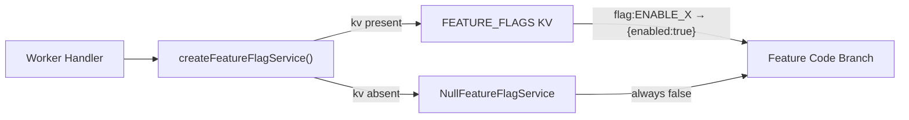
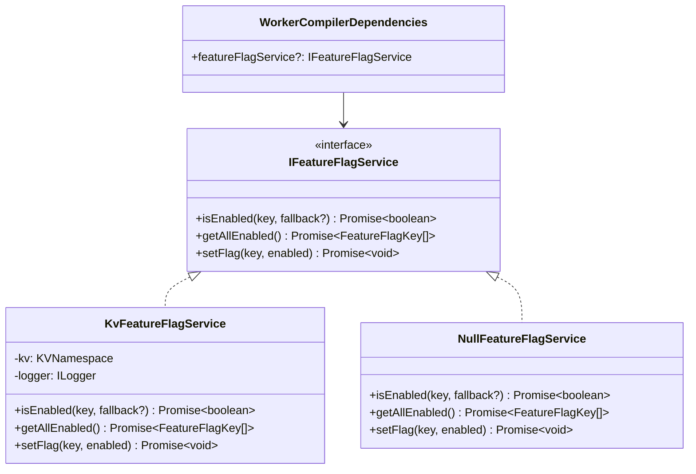
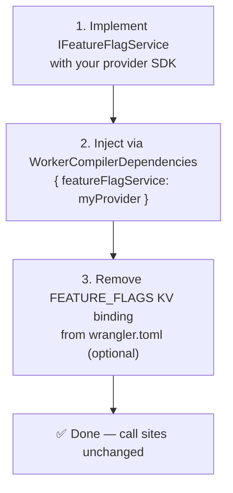

# KV Feature Flags

A lightweight, KV-backed feature flag system for the Adblock Compiler Cloudflare Worker. Flags are stored in the `FEATURE_FLAGS` KV namespace and can be toggled at runtime without redeployment.

## Overview



- **Storage:** Cloudflare KV namespace (`FEATURE_FLAGS`)
- **Key format:** `flag:<FLAG_NAME>` (e.g. `flag:ENABLE_BATCH_STREAMING`)
- **Value format:** JSON — `{"enabled":true,"updatedAt":"ISO-8601","note":"optional"}`
- **Consistency:** Eventual — changes propagate to all edge nodes within ~60 seconds
- **Extensibility:** Implements `IFeatureFlagService`; swap in any OpenFeature-compatible provider without changing call sites

> **Security note:** Do NOT use this service for security-sensitive gates. Use Clerk JWT claims or Cloudflare Access headers for access control.

---

## Quick Start

### 1. Create the KV namespace

```bash
wrangler kv:namespace create FEATURE_FLAGS
```

Copy the output `id` and add it to `wrangler.toml` (replace `your-feature-flags-kv-id`):

```toml
[[kv_namespaces]]
binding = "FEATURE_FLAGS"
id = "your-actual-kv-namespace-id"
```

### 2. Enable a flag

```bash
wrangler kv:key put --binding FEATURE_FLAGS \
  flag:ENABLE_BATCH_STREAMING \
  '{"enabled":true,"updatedAt":"2025-01-01T00:00:00.000Z"}'
```

### 3. Disable a flag

```bash
wrangler kv:key put --binding FEATURE_FLAGS \
  flag:ENABLE_BATCH_STREAMING \
  '{"enabled":false,"updatedAt":"2025-01-01T00:00:00.000Z"}'
```

### 4. List all flag keys

```bash
wrangler kv:key list --binding FEATURE_FLAGS --prefix flag:
```

### 5. Delete a flag (reverts to fallback `false`)

```bash
wrangler kv:key delete --binding FEATURE_FLAGS flag:ENABLE_BATCH_STREAMING
```

---

## Flag Registry

All known flag keys are defined in `src/platform/FeatureFlagService.ts` as the `FeatureFlagKey` union type.

| Flag | Category | Description |
|---|---|---|
| `ENABLE_BATCH_STREAMING` | Compilation | Stream batch results as SSE as they complete |
| `ENABLE_BROWSER_FETCHER` | Compilation | Use headless Chromium for source fetching |
| `ENABLE_ASYNC_COMPILE` | Compilation | Enable the `/compile/async` endpoint |
| `ENABLE_WORKFLOW_COMPILE` | Compilation | Route async compiles through the Workflows API |
| `ENABLE_R2_CACHE` | Cache | Persist compilation results to R2 |
| `ENABLE_WARMUP_CRON` | Cache | Run the cache-warming cron job |
| `ENABLE_BENCHMARK_HEADERS` | Observability | Return `X-Benchmark-*` headers on responses |
| `ENABLE_VERBOSE_ERRORS` | Observability | Include full stack traces in error responses |

### Adding a new flag

1. Add the key to the `FeatureFlagKey` union in `src/platform/FeatureFlagService.ts`:
   ```typescript
   export type FeatureFlagKey =
       | 'ENABLE_BATCH_STREAMING'
       | 'MY_NEW_FLAG';       // ← add here
   ```
2. Add a row to the table above.
3. Seed the flag via `wrangler kv:key put` or your admin UI.

---

## Usage in Worker Handlers

```typescript
import { createFeatureFlagService } from './services/feature-flag-service.ts';

// Create once per request (cheap — just wraps the KV binding)
const featureFlags = createFeatureFlagService(env.FEATURE_FLAGS, logger);

// Check a flag
if (await featureFlags.isEnabled('ENABLE_BATCH_STREAMING')) {
    return handleCompileStreamBatch(request, env, ctx);
}

// List all enabled flags (for diagnostics / health endpoints)
const enabled = await featureFlags.getAllEnabled();
logger.info(`Enabled flags: ${enabled.join(', ')}`);

// Toggle a flag programmatically (e.g. from an admin handler)
await featureFlags.setFlag('ENABLE_VERBOSE_ERRORS', true);
```

---

## Dependency Injection into WorkerCompiler

Inject the service via `WorkerCompilerDependencies` to enable compiler-level feature gating:

```typescript
import { WorkerCompiler } from '@jk-com/adblock-compiler';
import { createFeatureFlagService } from './services/feature-flag-service.ts';

const featureFlags = createFeatureFlagService(env.FEATURE_FLAGS, logger);

const compiler = new WorkerCompiler({
    logger,
    dependencies: {
        featureFlagService: featureFlags,
    },
});
```

The `featureFlagService` field on `WorkerCompilerDependencies` accepts any `IFeatureFlagService` implementation, making it straightforward to substitute a SaaS provider.

---

## Architecture



---

## Migration to OpenFeature / SaaS Providers



### Step-by-step

**Step 1.** Install your provider SDK (e.g. Flagsmith, Statsig, LaunchDarkly):

```bash
npm install @flagsmith/openfeature-provider
```

**Step 2.** Implement `IFeatureFlagService`:

```typescript
import type { IFeatureFlagService, FeatureFlagKey } from '@jk-com/adblock-compiler';

export class FlagsmithAdapter implements IFeatureFlagService {
    constructor(private readonly client: FlagsmithClient) {}

    async isEnabled(key: FeatureFlagKey | string, fallback = false): Promise<boolean> {
        try {
            return this.client.hasFeature(key);
        } catch {
            return fallback;
        }
    }

    async getAllEnabled(): Promise<FeatureFlagKey[]> {
        const flags = this.client.getAllFlags();
        return flags.filter((f) => f.enabled).map((f) => f.feature.name as FeatureFlagKey);
    }

    async setFlag(key: FeatureFlagKey | string, enabled: boolean): Promise<void> {
        // Delegate to Flagsmith admin API or throw UnsupportedOperationError
        throw new Error('setFlag() not supported in FlagsmithAdapter — use the Flagsmith dashboard');
    }
}
```

**Step 3.** Inject at startup:

```typescript
const featureFlags = new FlagsmithAdapter(flagsmithClient);
const compiler = new WorkerCompiler({ dependencies: { featureFlagService: featureFlags } });
```

**Step 4.** Remove the `FEATURE_FLAGS` KV binding from `wrangler.toml` once the SaaS provider is fully rolled out.

---

## Limitations

| Limitation | Detail |
|---|---|
| Eventual consistency | KV changes propagate in ~60 s; not suitable for real-time killswitches |
| No targeting / rollout % | Use `worker/services/admin-feature-flag-service.ts` (D1-backed) for targeting |
| No audit log | KV does not track who made a change; use the D1 admin service for auditing |
| No real-time push | Flags are read on each request; no WebSocket / push invalidation |
| Security | Do NOT use for access control — use Clerk JWT claims or CF Access headers |

---

## Related Files

| File | Purpose |
|---|---|
| `src/platform/FeatureFlagService.ts` | `IFeatureFlagService` interface + `FeatureFlagKey` type |
| `worker/services/feature-flag-service.ts` | `KvFeatureFlagService`, `NullFeatureFlagService`, `createFeatureFlagService` |
| `worker/services/feature-flag-service.test.ts` | Unit tests |
| `worker/services/admin-feature-flag-service.ts` | D1-backed CRUD + targeting rules (admin) |
| `worker/types.ts` | `FEATURE_FLAGS?: KVNamespace` in the `Env` interface |
| `wrangler.toml` | `[[kv_namespaces]]` binding declaration |
