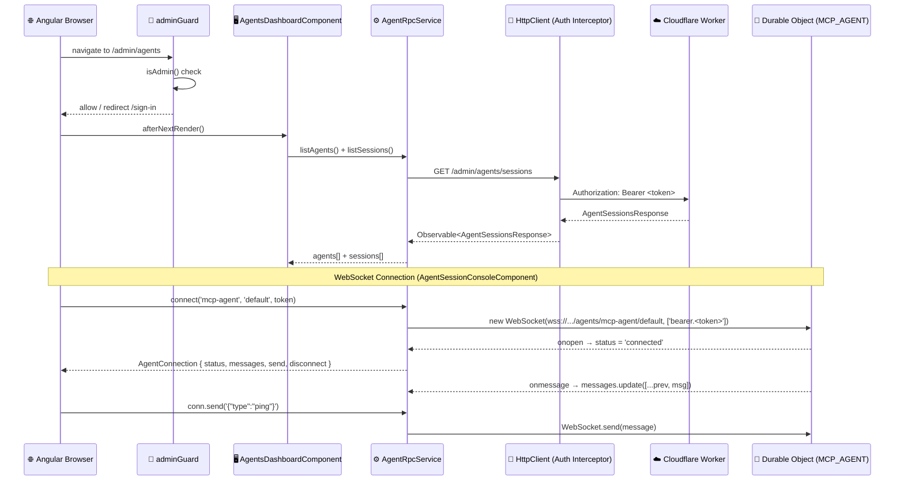
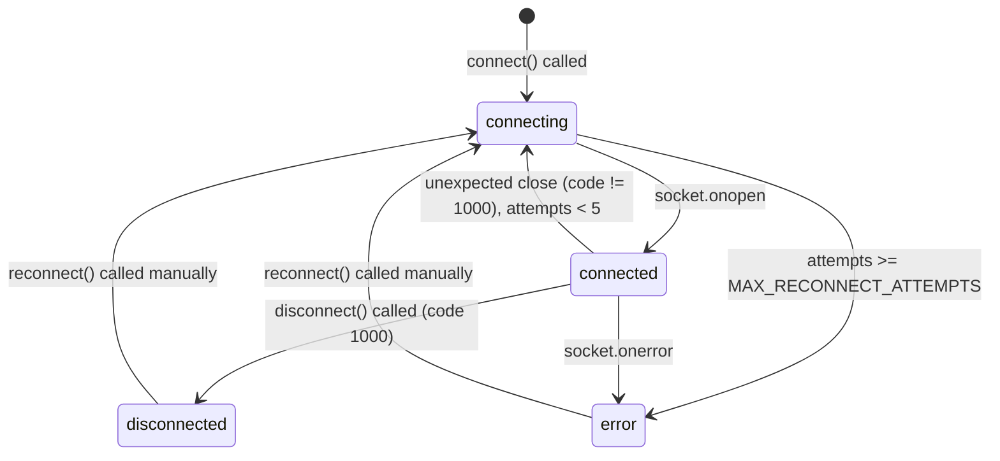

# Angular Agent Frontend Reference

This document is the authoritative reference for the Angular admin UI that surfaces the Cloudflare Agents SDK integration. It covers architecture, component catalog, service API, WebSocket lifecycle, signal patterns, route table, testing guide, and contributor notes.

**Related docs:**
- [Backend: docs/cloudflare/AGENTS.md](../cloudflare/AGENTS.md) — backend auth chain, registry, D1 schema
- [Frontend conventions: docs/frontend/ANGULAR_FRONTEND.md](./ANGULAR_FRONTEND.md) — Angular 21 patterns used across the app

---

## Architecture Overview



---

## Component Catalog

### `AgentsDashboardComponent`
- **Route:** `/admin/agents`
- **File:** `frontend/src/app/admin/agents/agents-dashboard.component.ts`
- **Purpose:** Main agent management panel showing the agent registry and active sessions.

**Signals:**
| Signal | Type | Description |
|--------|------|-------------|
| `loading` | `signal<boolean>` | True while data is loading |
| `error` | `signal<string\|null>` | Non-null on API error; shown in dismissible banner |
| `agents` | `signal<AgentListItem[]>` | Registered agents from KNOWN_AGENTS seed + session counts |
| `sessions` | `signal<AgentSession[]>` | All sessions from the API |
| `terminatingId` | `signal<string\|null>` | ID of session currently being terminated |
| `activeSessions` | `computed<AgentSession[]>` | Derived: sessions with `ended_at === null` |

**Methods:**
| Method | Description |
|--------|-------------|
| `loadData()` | Fetches agents and sessions in parallel; updates all state signals |
| `refresh()` | Calls `loadData()` — bound to Refresh button |
| `terminateSession(session)` | Calls DELETE endpoint, shows snackbar, refreshes list |

---

### `AgentSessionConsoleComponent`
- **Route:** `/admin/agents/:slug/:instanceId`
- **File:** `frontend/src/app/admin/agents/agent-session-console.component.ts`
- **Purpose:** Live WebSocket terminal for a single agent DO instance.

**Signals:**
| Signal | Type | Description |
|--------|------|-------------|
| `slug` | `Signal<string>` | Agent slug from `:slug` route param |
| `instanceId` | `Signal<string>` | DO instance from `:instanceId` route param |
| `connection` | `signal<AgentConnection\|null>` | Active WebSocket handle; null before first render |
| `connectionDuration` | `Signal<string>` | Live `Xs` / `Xm Xs` / `Xh Xm Xs` counter via `interval(1000)` |
| `statusLabel` | `computed<string>` | Human-readable status ("Connecting…", "Connected", …) |

**Methods:**
| Method | Description |
|--------|-------------|
| `openConnection()` | Fetches token + calls `AgentRpcService.connect()`. Called by `afterNextRender()`. |
| `reconnect()` | Closes current connection and calls `openConnection()` again |
| `disconnectManually()` | Calls `connection.disconnect()` |
| `sendMessage()` | Sends `messageInput` over the WebSocket and clears the input |

**CDK Virtual Scroll:** The message log uses `<cdk-virtual-scroll-viewport itemSize="64">` to keep DOM element count constant at O(visible rows) regardless of total message count.

---

### `AgentAuditLogComponent`
- **Route:** `/admin/agents/audit`
- **File:** `frontend/src/app/admin/agents/agent-audit-log.component.ts`
- **Purpose:** Paginated viewer for agent audit log events.

**Signals:**
| Signal | Type | Description |
|--------|------|-------------|
| `loading` | `signal<boolean>` | True while loading |
| `error` | `signal<string\|null>` | API error message |
| `entries` | `signal<AgentAuditLogEntry[]>` | Current page of entries |
| `totalCount` | `signal<number>` | Total rows for paginator |
| `pageIndex` | `signal<number>` | Current 0-based page |
| `activeFilter` | `signal<string\|null>` | Active event-type filter chip; null = all |
| `filteredEntries` | `computed<AgentAuditLogEntry[]>` | Client-side filtered entries |

---

## AgentRpcService API

**File:** `frontend/src/app/services/agent-rpc.service.ts`

### HTTP Methods

| Method | Endpoint | Returns |
|--------|----------|---------|
| `listAgents(page?)` | Derived from `listSessions` + KNOWN_AGENTS | `Observable<AgentListItem[]>` |
| `listSessions(page?, limit?)` | `GET /admin/agents/sessions` | `Observable<AgentSessionsResponse>` |
| `getSession(id)` | `GET /admin/agents/sessions/:id` | `Observable<AgentSessionDetailResponse>` |
| `terminateSession(id)` | `DELETE /admin/agents/sessions/:id` | `Observable<{success, error?}>` |
| `listAuditLog(page?, limit?)` | `GET /admin/agents/audit` | `Observable<AgentAuditResponse>` |

### WebSocket: `connect(slug, instanceId?, token?, destroyRef?)`

Returns an `AgentConnection` handle:

```typescript
interface AgentConnection {
    readonly status: Signal<AgentConnectionStatus>; // 'connecting' | 'connected' | 'disconnected' | 'error'
    readonly messages: Signal<readonly AgentMessage[]>;
    send(message: string): void;
    disconnect(): void;
}
```

---

## WebSocket Connection Lifecycle



### Auth Token Attachment

WebSocket connections cannot use the `Authorization` HTTP header — the browser does not expose this during the HTTP→WebSocket upgrade handshake. The Cloudflare Agents SDK uses the `Sec-WebSocket-Protocol` header as a workaround:

```typescript
// In AgentRpcService.connect():
const protocols: string[] = token ? [`bearer.${token}`] : [];
ws = new WebSocket(url, protocols);
// Server-side: Agents SDK reads the sub-protocol list and validates the bearer token.
```

Reference: https://developers.cloudflare.com/agents/configuration/authentication/

### Reconnect Policy

| Attempt | Delay |
|---------|-------|
| 1 | 1 s |
| 2 | 2 s |
| 3 | 4 s |
| 4 | 8 s |
| 5 | 16 s |
| >5 | Status → `error`, manual reconnect required |

---

## Admin Route Table

| Path | Component | Guard | Title |
|------|-----------|-------|-------|
| `/admin/agents` | `AgentsDashboardComponent` | `adminGuard` | Agent Management |
| `/admin/agents/:slug/:instanceId` | `AgentSessionConsoleComponent` | `adminGuard` | Agent Console |
| `/admin/agents/audit` | `AgentAuditLogComponent` | `adminGuard` | Agent Audit Log |

> **Important:** The `agents/audit` route is registered **before** `agents/:slug/:instanceId` in `admin.routes.ts` to prevent the wildcard param from swallowing the literal `audit` segment.

---

## Signal State Management Patterns

All components follow the same signal pattern used throughout the admin shell:

```typescript
// State
readonly loading = signal(true);
readonly error = signal<string | null>(null);
readonly items = signal<Item[]>([]);

// Derived
readonly activeItems = computed(() => this.items().filter(i => i.active));

// Init
private readonly _init = afterNextRender(() => this.loadData());

// Update
loadData(): void {
    this.loading.set(true);
    this.service.fetchItems().pipe(takeUntilDestroyed(this.destroyRef)).subscribe({
        next: (res) => { this.items.set(res.items); this.loading.set(false); },
        error: (err) => { this.error.set(err.error); this.loading.set(false); },
    });
}
```

---

## Testing Guide

### Running agent tests

```bash
cd frontend
npm run test -- --reporter=verbose --testPathPattern=agent
```

### Running all frontend tests

```bash
cd frontend
npm run test
```

### Test files

| File | What it tests |
|------|--------------|
| `services/agent-rpc.service.spec.ts` | HTTP methods (listSessions, terminateSession, listAuditLog), WebSocket lifecycle (connect, send, disconnect, auth token) |
| `admin/agents/agents-dashboard.component.spec.ts` | Loading state, data population, error state, empty state, terminate action |

### Mocking pattern

```typescript
// Mock AgentRpcService with signal-based stubs
const mock = {
    listSessions: vi.fn(() => of(SESSIONS_RESPONSE)),
    terminateSession: vi.fn(() => of({ success: true })),
};
{ provide: AgentRpcService, useValue: mock }
```

---

## Adding a New Agent (Contributor Notes)

The UI is designed to mirror the backend "one registry entry = full integration" model:

1. **Backend**: Add entry to `AGENT_REGISTRY` in `worker/agents/registry.ts` + `wrangler.toml` binding.
2. **Frontend**: Add entry to `KNOWN_AGENTS` in `frontend/src/app/models/agent.models.ts`.
3. No component changes needed — the dashboard automatically renders a card for each entry.

If the backend later exposes a `/admin/agents/registry` endpoint, replace the `KNOWN_AGENTS` seed in `AgentRpcService.listAgents()` with a direct HTTP call.

---

## UX Security Considerations

- **Admin-only gating:** All agent routes are protected by `adminGuard` (checks `AuthFacadeService.isAdmin()`). A non-admin user navigating to `/admin/agents` is redirected to `/sign-in`.
- **No token in localStorage:** Auth tokens are managed by Clerk/Better-Auth SDK. `AgentRpcService.connect()` retrieves the token via `AuthFacadeService.getToken()` at connection time and passes it as a WebSocket sub-protocol — never stored in `localStorage`.
- **WebSocket sub-protocol auth:** The `Sec-WebSocket-Protocol: bearer.<token>` pattern is the only standards-compliant way to pass credentials during a WebSocket upgrade. This matches the Cloudflare Agents SDK expectation.
- **Auto-cleanup on navigate:** `DestroyRef.onDestroy()` is used to close the WebSocket when the user navigates away from the console view, preventing orphaned Durable Object connections.
