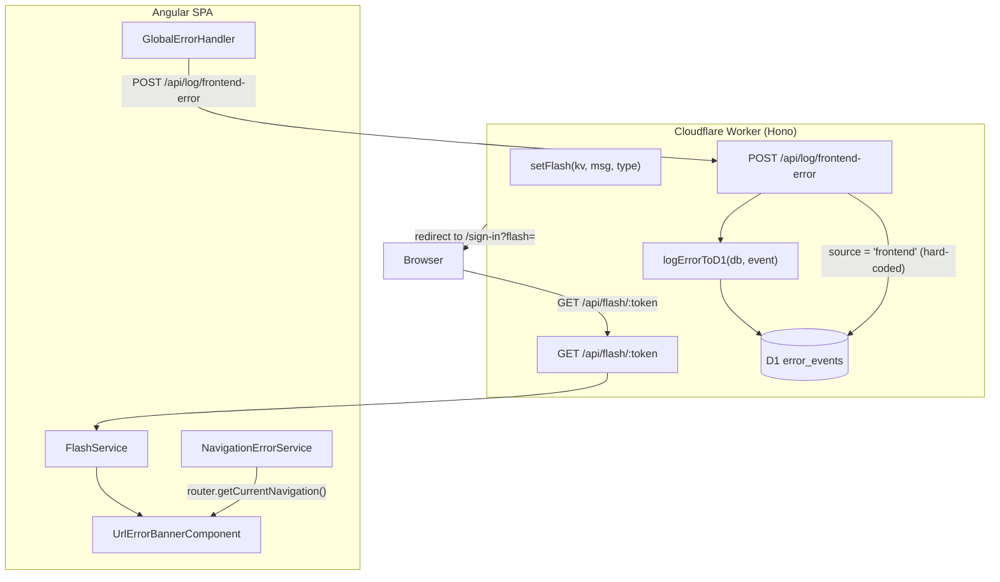
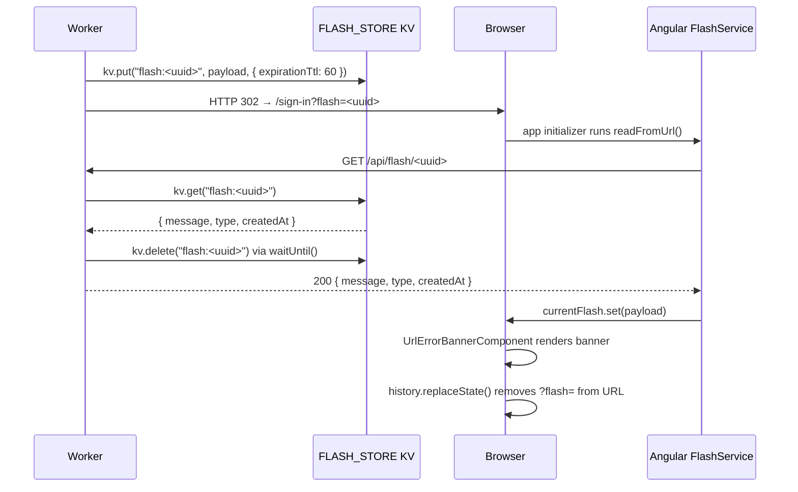

# Frontend Error Architecture

← [Back to README](../../README.md) | [Error Reporting](../development/ERROR_REPORTING.md)

PR #1748 introduced a layered, secure error-passing architecture that covers two distinct scenarios: server-initiated errors surfaced during redirects, and Angular SPA-internal navigation errors. Errors that are explicitly reported (via `LogService.reportError()` or the frontend `/api/log/frontend-error` endpoint) are persisted to a shared D1 audit table; the flash-token and router-state flows themselves do not automatically write to D1.

---

## Table of Contents

1. [Architecture Overview](#architecture-overview)
2. [Flow 1: KV Flash Store (server → client)](#flow-1-kv-flash-store-server--client)
3. [Flow 2: Angular Router State (SPA-internal)](#flow-2-angular-router-state-spa-internal)
4. [Flash API Endpoint](#flash-api-endpoint)
5. [Frontend Error Log Endpoint](#frontend-error-log-endpoint)
6. [D1 Audit Log — error_events Table](#d1-audit-log--error_events-table)
7. [Angular Services](#angular-services)
8. [Security Properties](#security-properties)
9. [Operational Guide](#operational-guide)

---

## Architecture Overview



The architecture has two independent runtime flows and one shared write path:

| Flow | Trigger | Transport | Consumer |
|---|---|---|---|
| KV Flash | Server redirects with `?flash=<token>` | `GET /api/flash/:token` | `FlashService.consume()` |
| Router State | Angular router navigation errors | In-process signal | `NavigationErrorService` |
| D1 Audit | Unhandled frontend/worker errors | `POST /api/log/frontend-error` | Offline analysis |

---

## Flow 1: KV Flash Store (server → client)

### Sequence



### KV Key Format

```
flash:<crypto.randomUUID()>
```

Example stored value (JSON-encoded):

```json
{
    "message": "You must be signed in to access this page",
    "type": "warn",
    "createdAt": "2026-05-20T14:32:01.123Z"
}
```

### `setFlash` — `worker/lib/flash.ts`

```typescript
export async function setFlash(
    kv: KVNamespace,
    message: string,
    type: FlashType = 'info',
    ttlSeconds = 60,
): Promise<string> {
    const token = crypto.randomUUID();
    const payload: FlashMessage = {
        message,
        type,
        createdAt: new Date().toISOString(),
    };
    await kv.put(`flash:${token}`, JSON.stringify(payload), { expirationTtl: ttlSeconds });
    return token;
}
```

### `getFlash` — `worker/lib/flash.ts`

```typescript
export async function getFlash(
    kv: KVNamespace,
    token: string,
    executionCtx?: ExecutionContext,
): Promise<FlashMessage | null> {
    const key = `flash:${token}`;
    const raw = await kv.get(key, 'text');
    if (!raw) return null;

    const deletePromise = kv.delete(key).catch((err) => {
        console.warn('[flash] Failed to delete consumed flash key:', err instanceof Error ? err.message : String(err));
    });

    if (executionCtx) {
        executionCtx.waitUntil(deletePromise);
    }

    try {
        return JSON.parse(raw) as FlashMessage;
    } catch {
        return null;
    }
}
```

**`waitUntil` pattern:** The delete is registered with the Worker runtime via `executionCtx.waitUntil()`. This means the KV delete completes even after the HTTP response has been flushed to the client, minimising the race window where a second concurrent request with the same token could read the message twice. The 60-second server-side TTL is the final safety net.

---

## Flow 2: Angular Router State (SPA-internal)

`NavigationErrorService` provides a `navigateWithError(commands, code, extras)` helper that attaches a structured `AppError` to the Angular Router navigation's `extras.state`. Unlike Flow 1, no network request is involved — the error travels entirely inside the Router state and is read by `UrlErrorBannerComponent` via the `currentError()` signal.

This flow handles cases such as:
- An auth guard redirecting to `/sign-in` (calls `NavigationErrorService.navigateWithError(['/sign-in'], 'TOKEN_EXPIRED', ...)`)
- Route resolver failures
- Lazy-loaded chunk load errors

---

## Flash API Endpoint

**`GET /api/flash/{token}`** — `worker/routes/flash.routes.ts`

| Property | Value |
|---|---|
| Method | `GET` |
| Path | `/api/flash/{token}` |
| Auth required | No — publicly accessible pre-auth |
| Rate limiting | Global pre-auth tier (do not add route-level; would double-count) |
| Tag | Meta |

### Request

The `token` path parameter is Zod-validated as a UUID:

```typescript
request: {
    params: z.object({
        token: z.string().uuid(),
    }),
},
```

### Responses

| Status | Condition | Body |
|---|---|---|
| `200` | Token found and not expired | `{ message, type, createdAt }` |
| `404` | Unknown, consumed, or expired token | `{ success: false, error: string }` |
| `503` | `FLASH_STORE` KV binding absent | `{ success: false, error: string }` |

### Response Schema

```typescript
const FlashMessageSchema = z.object({
    message: z.string(),
    type: z.enum(['info', 'warn', 'error', 'success']),
    createdAt: z.string(),
});
```

### Handler

```typescript
flashRoutes.openapi(getFlashRoute, async (c) => {
    if (!c.env.FLASH_STORE) {
        return c.json({ success: false, error: 'Flash store unavailable' }, 503);
    }

    const { token } = c.req.valid('param');
    const flash = await getFlash(c.env.FLASH_STORE, token, c.executionCtx);

    if (!flash) {
        return c.json({ success: false, error: 'Flash message not found or expired' }, 404);
    }

    return c.json(flash, 200);
});
```

---

## Frontend Error Log Endpoint

**`POST /api/log/frontend-error`** — `worker/routes/log.routes.ts`

| Property | Value |
|---|---|
| Method | `POST` |
| Path | `/api/log/frontend-error` |
| Auth required | No — errors logged regardless of auth state |
| Rate limiting | Global pre-auth tier + `bodySizeMiddleware()` |
| Response | `204 No Content` |

### Request Body Schema

```typescript
const FrontendErrorBodySchema = z.object({
    /** Human-readable error message (required). */
    message: z.string().min(1).max(2048),
    /** Stack trace from Error.stack (optional). */
    stack: z.string().max(16384).optional(),
    /** Free-form JSON context (route, component name, etc.). */
    context: z.string().max(4096).optional(),
    /** document.location.href at the time of the error. */
    url: z.string().max(2048).optional(),
    /** navigator.userAgent */
    userAgent: z.string().max(512).optional(),
    /** Frontend session ID (from auth state). */
    sessionId: z.string().max(256).optional(),
});
```

### Handler (key properties)

```typescript
logRoutes.openapi(logFrontendErrorRoute, async (c) => {
    if (!c.env.DB) {
        return c.json({ success: false, error: 'Database unavailable' }, 503);
    }

    const body = c.req.valid('json');

    // Source hard-coded server-side — clients cannot spoof it.
    c.executionCtx.waitUntil(
        logErrorToD1(c.env.DB, {
            source: 'frontend',
            message: body.message,
            stack: body.stack,
            context: parsedContext,
            url: body.url,
            userAgent: body.userAgent,
            sessionId: body.sessionId,
        }),
    );

    return c.body(null, 204);
});
```

**Non-blocking design:** The D1 insert is fired via `executionCtx.waitUntil()` so the `204` response is returned to Angular immediately. `logErrorToD1` never throws — it catches all errors internally and logs a console warning, ensuring the error reporter never disrupts the page.

**Source spoofing prevention:** The `source` field is hard-coded to `'frontend'` server-side and is not part of `FrontendErrorBodySchema`. Clients cannot inject a different source value.

---

## D1 Audit Log — error_events Table

Migration: `migrations/0012_error_events.sql`

### Schema

```sql
CREATE TABLE IF NOT EXISTS "error_events" (
    "id"          TEXT NOT NULL,
    "source"      TEXT NOT NULL DEFAULT 'worker',
    "severity"    TEXT,
    "message"     TEXT NOT NULL,
    "stack"       TEXT,
    "context"     TEXT,
    "url"         TEXT,
    "user_agent"  TEXT,
    "session_id"  TEXT,
    "created_at"  TEXT NOT NULL DEFAULT (strftime('%Y-%m-%dT%H:%M:%SZ', 'now')),

    PRIMARY KEY ("id"),

    CHECK ("source" IN ('worker', 'frontend')),
    CHECK ("severity" IN ('info', 'warning', 'error', 'fatal') OR "severity" IS NULL)
);
```

### Indexes

```sql
CREATE INDEX IF NOT EXISTS "idx_error_events_created_at" ON "error_events"("created_at");
CREATE INDEX IF NOT EXISTS "idx_error_events_source"     ON "error_events"("source");
CREATE INDEX IF NOT EXISTS "idx_error_events_severity"   ON "error_events"("severity");
```

### Column Reference

| Column | Type | Nullable | Description |
|---|---|---|---|
| `id` | TEXT | No | UUID v4, generated by Worker via `crypto.randomUUID()` |
| `source` | TEXT | No | `'worker'` or `'frontend'` — hard-coded by server |
| `severity` | TEXT | Yes | `'info'` \| `'warning'` \| `'error'` \| `'fatal'` |
| `message` | TEXT | No | Human-readable error message |
| `stack` | TEXT | Yes | Stack trace from `Error.stack` |
| `context` | TEXT | Yes | JSON-encoded context object or raw string |
| `url` | TEXT | Yes | Request URL (worker) or `document.location.href` (frontend) |
| `user_agent` | TEXT | Yes | `User-Agent` header or `navigator.userAgent` |
| `session_id` | TEXT | Yes | Auth session ID if available |
| `created_at` | TEXT | No | ISO-8601 timestamp, defaulted by D1 |

### `logErrorToD1` — `worker/utils/error-logger.ts`

```typescript
export async function logErrorToD1(db: D1Database, event: ErrorEvent): Promise<void> {
    try {
        const contextStr = event.context != null
            ? (typeof event.context === 'string' ? event.context : JSON.stringify(event.context))
            : null;

        await db.prepare(
            `INSERT INTO error_events
               (id, source, message, stack, context, url, user_agent, session_id, severity)
             VALUES (?, ?, ?, ?, ?, ?, ?, ?, ?)`,
        )
            .bind(
                crypto.randomUUID(),
                event.source ?? 'worker',
                event.message,
                event.stack ?? null,
                contextStr,
                event.url ?? null,
                event.userAgent ?? null,
                event.sessionId ?? null,
                event.severity ?? null,
            )
            .run();
    } catch (err) {
        console.warn(
            '[error-logger] Failed to persist error event to D1:',
            err instanceof Error ? err.message : String(err),
        );
    }
}
```

### Sample Queries

Query recent frontend errors:

```sql
SELECT id, message, url, session_id, created_at
FROM error_events
WHERE source = 'frontend'
ORDER BY created_at DESC
LIMIT 50;
```

Query fatal worker errors in the last hour:

```sql
SELECT id, message, stack, url, created_at
FROM error_events
WHERE source = 'worker'
  AND severity = 'fatal'
  AND created_at > strftime('%Y-%m-%dT%H:%M:%SZ', 'now', '-1 hour')
ORDER BY created_at DESC;
```

Run via Wrangler:

```bash
deno task wrangler d1 execute adblock-compiler-d1-database \
  --command "SELECT source, severity, COUNT(*) as cnt FROM error_events GROUP BY source, severity"
```

---

## Angular Services

### `FlashService` — `frontend/src/app/services/flash.service.ts`

```typescript
@Injectable({ providedIn: 'root' })
export class FlashService {
    readonly currentFlash = signal<FlashMessage | null>(null);

    /** Direct signal write — no network call. */
    set(message: string, type: FlashType): void { ... }

    /** Clears the current flash. */
    clear(): void { ... }

    /** Exchanges a KV token for the message via GET /api/flash/:token. */
    consume(token: string): void { ... }

    /** Reads ?flash=<token> from URL, calls consume(), then strips param. */
    readFromUrl(search?: string): void { ... }
}
```

`readFromUrl()` is called during `provideAppInitializer` before first render. After consuming the token it calls `history.replaceState()` to remove the `?flash=` parameter from the address bar — preventing it from leaking via the Referer header on subsequent navigations or appearing in browser history.

### Component: `UrlErrorBannerComponent`

Reads `FlashService.currentFlash()` as a signal and renders the banner when the value is non-null. Calls `FlashService.clear()` on dismiss.

---

## Security Properties

| Property | Implementation |
|---|---|
| Token entropy | `crypto.randomUUID()` — 122 bits of entropy |
| Server-side TTL | 60 seconds via `expirationTtl` — expired tokens return 404 regardless of delete race |
| Consume-once semantics | `kv.delete()` via `waitUntil()` after first read |
| No auth required | Flash and log endpoints are publicly accessible (pre-auth scenarios) |
| Rate limiting | Global pre-auth tier in `hono-app.ts`; no additional route-level middleware to avoid double-counting |
| Source spoofing prevention | `source` field hard-coded to `'frontend'` server-side; absent from `FrontendErrorBodySchema` |
| Body size cap | `bodySizeMiddleware()` on `POST /api/log/frontend-error` prevents large stack trace flooding |
| No PII in flash messages | Only UI status strings; no user data in KV |
| Parameterized queries | D1 inserts use `.prepare().bind()` — no SQL injection surface |
| URL cleanup | `history.replaceState()` removes `?flash=` to prevent Referer leakage |

---

## Operational Guide

### Applying the Migration

```bash
# Local (Miniflare / wrangler dev)
deno task wrangler d1 migrations apply adblock-compiler-d1-database --local

# Production
deno task wrangler d1 migrations apply adblock-compiler-d1-database
```

### Configuring FLASH_STORE

The KV binding must be declared in `wrangler.toml`:

```toml
[[kv_namespaces]]
binding = "FLASH_STORE"
id = "<your-kv-namespace-id>"
```

The handler returns `503` if `FLASH_STORE` is unbound — no runtime panic.

### Verifying the Flash Flow

```bash
# 1. Set a flash message (replace with a real Worker trigger, or call setFlash directly in tests)
# 2. Fetch the token:
curl https://api.bloqr.dev/api/flash/<uuid>
# → { "message": "...", "type": "warn", "createdAt": "..." }

# 3. Fetch the same token again:
curl https://api.bloqr.dev/api/flash/<uuid>
# → 404 { "success": false, "error": "Flash message not found or expired" }
```

### Monitoring error_events

Use the Wrangler D1 console or the admin endpoint `POST /api/admin/storage/query` (admin key required) to run read-only SQL against the live D1 database.

> **Note:** In production, `/api/admin/storage/query` is additionally gated by Cloudflare Access. A request supplying only `X-Admin-Key` will be rejected unless it also presents a valid CF Access service-token (`CF-Access-Client-Id` / `CF-Access-Client-Secret` headers) or a valid CF Access JWT cookie.

```bash
curl -X POST https://api.bloqr.dev/api/admin/storage/query \
  -H "X-Admin-Key: $ADMIN_KEY" \
  -H "CF-Access-Client-Id: $CF_ACCESS_CLIENT_ID" \
  -H "CF-Access-Client-Secret: $CF_ACCESS_CLIENT_SECRET" \
  -H "Content-Type: application/json" \
  -d '{"query": "SELECT source, COUNT(*) as cnt FROM error_events GROUP BY source"}'
```
