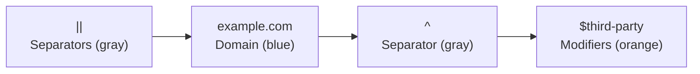
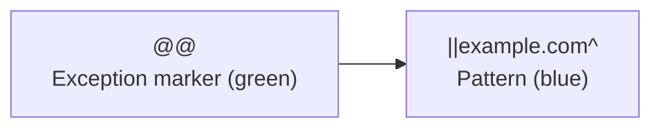
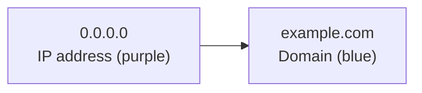
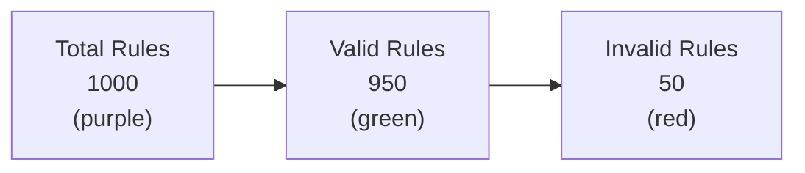
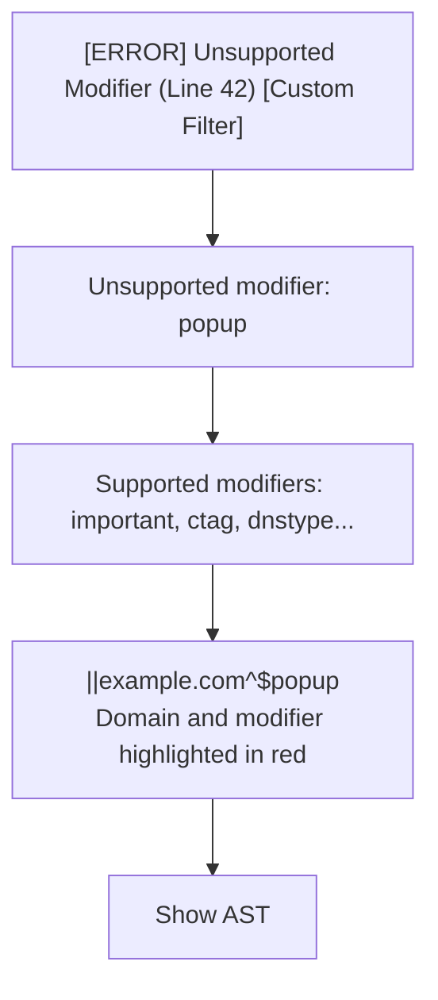
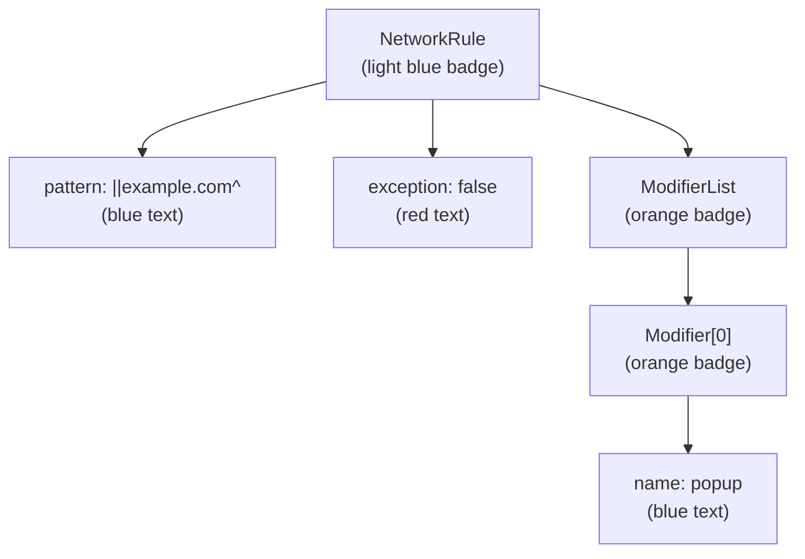

# Validation UI Component

A comprehensive, color-coded UI component for displaying validation errors from AGTree-parsed filter rules.

## Features

✨ **Color-Coded Error Types** - Each error type has a unique color scheme for instant recognition
🎨 **Syntax Highlighting** - Filter rules are syntax-highlighted based on their type
🌳 **AST Visualization** - Interactive AST tree view with color-coded node types
🔍 **Error Filtering** - Filter by severity (All, Errors, Warnings)
📊 **Summary Statistics** - Visual cards showing validation metrics
📥 **Export Capability** - Download validation reports as JSON
🌙 **Dark Mode** - Full support for light and dark themes
📱 **Responsive Design** - Works on all screen sizes

## Quick Start

### Include the Script

```html
<script src="validation-ui.js"></script>
```

### Display a Validation Report

```javascript
const report = {
    totalRules: 1000,
    validRules: 950,
    invalidRules: 50,
    errorCount: 45,
    warningCount: 5,
    infoCount: 0,
    errors: [
        {
            type: 'unsupported_modifier',
            severity: 'error',
            ruleText: '||example.com^$popup',
            message: 'Unsupported modifier: popup',
            details: 'Supported modifiers: important, ~important, ctag...',
            lineNumber: 42,
            sourceName: 'Custom Filter'
        }
    ]
};

ValidationUI.showReport(report);
```

## Color Coding Guide

### Error Types

| Error Type | Color | Hex Code |
|-----------|-------|----------|
| Parse Error | Red | #dc3545 |
| Syntax Error | Red | #dc3545 |
| Unsupported Modifier | Orange | #fd7e14 |
| Invalid Hostname | Pink | #e83e8c |
| IP Not Allowed | Purple | #6610f2 |
| Pattern Too Short | Yellow | #ffc107 |
| Public Suffix Match | Light Red | #ff6b6b |
| Invalid Characters | Magenta | #d63384 |
| Cosmetic Not Supported | Cyan | #0dcaf0 |

### AST Node Types

| Node Type | Color | Hex Code |
|-----------|-------|----------|
| Network Category | Blue | #0d6efd |
| Network Rule | Light Blue | #0dcaf0 |
| Host Rule | Purple | #6610f2 |
| Cosmetic Rule | Pink | #d63384 |
| Modifier | Orange | #fd7e14 |
| Comment | Gray | #6c757d |
| Invalid Rule | Red | #dc3545 |

### Syntax Highlighting

Rules are automatically syntax-highlighted:

#### Network Rules


#### Exception Rules


#### Host Rules


## API Reference

### ValidationUI.showReport(report)

Display a validation report.

**Parameters:**
- `report` (ValidationReport) - The validation report to display

**Example:**
```javascript
ValidationUI.showReport({
    totalRules: 100,
    validRules: 95,
    invalidRules: 5,
    errorCount: 4,
    warningCount: 1,
    infoCount: 0,
    errors: [...]
});
```

### ValidationUI.hideReport()

Hide the validation report section.

**Example:**
```javascript
ValidationUI.hideReport();
```

### ValidationUI.renderReport(report, container)

Render a validation report in a specific container element.

**Parameters:**
- `report` (ValidationReport) - The validation report
- `container` (HTMLElement) - Container element to render in

**Example:**
```javascript
const container = document.getElementById('my-container');
ValidationUI.renderReport(report, container);
```

### ValidationUI.downloadReport()

Download the current validation report as JSON.

**Example:**
```javascript
// Add a button to trigger download
button.addEventListener('click', () => {
    ValidationUI.downloadReport();
});
```

## Data Structures

### ValidationReport

```typescript
interface ValidationReport {
    errorCount: number;
    warningCount: number;
    infoCount: number;
    errors: ValidationError[];
    totalRules: number;
    validRules: number;
    invalidRules: number;
}
```

### ValidationError

```typescript
interface ValidationError {
    type: ValidationErrorType;
    severity: ValidationSeverity;
    ruleText: string;
    lineNumber?: number;
    message: string;
    details?: string;
    ast?: AnyRule;
    sourceName?: string;
}
```

### ValidationErrorType

```typescript
enum ValidationErrorType {
    parse_error = 'parse_error',
    syntax_error = 'syntax_error',
    unsupported_modifier = 'unsupported_modifier',
    invalid_hostname = 'invalid_hostname',
    ip_not_allowed = 'ip_not_allowed',
    pattern_too_short = 'pattern_too_short',
    public_suffix_match = 'public_suffix_match',
    invalid_characters = 'invalid_characters',
    cosmetic_not_supported = 'cosmetic_not_supported',
    modifier_validation_failed = 'modifier_validation_failed',
}
```

### ValidationSeverity

```typescript
enum ValidationSeverity {
    error = 'error',
    warning = 'warning',
    info = 'info',
}
```

## Visual Examples

### Summary Cards

The UI displays summary statistics in color-coded cards:



### Error List Item

Each error is displayed with:



### AST Visualization

Expandable AST tree with color-coded nodes:



## Integration with Compiler

To integrate with the adblock-compiler:

```javascript
// In your compilation workflow
const validator = new ValidateTransformation(false);
validator.setSourceName('My Filter List');

const validRules = validator.executeSync(rules);
const report = validator.getValidationReport(
    rules.length,
    validRules.length
);

// Display in UI
ValidationUI.showReport(report);
```

## Demo Page

A demo page is included (`validation-demo.html`) that shows:
- Color legend for error types
- Color legend for AST node types  
- Sample validation reports
- Dark mode toggle
- Interactive examples

To view:
1. Open `validation-demo.html` in a browser
2. Click "Load Sample Report" to see examples
3. Toggle dark mode to see theme adaptation
4. Click on AST buttons to explore parsed structures

## Browser Compatibility

- Chrome/Edge: ✅ Full support
- Firefox: ✅ Full support
- Safari: ✅ Full support
- Mobile browsers: ✅ Responsive design

## Styling

The component uses CSS custom properties for theming:

```css
:root {
    --alert-error-bg: #f8d7da;
    --alert-error-text: #721c24;
    --alert-error-border: #dc3545;
    --log-warn-bg: #fff3cd;
    --log-warn-text: #856404;
    --log-warn-border: #ffc107;
    /* ... etc */
}
```

Override these in your stylesheet to customize colors.

## Contributing

When adding new error types:

1. Add the error type to `ValidationErrorType` enum
2. Add color scheme in `getErrorTypeColor()` method
3. Add syntax highlighting logic in `highlightRule()` if needed
4. Update documentation and demo

## License

Part of the adblock-compiler project. See main project LICENSE.
