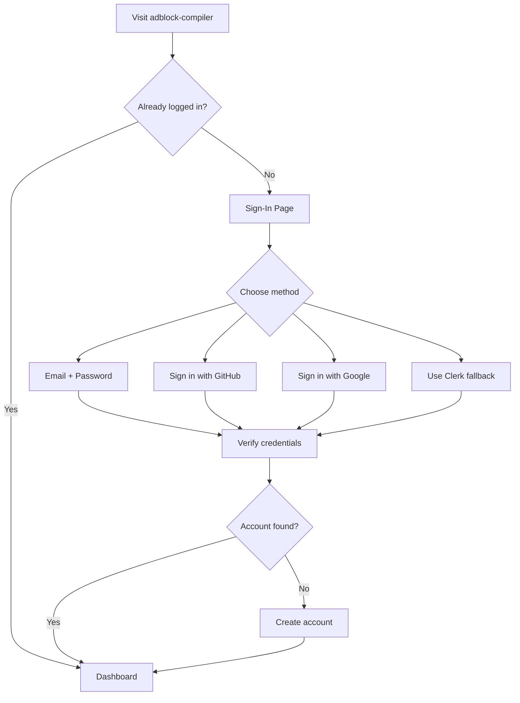
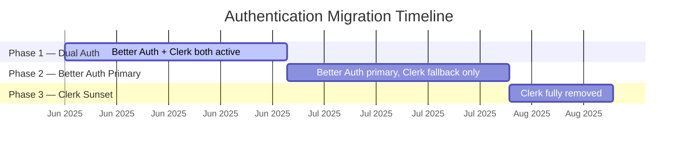

# User Migration Guide: Authentication & Database Upgrade

> **Last updated:** June 2025
>
> This guide is for **end users** of adblock-compiler. If you're a developer or
> contributor, see the [technical migration docs](../architecture/) for
> implementation details.

---

## Table of Contents

- [What Changed](#what-changed)
- [What This Means For You](#what-this-means-for-you)
- [New Login Flow](#new-login-flow)
  - [Signing In (Existing Users)](#signing-in-existing-users)
  - [Creating a New Account](#creating-a-new-account)
  - [Clerk Fallback (Transition Period)](#clerk-fallback-transition-period)
- [Session Changes](#session-changes)
- [API Key Users](#api-key-users)
- [Browser Extension Users](#browser-extension-users)
- [Frequently Asked Questions](#frequently-asked-questions)
- [Getting Help](#getting-help)
- [Migration Timeline](#migration-timeline)

---

## What Changed

We've made two behind-the-scenes upgrades to adblock-compiler:

1. **Authentication system** — We moved from Clerk to **Better Auth**, an
   open-source authentication library. This gives us tighter control over how
   your identity is verified, faster login flows, and improved privacy because
   your auth data no longer passes through a third-party service.

2. **Database** — We migrated from Cloudflare D1 to **Neon PostgreSQL**, a
   battle-tested relational database. This means better reliability, faster
   queries, and stronger data-integrity guarantees for your account information.

**The short version:** everything should feel the same or better. Your data is
safe, your account still exists, and most features work exactly as before.

---

## What This Means For You

| Area | Impact |
|---|---|
| **Your account** | ✅ Preserved — no action needed |
| **Your settings & preferences** | ✅ Migrated automatically |
| **Your API keys** | ✅ Continue to work unchanged |
| **Your active session** | ⚠️ One-time re-login required |
| **Browser extensions** | ✅ No changes needed |

The only thing you'll notice is a **one-time login prompt** the first time you
visit the site after the migration. After that, everything works as before.

---

## New Login Flow

Better Auth supports **email/password** and **social sign-in** (GitHub and
Google). Here's what the process looks like:

### Signing In (Existing Users)

1. Go to the adblock-compiler sign-in page.
2. Choose your preferred sign-in method:
   - **Email & password** — enter the email address associated with your
     existing account and your password.
   - **GitHub** — click "Sign in with GitHub" and authorize the app. If your
     GitHub email matches your existing account, you'll be linked automatically.
   - **Google** — click "Sign in with Google" and authorize the app. Same
     auto-linking behavior applies.
3. You'll be redirected to your dashboard. All your previous data, settings,
   and API keys will be right where you left them.

### Creating a New Account

If you're new to adblock-compiler:

1. Click **Sign Up** on the sign-in page.
2. Choose email/password or a social provider (GitHub, Google).
3. If using email/password, you'll receive a verification email — click the
   link to activate your account.
4. That's it! You're ready to start compiling filter lists.

### Clerk Fallback (Transition Period)

During the transition, the **Clerk sign-in option remains available** as a
fallback. If you run into any issues with the new Better Auth login, you can
click "Sign in with Clerk" to use the previous authentication system.

> **Note:** The Clerk fallback will be removed once the migration is fully
> complete (see [Migration Timeline](#migration-timeline) below). We encourage
> you to sign in with Better Auth so your session is established on the new
> system.

---

## Session Changes

Sessions now work a bit differently under the hood:

- **Server-side sessions** — Your session is stored securely in PostgreSQL
  instead of on a third-party service. This means faster verification and
  better privacy.
- **Secure cookies** — Sessions use `httpOnly` cookies that can't be accessed
  by JavaScript running in your browser, protecting you from cross-site
  scripting attacks.
- **Automatic refresh** — Sessions expire periodically and refresh
  automatically in the background. You won't need to re-enter your password
  unless you've been inactive for an extended period.

### What to Expect

After migration, you'll be **logged out once**. This is normal — the old Clerk
session tokens are no longer valid, and you need to establish a new session on
the Better Auth system. After you log in once, everything continues as usual.

---

## API Key Users

**Your API keys are unaffected by this migration.**

- Keys generated before the migration continue to work with no changes.
- API endpoints haven't changed — your existing integrations, scripts, and
  automations will keep running.
- You can generate new API keys from your dashboard at any time.

If you do experience any issues with an API key, see the
[FAQ](#my-api-key-stopped-working--what-do-i-do) below.

---

## Browser Extension Users

**No changes are needed for browser extensions.**

Filter list compilation endpoints remain at the same URLs with the same
behavior. If your browser extension fetches compiled filter lists from
adblock-compiler, it will continue to work without any updates.

---

## Frequently Asked Questions

### "Why was I logged out?"

The migration replaced the authentication system that managed your sessions.
Your old session token (issued by Clerk) is no longer recognized by the new
system (Better Auth). This is a **one-time event** — just sign in again and
you're all set.

### "Do I need to create a new account?"

**No.** All existing accounts were migrated to the new system. Sign in with
the same email address or social provider you used before, and your account
will be waiting for you.

### "Is my data safe?"

**Yes.** All account data, preferences, API keys, and compilation history were
migrated to the new PostgreSQL database. The migration was performed with
integrity checks to ensure nothing was lost. Your data is now stored with
stronger consistency guarantees than before.

### "What happened to my settings/preferences?"

Everything was carried over. Your compilation preferences, saved filter list
configurations, and dashboard settings are exactly where you left them.

### "Can I still use GitHub/Google to sign in?"

**Yes!** Better Auth fully supports GitHub and Google social sign-in. If your
social account's email matches your existing adblock-compiler account, it will
link automatically. You can also add or remove social providers from your
account settings at any time.

### "My API key stopped working — what do I do?"

API keys should continue to work without changes. If yours isn't working:

1. Double-check that you're using the correct key (no trailing whitespace or
   missing characters).
2. Verify the key hasn't expired — check your dashboard under **API Keys**.
3. Try generating a new key from the dashboard.
4. If the problem persists, [open an issue](#getting-help) and include the
   error message you're receiving (but **never** share your actual API key).

### "The site is slower than before — is that normal?"

You may notice slightly different performance characteristics during the
transition period as caches warm up and the new database settles in. In most
cases, the new system is **faster** than the old one. If you experience
sustained slowness:

- Try a hard refresh (`Ctrl+Shift+R` / `Cmd+Shift+R`).
- Clear your browser cache for the site.
- If it persists beyond a day or two, please [report it](#getting-help).

### "How do I report a problem?"

See the [Getting Help](#getting-help) section below. The fastest way is to
open a GitHub Issue with the `migration-issue` label.

---

## Getting Help

If you run into any problems related to the migration:

1. **Check this guide first** — most common questions are answered in the
   [FAQ](#frequently-asked-questions) above.
2. **Open a GitHub Issue** — go to
   [github.com/nicholasgriffintn/adblock-compiler/issues](https://github.com/nicholasgriffintn/adblock-compiler/issues)
   and create a new issue. Please use the **`migration-issue`** label so we
   can triage migration-related problems quickly.
3. **Include helpful details** when filing an issue:
   - What you were trying to do
   - What happened instead
   - Your browser name and version
   - Any error messages you saw (screenshots welcome)

> **Security note:** Never share API keys, passwords, or session tokens in a
> public issue. If your problem involves sensitive credentials, mention that
> in the issue and a maintainer will follow up privately.

---

## Migration Timeline

The migration is being rolled out in three phases:

| Phase | What Happens | User Impact |
|---|---|---|
| **Phase 1 — Dual Auth** | Both Better Auth and Clerk are active. New sessions default to Better Auth. | You can use either system. We encourage trying Better Auth. |
| **Phase 2 — Better Auth Primary** | Better Auth handles all new logins. Clerk is available only as a fallback for users who haven't switched yet. | If you haven't logged in with Better Auth yet, now is the time. |
| **Phase 3 — Clerk Sunset** | Clerk is fully removed. All auth flows go through Better Auth. | Seamless if you've already signed in with Better Auth. |

> **We'll send email reminders** before each phase transition so you're never
> caught off guard.

---

*Thank you for using adblock-compiler. If you have feedback on this migration
or this guide, we'd love to hear it — open an issue or drop a comment on the
migration tracking issue.*
