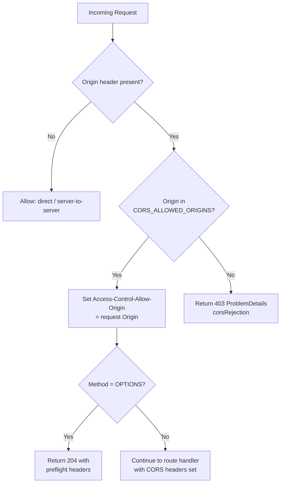

# CORS Policy

This document describes the Cross-Origin Resource Sharing (CORS) policy enforced by the Bloqr Cloudflare Worker. It covers allowed origins, the preflight flow, no-origin requests, error responses, and Zero Trust integration.

---

## Overview

All HTTP responses from the Worker include CORS headers computed at request time. The policy is strict by default:

- Only origins listed in `CORS_ALLOWED_ORIGINS` (a Worker environment binding) receive a permissive `Access-Control-Allow-Origin` header.
- Requests from unlisted origins are actively rejected with a **`403 ProblemDetails` (`corsRejection`)** — the Worker does not silently omit the header.
- Requests with no `Origin` header (direct server-to-server, CLI, or Postman) are allowed through unconditionally.
- Preflight `OPTIONS` requests return the full policy headers and `204 No Content`.

---

## CORS Request Decision Flow



---

## Environment Binding

The allowed-origins list is configured via the `CORS_ALLOWED_ORIGINS` Worker binding (a comma-delimited string):

```toml
# wrangler.toml
[vars]
CORS_ALLOWED_ORIGINS = "https://app.bloqr.app,https://admin.bloqr.app"
```

For local development, override via `.dev.vars`:

```ini
# .dev.vars
CORS_ALLOWED_ORIGINS = "http://localhost:4200,http://localhost:4201"
```

---

## Middleware Implementation

CORS is implemented in two steps inside `worker/hono-app.ts`:

**Step 4 — Hono `cors()` middleware** computes and attaches CORS response headers. For public endpoints (health, metrics, docs) it returns `'*'`; for all other endpoints it echoes the request `Origin` only when it matches the allowlist.

**Step 4a — Origin enforcement middleware** rejects disallowed origins with a `403 ProblemDetails` response. Requests without an `Origin` header pass through unconditionally; public-endpoint requests also pass through.

```typescript
// worker/hono-app.ts — Step 4: Hono cors() middleware
app.use(
    '*',
    cors({
        origin: (origin, c) => {
            const pathname = new URL(c.req.url).pathname;
            if (isPublicEndpoint(pathname)) return '*';
            return matchOrigin(origin, c.env as Env) ?? undefined;
        },
        allowMethods: ['GET', 'POST', 'PUT', 'PATCH', 'DELETE', 'OPTIONS'],
        allowHeaders: [
            'Content-Type',
            'Authorization',
            'X-Turnstile-Token',
            'X-Payg-Session',
            'X-Payment-Response',
            'X-Stripe-Customer-Id',
        ],
        exposeHeaders: ['X-Payg-Session-Remaining', 'X-Payment-Required', 'X-Request-Id'],
        maxAge: 86400,
        credentials: true,
    }),
);

// worker/hono-app.ts — Step 4a: explicit origin enforcement
app.use('*', async (c, next) => {
    const origin = c.req.header('Origin');

    // No Origin header → non-browser client → allow through unconditionally.
    if (!origin) {
        await next();
        return;
    }

    const pathname = c.req.path;

    // Public endpoints allow any origin (wildcard * returned by step 4).
    if (isPublicEndpoint(pathname)) {
        await next();
        return;
    }

    const allowed = matchOrigin(origin, c.env as Env);
    if (!allowed) {
        analytics?.trackSecurityEvent({ eventType: 'cors_rejection', ... });
        return ProblemResponse.corsRejection(pathname, `Origin '${origin}' is not permitted.`);
    }

    await next();
});
```

The `matchOrigin` helper (in `worker/utils/cors.ts`) checks the request `Origin` against the comma-delimited `CORS_ALLOWED_ORIGINS` Worker binding.

---

## Preflight `OPTIONS` Response Headers

A complete preflight response for an allowed origin:

```http
HTTP/1.1 204 No Content
Access-Control-Allow-Origin: https://app.bloqr.app
Access-Control-Allow-Methods: GET, POST, PUT, PATCH, DELETE, OPTIONS
Access-Control-Allow-Headers: Content-Type, Authorization, X-Turnstile-Token, X-Payg-Session, X-Payment-Response, X-Stripe-Customer-Id
Access-Control-Expose-Headers: X-Payg-Session-Remaining, X-Payment-Required, X-Request-Id
Access-Control-Allow-Credentials: true
Access-Control-Max-Age: 86400
Vary: Origin
```

`X-Turnstile-Token` is included in `Access-Control-Allow-Headers` so that the Angular frontend can set the Turnstile token on cross-origin requests to the Worker. See [Turnstile Middleware](./turnstile.md) for details.

---

## No-Origin Requests

Requests without an `Origin` header — typically from:

- cURL / Postman / Newman (API testing)
- Server-to-server calls (CI pipeline, Worker-to-Worker)
- Cloudflare Cron Triggers

…are allowed through without any CORS header manipulation. The route handler processes them normally. **No CORS headers are added to the response** for these requests; this is intentional and correct.

> **Security note (ZTA):** Absence of an `Origin` header does not bypass authentication. All endpoints that require a session still invoke `auth.api.getSession()`. CORS is a browser enforcement mechanism — it does not substitute for server-side access control.

---

## Error Responses

When a request arrives from a disallowed origin (i.e., the `Origin` header is present but not in `CORS_ALLOWED_ORIGINS`), the Worker returns a **`403 Forbidden`** response with a ProblemDetails JSON body (`ProblemResponse.corsRejection`). The request is terminated — it does not proceed to the route handler.

For preflight (`OPTIONS`) requests from disallowed origins, the Worker likewise returns a `403` with no `Access-Control-Allow-Origin` header. The browser will not proceed with the actual request.

---

## Adding a New Allowed Origin

1. Update `CORS_ALLOWED_ORIGINS` in `wrangler.toml` (for production) or `.dev.vars` (for local dev).
2. If the origin is on a new subdomain of `bloqr.app`, ensure the `better-auth` `trustedOrigins` binding (`TRUSTED_ORIGINS`) also includes it — see [Better Auth Security Audit, AUDIT-11](../auth/better-auth-audit-2026-05.md#audit-11----trustedorigins-included-wildcard-development-entries).
3. If the origin requires cookie sharing, verify the session cookie `Domain` attribute is set to `.bloqr.app`.

---

## Zero Trust Integration

| ZTA Principle | CORS Implementation |
|---------------|---------------------|
| Verify explicitly | Every request from a browser origin is checked against the explicit allow-list |
| Least privilege | `Access-Control-Allow-Origin` is echoed only for approved origins |
| Never trust, always verify | Credentials (`Authorization`, session cookie) are still validated server-side regardless of CORS outcome |
| Short-lived access | `Access-Control-Max-Age: 86400` caps preflight caching at 24 hours |

---

## Related Documentation

- [Turnstile Middleware](./turnstile.md) — adds `X-Turnstile-Token` to the `Authorization` surface checked by CORS
- [Better Auth Security Audit, AUDIT-11](../auth/better-auth-audit-2026-05.md#audit-11----trustedorigins-included-wildcard-development-entries) — `trustedOrigins` wildcard finding
- [Worker Request Lifecycle](../architecture/worker-request-lifecycle.md) — where CORS middleware fits in the pipeline
