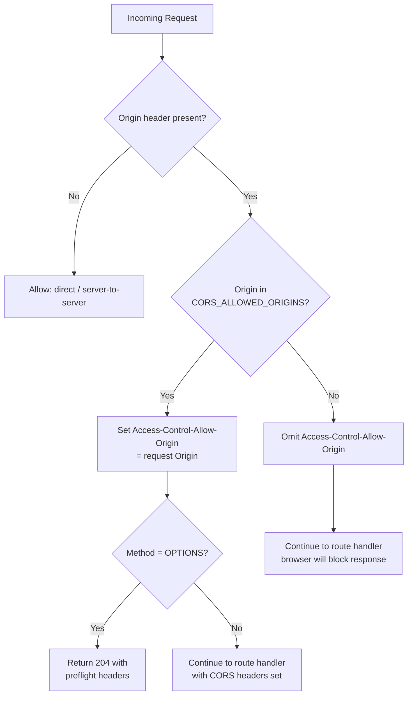

# CORS Policy

This document describes the Cross-Origin Resource Sharing (CORS) policy enforced by the Bloqr Cloudflare Worker. It covers allowed origins, the preflight flow, no-origin requests, error responses, and Zero Trust integration.

---

## Overview

All HTTP responses from the Worker include CORS headers computed at request time. The policy is strict by default:

- Only origins listed in `CORS_ALLOWED_ORIGINS` (a Worker environment binding) receive a permissive `Access-Control-Allow-Origin` header.
- Requests from unlisted origins receive no `Access-Control-Allow-Origin` header — browsers will block the response.
- Requests with no `Origin` header (direct server-to-server, CLI, or Postman) are allowed through unconditionally.
- Preflight `OPTIONS` requests return the full policy headers and `204 No Content`.

---

## CORS Request Decision Flow



---

## Environment Binding

The allowed-origins list is configured via the `CORS_ALLOWED_ORIGINS` Worker binding (a comma-delimited string):

```toml
# wrangler.toml
[vars]
CORS_ALLOWED_ORIGINS = "https://app.bloqr.app,https://admin.bloqr.app"
```

For local development, override via `.dev.vars`:

```ini
# .dev.vars
CORS_ALLOWED_ORIGINS = "http://localhost:4200,http://localhost:4201"
```

---

## Middleware Implementation

```typescript
// worker/middleware/cors.ts
import type { Context, Next } from 'hono';
import type { Env }            from '../types/env.ts';

const CORS_HEADERS: Record<string, string> = {
    'Access-Control-Allow-Methods':  'GET, POST, PUT, DELETE, PATCH, OPTIONS',
    'Access-Control-Allow-Headers':  'Content-Type, Authorization, CF-Turnstile-Token',
    'Access-Control-Allow-Credentials': 'true',
    'Access-Control-Max-Age':        '86400',
};

export function corsMiddleware() {
    return async (c: Context<{ Bindings: Env }>, next: Next): Promise<Response> => {
        const origin  = c.req.header('Origin');
        const allowed = parseAllowedOrigins(c.env.CORS_ALLOWED_ORIGINS);

        // No Origin header — direct call, allow through
        if (!origin) {
            return next();
        }

        const isAllowed = allowed.includes(origin);

        // Preflight
        if (c.req.method === 'OPTIONS') {
            const headers = new Headers(CORS_HEADERS);
            if (isAllowed) {
                headers.set('Access-Control-Allow-Origin', origin);
                headers.set('Vary', 'Origin');
            }
            return new Response(null, { status: 204, headers });
        }

        // Standard request
        await next();
        if (isAllowed) {
            c.res.headers.set('Access-Control-Allow-Origin', origin);
            c.res.headers.set('Vary', 'Origin');
            Object.entries(CORS_HEADERS).forEach(([k, v]) => c.res.headers.set(k, v));
        }
        return c.res;
    };
}

function parseAllowedOrigins(raw: string | undefined): string[] {
    if (!raw) return [];
    return raw.split(',').map(o => o.trim()).filter(Boolean);
}
```

---

## Preflight `OPTIONS` Response Headers

A complete preflight response for an allowed origin:

```http
HTTP/1.1 204 No Content
Access-Control-Allow-Origin: https://app.bloqr.app
Access-Control-Allow-Methods: GET, POST, PUT, DELETE, PATCH, OPTIONS
Access-Control-Allow-Headers: Content-Type, Authorization, CF-Turnstile-Token
Access-Control-Allow-Credentials: true
Access-Control-Max-Age: 86400
Vary: Origin
```

`CF-Turnstile-Token` is included in `Access-Control-Allow-Headers` so that the Angular frontend can set the Turnstile token on cross-origin requests to the Worker. See [Turnstile Middleware](./turnstile.md) for details.

---

## No-Origin Requests

Requests without an `Origin` header — typically from:

- cURL / Postman / Newman (API testing)
- Server-to-server calls (CI pipeline, Worker-to-Worker)
- Cloudflare Cron Triggers

…are allowed through without any CORS header manipulation. The route handler processes them normally. **No CORS headers are added to the response** for these requests; this is intentional and correct.

> **Security note (ZTA):** Absence of an `Origin` header does not bypass authentication. All endpoints that require a session still invoke `auth.api.getSession()`. CORS is a browser enforcement mechanism — it does not substitute for server-side access control.

---

## Error Responses

When a request from a disallowed origin completes, the Worker returns a normal HTTP response **without** an `Access-Control-Allow-Origin` header. The browser enforces the block — the Worker does not return a `4xx` for CORS reasons alone.

For preflight (`OPTIONS`) requests from disallowed origins, the Worker returns `204` with no `Access-Control-Allow-Origin` header. The browser will not proceed with the actual request.

---

## Adding a New Allowed Origin

1. Update `CORS_ALLOWED_ORIGINS` in `wrangler.toml` (for production) or `.dev.vars` (for local dev).
2. If the origin is on a new subdomain of `bloqr.app`, ensure the `better-auth` `trustedOrigins` binding (`TRUSTED_ORIGINS`) also includes it — see [Better Auth Security Audit, AUDIT-11](../auth/better-auth-audit-2026-05.md#audit-11----trustedorigins-included-wildcard-development-entries).
3. If the origin requires cookie sharing, verify the session cookie `Domain` attribute is set to `.bloqr.app`.

---

## Zero Trust Integration

| ZTA Principle | CORS Implementation |
|---------------|---------------------|
| Verify explicitly | Every request from a browser origin is checked against the explicit allow-list |
| Least privilege | `Access-Control-Allow-Origin` is echoed only for approved origins |
| Never trust, always verify | Credentials (`Authorization`, session cookie) are still validated server-side regardless of CORS outcome |
| Short-lived access | `Access-Control-Max-Age: 86400` caps preflight caching at 24 hours |

---

## Related Documentation

- [Turnstile Middleware](./turnstile.md) — adds `CF-Turnstile-Token` to the `Authorization` surface checked by CORS
- [Better Auth Security Audit, AUDIT-11](../auth/better-auth-audit-2026-05.md#audit-11----trustedorigins-included-wildcard-development-entries) — `trustedOrigins` wildcard finding
- [Worker Request Lifecycle](../architecture/worker-request-lifecycle.md) — where `corsMiddleware()` sits in the pipeline
