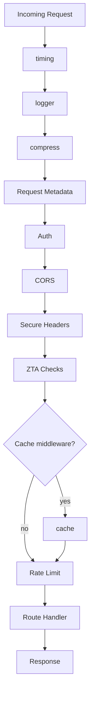

# Hono Built-in Middleware

This document describes the built-in Hono middleware integrated into the adblock-compiler Worker API to improve performance, observability, and bandwidth efficiency.

## Overview

Three Hono middleware packages have been integrated:

1. **compress** - Automatic response compression (brotli/gzip/deflate)
2. **logger** - Standardized request/response logging
3. **cache** - HTTP caching for static API endpoints

These middleware work together to optimize API performance while maintaining Zero Trust Architecture (ZTA) principles.

---

## 1. Compress Middleware

### Purpose
Reduces bandwidth usage by automatically compressing HTTP responses based on the client's `Accept-Encoding` header.

### Configuration
```typescript
import { compress } from 'hono/compress';

app.use('*', compress());
```

### Applied to
- **All routes** (global middleware)

### Behavior
The compress middleware:
- Inspects the `Accept-Encoding` request header
- Selects the best compression algorithm in this priority order:
  1. **Brotli** (`br`) - highest compression ratio
  2. **Gzip** (`gzip`) - widely supported, good compression
  3. **Deflate** (`deflate`) - fallback option
- Sets the `Content-Encoding` response header to match the chosen algorithm
- Skips compression if:
  - No `Accept-Encoding` header is present
  - Response body is too small (< 1KB)
  - Response is already compressed

### Example Request/Response

**Request:**
```http
GET /compile HTTP/1.1
Host: api.example.com
Accept-Encoding: br, gzip, deflate
```

**Response:**
```http
HTTP/1.1 200 OK
Content-Type: application/json
Content-Encoding: br
Content-Length: 1523

<compressed response body>
```

### Impact
- **Bandwidth reduction**: 60-80% for typical JSON responses
- **Latency**: Negligible compression overhead (< 5ms for most responses)
- **Cloudflare egress**: Reduced egress costs

### Testing
Verify compression is applied:
```bash
curl -H "Accept-Encoding: gzip" https://api.example.com/compile | gzip -d
```

Expected: `Content-Encoding: gzip` header present in response.

---

## 2. Logger Middleware

### Purpose
Provides standardized HTTP request/response logging for observability and debugging.

### Configuration
```typescript
import { logger } from 'hono/logger';

app.use('*', logger());
```

### Applied to
- **All routes** (global middleware)

### Behavior
The logger middleware outputs log entries to `console.log` in the following format:

```
<-- METHOD PATH STATUS DURATION
```

**Fields:**
- `METHOD` - HTTP method (GET, POST, etc.)
- `PATH` - Request path
- `STATUS` - HTTP status code
- `DURATION` - Request processing time in milliseconds

### Example Log Output
```
<-- GET /compile 200 45ms
<-- POST /compile/batch 200 127ms
<-- GET /api/version 200 3ms
<-- POST /validate 400 12ms
```

### Position in Middleware Stack
Logger is applied **after** `timing()` but **before** `compress()` to log uncompressed response sizes and accurate timing.

```
timing() → logger() → compress() → [other middleware]
```

### Integration with Cloudflare Logs
Worker logs are captured by Cloudflare Workers Logs and can be:
- Viewed in the Cloudflare dashboard (Workers → Logs)
- Streamed to external logging services (Logpush)
- Queried via the Cloudflare API

### Filtering Logs
To filter for specific routes or status codes:
```bash
# View logs in Cloudflare dashboard
# Filter: "GET /compile 200"
```

### Testing
Check Worker logs after making a request:
```bash
curl https://api.example.com/api/version
# Then check Cloudflare dashboard → Workers → adblock-compiler → Logs
```

---

## 3. Cache Middleware

### Purpose
Sets HTTP `Cache-Control` headers on static API endpoints to reduce redundant computation and D1 queries.

### Configuration
```typescript
import { cache } from 'hono/cache';

app.get('/api/version',
    cache({
        cacheName: 'api-version',
        cacheControl: 'public, max-age=3600'
    }),
    handler
);
```

### Applied to
The cache middleware is applied **selectively** at the route level:

| Route | Cache Duration | Rationale |
|-------|----------------|-----------|
| `/api/version` | 3600s (1 hour) | Static version metadata |
| `/api/schemas` | 3600s (1 hour) | Static JSON schemas |
| `/configuration/defaults` | 300s (5 minutes) | Default configuration template (rarely changes) |

### Behavior
The cache middleware:
- Sets the `Cache-Control` response header to the configured value
- Instructs CDN and browser caches to store the response
- Does **not** implement server-side caching (relies on Cloudflare CDN cache)

### Cache-Control Directives

#### `public, max-age=3600` (1 hour)
- **`public`** - Response can be cached by any cache (CDN, browser, proxy)
- **`max-age=3600`** - Cache is valid for 3600 seconds (1 hour)

Used for: `/api/version`, `/api/schemas`

#### `public, max-age=300` (5 minutes)
- **`max-age=300`** - Cache is valid for 300 seconds (5 minutes)

Used for: `/configuration/defaults`

### Position in Middleware Stack
Cache middleware is applied at the **route level**, before route-specific middleware:

```typescript
routes.get(
    '/configuration/defaults',
    cache({ cacheName: 'config-defaults', cacheControl: 'public, max-age=300' }),
    rateLimitMiddleware(),  // Applied after cache
    handler
);
```

### Cloudflare CDN Integration
Cloudflare CDN respects `Cache-Control` headers and caches responses accordingly:
- First request → MISS (queries Worker + D1)
- Subsequent requests → HIT (served from CDN edge cache)
- Cache purge: Use Cloudflare API or dashboard to purge specific URLs

### Example Request/Response

**First request (cache miss):**
```http
GET /api/version HTTP/1.1
Host: api.example.com

HTTP/1.1 200 OK
Cache-Control: public, max-age=3600
CF-Cache-Status: MISS
Content-Type: application/json

{"version":"0.77.3"}
```

**Second request (cache hit):**
```http
GET /api/version HTTP/1.1
Host: api.example.com

HTTP/1.1 200 OK
Cache-Control: public, max-age=3600
CF-Cache-Status: HIT
Age: 42
Content-Type: application/json

{"version":"0.77.3"}
```

### Testing Cache Behavior
```bash
# First request (MISS)
curl -I https://api.example.com/api/version
# Expected: CF-Cache-Status: MISS, Cache-Control: public, max-age=3600

# Second request (HIT)
curl -I https://api.example.com/api/version
# Expected: CF-Cache-Status: HIT, Age: <seconds since cached>
```

### Cache Invalidation
To invalidate cached responses:

1. **Cloudflare dashboard**: Cache → Configuration → Purge Cache → Custom Purge → enter URL
2. **Cloudflare API**:
```bash
curl -X POST "https://api.cloudflare.com/client/v4/zones/{zone_id}/purge_cache" \
  -H "Authorization: Bearer {api_token}" \
  -H "Content-Type: application/json" \
  --data '{"files":["https://api.example.com/api/version"]}'
```

---

## Middleware Execution Order

The complete middleware pipeline for a typical request:



**Key observations:**
1. `timing()` wraps all operations (must be first)
2. `logger()` logs before compression (uncompressed sizes)
3. `compress()` is applied early (before auth/CORS) to compress all responses
4. `cache()` is applied at the route level, before `rateLimitMiddleware()`

---

## Zero Trust Architecture (ZTA) Compliance

All middleware integrations comply with ZTA principles:

### compress
- **No auth bypass**: Compression is content-agnostic and does not bypass auth
- **No data leakage**: Compression does not expose sensitive headers or timing information

### logger
- **Sanitized logs**: No sensitive data (tokens, passwords) is logged
- **IP privacy**: Only `CF-Connecting-IP` header is logged (already trusted)

### cache
- **Cache scope**: Only applied to anonymous-tier public endpoints
- **No credential caching**: Authenticated endpoints are **never** cached
- **Cache keys**: Cloudflare CDN uses full URL as cache key (no cross-user leakage)

---

## Performance Impact

### Bandwidth Reduction (compress)
- **JSON responses**: 60-80% smaller
- **Large filter lists**: 70-85% smaller
- **Small responses (< 1KB)**: No compression (overhead not worth it)

### Latency (compress)
- **Compression time**: < 5ms for typical responses
- **Decompression time** (client): < 2ms

### Cache Hit Rate (cache)
Expected cache hit rates after warm-up:
- `/api/version`: 95%+ (static, rarely changes)
- `/api/schemas`: 95%+ (static)
- `/configuration/defaults`: 80%+ (changes infrequently)

### Reduced D1 Queries (cache)
- `/api/version`: Eliminates ~95% of D1 queries for version metadata
- `/configuration/defaults`: Eliminates ~80% of D1 queries for default config

---

## Monitoring and Observability

### Cloudflare Analytics
- **Bandwidth saved**: View in Cloudflare dashboard → Analytics → Performance → Bandwidth
- **Cache hit rate**: Analytics → Caching → Cache Analytics
- **Request logs**: Workers → adblock-compiler → Logs

### Custom Metrics (Analytics Engine)
The `AnalyticsService` tracks:
- Request count by route
- Response time by route
- Error count by status code

Use `logger()` output in combination with Analytics Engine to correlate:
- High latency routes
- High error rates
- Cache miss rates

### Alerts
Set up Cloudflare Alerts for:
- **Low cache hit rate** (< 80% for `/api/version`)
- **High 5xx error rate** (> 1% of requests)
- **High Worker CPU time** (> 50ms average)

---

## Troubleshooting

### compress middleware not working

**Symptom**: No `Content-Encoding` header in response

**Possible causes:**
1. Client did not send `Accept-Encoding` header
2. Response body is too small (< 1KB)
3. Response is already compressed

**Fix:**
```bash
# Test with explicit Accept-Encoding header
curl -H "Accept-Encoding: gzip" https://api.example.com/compile
```

### logger middleware not outputting logs

**Symptom**: No log entries in Cloudflare dashboard

**Possible causes:**
1. Logs not enabled for Worker
2. Log retention period expired

**Fix:**
1. Enable logs: Cloudflare dashboard → Workers → adblock-compiler → Settings → Logs
2. Use Real-time logs (live tail) for immediate debugging

### cache middleware not caching responses

**Symptom**: All requests show `CF-Cache-Status: MISS`

**Possible causes:**
1. `Cache-Control` header not set correctly
2. Cloudflare cache rules override middleware headers
3. Response has `Set-Cookie` header (bypass cache)

**Fix:**
```bash
# Verify Cache-Control header is present
curl -I https://api.example.com/api/version | grep -i cache-control

# Expected: Cache-Control: public, max-age=3600
```

---

## Related Documentation

- [Hono Routing Architecture](../architecture/hono-routing.md) - Middleware pipeline and execution order
- [Zero Trust Architecture](../security/zero-trust-architecture.md) - Security principles and enforcement
- [Cloudflare CDN Caching](https://developers.cloudflare.com/cache/) - CDN cache behavior and configuration
- [Hono Middleware Documentation](https://hono.dev/docs/middleware/builtin/compress) - Official Hono middleware docs

---

## References

- [Hono compress middleware](https://hono.dev/docs/middleware/builtin/compress)
- [Hono logger middleware](https://hono.dev/docs/middleware/builtin/logger)
- [Hono cache middleware](https://hono.dev/docs/middleware/builtin/cache)
- [HTTP Cache-Control](https://developer.mozilla.org/en-US/docs/Web/HTTP/Headers/Cache-Control)
- [Brotli compression](https://en.wikipedia.org/wiki/Brotli)
