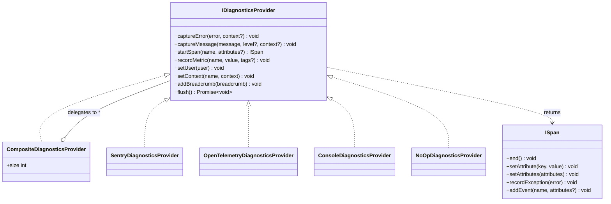
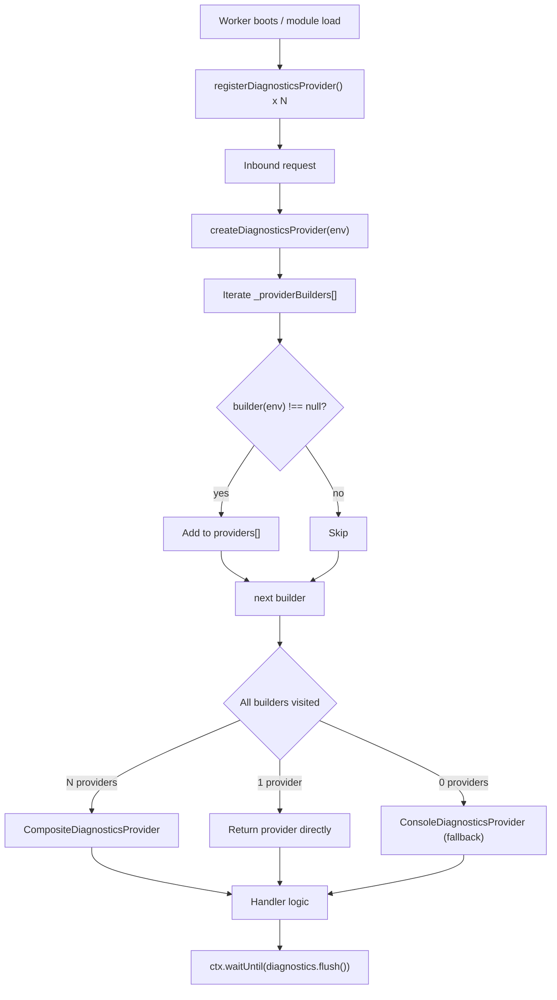

# Custom Diagnostics Providers

The `IDiagnosticsProvider` interface is the single extension point for the
entire observability stack. Any backend — Datadog, New Relic, Honeycomb,
a custom in-house sink — can be plugged in without touching core Worker code.

## Interface overview



## Built-in providers

| Class | Activated by | Notes |
|-------|-------------|-------|
| `SentryDiagnosticsProvider` | `SENTRY_DSN` secret | Error tracking + message capture |
| `OpenTelemetryDiagnosticsProvider` | `OTEL_EXPORTER_OTLP_ENDPOINT` secret | Traces via OTLP HTTP |
| `ConsoleDiagnosticsProvider` | fallback (no secrets set) | Structured JSON to `console` |
| `NoOpDiagnosticsProvider` | test environments | Silent no-op |
| `CompositeDiagnosticsProvider` | multiple backends active | Fan-out to all children |

## Adding a custom provider

### Step 1 — implement `IDiagnosticsProvider`

```typescript
// worker/services/my-datadog-provider.ts
import type {
    DiagnosticsBreadcrumb,
    DiagnosticsLevel,
    DiagnosticsUser,
    IDiagnosticsProvider,
    ISpan,
} from '../../src/diagnostics/index.ts';

export class DatadogDiagnosticsProvider implements IDiagnosticsProvider {
    constructor(private readonly apiKey: string) {}

    captureError(error: Error, context?: Record<string, unknown>): void {
        // send to Datadog Logs / Error Tracking ...
    }

    captureMessage(message: string, level?: DiagnosticsLevel): void {
        // send to Datadog Logs ...
    }

    startSpan(name: string): ISpan {
        // return a Datadog APM span ...
        return {
            end: () => {},
            setAttribute: () => {},
            setAttributes: () => {},
            recordException: (err) => { this.captureError(err); },
            addEvent: () => {},
        };
    }

    recordMetric(name: string, value: number): void {
        // send to Datadog StatsD / metrics API ...
    }

    setUser(_user: DiagnosticsUser): void {}
    setContext(_name: string, _ctx: Record<string, unknown>): void {}
    addBreadcrumb(_b: DiagnosticsBreadcrumb): void {}

    async flush(): Promise<void> {
        // flush any buffered payloads ...
    }
}
```

### Step 2 — register at module-load time

```typescript
// worker/worker.ts  (top-level, before any handler)
import { registerDiagnosticsProvider } from './services/diagnostics-factory.ts';
import { DatadogDiagnosticsProvider } from './services/my-datadog-provider.ts';

registerDiagnosticsProvider((env) =>
    env.DD_API_KEY ? new DatadogDiagnosticsProvider(env.DD_API_KEY) : null
);
```

`registerDiagnosticsProvider` is safe to call multiple times. Each registered
builder runs once per `createDiagnosticsProvider()` call. A builder that
returns `null` is silently skipped — use this to guard on missing env vars.

### Step 3 — add the required secret

```bash
wrangler secret put DD_API_KEY
```

No changes to `wrangler.toml` are needed.

## Provider registry flow



## `flush()` in Cloudflare Workers

Always call `flush()` via `ctx.waitUntil()` at the end of every handler so
buffered events are delivered before the isolate terminates:

```typescript
export default {
    async fetch(request, env, ctx) {
        const diagnostics = createDiagnosticsProvider(env);
        try {
            // ...handler logic...
        } catch (err) {
            diagnostics.captureError(err as Error, { url: request.url });
            throw err;
        } finally {
            ctx.waitUntil(diagnostics.flush());
        }
    },
};
```

`CompositeDiagnosticsProvider.flush()` uses `Promise.allSettled()` internally
so a slow or failing backend never blocks the others.

## Adding new methods to `IDiagnosticsProvider`

If you need to add a new method to the interface:

1. Add the method signature to `IDiagnosticsProvider` in
   `src/diagnostics/IDiagnosticsProvider.ts`
2. Implement it in `NoOpDiagnosticsProvider` and `ConsoleDiagnosticsProvider`
   (same file)
3. Add the fan-out delegation to `CompositeDiagnosticsProvider`
4. Implement in `SentryDiagnosticsProvider` and
   `OpenTelemetryDiagnosticsProvider`
5. Implement in any custom providers registered via `registerDiagnosticsProvider()`
