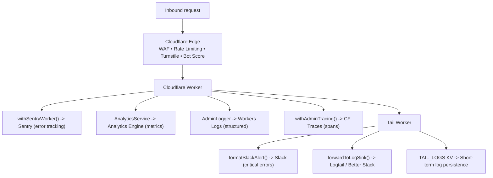

# Observability

This section covers the full observability stack for `adblock-compiler`, from
edge-level Cloudflare native tools to application-level error tracking with Sentry.

## Contents

| Document | What it covers |
|----------|---------------|
| [Sentry Integration](./SENTRY.md) | Error tracking, performance tracing, Worker wrapper, environment variables |
| [Cloudflare Native Observability](./CLOUDFLARE_OBSERVABILITY.md) | Workers Logs, Traces, Analytics Engine, Tail Worker, Logpush |
| [Prometheus Metrics](./PROMETHEUS.md) | `/metrics/prometheus` scrape endpoint, Analytics Engine SQL queries, Grafana |

## Observability layers

## Quick environment variable reference

| Variable | Layer | Required | Set via |
|----------|-------|----------|---------|
| `SENTRY_DSN` | Worker + Tail | Optional | `wrangler secret put SENTRY_DSN` |
| `ANALYTICS_ACCOUNT_ID` | Worker | Optional (Prometheus) | `wrangler secret put ANALYTICS_ACCOUNT_ID` |
| `ANALYTICS_API_TOKEN` | Worker | Optional (Prometheus) | `wrangler secret put ANALYTICS_API_TOKEN` |
| `SLACK_WEBHOOK_URL` | Tail Worker | Optional | `wrangler secret put SLACK_WEBHOOK_URL` (tail worker) |
| `LOG_SINK_URL` | Tail Worker | Optional | `wrangler secret put LOG_SINK_URL` (tail worker) |
| `LOG_SINK_TOKEN` | Tail Worker | Optional | `wrangler secret put LOG_SINK_TOKEN` (tail worker) |
