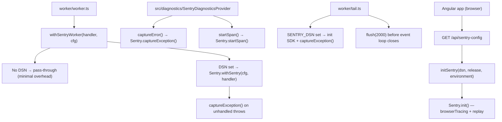
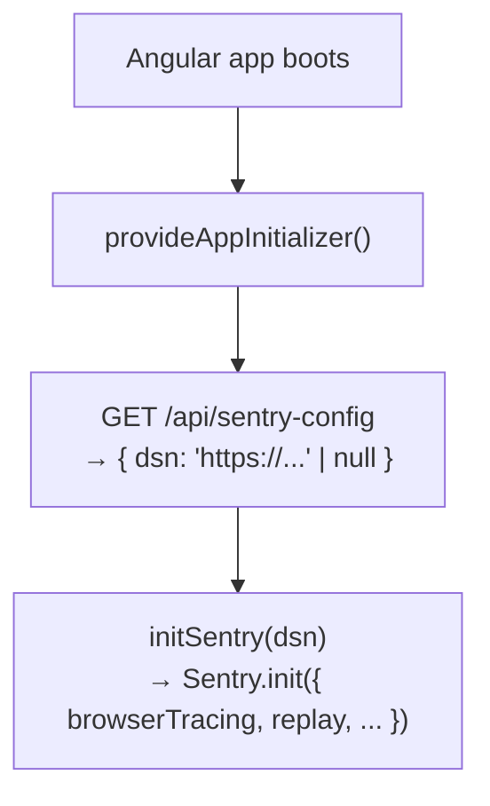

# Sentry Integration

`adblock-compiler` integrates [Sentry for Cloudflare Workers](https://docs.sentry.io/platforms/javascript/guides/cloudflare/) (`@sentry/cloudflare`) for automatic error capture, performance tracing, and release tracking.

The integration is **additive and opt-in**: when `SENTRY_DSN` is absent the worker
runs identically to before — no SDK is imported and no events are captured.

---

## Table of contents

1. [Architecture overview](#1-architecture-overview)
2. [Prerequisites — create your Sentry project](#2-prerequisites--create-your-sentry-project)
3. [Install the SDK](#3-install-the-sdk)
4. [Environment variables and secrets](#4-environment-variables-and-secrets)
5. [Worker wrapper](#5-worker-wrapper)
6. [Tail Worker capture](#6-tail-worker-capture)
7. [Using `SentryDiagnosticsProvider`](#7-using-sentrydiagnosticsprovider)
8. [Verifying the integration](#8-verifying-the-integration)
9. [Troubleshooting](#9-troubleshooting)
10. [Frontend RUM](#10-frontend-rum)

---

## 1. Architecture overview



All three layers use the **same `SENTRY_DSN` secret** — set once via
`wrangler secret put SENTRY_DSN` and both the Worker and the Angular frontend
(via `/api/sentry-config`) pick it up automatically.

---

## 2. Prerequisites — create your Sentry project

> **Security notice**: The Sentry DSN is a sensitive credential. Never commit it
> to source control. Always store it as a Cloudflare Worker Secret
> (`wrangler secret put SENTRY_DSN`) or in your untracked `.env.local`.

1. Log in to [sentry.io](https://sentry.io).
2. Create a new project: **Projects → Create Project → JavaScript → Cloudflare Workers**.
3. Name it `adblock-compiler` (or match your `wrangler.toml` `name` field).
4. Copy the **DSN** from *Settings → Projects → adblock-compiler → Client Keys (DSN)*.

---

## 3. Install the SDK

The SDK is managed via the Deno import map — do **not** use `npm install`.

```bash
# From the repo root — already done; package is in deno.json imports map
deno install
```

The `deno.json` imports map already contains:
```json
"@sentry/cloudflare": "npm:@sentry/cloudflare@^10.43.0"
```

Run `deno install` after pulling to ensure `deno.lock` is up-to-date.

---

## 4. Environment variables and secrets

All Sentry configuration is stored as **Cloudflare Worker Secrets** — never in
`wrangler.toml [vars]` or source code.

### Required

| Secret | Description | How to get it |
|--------|-------------|---------------|
| `SENTRY_DSN` | Your project DSN | Sentry → Settings → Projects → Your Project → Client Keys |

### Optional — tune performance monitoring

| Variable | Default | Description |
|----------|---------|-------------|
| `COMPILER_VERSION` | `0.x.x` | Passed as the Sentry **release** tag (already set in CI) |

### Set secrets

```bash
# Main worker
wrangler secret put SENTRY_DSN
# Paste: https://<key>@oNNNNNN.ingest.sentry.io/<project-id>

# Tail worker (if deploying separately)
wrangler secret put SENTRY_DSN --config wrangler.tail.toml
```

### Local `.env.local`

Add to your `.env.local` (never commit a real DSN):

```dotenv
# Error Reporting — Sentry
# Sentry DSN (required when ERROR_REPORTER_TYPE=sentry)
SENTRY_DSN=https://your-key@oNNNNNN.ingest.sentry.io/your-project-id
```

---

## 5. Worker wrapper

`worker/services/sentry-init.ts` exports `withSentryWorker()`. The wrapper is
**already active** — `worker/worker.ts` exports the handler through it:

```typescript
import { withSentryWorker } from './services/sentry-init.ts';

export default withSentryWorker(workerHandler, (env) => ({
    dsn: env.SENTRY_DSN,
    release: env.SENTRY_RELEASE ?? env.COMPILER_VERSION,
}));
```

When `SENTRY_DSN` is **absent** the wrapper is a minimal-overhead pass-through — the
Sentry SDK is not imported and no events are captured. To enable error capture,
set the secret (see [§4](#4-environment-variables-and-secrets)).

> **`tracesSampleRate`** — `withSentryWorker()` applies a default sample rate. Override
> it in the config callback (e.g. `tracesSampleRate: 0.1`) to stay within Sentry's
> free quota in production; use `1.0` in staging.

---

## 6. Tail Worker capture

The tail worker (`worker/tail.ts`) automatically forwards unhandled Worker
exceptions to Sentry when `SENTRY_DSN` is set. The integration is already
wired — no code changes are needed.

**How it works:**

1. On each tail event batch, if `SENTRY_DSN` is present in `TailEnv`, the
   Sentry SDK is dynamically imported and initialised (`tracesSampleRate: 0`
   — no transactions, only exceptions).
2. Each exception in `event.exceptions` is forwarded to Sentry via
   `sentry.captureException()` inside `sentry.withScope()`, with contextual
   tags (`outcome`, `scriptName`, `url`, `method`).
3. Before the event loop closes, `sentry.flush(2000)` is awaited via
   `ctx.waitUntil()` to ensure buffered events are sent.
4. Any Sentry failure is caught silently — the tail worker continues regardless.

**Setup** — set the secret for the tail worker deployment:

```bash
wrangler secret put SENTRY_DSN --config wrangler.tail.toml
# Use the same DSN as the main worker
```

> **Why a separate secret?** The tail worker is a separate Cloudflare deployment
> (see `wrangler.tail.toml`) and has its own binding scope. Even though both
> workers share the same DSN value, secrets must be set independently.

---

## 7. Using `SentryDiagnosticsProvider` and the provider factory

### Quickstart — use the factory (recommended)

`worker/services/diagnostics-factory.ts` exports `createDiagnosticsProvider(env)`,
which reads `SENTRY_DSN` and `OTEL_EXPORTER_OTLP_ENDPOINT` from `Env` and
returns the right provider (or a composite of both) with zero boilerplate:

```typescript
import { createDiagnosticsProvider } from './services/diagnostics-factory.ts';

export default {
    async fetch(request, env, ctx) {
        const diagnostics = createDiagnosticsProvider(env);
        const span = diagnostics.startSpan('compile');
        try {
            // ... business logic ...
            span.end();
        } catch (err) {
            span.recordException(err as Error);
            diagnostics.captureError(err as Error, { url: request.url });
            throw err;
        }
    },
};
```

| Env variables set | Provider returned |
|-------------------|--------------------|
| Neither | `ConsoleDiagnosticsProvider` (structured JSON to Workers Logs) |
| `SENTRY_DSN` only | `SentryDiagnosticsProvider` |
| `OTEL_EXPORTER_OTLP_ENDPOINT` only | `OpenTelemetryDiagnosticsProvider` |
| Both | `CompositeDiagnosticsProvider([Sentry, OTel])` — both receive every event |

### Extending with extra providers

Pass additional providers as the second argument:

```typescript
import { createDiagnosticsProvider } from './services/diagnostics-factory.ts';
import { MyCustomSink } from './my-custom-sink.ts';

const diagnostics = createDiagnosticsProvider(env, [new MyCustomSink()]);
```

### Using `CompositeDiagnosticsProvider` directly

If you need full control, compose providers manually:

```typescript
import { CompositeDiagnosticsProvider, SentryDiagnosticsProvider } from '../src/diagnostics/index.ts';
import { OpenTelemetryDiagnosticsProvider } from '../src/diagnostics/index.ts';

const diagnostics = new CompositeDiagnosticsProvider([
    new SentryDiagnosticsProvider({ dsn: env.SENTRY_DSN }),
    new OpenTelemetryDiagnosticsProvider({ serviceName: 'adblock-compiler' }),
]);
```

### Manual provider selection (advanced)

```typescript
import { SentryDiagnosticsProvider } from '../diagnostics/index.ts';

const diagnostics = env.SENTRY_DSN
    ? new SentryDiagnosticsProvider({
        dsn: env.SENTRY_DSN,
        release: env.COMPILER_VERSION,
        environment: 'production',
        tracesSampleRate: 0.1,
    })
    : new ConsoleDiagnosticsProvider();

// Capture an error
try {
    // ... risky operation
} catch (err) {
    diagnostics.captureError(err as Error, { operation: 'compileFilterList' });
    throw err;
}

// Start a span
const span = diagnostics.startSpan('compile', { ruleCount: 5000 });
try {
    // ... timed operation
} finally {
    span.end();
}
```

---

## 8. Verifying the integration

### Trigger a test error

```bash
# POST a deliberately malformed rule — will be caught and reported
curl -X POST https://adblock-compiler.your-domain.workers.dev/compile \
  -H "Content-Type: application/json" \
  -d '{"__sentry_test": true}'
```

### Check Sentry

1. Open **Sentry → Issues** — the error should appear within ~30 s.
2. Open **Sentry → Performance** — traces will appear once `tracesSampleRate > 0`.

### Local smoke test (no Sentry account needed)

```bash
# When SENTRY_DSN is absent the worker runs identically
wrangler dev
```

---

## 9. Troubleshooting

| Symptom | Likely cause | Fix |
|---------|-------------|-----|
| Build fails: `Could not resolve "@sentry/cloudflare"` | SDK not in deno.lock | Run `deno install` from repo root |
| No events in Sentry | `SENTRY_DSN` secret not set | `wrangler secret put SENTRY_DSN` |
| Quota exceeded | `tracesSampleRate` too high | Lower to `0.05` or `0.01` in production |
| SDK version conflicts | `@sentry/cloudflare` incompatibility | Check `deno.lock`; pin to a tested version in `deno.json` imports |
| Worker size exceeds 1 MB | Sentry SDK is large | Enable `--minify` in wrangler, or use `ConsoleDiagnosticsProvider` only |

### Relevant files

| File | Role |
|------|------|
| `worker/services/sentry-init.ts` | `withSentryWorker()` — wraps the main handler |
| `worker/handlers/sentry-config.ts` | `GET /api/sentry-config` — exposes public DSN to the frontend |
| `src/diagnostics/SentryDiagnosticsProvider.ts` | Fine-grained span / error capture |
| `src/diagnostics/IDiagnosticsProvider.ts` | `IDiagnosticsProvider` interface (NoOp + Console) |
| `worker/tail.ts` | Tail worker — Sentry fully wired: `captureException()` + `flush()` |
| `frontend/src/app/sentry.ts` | `initSentry()` — browser SDK init helper |
| `frontend/src/app/error/global-error-handler.ts` | Forwards Angular errors to Sentry via `captureException` |
| `.github/workflows/sentry-sourcemaps.yml` | Source map upload CI workflow |
| `.env.example` | `SENTRY_DSN` stub (search `Error Reporting`) |

---

## 10. Frontend RUM

The Angular admin UI ships with **Sentry Browser SDK** (`@sentry/angular` v9)
for real-user monitoring — unhandled JS errors, browser performance tracing,
and session replay.

### Quick start — enable RUM in 3 steps

**Step 1 — Create a Sentry project (or reuse the existing one)**

If you already have a Sentry project from §2, skip this step.
If not, create one at [sentry.io](https://sentry.io): **Projects → Create Project → JavaScript → Browser**.

**Step 2 — Set the `SENTRY_DSN` Worker secret**

```bash
# This single secret enables BOTH the Worker backend Sentry capture (§5)
# AND the Angular frontend RUM — they share the same DSN.
wrangler secret put SENTRY_DSN
# Paste your DSN, e.g.: https://abc123@o999.ingest.sentry.io/12345
```

After deploying the Worker, the Angular app fetches the DSN from
`GET /api/sentry-config` at boot and initialises Sentry automatically.
No rebuild is required — the same artifact works in any environment.

**Step 3 — (Optional) Enable source map uploads for readable stack traces**

```bash
# GitHub Actions secrets and variables — needed for .github/workflows/sentry-sourcemaps.yml
gh secret set SENTRY_AUTH_TOKEN        # from Sentry → Settings → Auth Tokens
gh variable set SENTRY_ORG --body "your-sentry-org-slug"
gh variable set SENTRY_PROJECT --body "adblock-compiler"
```

The workflow runs automatically on every push to `main` and on `v*` release tags.
It skips silently if `SENTRY_ORG` is not set, so it is safe to skip this step initially.

### How RUM is initialised

The DSN is fetched at **runtime** from `/api/sentry-config` (the Worker
exposes it from the `SENTRY_DSN` Worker Secret). It is never baked into the
build artifact, which means the same build artifact can run in any environment.

> **ZTA note:** `/api/sentry-config` (and all other pre-auth config endpoints) is protected by
> anonymous-tier rate limiting via `checkRateLimitTiered` in `worker/handlers/router.ts`, even
> though it requires no authentication. This prevents scraping or DoS of the config endpoint.
> The DSN itself is intentionally public (Sentry uses it in every browser request), but the
> endpoint still enforces rate limits. See `worker/utils/cors.ts` for the CORS policy.



If the endpoint is unreachable or `SENTRY_DSN` is unset, `initSentry()` is a
no-op and the app boots normally.

### All required secrets and variables

| Name | Where | Description |
|------|-------|-------------|
| `SENTRY_DSN` | Cloudflare Worker Secret | Public DSN — safe to send to the browser |
| `SENTRY_RELEASE` | Cloudflare Worker var (deploy-time) | Git SHA — links events to uploaded source maps |
| `SENTRY_AUTH_TOKEN` | GitHub secret | CI-only — used by `@sentry/cli` to upload source maps |
| `SENTRY_ORG` | GitHub variable (`vars.`) | Your Sentry organisation slug |
| `SENTRY_PROJECT` | GitHub variable (`vars.`) | Your Sentry project slug |

> **Source map association**: `SENTRY_RELEASE` must match the `--release` value used by the
> `sentry-sourcemaps.yml` CI workflow (which uses `${{ github.sha }}`). Set it at deploy time:
>
> ```bash
> wrangler deploy --var SENTRY_RELEASE:$(git rev-parse HEAD)
> ```
>
> Without a matching `release`, Sentry will capture errors correctly but stack traces will
> remain minified. The `SENTRY_DSN` alone is sufficient for error capture.

### Session Replay

`replayIntegration()` is enabled with conservative sampling:

| Setting | Value | Meaning |
|---------|-------|---------|
| `replaysSessionSampleRate` | `0.05` | Replay 5 % of all sessions |
| `replaysOnErrorSampleRate` | `1.0` | Always replay sessions that contain an error |

> **Privacy / GDPR**: Session replay captures user interactions including form
> inputs, clicks, and navigation events. **Sensitive fields (passwords, credit
> cards, PII) are masked by default**, but you should review what is captured
> for your specific use case. Sentry provides `maskAllText: true` and
> `blockAllMedia: true` replay options, plus a
> [data scrubbing](https://docs.sentry.io/security-legal-pii/scrubbing/) pipeline
> for server-side filtering. Review and enable these before enabling session
> replay in EU or privacy-sensitive production environments.

### Source map upload workflow

`.github/workflows/sentry-sourcemaps.yml` runs on every push to `main` and
on `v*` release tags. It builds the Angular app with source maps enabled and
uploads them to Sentry so that minified stack traces are readable. The upload
uses `--release "${{ github.sha }}"` to associate source maps with the exact
commit SHA deployed, enabling accurate stack trace de-minification.

The workflow skips silently if `SENTRY_ORG` is not configured (via the `if:`
condition), so it is safe to merge before Sentry is set up.

### Verifying RUM

1. Open **Sentry → Issues** — unhandled Angular errors appear within ~30 s.
2. Open **Sentry → Performance** — browser page-load and navigation spans
   appear when `tracesSampleRate > 0`.
3. Open **Sentry → Replays** — session recordings appear based on the
   sample rates configured in `frontend/src/app/sentry.ts`.

### RUM Troubleshooting

| Symptom | Likely cause | Fix |
|---------|-------------|-----|
| No RUM events in Sentry | `SENTRY_DSN` not set or `/api/sentry-config` unreachable | Check `wrangler secret put SENTRY_DSN`; verify the Worker is deployed |
| Browser console: `TypeError: Sentry is not a function` | `@sentry/angular` not installed | Run `pnpm install` from the repo root |
| No replays visible | `replaysSessionSampleRate` too low or DSN wrong | Verify DSN in the Network tab (GET `/api/sentry-config` should return a non-null DSN) |
| Source maps not resolving | `SENTRY_AUTH_TOKEN` / `SENTRY_ORG` / `SENTRY_PROJECT` not configured | Set all three in GitHub secrets/vars and re-run the `sentry-sourcemaps.yml` workflow |
