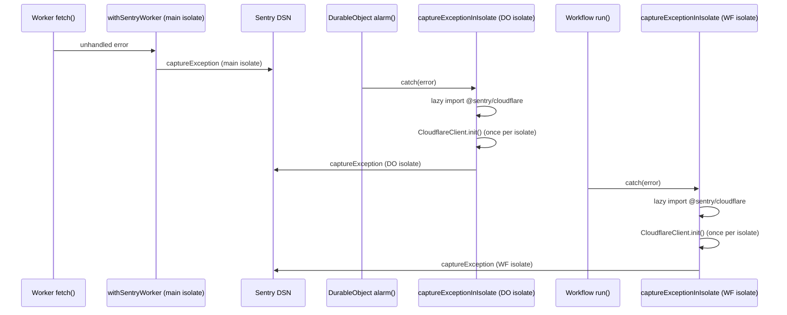

# Sentry — Durable Objects & Workflows

This document explains why Durable Objects and Cloudflare Workflows require their own Sentry initialisation, how `captureExceptionInIsolate` works, and how to configure it.

---

## Why isolate-local initialisation is required

Every Durable Object class instance and every Cloudflare Workflow run executes inside its own **V8 isolate** — a fully independent JavaScript runtime, separate from the main Worker fetch handler.

The main Worker wraps its `fetch`, `queue`, and `scheduled` entry points with `withSentryWorker` (in `worker/services/sentry-init.ts`). That wrapper lazily imports `@sentry/cloudflare` and uses `Sentry.withSentry(() => config, handler)` to configure Sentry handling for the **main isolate**.

A Durable Object's `alarm()`, `fetch()`, or `webSocketMessage()` handler — and a Workflow's `run()` — execute in a *different* isolate. They never share module scope with the main Worker, so `withSentryWorker`'s Sentry client is invisible to them. Any unhandled exception thrown inside a DO or Workflow is **silently dropped** by the Sentry SDK unless the DO/Workflow explicitly initialises its own client.

`worker/services/sentry-isolate-init.ts` solves this with `captureExceptionInIsolate(env, error)`.

---

## Architecture



---

## How `captureExceptionInIsolate` works

**File:** `worker/services/sentry-isolate-init.ts`

### Step-by-step

1. **Guard on `SENTRY_DSN`** — if the binding is absent, return immediately. Zero overhead.
2. **Lazy import** — `@sentry/cloudflare` is dynamically imported using `import()` on the first call. The in-flight `Promise` is cached in the module-level `sentryModulePromise` variable so concurrent calls within the same isolate do not race.
3. **Import failure** — if `import()` rejects, the promise cache is cleared (`sentryModulePromise = null`) so the *next* invocation can retry rather than permanently silencing Sentry.
4. **Init-once guard** — `Sentry.isInitialized()` is checked before constructing the `CloudflareClient`. The client is only created once per isolate lifetime.
5. **Client construction** — `@sentry/cloudflare` does not export `init()` from its main package index. Instead, `CloudflareClient` is constructed directly with `dsn`, `release`, `environment`, `tracesSampleRate`, and a minimal `fetch`-based transport, then wired up via `Sentry.setCurrentClient(client)` + `client.init()`.
6. **Capture** — `Sentry.captureException(error)` is called with the caught error.

### Call signature

```typescript
import { captureExceptionInIsolate } from './services/sentry-isolate-init.ts';

// In a Durable Object alarm/fetch/message handler:
try {
    await doSomething();
} catch (error) {
    await captureExceptionInIsolate(this.env as Env, error);
    throw error; // re-throw if you want the error to propagate
}

// In a Workflow run():
try {
    await step.do('my-step', async () => { ... });
} catch (error) {
    await captureExceptionInIsolate(this.env as Env, error);
}
```

### Where it is called

| File | Location | Notes |
|------|----------|-------|
| `worker/rate-limiter-do.ts` | `alarm()` catch block | Top-level catch around all alarm work |
| `worker/compilation-coordinator.ts` | `alarm()` / `fetch()` catch | Coordinator error capture |
| `worker/ws-hibernation-do.ts` | `webSocketError()` | Via `state.waitUntil` (see below) |
| `worker/workflows/CompilationWorkflow.ts` | `run()` catch | Outer try/catch wrapping all steps |
| `worker/workflows/BatchCompilationWorkflow.ts` | `run()` catch | Outer try/catch wrapping all steps |
| `worker/workflows/CacheWarmingWorkflow.ts` | `run()` catch | Outer try/catch wrapping all steps |
| `worker/workflows/HealthMonitoringWorkflow.ts` | `run()` catch | Outer try/catch wrapping all steps |

### `state.waitUntil` in `WsHibernationDO.webSocketError`

```typescript
async webSocketError(ws: WebSocket, error: unknown): Promise<void> {
    this.state.waitUntil(captureExceptionInIsolate(this.env as Env, error));
    // WebSocket teardown continues immediately — not blocked on Sentry import
}
```

`webSocketError` is called synchronously during WebSocket teardown. Awaiting `captureExceptionInIsolate` would block teardown until the Sentry SDK has been imported and the event sent — adding latency to client disconnects. Using `this.state.waitUntil` schedules the Sentry flush as a background task: teardown proceeds immediately while Sentry runs asynchronously after the handler returns.

---

## Configuration

### Required: `SENTRY_DSN`

Set `SENTRY_DSN` as a **Worker Secret** (never in `wrangler.toml [vars]`):

```bash
wrangler secret put SENTRY_DSN
# Paste the DSN from your Sentry project → Settings → Client Keys
```

When `SENTRY_DSN` is absent, `captureExceptionInIsolate` is a no-op — no SDK import, zero overhead.

### Optional: `SENTRY_RELEASE` and `ENVIRONMENT`

```toml
# wrangler.toml [vars] — non-secret
[vars]
ENVIRONMENT = "production"
# SENTRY_RELEASE is typically injected at deploy time as a secret or build var:
#   wrangler secret put SENTRY_RELEASE  (value: git SHA or semver)
```

Both fall back gracefully:
- `release` → `env.SENTRY_RELEASE ?? env.COMPILER_VERSION` (always has a value).
- `environment` → `env.ENVIRONMENT ?? 'production'`.

No other `wrangler.toml` changes are required — the bindings (`SENTRY_DSN`, `SENTRY_RELEASE`, `COMPILER_VERSION`, `ENVIRONMENT`) are already part of the Worker `Env` type in `worker/types.ts`.

---

## Retry behaviour on import failure

```
First call → import('@sentry/cloudflare') → rejects
             → sentryModulePromise = null   ← cache cleared
             → captureExceptionInIsolate returns (no-op)

Second call → import('@sentry/cloudflare') → retried fresh
```

The promise cache is cleared on import failure, so a transient module load error does not permanently silence Sentry for the lifetime of the isolate.

---

## Zero Trust notes

- `SENTRY_DSN` is a **Worker Secret only** — never committed to source or placed in `wrangler.toml [vars]`.
- `captureExceptionInIsolate` forwards only `Error` objects (or whatever was thrown) to Sentry. No request bodies, user PII, or secrets are included unless explicitly added via `Sentry.setContext()` (which is not done in this integration).
- Sentry events leave the Cloudflare network; do not include sensitive data in error messages.

---

## See also

- [`worker/services/sentry-isolate-init.ts`](../../worker/services/sentry-isolate-init.ts) — implementation
- [`docs/observability/SENTRY.md`](SENTRY.md) — main Worker Sentry setup
- [`docs/observability/SENTRY_BEST_PRACTICES.md`](SENTRY_BEST_PRACTICES.md) — best practices
