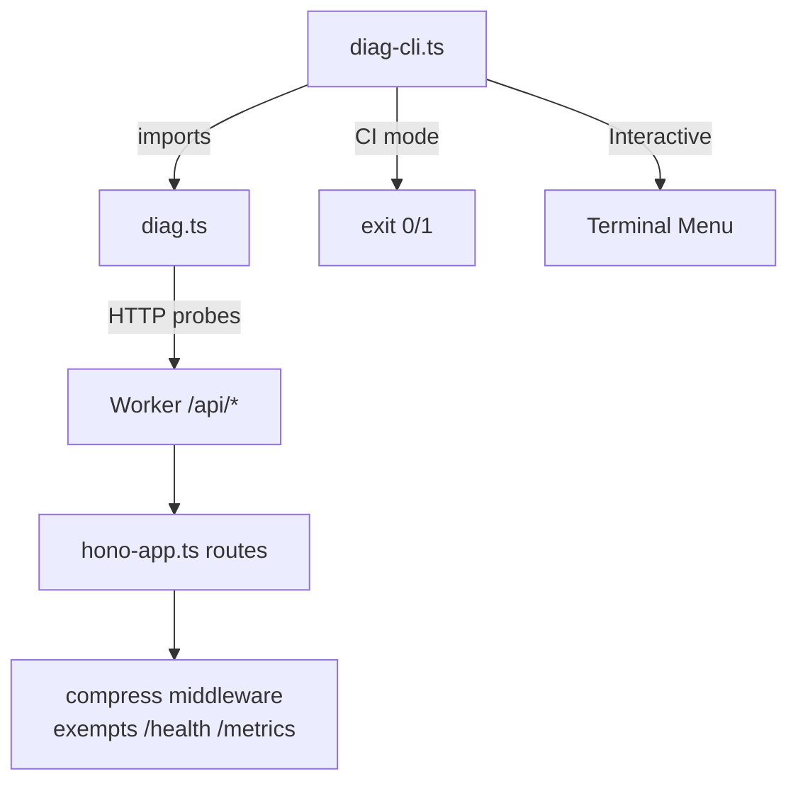

# Diagnostic System — Technical Reference

This document covers the architecture of the diagnostic tooling, the `compress()` middleware fix, and operational procedures for the adblock-compiler Cloudflare Worker.

## Table of Contents

1. [Architecture Overview](#architecture-overview)
2. [Probe Library: `scripts/diag.ts`](#probe-library-scriptsdiagts)
3. [CLI Harness: `scripts/diag-cli.ts`](#cli-harness-scriptsdiag-clits)
4. [Running Locally and in CI](#running-locally-and-in-ci)
5. [The `compress()` Middleware Bug and Fix](#the-compress-middleware-bug-and-fix)
6. [Why Brotli Is Not Supported in Cloudflare Workers](#why-brotli-is-not-supported-in-cloudflare-workers)
7. [The `waitUntil()` Hang Pattern](#the-waituntil-hang-pattern)
8. [`wrangler tail` Log Patterns](#wrangler-tail-log-patterns)
9. [Troubleshooting Manual](#troubleshooting-manual)

---

## Architecture Overview



The diagnostic system has two layers:

- **`scripts/diag.ts`** — pure library, no TTY, no `Deno.stdin`. Each probe function returns a `DiagResult` and never throws.
- **`scripts/diag-cli.ts`** — CLI harness that uses `diag.ts`. Supports interactive menu mode (TTY) and `--ci` mode (non-interactive, exit code 0/1).

---

## Probe Library: `scripts/diag.ts`

### `DiagResult` interface

```typescript
export interface DiagResult {
    ok: boolean;
    label: string;
    detail?: string;
    latency_ms?: number;
    raw?: unknown;
}
```

### Probes

| Probe | Endpoint | What it checks |
|---|---|---|
| `probeHealth` | `GET /api/health` | HTTP 200, valid JSON, `services.database.status` ≠ `down`, no gzip corruption |
| `probeDbSmoke` | `GET /api/health/db-smoke` | HTTP 200, valid JSON `{ ok: true }`, `db_name === 'adblock-compiler'`, latency reported |
| `probeMetrics` | `GET /api/metrics` | HTTP 200, valid JSON, response time < 5s |
| `probeAuthProviders` | `GET /api/auth/providers` | HTTP 200, valid JSON, completes without Worker-hang |
| `probeCompileSmoke` | `POST /api/compile` | Posts a minimal compile payload, expects 200 or 422 (not 5xx/hang) |
| `probeResponseEncoding` | `GET /api/health` with `Accept-Encoding: identity` | Detects if body starts with gzip magic bytes `\x1f\x8b` |

### Key design decisions

- **Every probe uses `AbortController` with a timeout** — no probe can hang indefinitely.
- **`probeResponseEncoding` reads as `ArrayBuffer`** and inspects the first two bytes for gzip magic (`0x1f 0x8b`). This is the most reliable way to detect the `compress()` bug because `Content-Encoding` headers can be stripped by Cloudflare's edge before they reach the observing client.
- **No TTY dependency** — `diag.ts` can be imported in CI workers, GitHub Actions steps, and other non-interactive environments.

---

## CLI Harness: `scripts/diag-cli.ts`

### Flags

| Flag | Default | Description |
|---|---|---|
| `--url` | `https://adblock-frontend.jayson-knight.workers.dev` | Base URL to probe |
| `--probe` | `all` | Comma-separated probe names, or `all` |
| `--timeout` | `15000` | Per-probe timeout in milliseconds |
| `--ci` | `false` | Non-interactive CI mode |
| `--help` | — | Print usage and exit |

### Interactive mode

```
📋 adblock-compiler diagnostic CLI
   URL: https://adblock-frontend.jayson-knight.workers.dev

Select a probe to run:
  1. probeHealth
  2. probeDbSmoke
  3. probeMetrics
  4. probeAuthProviders
  5. probeCompileSmoke
  6. probeResponseEncoding
  7. Run all
  8. Exit

Enter number:
```

After each run, a results table is printed and the menu loops.

### CI mode output

```
┌───────────────────────────┬──────────┬────────────┬───────────────────────────────────────────────┐
│ Probe                     │ Status   │ Latency    │ Detail                                        │
├───────────────────────────┼──────────┼────────────┼───────────────────────────────────────────────┤
│ probeHealth               │  ✅      │  342ms     │ status=healthy db=adblock-compiler            │
│ probeResponseEncoding     │  ❌      │  198ms     │ GZIP corruption detected!                     │
└───────────────────────────┴──────────┴────────────┴───────────────────────────────────────────────┘

❌ 1 probe(s) failed:
   • probeResponseEncoding: GZIP corruption detected! ...
```

Exit code is `0` if all probes pass, `1` if any fail.

---

## Running Locally and in CI

### Local (interactive)

```bash
deno task diag
```

### Local (target production)

```bash
deno task diag:prod
```

### Local (specific probes)

```bash
deno run --allow-net --allow-env scripts/diag-cli.ts \
  --probe probeHealth,probeResponseEncoding \
  --url https://adblock-frontend.jayson-knight.workers.dev
```

### CI mode (all probes, exit 0/1)

```bash
deno task diag:ci
```

### Target a staging environment

```bash
deno run --allow-net --allow-env scripts/diag-cli.ts \
  --ci \
  --url https://adblock-compiler-staging.jayson-knight.workers.dev
```

---

## The `compress()` Middleware Bug and Fix

### Root cause

In `worker/hono-app.ts`, the business routes sub-app applied `compress()` globally:

```typescript
routes.use('*', compress());
```

Hono's `compress()` middleware inspects the `Accept-Encoding` request header to decide whether to compress. However, **Cloudflare's edge layer can strip or re-encode `Accept-Encoding` before the request reaches the Worker**. This means diagnostic endpoints like `/api/health` can receive compressed responses even when `curl` sends `Accept-Encoding: identity`.

The result:
- `curl /api/health | jq` fails with `Invalid numeric literal` because `jq` is parsing gzip binary bytes as JSON text.
- `GET /api/health/db-smoke` can return an empty body (Worker hang + compressed empty response).

### The fix

The single `routes.use('*', compress())` line is replaced with a path-aware middleware that skips compression for health/diagnostic endpoints:

```typescript
const NO_COMPRESS_PATHS = new Set(['/health', '/health/db-smoke', '/health/latest', '/metrics']);
routes.use('*', async (c, next) => {
    const path = routesPath(c);
    if (NO_COMPRESS_PATHS.has(path)) {
        await next();
        return;
    }
    return compress()(c, next);
});
```

**Why these paths?**
- `/health`, `/health/db-smoke`, `/health/latest` — diagnostic endpoints consumed by `curl | jq`, CI smoke tests, and automated monitoring.
- `/metrics` — Prometheus/monitoring scrapers typically do not negotiate `Accept-Encoding`.

All other business routes (compile, AST, etc.) continue to receive gzip/deflate compression for bandwidth savings.

---

## Why Brotli Is Not Supported in Cloudflare Workers

> **Note from prior PR review:** Brotli was previously flagged and removed.

Hono's `compress()` middleware only supports **gzip** and **deflate** in Cloudflare Workers. The reason:

- Brotli (`br`) compression requires native platform support. The Cloudflare Workers runtime (V8 isolate) does not expose the `CompressionStream` API with `brotlicompress` format.
- Only the `gzip` and `deflate` formats are available via `CompressionStream` in the Workers runtime.
- Attempting to use Brotli in a Worker will either silently fall back to gzip or throw a runtime error.

**Bandwidth impact:** Without Brotli, responses are ~15–25% larger compared to Brotli-compressed equivalents. However, **CPU savings are significant** — Brotli compression is 3–5× more expensive (CPU time) than gzip. Given Cloudflare Workers' CPU time constraints (50ms/request on the free plan), using gzip is the correct tradeoff.

---

## The `waitUntil()` Hang Pattern

### Symptom

```
(warn) waitUntil() tasks did not complete before the response was returned
```

This warning appears in `wrangler tail` when a `c.executionCtx.waitUntil(promise)` call registers a background task that does not resolve before the Worker's CPU time budget expires.

### Causes

1. **Database query hangs** — A Hyperdrive → Neon query is stalled (connection pool exhausted, Neon cold start, network issue).
2. **Analytics `waitUntil`** — The analytics tracking task in `trackApiUsage()` is waiting on a slow DB insert.
3. **Better Auth session fetch** — `/api/auth/*` routes can time out if the auth DB is unresponsive.

### Detection with `probeMetrics`

`probeMetrics` fails if `/api/metrics` takes > 5s to respond. If `waitUntil` tasks are blocking, the metrics endpoint response time will spike above this threshold.

### Remediation

1. Check Neon dashboard for connection pool exhaustion.
2. Review Hyperdrive configuration — ensure `max_cached_open_connections` is appropriate for your tier.
3. If `trackApiUsage()` is hanging, check the D1/KV write path for timeouts.

---

## `wrangler tail` Log Patterns

Run tail logs:

```bash
deno task wrangler:tail
```

### Log patterns to watch for

| Pattern | Meaning | Action |
|---|---|---|
| `waitUntil() tasks did not complete` | Background task (analytics, DB write) timed out | Check DB/KV connectivity |
| `SyntaxError: Unexpected end of JSON` | Worker returned empty or partial response body | Check for Worker hang before response |
| `Worker exceeded CPU time limit` | Handler is too slow | Profile with `wrangler tail --format=pretty` |
| `Error: AbortError` | Request was aborted (timeout) | Check `AbortController` timeout values |
| `better_auth_timeout` | Better Auth session fetch timed out | Check auth DB; see KB-005 |
| `api_disabled` | User's API access has been revoked | Check user tier in D1 |
| `rate_limit_exceeded` | Too many requests from IP | Check rate limit configuration |

---

## Troubleshooting Manual

For a quick-reference guide aimed at support engineers, see:

👉 [scripts/docs/troubleshooting-manual.md](../../scripts/docs/troubleshooting-manual.md)
