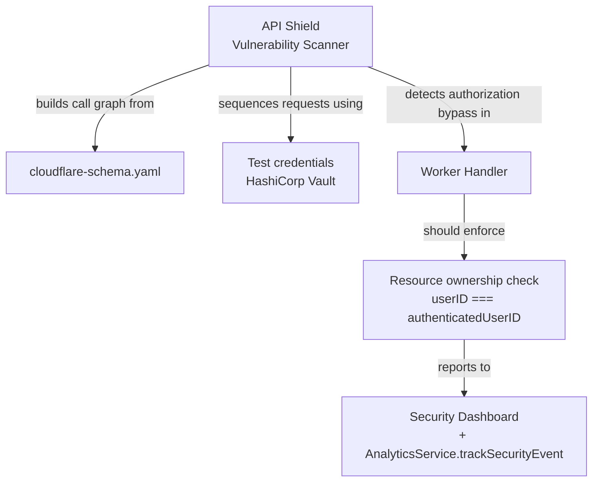
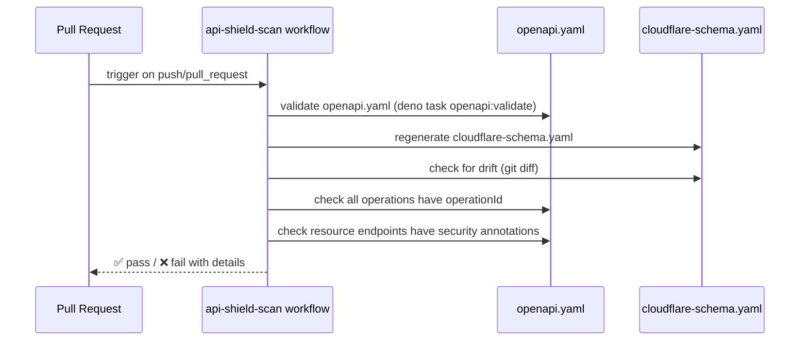
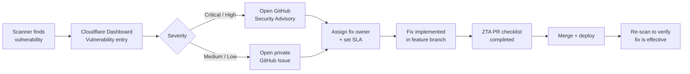

# Cloudflare API Shield Vulnerability Scanner

This document describes how Cloudflare's [Web and API Vulnerability Scanner](https://blog.cloudflare.com/vulnerability-scanner/) integrates with the adblock-compiler project and how its stateful, AI-driven approach strengthens the existing Zero Trust Architecture.

---

## Overview

Cloudflare's vulnerability scanner is a **stateful, AI-powered** security tool built into API Shield. Unlike traditional scanners that fire static test vectors at individual endpoints, it:

- **Builds an API call graph** from the uploaded OpenAPI spec (`docs/api/cloudflare-schema.yaml`)
- **Sequences requests** to simulate realistic attacker workflows (e.g., create a resource as user A → attempt to read/modify it as user B)
- **Detects logic flaws** that static analysis misses, especially **Broken Object Level Authorization (BOLA)** — the #1 OWASP API risk
- **Uses HashiCorp Vault** to protect test credentials during simulated attack flows

The scanner launches in beta targeting BOLA first, with OWASP Top 10 coverage (SQLi, XSS, etc.) planned for later releases.

---

## Why This Matters for adblock-compiler

The adblock-compiler API exposes user-scoped resources that are prime BOLA candidates:

| Resource | Endpoint | BOLA Risk |
|----------|----------|-----------|
| API keys | `GET/DELETE /api/user/api-keys/{id}` | User A reads/deletes user B's key |
| Queue jobs | `GET /api/queue/{id}` | User A reads user B's compilation job |
| Workflow runs | `GET /api/workflow/{id}` | User A reads user B's workflow state |
| Saved configurations | `GET/PUT/DELETE /api/configuration/{id}` | User A modifies user B's config |
| Compilation history | `GET /api/admin/deployments` | IDOR via deployment records |

Each of these endpoints accepts an ID parameter. The scanner will attempt to access one user's resource ID using another user's credentials — exactly the class of bug the existing ZTA auth tier enforces against, but now testable automatically.

---

## Relationship to Existing ZTA

The adblock-compiler already defends against BOLA through its Zero Trust Architecture:

```
Request → Auth (Clerk JWT / API Key) → requireAuth() → checkRateLimitTiered() → Handler
```

The handler is responsible for scoping the query to the authenticated user's resources. The vulnerability scanner **verifies** that this scoping is correctly implemented — it doesn't replace ZTA, it validates it.



---

## Setup Guide

### Prerequisites

- API Shield enabled on the Cloudflare zone
- Cloudflare API Shield Vulnerability Scanner in beta access
- An up-to-date `docs/api/cloudflare-schema.yaml` (generated by `deno task schema:cloudflare`)

### Step 1 — Upload the Schema

```bash
# Regenerate the Cloudflare-compatible schema (strips localhost, x-* extensions)
deno task schema:cloudflare

# Verify the schema validates cleanly
deno task openapi:validate
```

Upload `docs/api/cloudflare-schema.yaml` to:

> **Cloudflare Dashboard → Security → API Shield → Schema Validation → Add Schema**

Ensure the **Mitigation action** is set to `Block` for schema violations.

### Step 2 — Enable the Vulnerability Scanner

> **Cloudflare Dashboard → Security → API Shield → Vulnerability Scanner**

Configure scanner credentials for the scanner to use when authenticating requests:

| Credential type | Value source | Where to configure |
|---|---|---|
| Clerk JWT (Free tier) | Test user's Clerk session | Vault → `cf/vuln-scanner/clerk-jwt-free` |
| Clerk JWT (Pro tier) | Test user's Clerk session | Vault → `cf/vuln-scanner/clerk-jwt-pro` |
| API key | `abc_...` key from test account | Vault → `cf/vuln-scanner/api-key` |
| Admin key | `X-Admin-Key` value | Vault → `cf/vuln-scanner/admin-key` |

> ⚠️ **Never use production credentials for scanning.** Create dedicated test accounts for each tier.

### Step 3 — Configure Scan Scope

Limit the scanner to endpoints that handle user-scoped resources to maximise BOLA signal:

| Priority | Endpoints | Reason |
|----------|-----------|--------|
| **High** | `/api/user/api-keys`, `/api/queue/*`, `/api/workflow/*` | User-owned resources with IDs |
| **Medium** | `/api/configuration/*`, `/api/admin/deployments` | Configuration and history |
| **Low** | `/compile`, `/compile/stream`, `/compile/batch` | Stateless — less BOLA risk |

### Step 4 — Review Findings

Scan results appear in:
- **Cloudflare Dashboard → Security → API Shield → Vulnerabilities**
- **Cloudflare Analytics Engine** (if scanner emits events — check dashboard)

For each finding, open a **GitHub Security Advisory** via the process described in [SECURITY.md](../../SECURITY.md).

---

## CI/CD Integration

The `.github/workflows/api-shield-scan.yml` workflow runs on every PR and push to `main` to ensure the OpenAPI spec remains API Shield-compatible:



### What the workflow checks

| Check | Why it matters |
|-------|---------------|
| All operations have `operationId` | Required for scanner to reference operations in call graphs |
| Resource endpoints annotated with `security:` | Scanner needs to know which auth scheme to use |
| `cloudflare-schema.yaml` is up to date | Stale schema → scanner tests wrong surface |
| OpenAPI spec validates cleanly | Malformed spec → scanner cannot parse call graph |

---

## BOLA Prevention Patterns

Every resource-scoped endpoint in the Worker must scope its database query to the authenticated user. Pattern to follow:

```typescript
// ✅ Correct — query scoped to authenticated user
const row = await env.DB
    .prepare('SELECT * FROM api_keys WHERE user_id = ? AND id = ?')
    .bind(authContext.userId, keyId)
    .first();

if (!row) {
    // Return 404 (not 403) — avoid leaking resource existence
    return Response.json({ error: 'Not found' }, { status: 404 });
}

// ❌ Wrong — unscoped lookup leaks cross-user access
const row = await env.DB
    .prepare('SELECT * FROM api_keys WHERE id = ?')
    .bind(keyId)
    .first();
```

> **Return 404, not 403, for missing/unauthorized resources.** Returning 403 when a resource exists (but belongs to another user) leaks resource existence — a pattern the scanner will flag.

### Verified BOLA-safe endpoints

The following endpoints have been reviewed and confirmed to scope queries to `authContext.userId`:

- `GET /api/user/api-keys` — scoped via `WHERE user_id = ?`
- `DELETE /api/user/api-keys/{id}` — scoped via `WHERE user_id = ? AND id = ?`
- `PATCH /api/user/api-keys/{id}` — scoped via `WHERE user_id = ? AND id = ?`

> When the scanner is activated, any endpoint not listed here should be reviewed before the first scan run.

---

## Vulnerability Reporting Workflow

When the scanner (or any researcher) discovers a vulnerability:



### SLA by severity

| CVSS Score | Severity | Target fix time |
|---|---|---|
| 9.0–10.0 | Critical | 24 hours |
| 7.0–8.9 | High | 72 hours |
| 4.0–6.9 | Medium | 1 week |
| 0.1–3.9 | Low | Next sprint |

### Reporting via GitHub Security Advisories

```
Repository → Security tab → Advisories → New draft advisory
```

Include:
- CVSS score estimate
- Affected endpoints (operationId list)
- Steps to reproduce (curl commands or Postman collection)
- Suggested fix

---

## OpenAPI Extensions for Scanner Hints

The Cloudflare scanner can use OpenAPI extension fields to improve call graph quality. Add these to resource endpoints when available:

```yaml
# Example: Queue job endpoint with scanner hints
/api/queue/{jobId}:
    get:
        operationId: getQueueResults
        x-cf-resource-type: queue_job       # Resource type for BOLA grouping
        x-cf-owner-field: userId             # Field in response that identifies owner
        security:
            - ClerkJWT: []
            - UserApiKey: []
```

> These extensions are stripped by `deno task schema:cloudflare` before deployment. They exist solely for the scanner's static analysis phase.

---

## Related Documentation

- [Zero Trust Architecture](ZERO_TRUST_ARCHITECTURE.md) — existing ZTA implementation
- [ZTA Developer Guide](ZTA_DEVELOPER_GUIDE.md) — patterns for new endpoints
- [Security Policy](../../SECURITY.md) — vulnerability reporting process
- [API Shield Setup](../cloudflare/CLOUDFLARE_SERVICES.md#api-shield) — schema upload and validation
- [OpenAPI Tooling](../api/OPENAPI_TOOLING.md) — spec validation and generation
- [Cloudflare Blog: Vulnerability Scanner](https://blog.cloudflare.com/vulnerability-scanner/) — feature announcement
