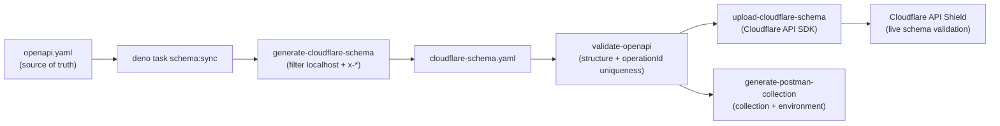

# Automated Web Asset Sync

This document describes how `cloudflare-schema.yaml` stays in sync with Cloudflare API Shield and why this process must run automatically any time `openapi.yaml` changes.

---

## Overview

`docs/api/cloudflare-schema.yaml` is the **source of truth** for Cloudflare API Shield Schema Validation. It is a filtered copy of `docs/api/openapi.yaml` with localhost servers and non-standard `x-*` extensions removed — exactly what Cloudflare's parser expects.

When `openapi.yaml` changes (a new route is added, a parameter is modified, a response schema is updated), three things must happen:

1. **Regenerate** `cloudflare-schema.yaml` from the updated `openapi.yaml`.
2. **Validate** the updated `openapi.yaml` for correctness.
3. **Upload** the new schema to Cloudflare API Shield so the live WAF reflects the current API shape.

Previously, only step 3 required a manual `deno task schema:upload`. There was no end-to-end task. The `schema:sync` task closes this gap.

---

## Pipeline diagram

---

## Tasks

| Task | Command | What it does |
|------|---------|-------------|
| `schema:sync` | `deno task schema:sync` | Full pipeline: generate → validate → upload → Postman |
| `schema:sync:dry` | `deno task schema:sync:dry` | Simulate all steps — no files written, no API calls |
| `schema:sync:local` | `deno task schema:sync:local` | Generate + validate + Postman only — no upload |

### When to run

- **After any change to `docs/api/openapi.yaml`** — run `deno task schema:sync` to push the change live.
- **Locally, without uploading** — run `deno task schema:sync:local` to regenerate `cloudflare-schema.yaml` and the Postman collection without touching the live API Shield schema.
- **Before a PR** — `deno task preflight` already checks for schema drift; running `schema:sync:local` first satisfies that check.

---

## Required environment variables (upload step only)

| Variable | Description | How to set |
|----------|-------------|-----------|
| `CLOUDFLARE_ZONE_ID` | 32-character hex zone ID from the Cloudflare dashboard | Shell env or CI secret |
| `CLOUDFLARE_API_SHIELD_TOKEN` | API token with **API Gateway: Edit** scope only | Shell env or CI secret |

> **Never reuse** `CLOUDFLARE_API_TOKEN` (the wrangler deploy token) for API Shield uploads — it has far broader permissions. Create a dedicated token scoped only to "API Gateway: Edit".

Both variables are Zod-validated before any API call. Missing or malformed values cause an immediate exit with a clear diagnostic.

---

## `--skip-if-unchanged` behaviour

By default `schema:sync` uses `--skip-if-unchanged`. The upload step:

1. Computes the SHA-256 of `cloudflare-schema.yaml`.
2. Lists all schemas currently registered in API Shield for the zone.
3. Compares the hash against each schema's `source` field.
4. If a match is found **and** `validation_enabled: true`, exits 0 without uploading.
5. If a match is found **but** `validation_enabled: false`, patches the existing schema to enable validation (no duplicate upload) and exits 0.
6. If no match is found, performs the full zero-downtime upsert: upload → enable validation → delete old schema.

Pass `--no-skip-if-unchanged` to force upload regardless of hash.

---

## Zero-downtime upsert sequence

When an upload is required, `sync-api-assets.ts` follows the same zero-downtime sequence as `upload-cloudflare-schema.ts`:

1. Upload the new schema → get its `schema_id`.
2. PATCH the new schema to enable validation.
3. DELETE the previously-active schema.

This ensures there is **no validation blackout** — API Shield always has exactly one active schema.

---

## Cloudflare API calls

All Cloudflare REST calls go through `CloudflareApiService` (`src/services/cloudflareApiService.ts`). No raw `fetch('https://api.cloudflare.com/...')` calls are made. The service wraps the official `cloudflare@^5.2.0` SDK and Zod-validates every response.

---

## See also

- [`scripts/sync-api-assets.ts`](../../scripts/sync-api-assets.ts) — the full pipeline script
- [`scripts/upload-cloudflare-schema.ts`](../../scripts/upload-cloudflare-schema.ts) — standalone upload script
- [`docs/api/OPENAPI_TOOLING.md`](../api/OPENAPI_TOOLING.md) — OpenAPI tooling overview
- [`docs/security/API_SHIELD_VULNERABILITY_SCANNER.md`](API_SHIELD_VULNERABILITY_SCANNER.md) — BOLA/vulnerability scanning
