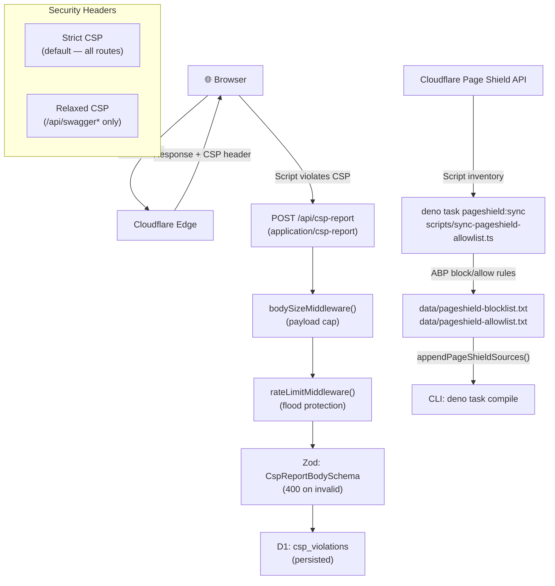
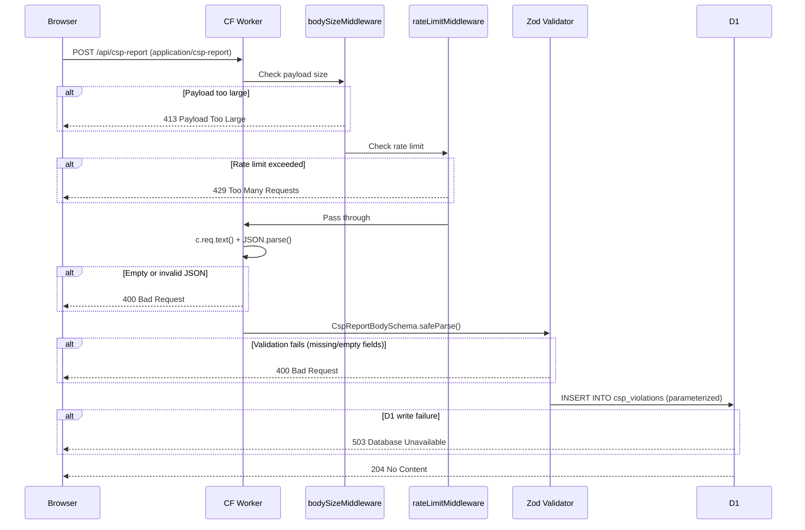

# Cloudflare Page Shield Integration

This document covers the complete Cloudflare Page Shield integration in bloqr-backend — from the Content Security Policy (CSP) header enforcement, to browser violation ingestion, to the Page Shield script-inventory sync that feeds the compiler's rule pipeline.

> **Security highlight:** This is a key differentiator. Every browser that loads your app is now a passive sensor that reports unauthorized script execution back to your D1 database, in real time, without any JavaScript instrumentation.

---

## Table of Contents

- [Overview](#overview)
- [Architecture](#architecture)
- [CSP Enforcement](#csp-enforcement)
  - [Strict vs. Swagger CSP](#strict-vs-swagger-csp)
  - [Extending the CSP](#extending-the-csp)
- [CSP Violation Reporting Endpoint](#csp-violation-reporting-endpoint)
  - [Endpoint specification](#endpoint-specification)
  - [Zod validation](#zod-validation)
  - [Database schema](#database-schema)
  - [Security posture](#security-posture)
- [Page Shield Script-Inventory Sync](#page-shield-script-inventory-sync)
  - [Shared ABP rule utilities](#shared-abp-rule-utilities)
  - [Deno sync script](#deno-sync-script)
  - [Worker cron stub](#worker-cron-stub)
  - [Compiler pipeline integration](#compiler-pipeline-integration)
- [Configuration](#configuration)
- [Extensibility](#extensibility)
- [Testing](#testing)
- [Marketing Blurb](#marketing-blurb)

---

## Overview

Cloudflare [Page Shield](https://developers.cloudflare.com/page-shield/) is a client-side security product that:

1. **Monitors** every third-party script loaded on your pages and scores each one for malicious behaviour.
2. **Enforces** a Content Security Policy so that only declared origins can execute scripts or load resources.
3. **Reports** violations back to a configurable endpoint (`report-uri`) so you can detect and triage policy breaches in real time.

The bloqr-backend integrates all three capabilities:

| Capability | Implementation |
|---|---|
| CSP enforcement | `worker/security-headers.ts` — `contentSecurityPolicyMiddleware()` |
| Violation ingestion | `worker/routes/csp-report.routes.ts` — `POST /api/csp-report` |
| Script-inventory sync → ABP rules | `scripts/sync-pageshield-allowlist.ts` + `worker/handlers/scheduled.ts` (stub) |
| Shared rule utilities | `src/utils/pageshield-rules.ts` |
| Compiler pipeline | `src/cli/CliApp.deno.ts` — `appendPageShieldSources()` |

---

## Architecture



---

## CSP Enforcement

**File:** `worker/security-headers.ts`

The `contentSecurityPolicyMiddleware()` Hono middleware runs **after** `secureHeaders()` in the global middleware chain and sets three security headers on every outgoing response:

| Header | Value |
|---|---|
| `Content-Security-Policy` | Path-dependent (see below) |
| `X-Content-Type-Options` | `nosniff` |
| `X-Frame-Options` | `DENY` |

### Strict vs. Swagger CSP

Two CSP strings are pre-built once per isolate lifetime (avoiding per-request string construction overhead):

| Variant | Applied to | Key differences |
|---|---|---|
| `CSP_STRICT` | All routes by default | No `'unsafe-inline'`; no `cdn.jsdelivr.net` |
| `CSP_SWAGGER` | `/api/swagger*` paths only | `'unsafe-inline'` in `script-src` + `style-src`; `cdn.jsdelivr.net` in `script-src` + `style-src` |

**Strict CSP directives:**

```
default-src 'self';
script-src 'self' https://challenges.cloudflare.com https://static.cloudflareinsights.com;
connect-src 'self' https://cloudflareinsights.com https://*.ingest.sentry.io;
style-src 'self';
img-src 'self' data: https:;
font-src 'self' data:;
object-src 'none';
base-uri 'self';
form-action 'self';
frame-src https://challenges.cloudflare.com;
frame-ancestors 'none';
upgrade-insecure-requests;
report-uri /api/csp-report
```

Why each origin is allowed:

| Origin | Directive | Reason |
|---|---|---|
| `challenges.cloudflare.com` | `script-src`, `frame-src` | Cloudflare Turnstile human verification |
| `static.cloudflareinsights.com` | `script-src` | Cloudflare Web Analytics beacon |
| `cloudflareinsights.com` | `connect-src` | Analytics data submission |
| `*.ingest.sentry.io` | `connect-src` | Sentry error event ingest |

### Extending the CSP

To allow an additional origin (e.g., a new CDN), edit `buildStrictCspDirectives()` in `worker/security-headers.ts`:

```ts
// Example: allow a new analytics provider
"connect-src 'self' https://cloudflareinsights.com https://*.ingest.sentry.io https://analytics.example.com",
```

To allow an origin **only on specific paths** (like the Swagger relaxation), add a third pre-built CSP string and extend the path check in `contentSecurityPolicyMiddleware()`:

```ts
export function contentSecurityPolicyMiddleware(): MiddlewareHandler<...> {
    return async (c, next) => {
        await next();
        let csp = CSP_STRICT;
        if (c.req.path.startsWith('/api/swagger')) csp = CSP_SWAGGER;
        if (c.req.path.startsWith('/docs/special')) csp = CSP_SPECIAL;  // new branch
        c.header('Content-Security-Policy', csp);
        c.header('X-Content-Type-Options', 'nosniff');
        c.header('X-Frame-Options', 'DENY');
    };
}
```

---

## CSP Violation Reporting Endpoint

**File:** `worker/routes/csp-report.routes.ts`

### Endpoint specification

| Property | Value |
|---|---|
| Method | `POST` |
| Path | `/api/csp-report` |
| Auth | None (browsers cannot carry Bearer tokens on `report-uri` requests) |
| Rate limiting | `bodySizeMiddleware()` + `rateLimitMiddleware()` — body is capped before any parsing |
| Content-Type | `application/csp-report` (primary) or `application/json` (also accepted) |
| Success response | `204 No Content` |
| Error responses | `400` (malformed), `405` (wrong method), `503` (DB unavailable or write failure) |
| ZTA tier | `UserTier.Anonymous` (registered in `worker/utils/route-permissions.ts`) |

### Zod validation

All incoming data is validated by `CspReportBodySchema` **before** any D1 write:

```ts
const CspReportBodySchema = z.object({
    'csp-report': z.object({
        // Required — reject empty or missing values (no .default(''))
        'document-uri': z.string().min(1).max(2048),
        'blocked-uri': z.string().min(1).max(2048),
        'violated-directive': z.string().min(1).max(512),
        // Optional fields
        'original-policy': z.string().max(4096).optional(),
        'effective-directive': z.string().max(512).optional(),
        'status-code': z.number().int().optional(),
    }),
});
```

Key decisions:
- `document-uri`, `blocked-uri`, and `violated-directive` are **required** and **non-empty** — a report missing any of these fields returns `400`, preventing low-quality rows from filling the `csp_violations` table.
- `'unsafe-inline'` violations will have `blocked-uri: 'inline'`; this is valid per the W3C spec.
- The schema intentionally omits `sample` (violation code sample) to avoid persisting potentially sensitive code snippets.

### Database schema

**File:** `migrations/0010_csp_violations.sql`

```sql
CREATE TABLE IF NOT EXISTS csp_violations (
    id TEXT PRIMARY KEY,
    document_uri TEXT NOT NULL DEFAULT '',
    blocked_uri TEXT NOT NULL DEFAULT '',
    violated_directive TEXT NOT NULL DEFAULT '',
    timestamp TEXT NOT NULL DEFAULT (strftime('%Y-%m-%dT%H:%M:%SZ', 'now'))
);

CREATE INDEX IF NOT EXISTS idx_csp_violations_timestamp ON csp_violations(timestamp);
CREATE INDEX IF NOT EXISTS idx_csp_violations_violated_directive ON csp_violations(violated_directive);
```

The two indexes support the most common query patterns:

| Query | Index used |
|---|---|
| "Show me violations in the last 24 h" | `idx_csp_violations_timestamp` |
| "How many `script-src` violations today?" | `idx_csp_violations_violated_directive` |

### Security posture



---

## Page Shield Script-Inventory Sync

### Shared ABP rule utilities

**File:** `src/utils/pageshield-rules.ts`

This module is the **single source of truth** for threshold constants and rule-generation logic. Both the Deno CLI sync script and the Worker cron handler import from here, so a threshold change only needs one edit.

| Export | Type | Description |
|---|---|---|
| `PAGE_SHIELD_BLOCK_THRESHOLD` | `number` (0.7) | Scripts with `malicious_score > 0.7` become block rules |
| `PAGE_SHIELD_ALLOW_THRESHOLD` | `number` (0.1) | Scripts with `malicious_score < 0.1` become allow rules |
| `toBlockRule(url)` | `(url: string) => string` | Returns `||hostname^` (ABP block syntax) |
| `toAllowRule(url)` | `(url: string) => string` | Returns `@@||hostname^` (ABP exception syntax) |

Both helpers gracefully fall back to using the raw value when `url` is not a valid URL (e.g., bare hostnames or empty strings).

**Extending thresholds:** Override constants in your consumer rather than editing the shared module:

```ts
import { toBlockRule } from '@/utils/pageshield-rules.ts';
const MY_STRICT_THRESHOLD = 0.5;  // stricter than the default 0.7
const blockRules = scripts
    .filter(s => s.malicious_score !== null && s.malicious_score > MY_STRICT_THRESHOLD)
    .map(s => toBlockRule(s.url));
```

### Deno sync script

**File:** `scripts/sync-pageshield-allowlist.ts`
**Task:** `deno task pageshield:sync`

Fetches the Page Shield script inventory for your zone via `CloudflareApiService.getPageShieldScripts()`, partitions scripts by malicious score, deduplicates by hostname, and writes two ABP-format files:

| File | Contents |
|---|---|
| `data/pageshield-blocklist.txt` | `||hostname^` rules for scripts with `malicious_score > 0.7` |
| `data/pageshield-allowlist.txt` | `@@||hostname^` rules for scripts with `malicious_score < 0.1` |

Each file begins with a generation header:

```
! Page Shield Blocklist
! Generated: 2026-04-23T18:00:00.000Z
! Source: Cloudflare Page Shield API
! Zone: <CF_ZONE_ID>
```

**Required environment variables:**

| Variable | Description |
|---|---|
| `CF_ZONE_ID` | Your Cloudflare zone ID (from the dashboard) |
| `CF_PAGE_SHIELD_API_TOKEN` | API token with **Page Shield Read** scope |

Set these in your `.env` file for CLI use (they are **not** Worker runtime secrets):

```sh
CF_ZONE_ID=abc123def456…
CF_PAGE_SHIELD_API_TOKEN=my_token_…
```

**Running the sync:**

```sh
deno task pageshield:sync
# → data/pageshield-blocklist.txt
# → data/pageshield-allowlist.txt
```

### Worker cron stub

**File:** `worker/handlers/scheduled.ts`

`syncPageShieldScripts()` is currently a **no-op stub** that logs a warning. This is intentional: the hourly `0 * * * *` cron fires the function, but it performs no API calls and writes nothing to KV until a KV consumer is wired into the compilation pipeline.

```ts
async function syncPageShieldScripts(_env: Env): Promise<void> {
    console.warn('[pageshield:sync] Disabled: no in-repo consumer for pageshield:blocklist or pageshield:allowlist yet');
}
```

**When to activate:** Once your compilation workflow reads from KV (e.g., a `CompilationConfig.sources` entry that resolves `kv://pageshield:blocklist`), replace the stub body with the sync logic from `scripts/sync-pageshield-allowlist.ts`, adapted to use Worker bindings instead of Deno APIs.

### Compiler pipeline integration

**File:** `src/cli/CliApp.deno.ts`

`appendPageShieldSources()` silently appends the locally-synced rule files as `SourceType.Adblock` sources when they exist. If the files are absent (fresh clone, before the first sync), it is a no-op.

```ts
// Called from CliApp.run() before compilation starts.
private async appendPageShieldSources(): Promise<void> {
    // Appends data/pageshield-blocklist.txt and data/pageshield-allowlist.txt
    // if present; no-op on fresh clone.
}
```

This means:

1. Run `deno task pageshield:sync` to produce the rule files.
2. Run `deno task compile` (or any CLI invocation) — the rules are automatically merged.

---

## Configuration

### Environment variables

| Variable | Track | Required | Description |
|---|---|---|---|
| `CF_ZONE_ID` | Shell (`.env`) | For `pageshield:sync` only | Cloudflare zone ID |
| `CF_PAGE_SHIELD_API_TOKEN` | Shell (`.env`) | For `pageshield:sync` only | API token with Page Shield Read scope |

> **Worker secrets:** `CF_ZONE_ID` and `CF_PAGE_SHIELD_API_TOKEN` are **not** needed in `.dev.vars` unless you activate the Worker cron sync. If you do, use `wrangler secret put CF_ZONE_ID` — never put them in `wrangler.toml [vars]`.

### CSP `report-uri`

The `report-uri` is hardcoded as `/api/csp-report` in both `buildStrictCspDirectives()` and `buildSwaggerCspDirectives()`. This is the Worker route that receives browser violation reports. No additional configuration is needed.

### Rate limiting

The CSP report endpoint uses the same `rateLimitMiddleware()` as other public endpoints. Limits are configured in `worker/middleware/hono-middleware.ts`. Body size is capped by `bodySizeMiddleware()` before rate-limit logic runs.

---

## Extensibility

### Adding new CSP sources

All directives are built in `buildStrictCspDirectives()` and `buildSwaggerCspDirectives()`. To extend:

1. Add the new origin to the appropriate directive string.
2. If the origin is path-specific, add a new CSP variant function and extend the path check in `contentSecurityPolicyMiddleware()`.
3. Update this document.

### Storing additional violation fields

To persist additional fields from the CSP report (e.g., `original-policy`):

1. Add the field to `CspReportBodySchema` in `worker/routes/csp-report.routes.ts`.
2. Add a column to `migrations/0010_csp_violations.sql` and create a new migration file.
3. Add the field to the `INSERT` statement in the handler.
4. Update tests in `worker/routes/csp-report.routes.test.ts`.

### Activating the Worker cron sync

When you are ready to wire Page Shield KV entries into the compilation pipeline:

1. Implement a KV reader in the compilation flow (e.g., in `worker/handlers/compile.ts`).
2. Replace the stub body in `syncPageShieldScripts()` with the sync logic.
3. Ensure `CF_ZONE_ID` and `CF_PAGE_SHIELD_API_TOKEN` are in Worker Secrets.
4. Add tests.

### Changing scoring thresholds

Edit `PAGE_SHIELD_BLOCK_THRESHOLD` and `PAGE_SHIELD_ALLOW_THRESHOLD` in `src/utils/pageshield-rules.ts`. Both the CLI sync script and the Worker cron will pick up the change automatically.

### Extending `toBlockRule` / `toAllowRule`

The current implementation produces hostname-only patterns (`||hostname^`). To generate path-specific patterns:

```ts
export function toBlockRuleWithPath(url: string): string {
    try {
        const u = new URL(url);
        return `||${u.hostname}${u.pathname}^`;
    } catch {
        return `||${url}^`;
    }
}
```

---

## Testing

### Unit tests

| File | Covers |
|---|---|
| `src/utils/pageshield-rules.test.ts` | `toBlockRule`, `toAllowRule`, threshold constants, deduplication compatibility |
| `worker/routes/csp-report.routes.test.ts` | 204 success, 400 malformed, 400 missing fields, 405 wrong method, 503 no DB, 503 write failure |

Run just the Page Shield-related tests:

```sh
# Rule utilities
deno test --allow-read --allow-write --allow-net --allow-env src/utils/pageshield-rules.test.ts

# Route tests
deno task test:worker -- worker/routes/csp-report.routes.test.ts
```

Run all worker tests:

```sh
deno task test:worker
```

### Integration test checklist

- [ ] CSP header appears on all responses with `report-uri /api/csp-report`
- [ ] `/api/swagger` responses have `unsafe-inline` in `script-src`; all other responses do not
- [ ] `POST /api/csp-report` with a valid `application/csp-report` body returns `204`
- [ ] `GET /api/csp-report` returns `405`
- [ ] D1 `csp_violations` table grows after a browser triggers a genuine CSP violation
- [ ] `deno task pageshield:sync` writes `data/pageshield-blocklist.txt` and `data/pageshield-allowlist.txt`

---

## Marketing Blurb

> **Passive script threat detection — zero instrumentation required.**
>
> bloqr-backend ships with built-in Cloudflare Page Shield integration: every browser that loads your app is a passive sensor. When a third-party script violates your Content Security Policy — whether an injected tracker, a supply-chain compromise, or a typosquatted CDN — the browser reports it to a dedicated endpoint backed by Cloudflare D1. No JavaScript agents, no sampling, no SDK. Every violation is captured, validated with Zod, and persisted in real time. Combine this with Page Shield's AI-scored script inventory to auto-generate adblock allow/block rules and harden your compiled filter lists against the latest supply-chain threats.

---

*See also:*
- [Zero Trust Architecture](ZERO_TRUST_ARCHITECTURE.md)
- [ZTA Developer Guide](ZTA_DEVELOPER_GUIDE.md)
- [API Shield Vulnerability Scanner](API_SHIELD_VULNERABILITY_SCANNER.md)
