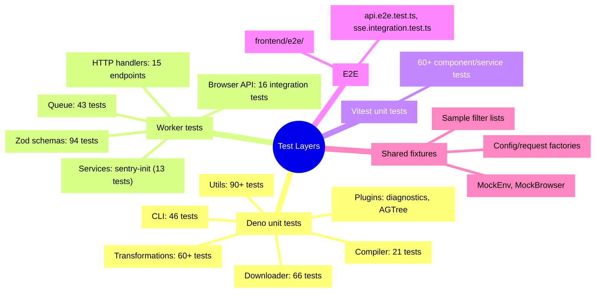

# Testing Documentation

## Overview

This project uses a layered testing strategy spanning three frameworks:

| Layer | Framework | Directory | Runner |
|-------|-----------|-----------|--------|
| Deno backend (CLI + core) | Deno native (`@std/assert`, `@std/testing/mock`) | `src/` | `deno task test:src` |
| Cloudflare Worker | Deno native | `worker/` | `deno task test:worker` |
| Angular frontend | Vitest + `@analogjs/vitest-angular` | `frontend/` | `pnpm --filter adblock-frontend run test` |
| E2E (Worker) | Deno native | `worker/*.e2e.test.ts` | included in `test:worker` |
| E2E (Frontend) | Playwright | `frontend/e2e/` | `pnpm --filter adblock-frontend run test:e2e` |

All test files are **co-located** next to their source files using the `*.test.ts` naming convention.

## Test Structure



## Running Tests

```bash
# All Deno tests (src/ + worker/)
deno task test

# Backend only (src/)
deno task test:src

# Worker only
deno task test:worker

# Frontend unit tests
pnpm --filter adblock-frontend run test

# Frontend E2E
pnpm --filter adblock-frontend run test:e2e

# Single file
deno test --no-check src/utils/AGTreeParser.roundtrip.test.ts

# With coverage
deno task test:coverage
```

## Shared Test Fixtures (`tests/fixtures/`)

Centralized mock factories and sample data live in `tests/fixtures/`:

```
tests/fixtures/
├── mod.ts                          # Barrel export
├── mocks/
│   ├── MockEnv.ts                  # Worker Env mock (KV, Analytics)
│   └── MockBrowser.ts              # Playwright browser/page mock
├── factories/
│   └── compiler-config.ts          # CompilationConfig, ISource, request factories
└── sample-rules/
    ├── adblock.txt                 # Sample adblock filter list
    ├── hosts.txt                   # Sample hosts file
    └── rpz.txt                     # Sample RPZ zone file
```

### Using Fixtures

```typescript
import {
    createMockEnv,
    createMockRequest,
    createMockCtx,
    MockKVNamespace,
} from '../tests/fixtures/mocks/MockEnv.ts';
import { createTestConfig, SAMPLE_ADBLOCK_RULES } from '../tests/fixtures/factories/compiler-config.ts';

Deno.test('my handler test', async () => {
    const kv = new MockKVNamespace();
    const env = createMockEnv({ COMPILATION_CACHE: kv as unknown as KVNamespace });
    const request = createMockRequest('https://test.example.com/api/endpoint', {
        method: 'POST',
        headers: { 'Content-Type': 'application/json' },
        body: JSON.stringify({ data: 'test' }),
    });
    const response = await myHandler(request, env, createMockCtx());
    assertEquals(response.status, 200);
});
```

`MockKVNamespace` is an in-memory `Map`-backed implementation supporting `get`, `put`, `delete`, and `list` — no Cloudflare binding required.

## CI Pipeline

Tests run automatically in GitHub Actions (`ci.yml`) on push to `main`, pull requests, and workflow dispatch:

1. **Deno tests** — `deno task test:src` + `deno task test:worker`
2. **Frontend Vitest** — `pnpm --filter adblock-frontend run test`
3. **Wrangler verify** — `wrangler deploy --dry-run` (retried up to 3× with 15s backoff)

## Coverage Targets

| Metric | Threshold |
|--------|-----------|
| Patch coverage (new code) | ≥ 80% |

```bash
# Generate coverage
deno task test:coverage

# HTML report
deno coverage coverage --html --include="^file:"
```

## Writing New Tests

> **Mandatory rule: every code change ships with tests — no exceptions.**
> New source file → new test file. Modified logic → updated tests for the affected code path.

### Test File Template

```typescript
import { assertEquals, assertExists, assertRejects } from '@std/assert';
import { MyClass } from './MyClass.ts';

Deno.test('MyClass - should do something', () => {
    const instance = new MyClass();
    const result = instance.doSomething();
    assertEquals(result, expectedValue);
});

Deno.test('MyClass - should handle errors', async () => {
    const instance = new MyClass();
    await assertRejects(
        async () => await instance.failingMethod(),
        Error,
        'Expected error message',
    );
});
```

### Best Practices

1. **Co-locate tests** — `*.test.ts` next to source files
2. **Use shared fixtures** — import from `tests/fixtures/` for mocks and factories
3. **Descriptive names** — `'handleResolveUrl: returns 400 for invalid URL'`
4. **Test edge cases** — empty inputs, null values, boundary conditions
5. **Keep tests isolated** — each test should be independent
6. **Mock external bindings** — use `MockKVNamespace`, `MockBrowser` instead of real bindings
7. **Sanitize ops** — use `sanitizeOps: false` only when a known timer/resource leak is unavoidable (e.g., Sentry dynamic import)

## Troubleshooting

### Tests fail with permission errors

```bash
deno test --allow-read --allow-write --allow-net --allow-env
```

### Timer/resource leaks

If a test triggers timer or resource leak sanitizer failures from dynamic imports:

```typescript
Deno.test({
    name: 'test with dynamic import side-effects',
    fn: async () => { /* ... */ },
    sanitizeOps: false,
    sanitizeResources: false,
});
```

### Mock not working

Ensure mocks are passed to constructors:

```typescript
const mockFs = new MockFileSystem();
const instance = new MyClass(mockFs);
```

## Resources

- [Deno Testing Documentation](https://deno.land/manual/testing)
- [Deno Assertions](https://deno.land/std/assert)
- [Vitest Documentation](https://vitest.dev/)
- [Playwright Testing](https://playwright.dev/)
- [Project README](../../README.md)
