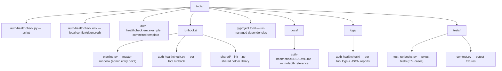

# Ops Tools

This chapter documents the operational tooling suite for adblock-compiler / Bloqr. Each tool is a standalone Python script in `tools/` and has a matching interactive Marimo runbook in `tools/runbooks/`.

> **Admin starting point:** Run `deno task runbook:pipeline` to open the master health dashboard runbook in your browser. Everything you need is inside.

---

## Quick Start

```bash
# One-time setup (from repo root)
uv sync --directory tools

# Launch the master pipeline runbook — the recommended admin entry point
deno task runbook:pipeline
# — or —
marimo run tools/runbooks/pipeline.py
```

The master pipeline runbook opens at `http://localhost:2718` and shows:
- Real-time health status for every tool (last run result)
- Tool selector with per-tool flag configuration
- Pipeline execution with live progress
- Log browser for all tools
- One-click log file copying for AI assistants

---

## What Is Marimo?

[Marimo](https://marimo.io) is an open-source (Apache 2.0) reactive Python notebook that runs in your browser via a single command. Key advantages:

| Property | Detail |
|---|---|
| Self-contained | One `.py` file per runbook — no JSON, no platform account |
| Git-friendly | Plain Python diffs cleanly — no notebook JSON merge conflicts |
| No learning curve | Run one command, get a browser UI |
| Reactive | Changing an input cell automatically updates all downstream cells |
| Free & local-first | `uv sync --directory tools` — nothing else required |
| CI/headless mode | `marimo run <file.py> --no-token` for scripted pipelines |

**Runbooks are entirely self-contained.** All documentation, environment configuration, execution, log viewing, and AI log-sharing are embedded inside the `.py` file. No markdown files are required at runtime.

---

## Available Tools

| Tool | Script | Runbook | Docs |
|---|---|---|---|
| **Auth Healthcheck** | `tools/auth-healthcheck.py` | `deno task runbook:auth-healthcheck` | [→](../../tools/docs/auth-healthcheck/README.md) |

> **Future tools planned:**
> - `db-healthcheck.py` — Neon / Prisma schema drift, row counts, replication lag
> - `kv-inspector.py` — Better Auth KV key explorer with TTL and prefix breakdown
> - `worker-smoke-test.py` — Smoke test all API endpoints and report status codes
> - `d1-audit.py` — D1 table structure, row counts, and index analysis
> - `deployment-verify.py` — Post-deploy validation: worker version, secrets present, bindings wired

---

## Directory Structure



---

## Tool Conventions

Every tool follows these conventions for consistency and CI-pipeline compatibility:

| Convention | Detail |
|---|---|
| Config file | `tools/<tool>.env` (gitignored — copy from `.env.example`) |
| Config template | `tools/<tool>.env.example` (committed — safe to share) |
| Dependencies | `tools/pyproject.toml` (uv-managed — `uv sync --directory tools` to install) |
| JSON report | `tools/logs/<tool>/<tool>-YYYYMMDD-HHMMSS.json` |
| Text log | `tools/logs/<tool>/<tool>-YYYYMMDD-HHMMSS.log` |
| Run modes | `--mode all` (checks + cleanup), `--mode checks`, `--mode cleanup`, `--dry-run` |
| Interactive menu | Shown when run without `--mode` (requires a TTY) |
| AI-ready output | JSON report contains full results, errors, and summary — paste to Copilot / Claude |

---

## Setup (one time)

```bash
# From repo root
uv sync --directory tools

# Verify (should print marimo version)
uv run --directory tools marimo --version
```

Add a shell alias for convenience:

```bash
# Add to ~/.zshrc or ~/.bashrc
alias bloqr-tools='cd /path/to/adblock-compiler && uv sync --directory tools'
alias bloqr-runbooks='cd /path/to/adblock-compiler && uv run --directory tools marimo run runbooks/pipeline.py'
```

---

## Deno Shortcut Tasks

```bash
deno task runbook:setup             # Install Marimo + all dependencies (one-time)
deno task runbook:pipeline          # Launch master pipeline runbook
deno task runbook:auth-healthcheck  # Launch auth-healthcheck runbook
deno task runbook:test              # Run all runbook tests with pytest
```

---

## Pipeline Chaining

Tools can be chained together in a bash pipeline by using `--mode all` and reading the JSON report that each tool writes to `tools/logs/<tool>/`.

### Example: Auth check → DB check (future)

```bash
# Step 1: Run auth healthcheck
uv run --directory tools python auth-healthcheck.py --mode all

# Step 2: Grab the JSON report
AUTH_REPORT=$(ls -t tools/logs/auth-healthcheck/*.json | head -1)

# Step 3: Check overall status
FAILED=$(jq '.summary.failed' "$AUTH_REPORT")
if [ "$FAILED" -gt 0 ]; then
    echo "❌ Auth check failed — stopping pipeline"
    jq '.errors' "$AUTH_REPORT"
    exit 1
fi

# Step 4: Run next tool
python tools/db-healthcheck.py --mode all

# (and so on)
```

### Using the Master Pipeline Runbook

The `pipeline.py` Marimo runbook provides a visual version of this flow:

1. Open `deno task runbook:pipeline`
2. Check the health dashboard — green/red/yellow status for each tool's last run
3. Select the tools you want to chain using the checkbox UI
4. Optionally configure per-tool flags (mode, API base, etc.)
5. Click **Run Pipeline** — tools execute in sequence with a live progress tracker
6. Review the aggregate results summary
7. Browse log files inline or copy the JSON report path to paste into an AI assistant

### Common Pipeline Patterns

| Pattern | Tools | Use case |
|---|---|---|
| Auth smoke test | `auth-healthcheck` | Before any deploy or after auth config changes |
| Full stack check | `auth-healthcheck → db-healthcheck → worker-smoke-test` | Post-deploy validation |
| Cleanup only | `auth-healthcheck --mode cleanup` | After a failed check leaves test data |
| Dry run config check | `auth-healthcheck --dry-run` | Verify env file is correct without making requests |

---

## Log Files & AI Assistants

Every tool writes two output files:

1. **JSON report** (`tools/logs/<tool>/<tool>-YYYYMMDD-HHMMSS.json`) — machine-readable, structured, safe to paste into AI chats
2. **Text log** (`tools/logs/<tool>/<tool>-YYYYMMDD-HHMMSS.log`) — human-readable terminal output with ANSI codes stripped

To share with an AI assistant (Copilot, Claude, etc.):

```bash
# Print the latest report for copying
cat $(ls -t tools/logs/auth-healthcheck/*.json | head -1)

# Or let the Marimo runbook do it — the "📂 View Logs" section has a file picker
# that displays the log inline and gives you the file path to copy
```

---

## Tests

Runbook tests live in `tools/tests/` and are run with pytest. They do **not** require network access and do not start Marimo:

```bash
uv run --directory tools pytest tests/ -v
# or
deno task runbook:test
```

Tests validate:
- All runbook `.py` files are valid Python syntax
- Marimo `App` declaration and `@app.cell` structure are present
- `KNOWN_TOOLS` registry is complete and correctly keyed
- Shared helper library (`shared/__init__.py`) functions behave correctly
- Directory structure is correct (logs, docs, pyproject.toml)
- PR template exists

---

## Adding a New Tool

1. Create `tools/<tool>.py` — the script
2. Create `tools/<tool>.env.example` — config template
3. Add `tools/<tool>` to `KNOWN_TOOLS` in `tools/runbooks/shared/__init__.py`
4. Create `tools/logs/<tool>/.gitkeep`
5. Create `tools/docs/<tool>/README.md` — in-depth reference
6. Create `tools/runbooks/<tool>.py` — Marimo runbook
7. Add `"runbook:<tool>"` task to `deno.json`
8. Update this file (`docs/tools/README.md`) — add row to the Available Tools table
9. Run `deno task runbook:test` — all 57+ tests should still pass (plus any new ones you add)
10. Open a PR using the **Tools / Runbooks** PR template (`.github/PULL_REQUEST_TEMPLATE/tools-runbooks.md`)

---

## Remote Access (Future)

The tooling is designed for **local use first**, but Marimo supports a remote mode via its built-in `marimo server` command. When remote access is needed (e.g., a CTO on a plane with only a tablet):

```bash
# Start Marimo in server mode (exposes all runbooks via browser)
marimo run tools/runbooks/pipeline.py --host 0.0.0.0 --port 2718
```

This can be exposed securely via:
- **Cloudflare Tunnel** (`cloudflared tunnel run`) — zero-config, no firewall rules
- **Cloudflare Access** policy on the tunnel — requires authentication before reaching Marimo
- Potential future subdomain: `tools.bloqr.dev`

> **Important:** Marimo does not natively run inside a Cloudflare Worker (Workers are JS/Wasm only and do not support Python). Remote access always requires a Python process (a VM, container, or developer laptop). The recommended pattern is Marimo + Cloudflare Tunnel + Cloudflare Access.

---

## Troubleshooting the Tools

| Symptom | Fix |
|---|---|
| `marimo: command not found` | Run `uv sync --directory tools` or `deno task runbook:setup` |
| `ModuleNotFoundError: No module named 'shared'` | Run from repo root: `cd /path/to/adblock-compiler && uv run --directory tools marimo run runbooks/auth-healthcheck.py` |
| `psycopg2 not found` | Run `uv sync --directory tools` to install all dependencies |
| `wrangler: command not found` | `npm install -g wrangler` or use `deno run -A npm:wrangler` |
| Browser doesn't open | Navigate to `http://localhost:2718` manually |
| Port 2718 in use | `marimo run tools/runbooks/pipeline.py --port 2719` |

