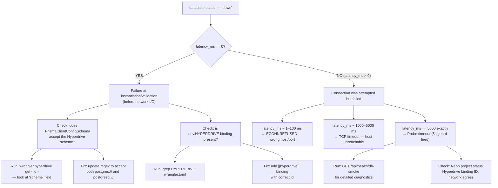

# KB-003: Database Down After Deploy — Live Debugging Session (2026-03-25)

> **Status:** ✅ Active
> **Affected versions:** v0.75.0, v0.76.0
> **Resolved in:** Hardening PR (error surfacing + `/api/health/db-smoke` + `$disconnect` + 5s timeout)
> **Date:** 2026-03-25

---

## Symptom Description

The live site at `https://bloqr-frontend.jk-com.workers.dev/` showed:

- **"Degraded performance — v0.75.0"** banner on every page (including anonymous/public pages)
- **"Data may be stale"** secondary banner
- `/api/health` returned `database.status: "down"` with `latency_ms: 0`
- Cloudflare Hyperdrive admin dashboard showed **zero traffic** for the binding
- Neon dashboard showed recent migration activity (migrations had run successfully)
- Every auth-related request (`/api/auth/get-session`, `/api/auth/sign-out`) was being killed by Cloudflare with "Worker hung" errors visible in `wrangler tail`

The problem affected **all visitors** — not just authenticated users — because the auth middleware always attempts to verify session state on every request.

---

## All Diagnostic Commands Run and Their Outputs

### 1. Health endpoint check

```bash
curl -s https://bloqr-frontend.jk-com.workers.dev/api/health | jq .services.database
```

Output:

```json
{
  "status": "down",
  "latency_ms": 0,
  "hyperdrive_host": "11f7f957eaae03a9fe9365c78e6eb4ed.hyperdrive.local"
}
```

**Key observations:**
- `latency_ms: 0` — failure is at instantiation, not network level
- `.hyperdrive.local` — this is **correct**; it is the Cloudflare internal proxy address

### 2. Hyperdrive binding configuration

```bash
wrangler hyperdrive get 800f7e2edc86488ab24e8621982e9ad7
```

Output:

```json
{
  "id": "800f7e2edc86488ab24e8621982e9ad7",
  "name": "hyperdrive-adblockdb-neon-prod",
  "origin": {
    "host": "ep-winter-term-a8rxh2a9-pooler.eastus2.azure.neon.tech",
    "port": 5432,
    "database": "bloqr-backend",
    "scheme": "postgres",
    "user": "neondb_owner"
  }
}
```

**Key observation:** `"scheme": "postgres"` means `env.HYPERDRIVE.connectionString` starts with `postgres://`, not `postgresql://`.

### 3. Deployed version verification

```bash
curl -s https://bloqr-frontend.jk-com.workers.dev/api/health | jq .version
# "0.76.0"

wrangler deployments list
# Confirmed v0.76.0 was the active deployment
```

### 4. Worker tail (most important)

```bash
wrangler tail --format=pretty
```

Output (paraphrased):

```
✘ [ERROR] Error: The Workers runtime canceled this request because it detected
  that your Worker's code had hung and would never generate a response.
```

This appeared on every `/api/auth/*` request. The root cause: `createAuth(env)` internally calls `createPrismaClient()`, which (in the broken state) either threw synchronously or created a `pg.Pool` that hung waiting for a connection — exhausting the Worker's CPU time budget until Cloudflare killed the request.

---

## Decision Tree

Use this diagram to categorize a `database: down` scenario:



---

## Interpreting `wrangler deployments list` Output

```bash
wrangler deployments list
```

Look for:
- The most recent deployment's version tag (should match the `version` field in `/api/health`)
- Whether the deployment completed successfully (no error state)
- The binding list — confirm `HYPERDRIVE` appears with the correct binding ID

If the version in the health response does not match the most recent deployment, either the deployment failed silently or there is a routing issue (frontend Worker proxying to an old backend Worker version).

---

## What `"scheme": "postgres"` vs `"postgresql"` Means

Cloudflare Hyperdrive always returns `postgres://` (the PostgreSQL short alias) from `env.HYPERDRIVE.connectionString`. This is not configurable — it is hardcoded by the Hyperdrive proxy.

| Hyperdrive `scheme` config value | `env.HYPERDRIVE.connectionString` prefix |
|---|---|
| `"postgres"` | `postgres://...` |
| `"postgresql"` | `postgresql://...` |

Both are valid PostgreSQL connection string schemes. The standard form is `postgresql://`; `postgres://` is an alias recognized by all PostgreSQL clients including Prisma and `pg`.

If your Zod schema only accepts one form, it will reject the other at validation time — with zero network activity and `latency_ms: 0`.

---

## Step-by-Step Resolution Checklist

Use this checklist to resolve `database: down` after a deploy.

### Phase 1 — Confirm the failure layer

- [ ] Run `curl -s <your-worker>/api/health | jq .services.database`
- [ ] Note `latency_ms` — is it `0` (instantiation failure) or non-zero (network failure)?
- [ ] Note `error_code` and `error_message` (added in v0.76.0+) — what do they say?
- [ ] Run `GET /api/health/db-smoke` — does it return `ok: true` or `ok: false` with an `error`?

### Phase 2 — If `latency_ms == 0` (instantiation failure)

- [ ] Run `wrangler hyperdrive get <id>` — note the `scheme` field
- [ ] Check `worker/lib/prisma-config.ts` — does the `connectionString` regex accept the scheme?
- [ ] Check `wrangler.toml` — does `[[hyperdrive]]` have the correct `id`?
- [ ] Run `wrangler tail` — look for `ZodError` or similar validation exceptions
- [ ] Apply schema fix if needed, run `wrangler deploy`, re-check health

### Phase 3 — If `latency_ms > 0` (network failure)

- [ ] Run `GET /api/health/db-smoke` — full diagnostic output
- [ ] Check Neon project status at `console.neon.tech`
- [ ] Verify the Hyperdrive binding origin host matches the Neon pooler URL
- [ ] Check if Neon branch/endpoint is active (not sleeping)
- [ ] Run `wrangler tail` during a request to capture the raw error

### Phase 4 — Verify the fix

- [ ] Run `GET /api/health/db-smoke` — expect `ok: true`
- [ ] Run `GET /api/health` — expect `services.database.status: "healthy"`
- [ ] Check UI — "Degraded performance" banner should be gone
- [ ] Check Cloudflare Hyperdrive dashboard — traffic should appear within a few minutes

---

## Prevention

**Always run `GET /api/health/db-smoke` after every production deploy.**

Add this to your post-deploy checklist or CI/CD pipeline:

```bash
# Post-deploy smoke test — fails if DB is not reachable
SMOKE=$(curl -s https://<your-worker>.workers.dev/api/health/db-smoke)
OK=$(echo "$SMOKE" | jq -r '.ok')
if [ "$OK" != "true" ]; then
  echo "DB smoke test FAILED: $(echo $SMOKE | jq -r '.error')"
  exit 1
fi
echo "DB smoke test passed — table_count=$(echo $SMOKE | jq -r '.table_count')"
```

This catches Zod validation regressions, wrong binding IDs, and Neon endpoint issues before they affect users.

---

## Worker Code Changed in This Session

| File | Change |
|---|---|
| `worker/lib/prisma-config.ts` | Accept both `postgres://` and `postgresql://` schemes |
| `worker/handlers/health.ts` | `databaseProbe`: error surfacing, 5s timeout, `$disconnect()` in finally |
| `worker/handlers/health.ts` | New `handleDbSmoke` handler |
| `worker/hono-app.ts` | Wire `GET /health/db-smoke` route + add to public monitoring paths |
| `frontend/src/app/performance/performance.component.ts` | Surface `error_message` and `db_name` in health card |
| `frontend/src/app/admin/dashboard/dashboard.component.ts` | Surface `error_message` and `db_name` in admin health indicators |

---

## ZTA Security Notes

- `GET /api/health/db-smoke` is **unauthenticated** (same tier as `/api/health`) — intentional for diagnostics
- No credentials, connection strings, or PII are returned by either endpoint
- `error_message` is sanitized: `postgres://...` patterns are replaced with `[redacted]` before being surfaced
- `hyperdrive_host` is the only connection detail returned — it is a hostname, not a credential

---

## Related Articles

- [KB-002](./KB-002-hyperdrive-database-down.md) — Root cause analysis and schema fix
- [Neon Troubleshooting](./neon-troubleshooting.md) — General Neon/Hyperdrive/Prisma troubleshooting
- [KB-001](./KB-001-api-not-available.md) — "API not available" on the main page
