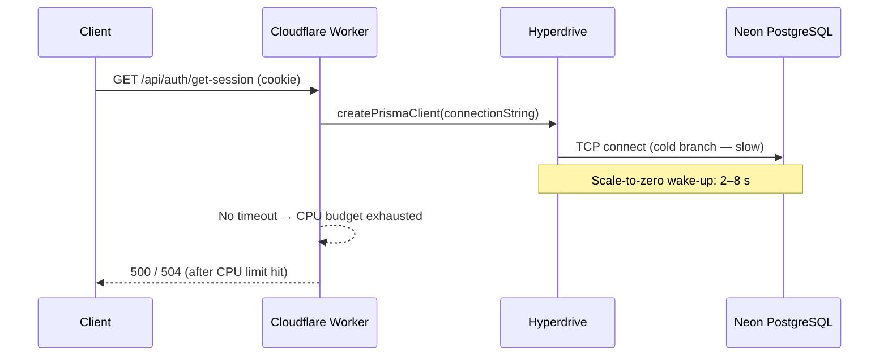

# KB-005: Better Auth + Cloudflare Workers — Hanging Worker and Rate Limiting Skipped

> **Status:** ✅ Resolved
> **Severity:** High (CPU timeout → hung requests; brute-force protection silently disabled)
> **Affected versions:** Any deployment where `better-auth-provider.ts` lacks a DB call timeout
> and/or `auth.ts` lacks `ipAddress.ipAddressHeaders`
> **Resolved in:** `worker/middleware/better-auth-provider.ts` (AbortController timeout) +
> `worker/lib/auth.ts` (`ipAddress.ipAddressHeaders`)
> **Date:** 2026-03-27

---

## Summary

Two independent but easy-to-miss integration issues affect deployments of Better Auth on
Cloudflare Workers when backed by Neon PostgreSQL via Hyperdrive:

| # | Problem | Impact | Fix |
|---|---------|--------|-----|
| 1 | Missing `AbortSignal` timeout on `auth.api.getSession()` | Worker CPU budget exhausted → hung requests, double error log lines | Add `Promise.race` + `AbortController` with 10 s deadline |
| 2 | Missing `ipAddress.ipAddressHeaders` in Better Auth config | BA cannot read client IP → all per-endpoint rate limiting silently skipped | Add `advanced.ipAddress.ipAddressHeaders: ['CF-Connecting-IP', 'X-Forwarded-For']` |

Both issues are dormant during local `wrangler dev` but surface in deployed Workers because:

- Cloudflare Workers enforce a **10–50 ms CPU-time budget per request** (not wall-clock time). A
  hung database call burns the full budget, leaving two correlated error lines in the log.
- `CF-Connecting-IP` is only injected by Cloudflare's edge in a deployed Worker; it is absent
  during `wrangler dev`, so the rate-limit bypass is invisible in local development.

---

## Problem 1 — Worker CPU Timeout: Hanging on `/api/auth/get-session`

### Symptoms

In `wrangler tail` or the Cloudflare dashboard **Workers Logs** view, a hung request produces
**two consecutive error lines** for the same request ID:

```
[ERROR] [better-auth] Token verification error: TimeoutError (DB call exceeded 10s)
[ERROR] Worker exceeded CPU time limit
```

The caller experiences:

- HTTP `500` or `504` after a long pause (exact response depends on the Cloudflare edge tier)
- Any endpoint that hits the auth middleware — `/api/auth/get-session`,
  `/api/auth/list-sessions`, authenticated compile endpoints — becomes unresponsive

### Root Cause

`auth.api.getSession()` triggers a Prisma → Hyperdrive → Neon PostgreSQL round-trip. If the
Neon branch is cold (first request after scale-to-zero), or Hyperdrive's connection pool is
saturated, the TCP handshake can take several seconds. Without an explicit deadline, the Worker's
`fetch` event handler holds its CPU allocation open, eventually exhausting the runtime budget.



Without a timeout, the Worker hangs silently until the runtime kills it. With a timeout, the
hang is surfaced as a named `TimeoutError` before the CPU budget is exhausted.

### How to Diagnose

**Step 1 — Search for double error lines in `wrangler tail`:**

```bash
wrangler tail --format pretty 2>&1 | grep -A1 "Token verification error"
```

Expected output when the bug is present:

```
[ERROR] [better-auth] Token verification error: ... (no TimeoutError label)
[ERROR] Worker exceeded CPU time limit
```

Expected output after the fix is applied:

```
[ERROR] [better-auth] Token verification error: TimeoutError (DB call exceeded 10s)
# Worker CPU limit error is absent — the timeout fires before the budget is exhausted
```

**Step 2 — Reproduce locally with an artificial delay:**

Add a `setTimeout` of 12000 ms before the `auth.api.getSession()` call in a local branch,
invoke `GET /api/auth/get-session`, and observe whether the Worker terminates gracefully
(`TimeoutError` log) or hangs indefinitely.

**Step 3 — Check Analytics Engine telemetry:**

```bash
# Via wrangler analytics (or the Cloudflare dashboard → Analytics Engine):
# Look for events with reason = "better_auth_timeout"
```

The `AnalyticsService.trackSecurityEvent()` call in `BetterAuthProvider.verifyToken()` emits a
`reason: 'better_auth_timeout'` event on every timeout. Aggregating these by time shows when
Neon cold-start latency is creating a user-visible problem.

### Resolution

The fix uses `Promise.race` to pair the `getSession` promise with a `setTimeout`-backed
`AbortController`. If the DB call takes longer than 10 s, the controller aborts the underlying
`fetch` and a `DOMException('TimeoutError')` rejects the race.

**`worker/middleware/better-auth-provider.ts` — current (fixed) implementation:**

```typescript
const abortController = new AbortController();
let timeoutId: ReturnType<typeof setTimeout> | undefined;
const betterAuthRequest = new Request(url.toString(), {
    method: 'GET',
    headers: request.headers,
    signal: abortController.signal,
});
const sessionPromise = auth.api.getSession(betterAuthRequest as Request);
const session = await Promise.race([
    sessionPromise.finally(() => {
        if (timeoutId !== undefined) {
            clearTimeout(timeoutId);
        }
    }),
    new Promise<never>((_, reject) => {
        timeoutId = setTimeout(() => {
            abortController.abort();
            reject(new DOMException('DB call exceeded 10s', 'TimeoutError'));
        }, 10_000);
    }),
]);
```

Key design choices:

- `AbortController` is shared between the synthetic `Request` and the timeout branch — aborting
  the controller signals the in-flight Prisma/HTTP connection to close, releasing the TCP socket.
- `sessionPromise.finally(() => clearTimeout(timeoutId))` cancels the timer if the DB call
  resolves before the deadline, preventing dangling timer handles.
- The catch block in `verifyToken` distinguishes `TimeoutError` from other errors and emits
  separate telemetry (`reason: 'better_auth_timeout'` vs `'better_auth_verification_error'`).

> **Why not `AbortSignal.timeout(10_000)`?**
>
> `AbortSignal.timeout()` is not universally available in the Cloudflare Workers runtime at the
> time of this writing. The manual `AbortController` + `setTimeout` pattern is functionally
> equivalent and works across all runtime versions.

---

## Problem 2 — Silent Rate Limit Skip: Brute-Force Protection Disabled

### Symptoms

All Better Auth per-endpoint rate limits are silently bypassed. An attacker can make unlimited
`POST /api/auth/sign-in` attempts without being throttled. There is no error message or log line
to indicate the skip — the request simply succeeds or fails based on credentials alone.

To confirm the issue:

```bash
# Rapid sign-in attempts — none should succeed after N attempts if rate limiting is active
for i in $(seq 1 20); do
  curl -s -o /dev/null -w "%{http_code}\n" \
    -X POST https://adblock-frontend.jayson-knight.workers.dev/api/auth/sign-in/email \
    -H 'Content-Type: application/json' \
    -d '{"email":"test@example.com","password":"wrong"}'
done
```

If ALL 20 responses are `401` (or `200`), rate limiting is NOT active. Once the fix is applied,
responses should transition to `429 Too Many Requests` after Better Auth's per-endpoint threshold
is reached.

### Root Cause

Better Auth's built-in rate limiter (which guards `/sign-in`, `/sign-up`, `/two-factor/*`, and
other sensitive endpoints) requires the client's IP address to key its counters. It extracts the
IP by inspecting the incoming `Request` headers according to the `ipAddress.ipAddressHeaders`
configuration list.

Without `ipAddressHeaders`, Better Auth falls back to `request.socket?.remoteAddress` — which
is `undefined` inside a Cloudflare Worker (Workers have no raw socket access). When the IP
resolves to `undefined` or an empty string, Better Auth's rate limiter treats every request as
having the same "null" identity and **skips all rate limiting** rather than applying a catch-all
block.

Cloudflare injects the real client IP in the `CF-Connecting-IP` header. This header is:

- **Always present** in deployed Workers (injected by the Cloudflare edge, not forgeable by
  clients because the edge strips any client-supplied `CF-Connecting-IP`)
- **Absent** in `wrangler dev` (no Cloudflare edge in the loop), which is why the bypass is
  invisible locally

### How to Diagnose

**Step 1 — Check whether `ipAddressHeaders` is present in the auth config:**

```bash
grep -n "ipAddress\|ipAddressHeaders\|CF-Connecting" worker/lib/auth.ts
```

If this returns no matches, `ipAddressHeaders` is not configured and rate limiting is silently
skipped.

**Step 2 — Add a temporary debug log to confirm IP extraction:**

In `worker/lib/auth.ts`, add a temporary `console.log` inside `createAuth()` to surface
what Better Auth sees as the client IP during a sign-in attempt:

```typescript
// Temporary diagnostic only — remove before commit
console.log('[auth-debug] CF-Connecting-IP:', request.headers.get('CF-Connecting-IP'));
```

In a deployed Worker, this should log a non-null IP. In `wrangler dev`, it logs `null` — which
confirms the local silent-skip.

**Step 3 — Stress test after the fix to confirm 429s appear:**

After applying the fix, repeat the loop from the Symptoms section. Requests beyond Better Auth's
threshold should receive `429 Too Many Requests`.

### Resolution

Add `advanced.ipAddress.ipAddressHeaders` to the `betterAuth({...})` call in
`worker/lib/auth.ts`:

**`worker/lib/auth.ts` — current (fixed) implementation (inside `betterAuth({...})`):**

```typescript
advanced: {
    cookiePrefix: 'adblock',
    defaultCookieAttributes: {
        httpOnly: true,
        secure: true,
        sameSite: 'lax',
        path: '/',
    },
    // ── Cloudflare reverse proxy IP extraction ────────────────────────────
    // Without this, Better Auth cannot determine the real client IP and its
    // built-in rate limiter (brute-force protection on /sign-in, /sign-up,
    // /two-factor/*) silently skips ALL rate limiting. CF-Connecting-IP is
    // injected by Cloudflare's edge and is the authoritative client IP.
    // X-Forwarded-For is included as fallback for local dev / wrangler dev.
    ipAddress: {
        ipAddressHeaders: ['CF-Connecting-IP', 'X-Forwarded-For'],
    },
},
```

Why this order matters:

| Header | Where it comes from | Trust level |
|--------|---------------------|-------------|
| `CF-Connecting-IP` | Cloudflare edge (always authoritative in deployed Workers) | High — edge-injected, client cannot forge |
| `X-Forwarded-For` | Load balancer / reverse proxy chain | Medium — useful for `wrangler dev`, but trust with care in production |

Better Auth reads the list in order and uses the first non-empty value. In a deployed Worker,
`CF-Connecting-IP` is always non-empty and is used. `X-Forwarded-For` is a fallback for local
dev where `CF-Connecting-IP` is absent.

> **Security note:** Never include `X-Real-IP` or trust `X-Forwarded-For` as the sole IP source
> in production without validating against trusted proxy CIDRs. Cloudflare's edge strips
> client-supplied `CF-Connecting-IP` before it reaches your Worker, so it is always safe to
> trust `CF-Connecting-IP` first.

---

## Prevention

Use this checklist when deploying Better Auth on a new Cloudflare Worker or migrating an
existing Worker to Better Auth:

- [ ] **`ipAddress.ipAddressHeaders` is configured** in `createAuth()` with
  `['CF-Connecting-IP', 'X-Forwarded-For']`
- [ ] **Every `auth.api.*` call has a deadline** — use `Promise.race` with an `AbortController`
  and `setTimeout`; never await a BA DB-backed call without a timeout in a Worker
- [ ] **Analytics telemetry is wired up** — `AnalyticsService.trackSecurityEvent()` is called on
  both `better_auth_timeout` and `better_auth_verification_error` so timeouts are visible in the
  Cloudflare dashboard
- [ ] **Stress test `sign-in` in production** — confirm `429` responses appear after the BA
  threshold is reached (not possible to test locally, only in deployed Workers)
- [ ] **Monitor `wrangler tail` after first deploy** — look for the double error pattern
  (`Token verification error` followed by `Worker exceeded CPU time limit`) as an indicator
  of the missing-timeout issue

---

## Worker Code Reference

| File | Relevance |
|------|-----------|
| `worker/middleware/better-auth-provider.ts` | `BetterAuthProvider.verifyToken()` — `Promise.race` + `AbortController` timeout |
| `worker/lib/auth.ts` | `createAuth()` — `advanced.ipAddress.ipAddressHeaders` configuration |
| `src/services/AnalyticsService.ts` | `trackSecurityEvent()` — telemetry for `better_auth_timeout` events |

---

## Related KB Articles

- [KB-002](./KB-002-hyperdrive-database-down.md) — Hyperdrive binding connected but `database`
  service reports `down` (covers DB connectivity issues that can cause the timeout to fire)
- [KB-003](./KB-003-neon-hyperdrive-live-session-2026-03-25.md) — Live debugging session
  2026-03-25 (full context of Neon + Hyperdrive cold-start latency)
- [KB-004](./KB-004-prisma-wasm-cloudflare.md) — Prisma WASM error on Cloudflare Workers
  (covers another category of DB-layer failures that also cause `getSession` to hang)

### Related Auth Documentation

- [Better Auth Developer Guide](../auth/better-auth-developer-guide.md) — Plugin catalogue,
  adapter swapping, and configuration reference
- [ZTA Review Fixes](../auth/zta-review-fixes.md) — Auth telemetry, rate-limit semantics, and
  other security hardening applied alongside these fixes
- [Cloudflare Access](../auth/cloudflare-access.md) — Network-level protection for admin routes
  (complements BA's per-endpoint rate limiting)
