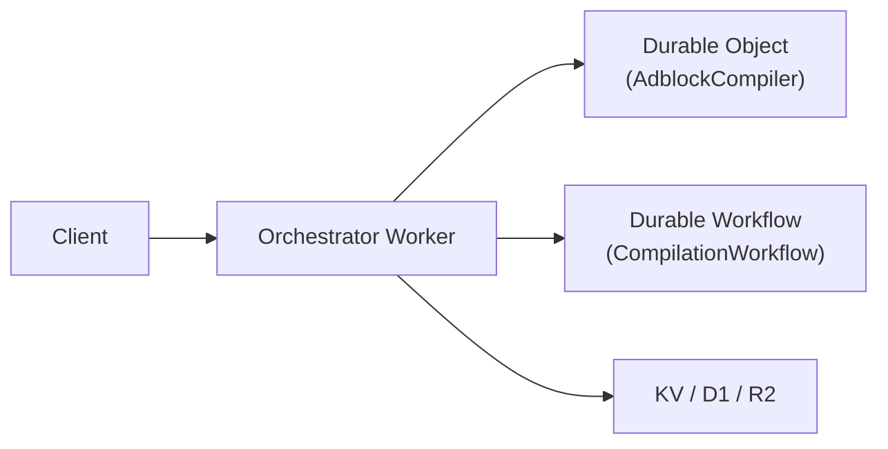
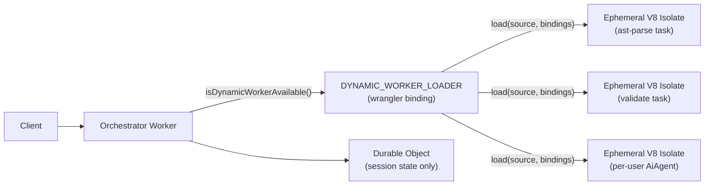
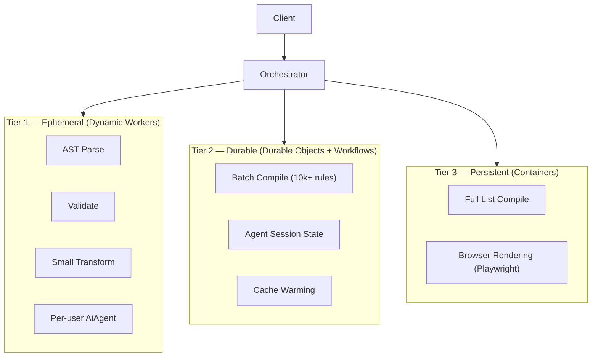

# Cloudflare Dynamic Workers — Architecture Pivot

> **Date:** 2026-03-24
> **Author:** @jaypatrick
> **Context:** Cloudflare Dynamic Workers announced same day — <https://blog.cloudflare.com/dynamic-workers/>
> **Related:** Issue [#1386](https://github.com/jaypatrick/adblock-compiler/issues/1386),
>              Issue [#1377](https://github.com/jaypatrick/adblock-compiler/issues/1377)

---

## Executive Summary

On 24 March 2026, Cloudflare announced **Dynamic Workers** — a primitive that lets any Worker
spin up isolated V8 sandboxes at runtime from source-code strings with ~1 ms cold-start, no
pre-deployment, and full Zero Trust sandboxing. This changes the foundational architecture of
the bloqr-backend project and represents a pivotal competitive opportunity.

The bloqr-backend is a **day-1 adopter**. We are scaffolding Dynamic Workers support
immediately, starting with the `/api/ast/parse` endpoint as a pilot and building toward a
Compiler-as-a-Platform model where every compilation job, validation run, and AI agent task
runs in its own isolated ephemeral Worker.

---

## Context

### What We Had (pre-2026-03-24)



- Stateless endpoints (`/ast/parse`, `/validate`) ran **inline** in the orchestrator Worker
- Stateful compilation used Durable Objects and Workflows
- Per-user isolation was only at the KV-key level — no compute isolation

### What Dynamic Workers Enable (2026-03-24+)



- Stateless endpoints now dispatch to **ephemeral V8 isolates** — no shared memory, no
  persistent state, no outbound network (unless explicitly granted)
- Per-user compute isolation is **structural**, not policy-based
- Spawning a new isolate for untrusted or generated code is safe and ~1 ms fast

---

## Why This Is a Pivotal Moment

### 1. Structural ZTA

Today's ZTA model in this project is policy-enforced (middleware, scope checks, rate limits).
Dynamic Workers make isolation **structural**:

- Spawned isolate can only see bindings explicitly forwarded (`COMPILATION_CACHE`, `RATE_LIMIT`,
  `COMPILER_VERSION` — never auth secrets, admin DB, or the full `Env`)
- `globalOutbound: null` cuts network egress at the V8 level — not just the application level
- No shared memory between requests — each isolate is a clean-room environment

This is the missing piece for safe multi-tenant compilation.

### 2. LLM-Driven Codegen → Safe Execution

The long-term vision for the bloqr-backend is **Compiler-as-a-Platform**: users describe
the transform they want in natural language, an LLM generates the transformation code, and the
Worker executes it. Dynamic Workers make this safe:

```
User prompt → LLM codegen → validate source → load(generatedSource, minimalBindings) → run
```

Without Dynamic Workers, executing LLM-generated code in the orchestrator Worker was a ZTA
non-starter. With Dynamic Workers, the generated code runs in a fresh V8 isolate with zero
privilege escalation possible.

### 3. Competitive Moat

The bloqr-backend is one of the first projects to scaffold Dynamic Workers support on the
day of GA announcement. Early adoption means:

- API stability feedback directly to Cloudflare (partner relationship opportunity)
- First-mover advantage in the "serverless sandbox" niche for filter-list tooling
- Foundation for a per-execution billing model that maps 1:1 to Cloudflare's usage-based pricing

### 4. Per-User AiAgent Isolation

Issue [#1377](https://github.com/jaypatrick/adblock-compiler/issues/1377) describes per-user
AI agents for natural-language compiler control. Dynamic Workers provide the missing isolation
layer: each user session can have its own Agent running in a dedicated isolate, with the
Durable Object used only for persistent state (conversation history, rule drafts).

---

## Near-Term Roadmap

| Quarter | Milestone | Risk |
|---|---|---|
| Q1 2026 | Pilot: `/api/ast/parse` via Dynamic Worker (feature-flagged) | Low — falls back to inline impl |
| Q1 2026 | Pilot: `/api/validate` via Dynamic Worker | Low |
| Q2 2026 | Single-file `/compile` (small rulesets) via Dynamic Worker | Medium — perf benchmarking needed |
| Q2 2026 | Per-user AiAgent: Dynamic Worker per session + DO for state | Medium |
| Q3 2026 | LLM codegen → Dynamic Worker safe execution (private beta) | High — requires LLM integration |
| Q4 2026 | Compiler-as-a-Platform: public API for custom transforms | High |

---

## Mid-Term Vision: Three-Tier Execution Model



**Decision matrix:**

| Criteria | Dynamic Worker | Durable Object | Container |
|---|---|---|---|
| Cold-start | ~1 ms | ~5 ms | ~2 s |
| Isolation | V8 isolate | Shared process | Container |
| Persistent state | ❌ | ✅ | ✅ |
| Outbound network | Optional | ✅ | ✅ |
| Cost model | Per-execution ms | Per DO-second | Per container-second |
| Best for | Stateless tasks | Sessions, queues | Long-running, heavy IO |

---

## Risk Analysis

| Risk | Likelihood | Mitigation |
|---|---|---|
| Dynamic Workers API stability (beta) | Medium | Feature-flagged — fallback to inline impl always present |
| ESM imports inside source strings | High (near-term) | Self-contained source strings only; no `import` statements in isolate source |
| Bundle size for complex transforms | Medium | Build step to inline dependencies into source string |
| Beta account flag requirement | High (short-term) | `DYNAMIC_WORKER_LOADER` is optional in `Env` — existing deploys unaffected |
| Cold-start regression on high-churn endpoints | Low | Benchmark before GA; Dynamic Workers ~1 ms cold-start per Cloudflare claims |

---

## Revenue Angle

Dynamic Workers map naturally to a per-execution billing model:

- Each `dispatchToDynamicWorker()` call is one ephemeral isolate invocation
- Cloudflare bills per Worker invocation (CPU time)
- For Compiler-as-a-Service, we can expose a public API where customers pay per compile/validate/transform operation
- Granularity: individual rule validations, single-file transforms, AST parse jobs — all separately billable

This is fundamentally different from the current model where all requests share the same orchestrator Worker's billing meter.

---

## Decision Log

| Date | Decision | Rationale |
|---|---|---|
| 2026-03-24 | Scaffold Dynamic Workers on GA day | First-mover; ZTA alignment; unblocks LLM codegen path |
| 2026-03-24 | Feature-flag via `isDynamicWorkerAvailable()` | Backward compatible; zero risk to existing deploys |
| 2026-03-24 | Minimum bindings (`COMPILATION_CACHE`, `RATE_LIMIT`, `COMPILER_VERSION`) | ZTA principle: least privilege |
| 2026-03-24 | Pilot on `/api/ast/parse` | Simplest stateless endpoint; lowest risk |
| 2026-03-24 | Self-contained source strings only | ESM imports not yet supported in Dynamic Worker isolates |

---

## References

- [Cloudflare Dynamic Workers announcement](https://blog.cloudflare.com/dynamic-workers/)
- [Cloudflare Dynamic Workers API reference](https://developers.cloudflare.com/dynamic-workers/)
- Issue [#1386](https://github.com/jaypatrick/adblock-compiler/issues/1386) — implementation tracking
- Issue [#1377](https://github.com/jaypatrick/adblock-compiler/issues/1377) — multi-agent orchestration
- `docs/cloudflare/DYNAMIC_WORKERS.md` — technical integration guide
- `worker/dynamic-workers/` — implementation
