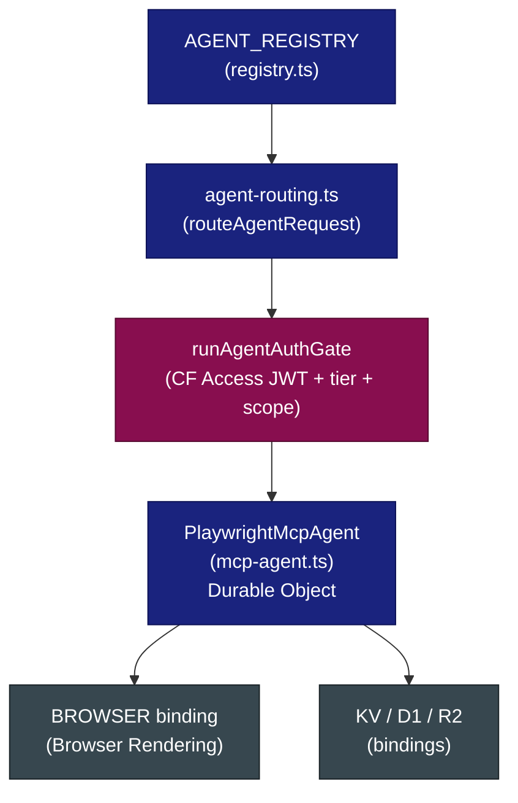
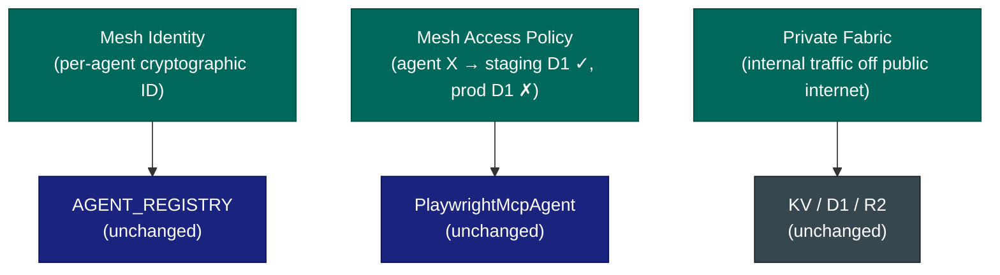
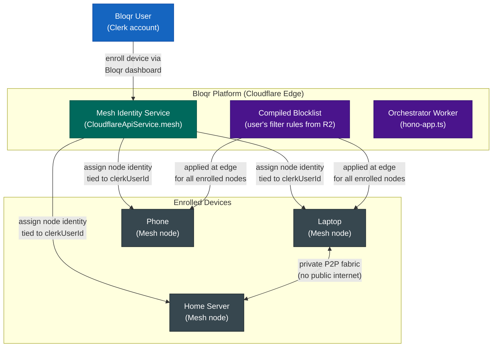
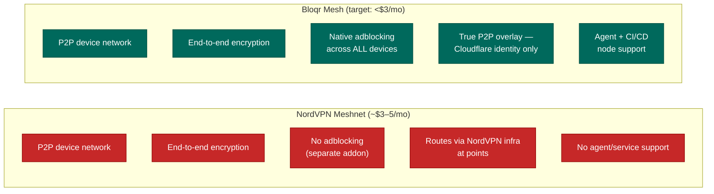

# Cloudflare Mesh: Private Agent Networking for bloqr-backend

**Date:** 2026-04-15 00:11:51
**Status:** Strategic Evaluation — Awaiting SDK Maturity
**Relates to:** [Issue #1592](https://github.com/jaypatrick/adblock-compiler/issues/1592), [Issue #1377](https://github.com/jaypatrick/adblock-compiler/issues/1377), [ideas/CLOUDFLARE_DYNAMIC_WORKERS_PIVOT.md](./CLOUDFLARE_DYNAMIC_WORKERS_PIVOT.md)

---

## Executive Summary

On April 14, 2026, Cloudflare launched [Cloudflare Mesh](https://blog.cloudflare.com/mesh/) — a private networking layer purpose-built for connecting users, services, and AI agents into a unified, identity-driven network fabric. Unlike a VPN, Mesh assigns each agent, node, and user a distinct cryptographic identity, enabling fine-grained access policies enforced at the network level — not the application level.

This document evaluates Mesh's fit within the bloqr-backend platform across **two distinct scopes**:

1. **Infrastructure ZTA** — Mesh as a structural enforcement layer on top of the existing Cloudflare agent stack (Agents SDK, Durable Objects, AGENT_REGISTRY, MCP agent).
2. **User-facing product feature (Bloqr Mesh)** — Mesh as a consumer/prosumer private network feature, competitive with NordVPN Meshnet, bundled natively with adblocking.

---

## What Is Cloudflare Mesh?

Cloudflare Mesh is a **private overlay network** that:

- Assigns each participant (user, Worker, agent, Durable Object, external node) a **distinct cryptographic identity**
- Connects participants across clouds, data centres, local machines, and Workers into a **single private network fabric**
- Enforces **per-identity access policies** (e.g., "this agent may reach staging D1, never production D1")
- Extends Cloudflare One / Zero Trust — existing CF Access JWT enforcement, Gateway policies, and device posture checks apply automatically to Mesh traffic
- Integrates directly with **Cloudflare Workers, Durable Objects, and the Agents SDK**
- Offers a **free tier** (50 nodes, 50 users) suitable for staging/sandbox adoption

### Key Concepts

| Concept | Description |
|---|---|
| **Mesh node** | Any participant enrolled in the network (Worker, DO, agent, user device, CI runner). Replaces "WARP Connector". |
| **Mesh identity** | Cryptographic identity assigned to each node — persists across DO hibernation cycles |
| **Access policy** | Network-level rule: "agent X may reach binding Y, never binding Z" — enforced before application code runs |
| **Private fabric** | The overlay network — internal-to-internal traffic never traverses the public internet |
| **Cloudflare One convergence** | Existing CF Access JWT verification becomes the policy enforcement point for a network-segmented path |

### Reference Links

- [Cloudflare Blog: Mesh launch announcement](https://blog.cloudflare.com/mesh/)
- [Cloudflare Mesh Docs](https://developers.cloudflare.com/mesh/)
- [Cloudflare One / Zero Trust](https://developers.cloudflare.com/cloudflare-one/)
- [BusinessWire: Cloudflare Launches Mesh to Secure the AI Agent Lifecycle](https://www.businesswire.com/news/home/20260414016256/en/Cloudflare-Launches-Mesh-to-Secure-the-AI-Agent-Lifecycle)

---

## Competitive Context: NordVPN Meshnet

NordVPN Meshnet is the closest existing consumer product to what Cloudflare Mesh enables at the user level. Understanding the comparison is critical to positioning Bloqr Mesh correctly.

### Feature Comparison

| Feature | NordVPN Meshnet | Cloudflare Mesh (via Bloqr) |
|---|---|---|
| **Core concept** | P2P overlay network between user devices | Private overlay network for users, agents, services, and Workers |
| **Encryption** | End-to-end via NordLynx (WireGuard) | End-to-end on private fabric, enforced by Cloudflare infrastructure |
| **Identity** | Per-device identity | Per-node cryptographic identity (agents, DOs, Workers, users, CI) |
| **Access policies** | Coarse — device-to-device allow/deny | Fine-grained — per-identity, per-binding, per-resource policies |
| **Target user** | Consumers + small teams (gaming LAN, remote desktop, file sharing) | Privacy-focused users, developers, prosumers, enterprise |
| **Pricing** | ~$3–5/mo bundled with NordVPN, or standalone | Marginal on top of existing Cloudflare infrastructure; significantly cheaper |
| **Platform dependency** | NordVPN app required on every device | Cloudflare WARP client (Mesh node) — lighter weight, no VPN subscription required |
| **Adblocking** | None natively (separate NordVPN feature, addon pricing) | **Native — Bloqr blocklists applied uniformly across all enrolled Mesh devices** |
| **AI agent support** | None | First-class — designed for agentic workloads |
| **Privacy model** | Traffic routed through NordVPN infrastructure | P2P direct overlay — Cloudflare provides identity/policy fabric only, not traffic relay |

### The Opportunity

NordVPN Meshnet is a **consumer feature bolted onto a VPN product**. Bloqr can offer something categorically better:

1. **Native adblocking across the Mesh** — every device on the Bloqr Mesh private network has the user's compiled blocklist applied. NordVPN charges separately for "Threat Protection"; we bundle it.
2. **No VPN subscription required** — Cloudflare Mesh runs on Cloudflare's edge, not a VPN server fleet. The marginal infrastructure cost is minimal; we pass the savings directly to users.
3. **Stronger privacy narrative** — NordVPN's Meshnet still transits NordVPN infrastructure at points. Cloudflare Mesh is a direct P2P overlay — Cloudflare provides the identity fabric, not a traffic relay.
4. **Prosumer-to-enterprise continuity** — the same Mesh identity model that protects a user's home devices also protects their CI/CD runners and production agents. NordVPN has no story here.
5. **Pricing**: Bloqr can undercut NordVPN Meshnet by targeting the prosumer segment that wants Meshnet but not a full VPN subscription.

---

## Part 1: Infrastructure ZTA Integration

### Current Architecture: What Mesh Augments

The bloqr-backend already has a deep Cloudflare ZTA stack. Mesh is not a replacement — it is a structural enforcement layer on top of what exists.

#### Existing ZTA Middleware Chain


#### Existing Agent Infrastructure



#### What Mesh Adds (Structural Layer)



### Gap Analysis: What Mesh Solves (Infrastructure)

| Current State | Current Workaround | Mesh Solution |
|---|---|---|
| `/agents/*` + `/admin/*` protected by `verifyCfAccessJwt()` — correct but requires per-env audience tag configuration | Manually configure `CF_ACCESS_AUD` per environment via `wrangler secret` | Mesh node identity replaces per-env audience tags; identity travels with the agent |
| Agents calling internal bindings (D1, R2, Queues) traverse the public Worker URL surface | Auth middleware on every internal route | Mesh puts agents on a private fabric — internal-to-internal traffic never hits the public edge |
| Per-user AI agent isolation (`ideas/CLOUDFLARE_DYNAMIC_WORKERS_PIVOT.md`) is policy-based (auth middleware + KV key namespacing) | `checkRateLimitTiered` + `UserTier` enforcement | Mesh gives each agent a distinct **network identity** — structural, platform-enforced isolation, not policy-based |
| Staging vs. production environment separation is purely config-driven | Separate `wrangler.toml` environments + secrets | Mesh access policies can structurally block a staging agent from ever reaching a production binding — enforced at the network layer |
| MCP agent and Browser Rendering binding communicate over Workers service bindings | Accepted as-is | Mesh private fabric for Worker-to-Worker communication — zero public exposure |
| CI/CD runners accessing admin routes require CF Access service tokens | `CF-Access-Client-Id` + `CF-Access-Client-Secret` headers | CI runner enrolled as a Mesh node with scoped identity — no header-based credentials |

---

## Part 2: Infrastructure Integration Plan

### Phase 0: Foundation (Build Now — No SDK Dependency)

These items can be built immediately in parallel with SDK maturation. They establish the contracts and abstractions that Mesh will slot into, so zero rework is needed when Mesh GA lands.

#### 0.1 — `MeshService` Stub in `CloudflareApiService`

Per the mandatory Cloudflare SDK rule (`.github/copilot-instructions.md`), all CF REST API calls go through `src/services/cloudflareApiService.ts`. Add a `MeshService` namespace stub now with typed method signatures derived from the [Cloudflare Mesh API docs](https://developers.cloudflare.com/mesh/). Stub implementations throw `NotImplementedError` with a clear message. This way, when the `cloudflare@^5.x` SDK adds typed Mesh methods, the integration is a one-file swap.

```typescript
// src/services/cloudflareApiService.ts (extension)
export interface MeshNodeEnrollment {
    nodeId: string;
    identity: string;
    enrolledAt: string;
    agentSlug?: string;       // internal: corresponds to AgentRegistryEntry.slug
    clerkUserId?: string;     // user-facing: corresponds to enrolled end-user device
}

export interface MeshAccessPolicy {
    policyId: string;
    nodeIdentity: string;
    allowedBindings: string[];
    deniedBindings: string[];
}

// CloudflareApiService extension:
mesh = {
    enrollNode: (_agentSlug: string): Promise<MeshNodeEnrollment> => {
        throw new Error('Mesh SDK not yet available — tracking: https://github.com/jaypatrick/adblock-compiler/issues/1592');
    },
    enrollUserDevice: (_clerkUserId: string, _deviceLabel: string): Promise<MeshNodeEnrollment> => {
        throw new Error('Mesh SDK not yet available — tracking: https://github.com/jaypatrick/adblock-compiler/issues/1592');
    },
    applyAccessPolicy: (_policy: MeshAccessPolicy): Promise<void> => {
        throw new Error('Mesh SDK not yet available — tracking: https://github.com/jaypatrick/adblock-compiler/issues/1592');
    },
    listNodes: (): Promise<MeshNodeEnrollment[]> => {
        throw new Error('Mesh SDK not yet available — tracking: https://github.com/jaypatrick/adblock-compiler/issues/1592');
    },
    revokeNode: (_nodeId: string): Promise<void> => {
        throw new Error('Mesh SDK not yet available — tracking: https://github.com/jaypatrick/adblock-compiler/issues/1592');
    },
};
```

#### 0.2 — `MeshAccessPolicy` Type Alignment with `AGENT_REGISTRY`

Each `AgentRegistryEntry` in `worker/agents/registry.ts` already declares `requiredTier`, `requiredScopes`, and `bindingKey`. Add an optional `meshPolicy` field to `AgentRegistryEntry` that declares the **intended** Mesh access policy for each agent. This is documentation-as-code now, and will drive automatic policy enrollment when the SDK is ready.

```typescript
// worker/agents/registry.ts (extension)
export interface AgentMeshPolicy {
    /** Bindings this agent is allowed to reach on the Mesh private fabric. */
    allowedBindings: readonly string[];
    /** Bindings explicitly denied — belt-and-suspenders for production isolation. */
    deniedBindings: readonly string[];
    /** Whether this agent should be enrolled as a Mesh node on deploy. */
    autoEnroll: boolean;
}

export interface AgentRegistryEntry {
    // ... existing fields ...
    /** Optional Mesh access policy. Undefined = not yet enrolled in Mesh. */
    readonly meshPolicy?: AgentMeshPolicy;
}
```

MCP agent entry update:

```typescript
{
    bindingKey: 'MCP_AGENT',
    slug: 'mcp-agent',
    // ... existing fields ...
    meshPolicy: {
        allowedBindings: ['BROWSER', 'COMPILATION_CACHE', 'METRICS'],
        deniedBindings: ['DB', 'ADMIN_DB', 'FILTER_STORAGE', 'BLOQR_BACKEND_QUEUE'],
        autoEnroll: false, // flip to true when SDK is ready
    },
}
```

#### 0.3 — Mesh Readiness Check in Worker Health Endpoint

Add a `mesh` field to the `/api/health` response that reports whether the Worker's Mesh node identity is enrolled and reachable. Returns `{ status: 'not_configured' }` until Mesh is active. This gives a clear, observable signal for when to flip `autoEnroll: true`.

#### 0.4 — Admin Endpoint Audit: Document Mesh Candidates

Audit all `/admin/*` routes in `worker/routes/admin.routes.ts` and tag each with the Mesh isolation level it should eventually enforce. This is a docs/comment pass — no code changes. Result: a checklist that drives Phase 1.

---

### Phase 1: Staging Pilot (Post-SDK GA — ~4–6 Weeks)

**Trigger:** `cloudflare` npm SDK changelog shows typed `mesh.*` methods.

#### 1.1 — Enroll Staging MCP Agent as Mesh Node

- Implement `CloudflareApiService.mesh.enrollNode('mcp-agent')` against the live Mesh API
- Apply the `meshPolicy` defined in Phase 0.2
- Validate: staging MCP agent can reach `BROWSER` and `COMPILATION_CACHE`; attempting to call `DB` is blocked at the network layer
- All enrollment logic goes through `CloudflareApiService` — no raw `fetch` to `api.cloudflare.com`

#### 1.2 — Replace `verifyCfAccessJwt` with Mesh Identity on Agent Routes

- For enrolled agents, the Mesh identity replaces the need to verify `CF-Access-JWT-Assertion` header
- Keep `verifyCfAccessJwt` as a fallback for non-Mesh paths (admin routes, CI/CD runners not yet enrolled)
- Auth chain becomes: Mesh identity check → tier gate → scope gate (skips JWT verification for Mesh-enrolled agents)

#### 1.3 — Enroll CI/CD Runner as Mesh Node

- Retire `CF-Access-Client-Id` / `CF-Access-Client-Secret` header credentials for CI/CD admin route access
- CI runner enrolled as a Mesh node with scoped identity: allowed `['/admin/storage/stats', '/admin/health']`, denied everything else

---

### Phase 2: Production Rollout (Post-Pilot Validation)

#### 2.1 — Production Agent Enrollment

- Enroll all `AGENT_REGISTRY` entries with `autoEnroll: true` as Mesh nodes in production
- Apply `meshPolicy.allowedBindings` / `deniedBindings` as live network policies
- Remove `CF_ACCESS_AUD` wrangler secret from production — Mesh identity supersedes it

#### 2.2 — Private Fabric for Worker-to-Worker Communication

- Enroll the orchestrator Worker, MCP agent DO, and Tail Worker as Mesh nodes on the private fabric
- Internal service-binding calls move off the public Workers URL surface onto the Mesh private fabric
- Removes need for CORS headers on internal routes

#### 2.3 — Staging/Production Isolation by Policy

- Define a Mesh access policy that structurally prevents any staging-enrolled agent from reaching production bindings (`DB`, `FILTER_STORAGE`, `BLOQR_BACKEND_QUEUE`)
- This replaces the current environment-separation strategy (separate `wrangler.toml` environments) with network-enforced isolation

---

## Part 3: Bloqr Mesh — User-Facing Product Feature

> **Strategic framing:** NordVPN Meshnet charges ~$3–5/month for a P2P device network with no adblocking. Bloqr can offer a better product — private device network + native adblocking across every enrolled device — for less. This is a meaningful product differentiator and a new revenue surface.

### Product Vision

**Bloqr Mesh** is a user-facing private network feature that:

- Lets users enroll their devices (laptop, phone, home server, router, VPS) into a private Bloqr-managed network
- Applies the user's compiled Bloqr blocklist **uniformly across all enrolled devices** — even on untrusted public Wi-Fi
- Requires no VPN subscription — Bloqr Mesh is a lighter-weight P2P overlay, not a VPN tunnel through a third-party server
- Ties each device identity to the user's Bloqr/Clerk account — single pane of glass for device + blocklist management

### User-Facing Architecture



### Pricing Tier Model

Aligns with the existing `UserTier` model already in `worker/types.ts`:

| Bloqr Tier | Mesh Device Limit | Adblocking | Private Fabric | Notes |
|---|---|---|---|---|
| **Free** | 2 devices | ✅ Basic blocklist | ✅ | Sufficient for personal use |
| **Pro** | 10 devices | ✅ Custom + community lists | ✅ | Family / small team |
| **Admin / Enterprise** | Unlimited | ✅ Full compiler access | ✅ + policy management UI | Dev teams, power users |

**Competitive price target:** < $3/month for Pro tier (NordVPN Meshnet standalone equivalent). Marginal CF infrastructure cost makes this easily achievable.

### Competitive Positioning vs. NordVPN Meshnet



### Implementation Plan (Phase 3)

**Trigger:** Cloudflare Mesh SDK GA + Phase 2 (infra) validated in production.

#### 3.1 — User Device Enrollment API

New Worker routes under `/mesh/*`, gated by Clerk JWT + tier check:

```typescript
// worker/routes/mesh.routes.ts (new file)
// POST /mesh/devices        — enroll a new device (calls CloudflareApiService.mesh.enrollUserDevice)
// GET  /mesh/devices        — list user's enrolled devices
// DELETE /mesh/devices/:id  — revoke a device node
// GET  /mesh/status         — health/connectivity status of enrolled nodes
```

All routes follow ZTA PR checklist:
- `requireAuth(authContext)` at handler top
- `checkRateLimitTiered` on every public endpoint
- Device limit enforced by `UserTier` before calling Mesh enrollment API
- All inputs Zod-validated (`MeshDeviceEnrollRequestSchema`)
- `AnalyticsService.trackSecurityEvent()` on auth failure + enrollment events

#### 3.2 — D1 Schema: `mesh_devices` Table

Track enrolled devices per user for the Bloqr dashboard. Mirrors the `agent_sessions` pattern from the agent backend (PR #1382):

```sql
CREATE TABLE mesh_devices (
    id          TEXT PRIMARY KEY,
    clerk_user_id TEXT NOT NULL,
    node_id     TEXT NOT NULL UNIQUE,   -- Cloudflare Mesh node ID
    label       TEXT NOT NULL,          -- user-assigned device name
    enrolled_at TEXT NOT NULL,
    last_seen   TEXT,
    revoked_at  TEXT,
    FOREIGN KEY (clerk_user_id) REFERENCES users(clerk_user_id)
);
CREATE INDEX idx_mesh_devices_user ON mesh_devices(clerk_user_id) WHERE revoked_at IS NULL;
```

#### 3.3 — Blocklist Application Across Mesh

The core differentiator: route all DNS/HTTP traffic from enrolled Mesh nodes through the user's Bloqr-compiled blocklist. This likely requires Cloudflare Gateway integration (DNS filtering policy applied to Mesh network traffic). Detailed design deferred to a sub-issue once Mesh GA lands and Gateway + Mesh integration docs are available.

#### 3.4 — Bloqr Dashboard: Mesh Management Panel

New Angular component following the `AgentsDashboardComponent` pattern (PR #1383):

- **`MeshDashboardComponent`** — device list cards, enrollment status chips, node health indicators
- **`MeshEnrollComponent`** — device enrollment flow (label input → enrollment token → WARP client QR/link)
- **`MeshDeviceCardComponent`** — per-device: label, node ID, last seen, revoke action
- Route: `/dashboard/mesh` — lazy-loaded, tier-gated (`UserTier.Free` and above)
- Angular `CanActivateFn` guard: redirect to upgrade page if `mesh` feature flag is off for tier

---

## Relationship to Other Strategic Initiatives

```mermaid
flowchart LR
    classDef mesh fill:#00695c,stroke:#004d40,color:#fff
    classDef dw fill:#e65100,stroke:#bf360c,color:#fff
    classDef agents fill:#1a237e,stroke:#0d1257,color:#fff
    classDef current fill:#37474f,stroke:#1a2327,color:#fff
    classDef product fill:#880e4f,stroke:#560930,color:#fff

    ZTA["ZTA Middleware Chain\n(current)"]:::current
    AGENTS_SDK["Cloudflare Agents SDK\n(#1377)"]:::agents
    DW["Dynamic Workers\n(CLOUDFLARE_DYNAMIC_WORKERS_PIVOT.md)"]:::dw
    MESH_INFRA["CF Mesh — Infrastructure\n(Phases 0–2)"]:::mesh
    MESH_PRODUCT["Bloqr Mesh — Product\n(Phase 3)"]:::product

    ZTA -->|"application-layer enforcement"| AGENTS_SDK
    AGENTS_SDK -->|"per-user agent isolation\n(policy-based)"| DW
    DW -->|"structural V8 isolate isolation"| MESH_INFRA
    MESH_INFRA -->|"network-layer enforcement\n+ user node identity model"| MESH_PRODUCT
    MESH_PRODUCT -->|"revenue + competitive moat"| ZTA

    style MESH_PRODUCT stroke-width:3px
```



| Initiative | Layer | Enforced By | User-Facing? |
|---|---|---|---|
| ZTA middleware (current) | Application | Application code | No |
| Dynamic Workers | Compute | V8 runtime | No |
| CF Mesh — Infrastructure (Phases 0–2) | Network | Cloudflare infrastructure | No |
| **Bloqr Mesh — Product (Phase 3)** | **Network + Product** | **Cloudflare infrastructure** | **Yes — revenue surface** |

---

## What We Can Build Right Now (Phase 0 Checklist)

- [ ] `MeshService` stub namespace added to `src/services/cloudflareApiService.ts` (includes `enrollUserDevice` + `revokeNode` stubs for Phase 3)
- [ ] `AgentMeshPolicy` type + `meshPolicy` optional field added to `AgentRegistryEntry` in `worker/agents/registry.ts`
- [ ] MCP agent entry in `AGENT_REGISTRY` updated with intended `meshPolicy` (with `autoEnroll: false`)
- [ ] `/api/health` response extended with `mesh: { status: 'not_configured' }` placeholder
- [ ] Admin route audit complete — each route tagged with intended Mesh isolation level in comments
- [ ] `validateAgentRegistry()` extended to validate `meshPolicy.allowedBindings` does not include denied bindings (static consistency check)
- [ ] `MeshDeviceEnrollRequestSchema` Zod schema drafted in `worker/schemas/mesh.ts` (no handler yet — schema-first)
- [ ] `mesh_devices` D1 migration file drafted in `prisma/migrations/` (pending Mesh GA before applying)

---

## Decision Log

| Date | Decision | Rationale |
|---|---|---|
| 2026-04-15 | Begin Phase 0 (SDK-independent groundwork) immediately | Zero risk, zero SDK dependency; establishes contracts for Phase 1 |
| 2026-04-15 | Hold Phase 1 (live Mesh enrollment) pending `cloudflare@^5.x` Mesh methods | Mandatory `CloudflareApiService` rule blocks raw API calls; wait for typed SDK |
| 2026-04-15 | `AgentMeshPolicy` field added to `AGENT_REGISTRY` as documentation-as-code | Drives automatic policy enrollment when SDK is ready; zero rework on Phase 1 |
| 2026-04-15 | Mesh does not replace Clerk JWT or `verifyCfAccessJwt` in Phase 1 | Defense-in-depth; Mesh is an additional layer, not a replacement |
| 2026-04-15 | Add Phase 3: Bloqr Mesh as user-facing product feature | NordVPN Meshnet competitive opportunity; native adblocking across Mesh is a unique differentiator; marginal CF infra cost enables aggressive pricing |
| 2026-04-15 | Blocklist-across-Mesh implementation deferred to sub-issue | Requires Cloudflare Gateway + Mesh integration details not yet documented; design after SDK GA |

---

## Related Issues & Documents

- [Tracking Issue #1592: Cloudflare Mesh Integration](https://github.com/jaypatrick/adblock-compiler/issues/1592)
- [Issue #1377: Evaluate and Document Integration of Cloudflare Agents SDK](https://github.com/jaypatrick/adblock-compiler/issues/1377)
- [ideas/CLOUDFLARE_DYNAMIC_WORKERS_PIVOT.md](./CLOUDFLARE_DYNAMIC_WORKERS_PIVOT.md)
- [ideas/AI_CLOUDFLARE_INTEGRATION.md](./AI_CLOUDFLARE_INTEGRATION.md)
- [docs/cloudflare/CLOUDFLARE_AGENTS.md](../docs/cloudflare/CLOUDFLARE_AGENTS.md)
- [docs/auth/cloudflare-access.md](../docs/auth/cloudflare-access.md)
- [docs/PITCH_SUMMARY.md](../docs/PITCH_SUMMARY.md)
- [worker/agents/registry.ts](../worker/agents/registry.ts)
- [src/services/cloudflareApiService.ts](../src/services/cloudflareApiService.ts)

---

*Document authored with GitHub Copilot on 2026-04-15. Based on live analysis of the bloqr-backend codebase, the Cloudflare Mesh launch, and competitive analysis of NordVPN Meshnet.*