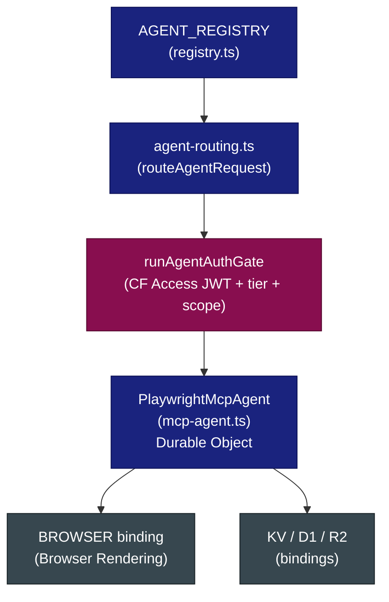
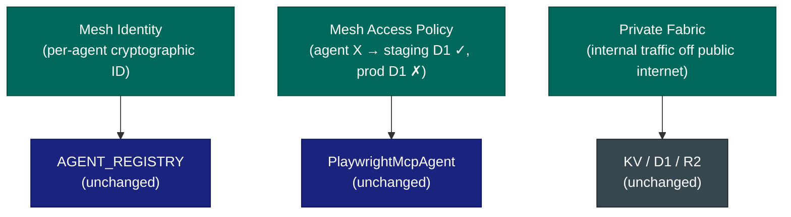
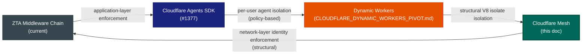

# Cloudflare Mesh: Private Agent Networking for adblock-compiler

**Date:** 2026-04-15 00:04:05\n**Status:** Strategic Evaluation — Awaiting SDK Maturity\n**Relates to:** [Issue #1377](https://github.com/jaypatrick/adblock-compiler/issues/1377), [ideas/CLOUDFLARE_DYNAMIC_WORKERS_PIVOT.md](./CLOUDFLARE_DYNAMIC_WORKERS_PIVOT.md)

---

## Executive Summary

On April 14, 2026, Cloudflare launched [Cloudflare Mesh](https://blog.cloudflare.com/mesh/) — a private networking layer purpose-built for connecting users, services, and AI agents into a unified, identity-driven network fabric. Unlike a VPN, Mesh assigns each agent, node, and user a distinct cryptographic identity, enabling fine-grained access policies enforced at the network level — not the application level.

This document evaluates Mesh's fit within the adblock-compiler platform, which already runs a production Cloudflare agent infrastructure (Agents SDK, Durable Objects, AGENT_REGISTRY, MCP agent) and enforces Zero Trust Architecture (ZTA) at every layer. The thesis: **Mesh is a natural structural enforcement layer on top of everything already built**, and should be integrated once the `cloudflare` SDK (`^5.x`) exposes stable typed Mesh methods.

---

## What Is Cloudflare Mesh?

Cloudflare Mesh is a **private overlay network** that:

- Assigns each participant (user, Worker, agent, Durable Object, external node) a **distinct cryptographic identity**
- Connects participants across clouds, data centres, local machines, and Workers into a **single private network fabric**
- Enforces **per-identity access policies** (e.g., "this agent may reach staging D1, never production D1")
- Extends Cloudflare One / Zero Trust — existing CF Access JWT enforcement, Gateway policies, and device posture checks apply automatically to Mesh traffic
- Integrates directly with **Cloudflare Workers, Durable Objects, and the Agents SDK**
- Offers a **free tier** (50 nodes, 50 users) suitable for staging/sandbox adoption

### Key Concepts

| Concept | Description |
|---|---|
| **Mesh node** | Any participant enrolled in the network (Worker, DO, agent, user device, CI runner). Replaces "WARP Connector". |
| **Mesh identity** | Cryptographic identity assigned to each node — persists across DO hibernation cycles |
| **Access policy** | Network-level rule: "agent X may reach binding Y, never binding Z" — enforced before application code runs |
| **Private fabric** | The overlay network — internal-to-internal traffic never traverses the public internet |
| **Cloudflare One convergence** | Existing CF Access JWT verification becomes the policy enforcement point for a network-segmented path |

### Reference Links

- [Cloudflare Blog: Mesh launch announcement](https://blog.cloudflare.com/mesh/)
- [Cloudflare Mesh Docs](https://developers.cloudflare.com/mesh/)
- [Cloudflare One / Zero Trust](https://developers.cloudflare.com/cloudflare-one/)
- [BusinessWire: Cloudflare Launches Mesh to Secure the AI Agent Lifecycle](https://www.businesswire.com/news/home/20260414016256/en/Cloudflare-Launches-Mesh-to-Secure-the-AI-Agent-Lifecycle)

---

## Current Architecture: What Mesh Augments

The adblock-compiler already has a deep Cloudflare ZTA stack. Mesh is not a replacement — it is a structural enforcement layer on top of what exists.

### Existing ZTA Middleware Chain


### Existing Agent Infrastructure



### What Mesh Adds (Structural Layer)



---

## Gap Analysis: What Mesh Solves

| Current State | Current Workaround | Mesh Solution |
|---|---|---|
| `/agents/*` + `/admin/*` protected by `verifyCfAccessJwt()` — correct but requires per-env audience tag configuration | Manually configure `CF_ACCESS_AUD` per environment via `wrangler secret` | Mesh node identity replaces per-env audience tags; identity travels with the agent |
| Agents calling internal bindings (D1, R2, Queues) traverse the public Worker URL surface | Auth middleware on every internal route | Mesh puts agents on a private fabric — internal-to-internal traffic never hits the public edge |
| Per-user AI agent isolation (`ideas/CLOUDFLARE_DYNAMIC_WORKERS_PIVOT.md`) is policy-based (auth middleware + KV key namespacing) | `checkRateLimitTiered` + `UserTier` enforcement | Mesh gives each agent a distinct **network identity** — structural, platform-enforced isolation, not policy-based |
| Staging vs. production environment separation is purely config-driven | Separate `wrangler.toml` environments + secrets | Mesh access policies can structurally block a staging agent from ever reaching a production binding — enforced at the network layer |
| MCP agent and Browser Rendering binding communicate over Workers service bindings | Accepted as-is | Mesh private fabric for Worker-to-Worker communication — zero public exposure |
| CI/CD runners accessing admin routes require CF Access service tokens | `CF-Access-Client-Id` + `CF-Access-Client-Secret` headers | CI runner enrolled as a Mesh node with scoped identity — no header-based credentials |

---

## Integration Plan

### Phase 0: Foundation (Build Now — No SDK Dependency)

These items can be built immediately in parallel with SDK maturation. They establish the contracts and abstractions that Mesh will slot into, so zero rework is needed when Mesh GA lands.

#### 0.1 — `MeshService` Stub in `CloudflareApiService`

Per the mandatory Cloudflare SDK rule (`.github/copilot-instructions.md`), all CF REST API calls go through `src/services/cloudflareApiService.ts`. Add a `MeshService` namespace stub now with typed method signatures derived from the [Cloudflare Mesh API docs](https://developers.cloudflare.com/mesh/). Stub implementations throw `NotImplementedError` with a clear message. This way, when the `cloudflare@^5.x` SDK adds typed Mesh methods, the integration is a one-file swap.

```typescript
// src/services/cloudflareApiService.ts (extension)
export interface MeshNodeEnrollment {
    nodeId: string;
    identity: string;
    enrolledAt: string;
    agentSlug?: string; // corresponds to AgentRegistryEntry.slug
}

export interface MeshAccessPolicy {
    policyId: string;
    nodeIdentity: string;
    allowedBindings: string[];
    deniedBindings: string[];
}

// CloudflareApiService extension:
mesh = {
    enrollNode: (_agentSlug: string): Promise<MeshNodeEnrollment> => {
        throw new Error('Mesh SDK not yet available — tracking: [issue link]');
    },
    applyAccessPolicy: (_policy: MeshAccessPolicy): Promise<void> => {
        throw new Error('Mesh SDK not yet available — tracking: [issue link]');
    },
    listNodes: (): Promise<MeshNodeEnrollment[]> => {
        throw new Error('Mesh SDK not yet available — tracking: [issue link]');
    },
};
```

#### 0.2 — `MeshAccessPolicy` Type Alignment with `AGENT_REGISTRY`

Each `AgentRegistryEntry` in `worker/agents/registry.ts` already declares `requiredTier`, `requiredScopes`, and `bindingKey`. Add an optional `meshPolicy` field to `AgentRegistryEntry` that declares the **intended** Mesh access policy for each agent. This is documentation-as-code now, and will drive automatic policy enrollment when the SDK is ready.

```typescript
// worker/agents/registry.ts (extension)
export interface AgentMeshPolicy {
    /** Bindings this agent is allowed to reach on the Mesh private fabric. */
    allowedBindings: readonly string[];
    /** Bindings explicitly denied — belt-and-suspenders for production isolation. */
    deniedBindings: readonly string[];
    /** Whether this agent should be enrolled as a Mesh node on deploy. */
    autoEnroll: boolean;
}

export interface AgentRegistryEntry {
    // ... existing fields ...
    /** Optional Mesh access policy. Undefined = not yet enrolled in Mesh. */
    readonly meshPolicy?: AgentMeshPolicy;
}
```

MCP agent entry update:

```typescript
{
    bindingKey: 'MCP_AGENT',
    slug: 'mcp-agent',
    // ... existing fields ...
    meshPolicy: {
        allowedBindings: ['BROWSER', 'COMPILATION_CACHE', 'METRICS'],
        deniedBindings: ['DB', 'ADMIN_DB', 'FILTER_STORAGE', 'ADBLOCK_COMPILER_QUEUE'],
        autoEnroll: false, // flip to true when SDK is ready
    },
}
```

#### 0.3 — Mesh Readiness Check in Worker Health Endpoint

Add a `mesh` field to the `/api/health` response that reports whether the Worker's Mesh node identity is enrolled and reachable. Returns `{ status: 'not_configured' }` until Mesh is active. This gives a clear, observable signal for when to flip `autoEnroll: true`.

#### 0.4 — Admin Endpoint Audit: Document Mesh Candidates

Audit all `/admin/*` routes in `worker/routes/admin.routes.ts` and tag each with the Mesh isolation level it should eventually enforce. This is a docs/comment pass — no code changes. Result: a checklist that drives Phase 1.

---

### Phase 1: Staging Pilot (Post-SDK GA — ~4–6 Weeks)

**Trigger:** `cloudflare` npm SDK changelog shows typed `mesh.*` methods.

#### 1.1 — Enroll Staging MCP Agent as Mesh Node

- Implement `CloudflareApiService.mesh.enrollNode('mcp-agent')` against the live Mesh API
- Apply the `meshPolicy` defined in Phase 0.2
- Validate: staging MCP agent can reach `BROWSER` and `COMPILATION_CACHE`; attempting to call `DB` is blocked at the network layer
- All enrollment logic goes through `CloudflareApiService` — no raw `fetch` to `api.cloudflare.com`

#### 1.2 — Replace `verifyCfAccessJwt` with Mesh Identity on Agent Routes

- For enrolled agents, the Mesh identity replaces the need to verify `CF-Access-JWT-Assertion` header
- Keep `verifyCfAccessJwt` as a fallback for non-Mesh paths (admin routes, CI/CD runners not yet enrolled)
- Auth chain becomes: Mesh identity check → tier gate → scope gate (skips JWT verification for Mesh-enrolled agents)

#### 1.3 — Enroll CI/CD Runner as Mesh Node

- Retire `CF-Access-Client-Id` / `CF-Access-Client-Secret` header credentials for CI/CD admin route access
- CI runner enrolled as a Mesh node with scoped identity: allowed `['/admin/storage/stats', '/admin/health']`, denied everything else

---

### Phase 2: Production Rollout (Post-Pilot Validation)

#### 2.1 — Production Agent Enrollment

- Enroll all `AGENT_REGISTRY` entries with `autoEnroll: true` as Mesh nodes in production
- Apply `meshPolicy.allowedBindings` / `deniedBindings` as live network policies
- Remove `CF_ACCESS_AUD` wrangler secret from production — Mesh identity supersedes it

#### 2.2 — Private Fabric for Worker-to-Worker Communication

- Enroll the orchestrator Worker, MCP agent DO, and Tail Worker as Mesh nodes on the private fabric
- Internal service-binding calls move off the public Workers URL surface onto the Mesh private fabric
- Removes need for CORS headers on internal routes

#### 2.3 — Staging/Production Isolation by Policy

- Define a Mesh access policy that structurally prevents any staging-enrolled agent from reaching production bindings (`DB`, `FILTER_STORAGE`, `ADBLOCK_COMPILER_QUEUE`)
- This replaces the current environment-separation strategy (separate `wrangler.toml` environments) with network-enforced isolation

---

## Relationship to Other Strategic Initiatives



The three initiatives are **additive, not competing**:

| Initiative | Isolation Layer | Enforced By |
|---|---|---|
| ZTA middleware (current) | Application | Application code |
| Dynamic Workers | Compute | V8 runtime |
| Cloudflare Mesh | Network | Cloudflare infrastructure |

Together they form a three-layer Zero Trust stack where no single layer is the last line of defence.

---

## What We Can Build Right Now (Phase 0 Checklist)

- [ ] `MeshService` stub namespace added to `src/services/cloudflareApiService.ts`
- [ ] `AgentMeshPolicy` type + `meshPolicy` optional field added to `AgentRegistryEntry` in `worker/agents/registry.ts`
- [ ] MCP agent entry in `AGENT_REGISTRY` updated with intended `meshPolicy` (with `autoEnroll: false`)
- [ ] `/api/health` response extended with `mesh: { status: 'not_configured' }` placeholder
- [ ] Admin route audit complete — each route tagged with intended Mesh isolation level in comments
- [ ] `validateAgentRegistry()` extended to validate `meshPolicy.allowedBindings` does not include denied bindings (static consistency check)

---

## Decision Log

| Date | Decision | Rationale |
|---|---|---|
| 2026-04-15 | Begin Phase 0 (SDK-independent groundwork) immediately | Zero risk, zero SDK dependency; establishes contracts for Phase 1 |
| 2026-04-15 | Hold Phase 1 (live Mesh enrollment) pending `cloudflare@^5.x` Mesh methods | Mandatory `CloudflareApiService` rule blocks raw API calls; wait for typed SDK |
| 2026-04-15 | `AgentMeshPolicy` field added to `AGENT_REGISTRY` as documentation-as-code | Drives automatic policy enrollment when SDK is ready; zero rework on Phase 1 |
| 2026-04-15 | Mesh does not replace Clerk JWT or `verifyCfAccessJwt` in Phase 1 | Defense-in-depth; Mesh is an additional layer, not a replacement |

---

## Related Issues & Documents

- [Tracking Issue: Cloudflare Mesh Integration](https://github.com/jaypatrick/adblock-compiler/issues/TBD)
- [Issue #1377: Evaluate and Document Integration of Cloudflare Agents SDK](https://github.com/jaypatrick/adblock-compiler/issues/1377)
- [ideas/CLOUDFLARE_DYNAMIC_WORKERS_PIVOT.md](./CLOUDFLARE_DYNAMIC_WORKERS_PIVOT.md)
- [ideas/AI_CLOUDFLARE_INTEGRATION.md](./AI_CLOUDFLARE_INTEGRATION.md)
- [docs/cloudflare/CLOUDFLARE_AGENTS.md](../docs/cloudflare/CLOUDFLARE_AGENTS.md)
- [docs/auth/cloudflare-access.md](../docs/auth/cloudflare-access.md)
- [worker/agents/registry.ts](../worker/agents/registry.ts)
- [src/services/cloudflareApiService.ts](../src/services/cloudflareApiService.ts)

---

*Document authored with GitHub Copilot on 2026-04-15. Based on live analysis of the adblock-compiler codebase and the Cloudflare Mesh launch announcement.*