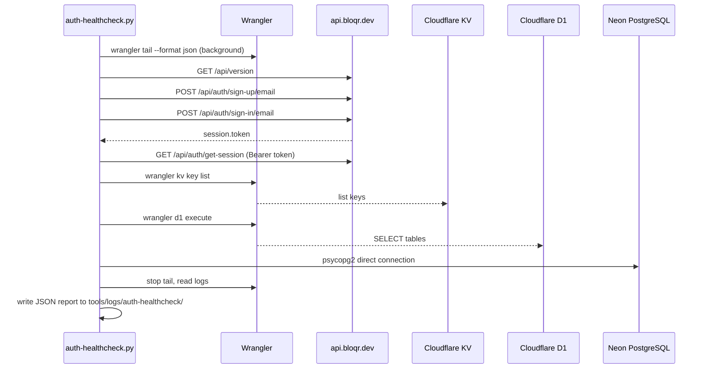

# auth-healthcheck — In-Depth Reference

**Script:** `tools/auth-healthcheck.py`
**Config:** `tools/auth-healthcheck.env` (copy from `tools/auth-healthcheck.env.example`)
**Runbook:** `tools/runbooks/auth-healthcheck.py` (interactive — `marimo run tools/runbooks/auth-healthcheck.py`)
**Logs:** `tools/logs/auth-healthcheck/`

End-to-end production auth diagnostic for the Better Auth / Bloqr stack. Validates the full authentication chain from sign-up through session validation, then checks every backing store (KV, D1, Neon) and captures wrangler tail logs in the background.

---

## What It Checks

| Step | Check              | What it verifies                                                                                              |
| ---- | ------------------ | ------------------------------------------------------------------------------------------------------------- |
| 1    | API health         | `GET /api/version` responds, `/api/auth/providers` lists providers                                            |
| 2    | Sign-up            | `POST /api/auth/sign-up/email` creates a new test user                                                        |
| 3    | Sign-in + token    | `POST /api/auth/sign-in/email` returns `session.token`, `session.id`, `user` object                           |
| 4    | Session validation | `GET /api/auth/get-session` with Bearer token returns the correct user                                        |
| 5    | Email verification | `user.emailVerified` flag checked; warns if false                                                             |
| 6    | Better Auth KV     | `wrangler kv key list` — verifies KV is accessible and shows key prefix distribution                          |
| 7    | D1 databases       | Both `DB` (adblock-compiler-d1-database) and `ADMIN_DB` (adblock-compiler-admin-d1) — table list + row counts |
| 8    | Neon / PostgreSQL  | Direct connection via `psycopg2` — table row counts, test user row, session row                               |
| 9    | Admin API          | `GET /api/auth/admin/list-users` with API key (optional)                                                      |
| 10   | Tail log summary   | Worker exceptions and auth-related log events captured during the run                                         |

---

## Architecture



---

## Prerequisites

```bash
# One-time setup (from repo root)
uv sync --directory tools
```

> `psycopg2-binary` is a self-contained PostgreSQL client — no Homebrew Postgres required.

Also required:

- `wrangler` CLI authenticated with your Cloudflare account (`wrangler login`)
- Access to the target API (local or production)

---

## Configuration

```bash
cp tools/auth-healthcheck.env.example tools/auth-healthcheck.env
# Edit tools/auth-healthcheck.env with your values
```

### Key Variables

| Variable              | Required | Default                       | Description                                                                    |
| --------------------- | -------- | ----------------------------- | ------------------------------------------------------------------------------ |
| `NEON_URL`            | ✅       | —                             | Direct Neon connection string from Neon Console → Branch → "Direct connection" |
| `BETTER_AUTH_API_KEY` | Optional | —                             | Enables admin API check (`list-users`)                                         |
| `TEST_EMAIL`          | Optional | auto-generated                | Fixed test email; leave blank to generate unique email each run                |
| `TEST_PASSWORD`       | Optional | `HealthCheck1234!!@@`         | Password for test user                                                         |
| `API_BASE`            | Optional | `https://api.bloqr.dev/api`   | Target API base URL                                                            |
| `KV_BINDING`          | Optional | `BETTER_AUTH_KV`              | Wrangler KV binding name                                                       |
| `D1_BINDING`          | Optional | `DB`                          | Wrangler D1 primary binding name                                               |
| `D1_ADMIN_BINDING`    | Optional | `ADMIN_DB`                    | Wrangler D1 admin binding name                                                 |
| `ENABLE_TAIL`         | Optional | `true`                        | Set `false` to skip wrangler tail                                              |
| `TAIL_WAIT_SEC`       | Optional | `4`                           | Seconds to wait for tail to flush                                              |
| `WRANGLER_ENV`        | Optional | —                             | Wrangler environment (`dev`, `staging`, etc.)                                  |
| `LOG_DIR`             | Optional | `tools/logs/auth-healthcheck` | Directory for log and report output                                            |

---

## Running — CLI

### Interactive mode (TTY)

```bash
uv run --directory tools python tools/auth-healthcheck.py
```

An interactive menu appears:
```
  adblock-compiler · Auth Healthcheck
  Select an action

  1. Run checks only
  2. Run checks then clean up test data
  3. Dry run (print config, no requests)
  4. Clean up test data only
  q. Quit
```

### Non-interactive / pipeline mode

```bash
# Run all checks
uv run --directory tools python tools/auth-healthcheck.py --mode all

# Run checks only (no cleanup)
uv run --directory tools python tools/auth-healthcheck.py --mode checks

# Clean up test data only
uv run --directory tools python tools/auth-healthcheck.py --mode cleanup

# Dry run — prints config, makes no requests
uv run --directory tools python tools/auth-healthcheck.py --mode checks --dry-run
```

### Deno shortcut

```bash
# Requires deno.json runbook:* tasks
deno task runbook:auth-healthcheck
```

---

## Running — Interactive Runbook (Marimo)

The Marimo runbook is the recommended interface for admins. It provides:

- Environment variable editor (no need to edit `.env` files manually)
- One-click run with streamed output
- Inline log viewer
- JSON report display
- File picker to copy logs to AI assistants

```bash
# Marimo is already included in tools/pyproject.toml — just sync
uv sync --directory tools

# Launch the runbook
uv run --directory tools marimo run tools/runbooks/auth-healthcheck.py

# Or use the deno task shortcut
deno task runbook:auth-healthcheck
```

Open the browser at `http://localhost:2718` (default port). Everything is self-contained — no markdown files required.

---

## Run Modes

| Mode             | What happens                                                                  |
| ---------------- | ----------------------------------------------------------------------------- |
| `all`            | Runs all checks, then deletes test user and session (default for CI/pipeline) |
| `checks`         | Runs all checks, leaves test data in place                                    |
| `cleanup`        | Deletes test data only — skips all checks                                     |
| `checks-cleanup` | Runs all checks then cleans up (alias for `all`)                              |

---

## Output

### Terminal output (rich)

The script uses the `rich` library to print:

- A live progress indicator per check
- A final summary table with PASS / FAIL / WARN per step
- Tail log excerpts

### JSON report

Written to `tools/logs/auth-healthcheck/auth-healthcheck-YYYYMMDD-HHMMSS.json`:

```json
{
    "timestamp": "2026-05-02T10:00:00",
    "api_base": "https://api.bloqr.dev/api",
    "results": {
        "POST /auth/sign-in/email": {
            "status": "PASS",
            "detail": "HTTP 200 OK",
            "data": {}
        }
    },
    "errors": [
        { "check": "session.token present", "detail": "missing — response keys: ['user']" }
    ],
    "summary": {
        "passed": 14,
        "failed": 1,
        "warnings": 2
    }
}
```

Paste the JSON file contents directly into a Copilot or Claude chat for instant root-cause analysis.

---

## Interpreting Results

### All green ✅

Auth is fully working. Sign-up, sign-in, session validation, KV writes, and Neon rows all succeeded.

### `session.token present` ❌

The most critical failure. Sign-in returned HTTP 200 but no token in the response body. Common causes:

- `storeSessionInDatabase` conflict with KV binding (fixed in PR #1725)
- Prisma field mapping error — `displayName` / `name` mismatch
- Better Auth plugin (sentinel) crashing on init (fixed in PR #1724)

### `POST /auth/sign-in/email` → HTTP 500 ❌

Worker is crashing during sign-in. Check the tail logs section of the report for the exception.

### `emailVerified` ⚠️

Normal for new sign-ups if `requireEmailVerification=false`. If sign-in is being blocked, `requireEmailVerification=true` is set and Resend is not delivering the verification email.

### `Session in Neon` ⚠️ (not in Postgres)

Expected when `storeSessionInDatabase=false` (the default when KV is bound). Sessions live in KV only. This is correct.

### `KV accessible` ❌ or `D1 execute` ❌

Wrangler binding is not resolving. Check `wrangler.toml` binding names match the `KV_BINDING` / `D1_BINDING` values in your env file.

### `GET /api/version` ❌

The API is unreachable. Check:

1. `API_BASE` is set correctly
2. The worker is deployed / `wrangler dev` is running
3. Firewall / VPN is not blocking the request

---

## Wrangler Tail Logs

The script starts `wrangler tail --format json` in a background process and writes output to `tools/logs/auth-healthcheck/wrangler-tail-YYYYMMDD-HHMMSS.log`. The terminal summary shows:

- Worker exceptions (unhandled errors)
- Error-level log lines
- Auth-related events (sign-in, sign-up, session, Prisma, Better Auth)

To watch tail live in a separate terminal:

```bash
tail -f tools/logs/auth-healthcheck/wrangler-tail-*.log | jq '.logs[].parts[]'
```

---

## Pipeline Usage

Chain with other tools using `--mode all --json-only` for machine-readable output:

```bash
# Run auth check, feed JSON to next step
python tools/auth-healthcheck.py --mode all

# In a pipeline script
AUTH_REPORT=$(ls -t tools/logs/auth-healthcheck/*.json | head -1)
jq '.summary' "$AUTH_REPORT"
```

See [`docs/tools/README.md`](../../../docs/tools/README.md) for full pipeline chaining guide.

---

## Cleanup

Test data created by the script:

| Store             | What was created                                         | How to clean up                                |
| ----------------- | -------------------------------------------------------- | ---------------------------------------------- |
| Better Auth / API | Test user account                                        | `--mode cleanup` or mode 4 in interactive menu |
| Neon PostgreSQL   | User row, session row (if `storeSessionInDatabase=true`) | Deleted by cleanup mode                        |
| Cloudflare KV     | Session key                                              | Deleted by cleanup mode                        |

---

## Related Documentation

- [Tools Overview](../../../docs/tools/README.md) — All tools, pipeline guide, Marimo setup
- [Better Auth + Prisma](../../../docs/auth/better-auth-prisma.md) — Auth configuration reference
- [Auth Chain Reference](../../../docs/auth/auth-chain-reference.md) — Request flow through the auth stack
- [Neon Setup](../../../docs/database-setup/neon-setup.md) — How to get your `NEON_URL`
- [KB-001: API Not Available](../../../docs/troubleshooting/KB-001-api-not-available.md) — If the script can't reach the API
